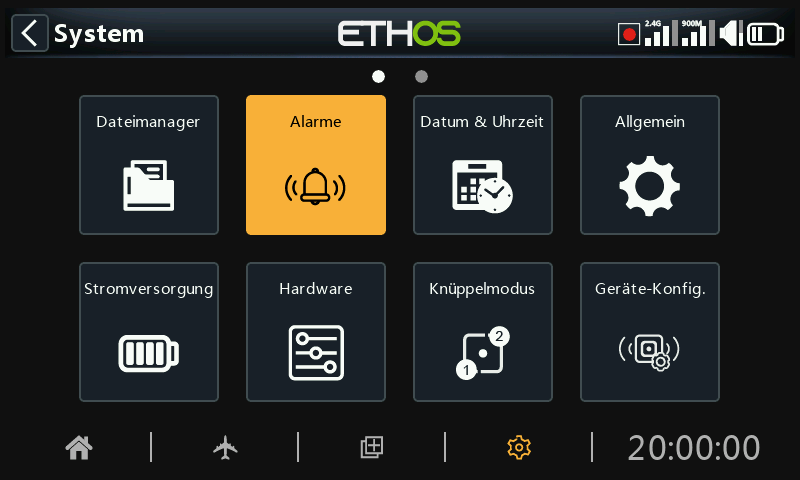
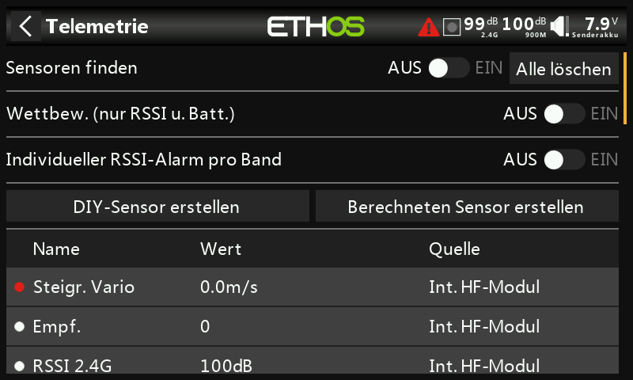

# Alarme

Die Systemwarnungen sind:

## Stummer Modus

Ein ‚Stummer Modus'-Alarm wird beim Start ausgegeben, wenn ‚Stummer Modus' aktiviert ist und der 'Audio Mode' unter System / Allgemein / [Audio / Modus](general.md) auf lautlos gesetzt wurde.

## Senderakku -kalibriert?-

Eine Sprachmeldung 'Funkbatterie ist schwach' wird ausgegeben, wenn die Überprüfung der 'Hauptspannung' eingeschaltet ist und die Hauptbatterie des Senders unter dem Schwellenwert liegt, der im Parameter 'Niedrige Spannung' unter System / Batterie eingestellt ist.

## Uhr/Dat.-Batterie-

Ein Sprachalarm „RTC-Batterie ist schwach“ wird ausgegeben, wenn die Überprüfung der RTC-Spannung eingeschaltet ist und die RTC-Uhrenbatterie unter 2,5 V liegt, dem Standardwert für die RTC-Batterie. Der Alarm kann ausgeschaltet werden, bis die RTC-Batterie ausgetauscht wurde, sollte aber nicht auf unbestimmte Zeit ausgeschaltet bleiben. Die Echtzeit wird bei der Datenaufzeichnung verwendet, und eine ungültige Zeit führt zu Schwierigkeiten beim Lesen der Aufzeichnungen, insbesondere bei der Unterscheidung von Flugphasen.

## Sensorkonflikt-Warnung

Die Sensor-Konflikterkennung kann deaktiviert werden. Dies sollte nur erforderlich sein, wenn Sie Sensoren haben, die nicht der S.Port-Spezifikation entsprechen.

## Inaktivitäts-Warnung nach

Ein Sprachalarm „Sender eingeschaltet. Längere Zeit ohne Aktivität“ wird ausgegeben, wenn das Funkgerät länger als die „Inaktivität“-Zeit nicht benutzt wurde, und auch ein haptischer Alarm, falls die Lautstärke des Senders ganz herunter gedreht wird. Die Standardeinstellung ist 10 Minuten und kann bis zu 120 Minuten betragen.
