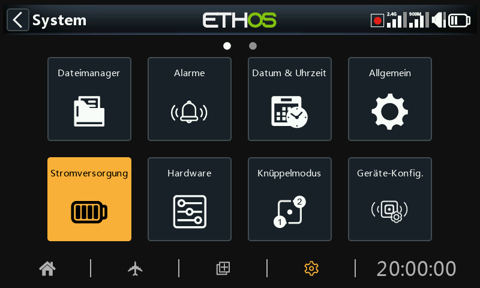

# Stromversorgung

Der Abschnitt Batterie dient zum Kalibrieren der Senderbatterien und zum Einstellen der Alarmschwellen.

## Senderakku -kalibriert?-

Unter „Senderakku -kalibriert?-“ wird die aktuelle Batteriespannung angezeigt, aber auch die Kalibrierung der Batteriespannung eingestellt. Sie können die mit einem Multimeter gemessene aktuelle Batteriespannung eingeben. Der Standardwert ist 8,4 V für eine geladene 2-Zellen-Lithiumbatterie.

## Warnschwelle Akkuspannung

Dies ist die Alarmschwellenspannung. Der Standardwert ist 7,2 V. Ein Wert von 7,4 V würde eine zusätzliche Sicherheitsspanne bieten.

Es wird ein Warndialogfeld geöffnet, und jede Minute wird die Sprachmeldung „Senderakku  schwach“ ausgegeben, wenn die Spannung des Senderakkus unter den hier festgelegten Schwellenwert fällt, sofern die Option „Hauptspannung“ unter „System/Alarme/Senderbatterie - kalibriert?“ aktiviert ist.

### Warnung!

### Wenn diese Warnung angezeigt wird, ist es ratsam, zu landen und den Akku des Funkgeräts aufzuladen! Die Warnung wird jede Minute wiederholt, auch wenn das Warnungsdialogfeld noch geöffnet ist.

### Bitte beachten Sie, dass sich der Sender unabhängig davon abschaltet, wenn die Akkuspannung auf 6,0 V fällt, um den LiIon-Akku (2 X 3,0 V) zu schützen!

## Anzeige Spannungsbereich

Mit diesen Einstellungen wird der Bereich der grafischen Batterieanzeige oben rechts auf dem Bildschirm festgelegt. Der Standardbereich für den eingebauten Li-Ion-Akku liegt zwischen 6,4 und 8,4 V. Viele Piloten erhöhen die untere Messspannung, um den TX-Spannungsalarm früher auszulösen und eine Tiefentladung des TX-Akkus zu vermeiden.

Der MIN-Wert ist der Wert, bei dem der erste Punktbalken erlischt, und der MAX-Wert ist der Wert, bei dem der vierte Punktbalken aufleuchtet, wenn Sie die grafische Darstellung der Batteriespannung verwenden.

Wenn der Akku auf einen anderen Typ umgestellt wird, müssen die Grenzwerte entsprechend angepasst werden.

## Uhr/Datum -Batterie-

Zeigt die Spannung der RTC-Batterie (Real Time Clock) im Sender an. Die Spannung beträgt 3,0 V bei einer neuen Batterie. Wenn die Spannung unter 2,7 V liegt, tauschen Sie bitte die Batterie im Sender aus, um sicherzustellen, dass die Uhr richtig läuft. Wenn die Spannung unter 2,5 V fällt, wird eine Warnung ausgegeben (siehe Warnungen / [RTC-Spannung](alerts.md)).
