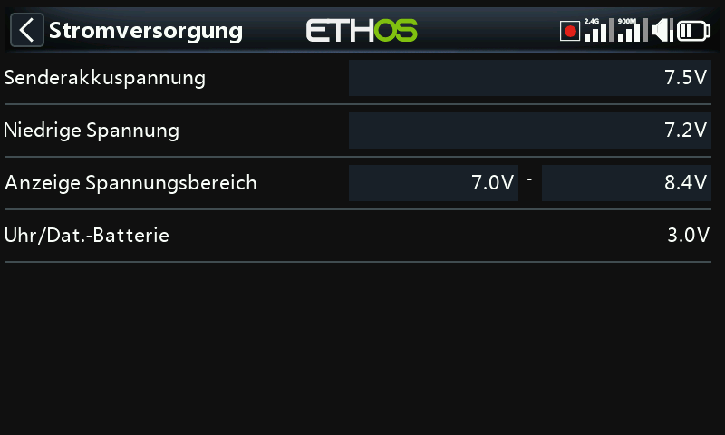

# Akku

Kalibriert die Messung des senderinternen Akkus und legt die Alarmschwellen
fest — getrennt von den Flugakku-Einstellungen eines Modells (siehe [Anleitung:
Warnung bei niedriger Akkuspannung](../how-to/low-battery-warning.md)).

- **Hauptspannung** — zeigt den aktuellen Messwert an und dient zugleich der
  Kalibrierung: Tragen Sie hier die tatsächliche, mit einem Multimeter
  gemessene Spannung ein. Der Standardwert ist 8,4 V (ein voll geladener
  2S-Li-Ion-Akku).
- **Niedrige Spannung** — die Alarmschwelle, standardmäßig 7,2 V (7,4 V bietet
  zusätzliche Reserve). Wenn die [Warnung zur Hauptspannung](alerts.md)
  aktiviert ist, löst ein Unterschreiten dieses Werts einen Warndialog sowie
  jede Minute die Sprachansage „Radio battery is low“ aus — unabhängig davon,
  ob der Dialog geöffnet ist oder nicht.

  !!! warning
      Landen Sie und laden Sie den Senderakku, sobald diese Warnung ertönt — sie
      wiederholt sich in jedem Fall jede Minute. Bei 6,0 V schaltet sich der
      Sender bedingungslos ab, um die beiden 3,0-V-Li-Ion-Zellen zu schützen.

- **Anzeigebereich der Spannung** — Minimum und Maximum für die grafische
  Akkuanzeige in der oberen rechten Ecke: Bei MIN erlischt das erste
  Balkensegment, bei MAX leuchtet das vierte. Die Standardwerte sind 6,4–8,4 V
  für den eingebauten Li-Ion-Akku; viele Piloten heben den unteren Wert an, um
  früher eine Unterspannungswarnung zu erhalten und eine Tiefentladung zu
  vermeiden. Passen Sie diese Werte an den tatsächlich eingebauten Akkutyp an.
- **RTC-Spannung** — die Spannung der Knopfzelle für die Echtzeituhr. Im
  Neuzustand 3,0 V; unterhalb von 2,7 V sollte sie ersetzt werden, damit die Uhr
  genau bleibt, und unterhalb von 2,5 V ist mit der
  [RTC-Spannungswarnung](alerts.md) zu rechnen.
