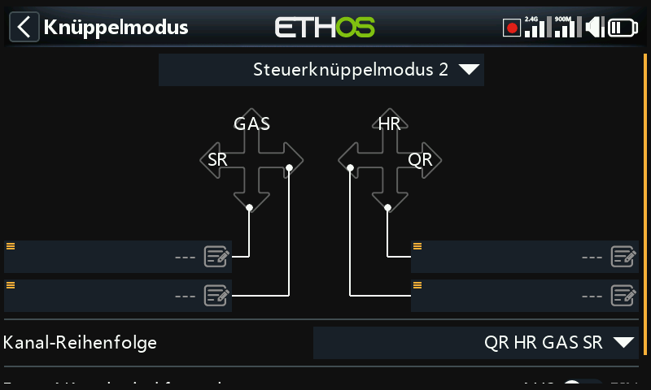
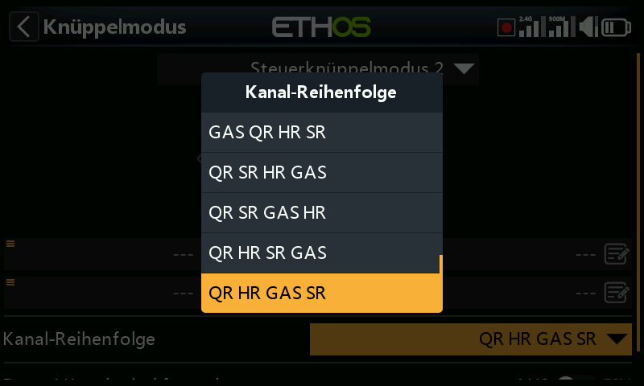
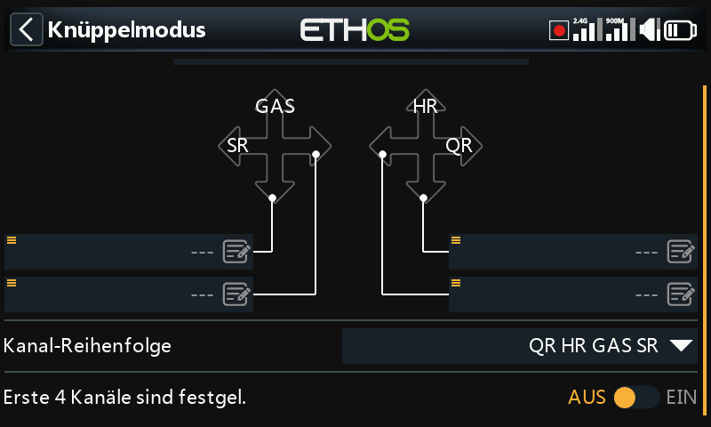

# Bedienelemente

Im Menü als **Knüppel Modus** bezeichnet — Steuerknüppelmodus und die
standardmäßige Reihenfolge der Kanalzuordnung.

## Knüppel Mode

- **Mode 1** — Gas und Querruder auf dem rechten Steuerknüppel, Höhen- und
  Seitenruder auf dem linken.
- **Mode 2** — Gas und Seitenruder auf dem linken, Quer- und Höhenruder auf
  dem rechten Steuerknüppel.

Standardmäßig sind die Knüppel so benannt, wie es die Standard-Knüppelmodi
vorgeben; sie können nach Belieben umbenannt werden.

## Kanal Reihenfolge

Definiert die Reihenfolge, in der die vier Knüppel-Eingänge den Kanälen
zugewiesen werden, wenn ein neues Modell von den Assistenten der
[Modellauswahl](../model-setup/model-select.md) erstellt wird. Die
Standardreihenfolge ist **QR HR GAS SR** (AETR). Wenn es mehr als eine Fläche
pro Typ gibt, werden sie gruppiert, es sei denn, [Ersten vier Kanäle
fest](#first-four-channels-fixed) ist aktiviert — bei 2 Querrudern ist die
Reihenfolge der Kanäle z. B. **QR QR HR GAS SR**.

## Ersten vier Kanäle fest {: #first-four-channels-fixed }

Wenn diese Option aktiviert ist, wird die Kanalgruppierung nie auf den ersten
vier Kanälen durchgeführt. Bei der Kanalreihenfolge **QR HR GAS SR** und einem
Modell mit 2 Querrudern, 1 Höhenruder, 1 Motor, 1 Seitenruder und 2
Wölbklappen erstellt der Assistent die Kanalreihenfolge **QR HR GAS SR QR WK
WK** (die Kanäle 1–4 bleiben exakt QR-HR-GAS-SR, das zweite Querruder und
beide Wölbklappen werden dahinter angehängt) statt **QR QR HR GAS SR WK WK**.
Mit dieser Einstellung erstellt der Assistent Modelle, die für die
stabilisierten SRx-Empfänger geeignet sind, denn diese erwarten genau diese
feste Belegung.

