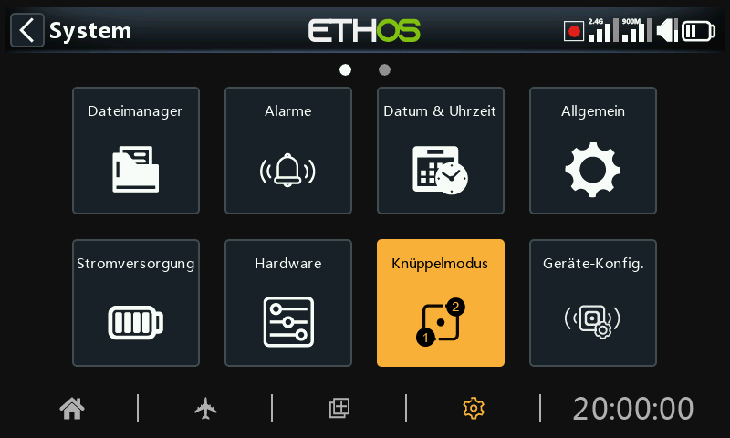

# Knüppel Mode

Wählen Sie Ihren bevorzugten Steuerknüppelmodus. In Modus 1 befinden sich Gas und Querruder auf dem rechten Steuerknüppel und Höhen- und Seitenruder auf dem linken. Im Modus 2 befinden sich Gas und Seitenruder auf dem linken und Quer- und Höhenruder auf dem rechten Steuerknüppel.

Standardmäßig sind die Knüppel so benannt, wie oben für die Standard-Knüppelmodi aufgeführt. Sie können nach Belieben umbenannt werden.

## Kanal Reihenfolge

Die 'Kanal Reihenfolge' definiert die Reihenfolge, in der die vier Knüppel-Eingänge den Kanälen in den Mischungen zugewiesen werden, wenn ein neues Modell von den Assistenten erstellt wird. Die Standardreihenfolge ist QR HR GAS SR. Wenn es mehr als eine Fläche pro Typ gibt, werden sie gruppiert, es sei denn, die ersten vier Kanäle sind festgelegt, siehe unten. Bei 2 Querrudern ist die Reihenfolge der Kanäle z.B. QR QR HR GAS SR.

## Ersten vier Kanäle fest

Wenn diese Option aktiviert ist, wird die Kanalgruppierung nicht auf den ersten vier Kanälen durchgeführt. Wenn die Kanalreihenfolge AETR ist, dann wird der Assistent ein Modell erstellen, das für die stabilisierten SRx-Empfänger geeignet ist. Zum Beispiel wird ein Modell mit 2 Querrudern, 1 Höhenruder, 1 Motor, 1 Seitenruder und 2 Wölbklappen mit einer Kanalreihenfolge von QR HR GAS SR QR WK WK erstellt. Wenn diese Option nicht aktiviert ist, würde die Kanalreihenfolge QR QR HR GAS SR lauten.
