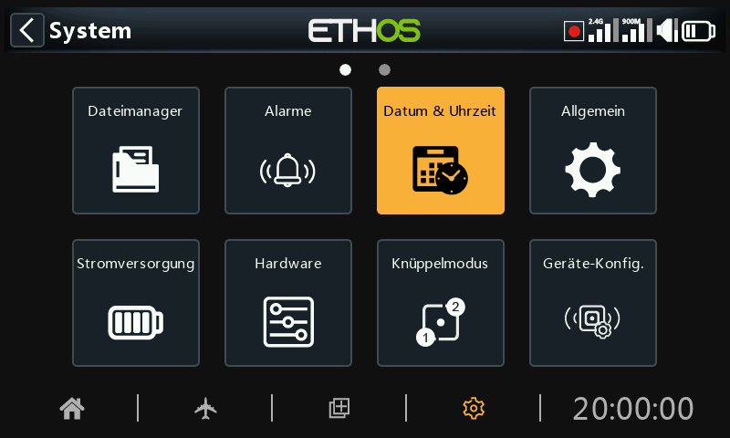

# Datum & Uhrzeit

Die Einstellungen für Datum und Uhrzeit sind:

## Zeitformat 24 Std

Die Uhr wird im 24-Stunden-Format angezeigt, wenn sie aktiviert ist.

## zeigt Sekunden

Wenn diese Funktion aktiviert ist, zeigt die Uhr auch Sekunden an.

## Datum

Sollte auf das aktuelle Datum gesetzt werden. Dieses wird in den Protokollen verwendet.

## Uhrzeit

Sollte auf die aktuelle Zeit gesetzt werden. Diese wird in den Protokollen verwendet.

## Zeitzone

Ermöglicht die Konfiguration der Zeitzone des Benutzers.

## Man. Abgl. Uhrz.-Genauigkeit

Die Echtzeituhr kann kalibriert werden, um eine Abweichung der Uhr von bis zu 41 Sekunden pro Tag auszugleichen.

Berechnen Sie für die Kalibrierung, wie viele Sekunden Ihre Uhr in 24 Stunden zu- oder abnimmt.

Stellen Sie den Kalibrierungswert auf das 12-fache dieser Anzahl von Sekunden ein, so dass er negativ ist, wenn Ihre Uhr schnell läuft, und positiv, wenn sie langsam läuft. Um die beste Genauigkeit zu erzielen, sollten Sie überprüfen, ob Ihre Uhr genau geht, und den Kalibrierungswert leicht anpassen. Der tatsächliche Kalibrierungswert kann auf -500 bis +500 eingestellt werden.

## Autom. Abgl. Uhrz. über GPS

Wenn diese Funktion aktiviert ist, werden Uhrzeit und Datum automatisch anhand der GPS-Sensordaten eingestellt.
