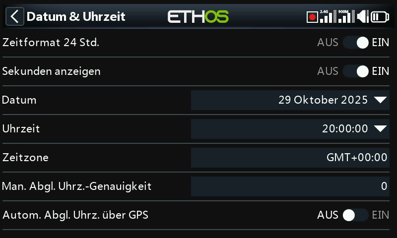

# Datum & Uhrzeit

- **24-Stunden-Format** — schaltet die Uhr zwischen 12- und 24-Stunden-Anzeige um.
- **Sekunden anzeigen** — ergänzt die Uhranzeige um Sekunden.
- **Datum** / **Uhrzeit** — Einstellung des aktuellen Datums bzw. der aktuellen
  Uhrzeit; beide werden auch für die Datenaufzeichnung verwendet.
- **Zeitzone** — Ihre lokale Zeitzone.
- **RTC-Geschwindigkeit anpassen** — gleicht die Gangabweichung der
  Echtzeituhr aus, bis zu 41 Sekunden pro Tag. Ermitteln Sie, wie viele
  Sekunden Ihre Uhr innerhalb von 24 Stunden vor- oder nachgeht, und setzen
  Sie den Kalibrierwert auf das **12-fache dieser Sekundenzahl** — negativ,
  wenn die Uhr vorgeht, positiv, wenn sie nachgeht (Bereich −500 bis +500).
  Überprüfen Sie das Ergebnis nach ein bis zwei Tagen erneut und justieren Sie
  nach.
- **Automatisch per GPS anpassen** — sofern aktiviert, werden Datum und
  Uhrzeit stattdessen automatisch aus den Daten eines externen GPS-Sensors
  übernommen.
