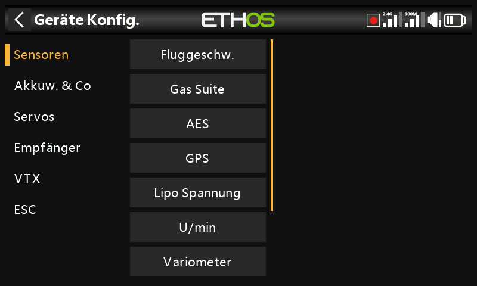
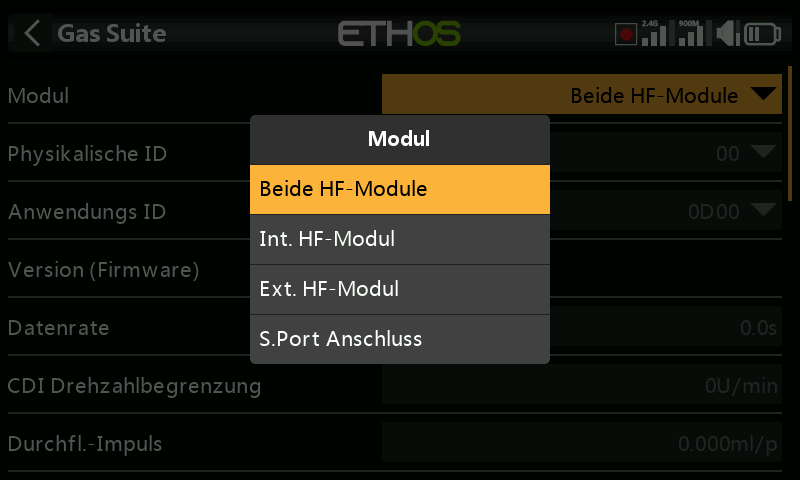
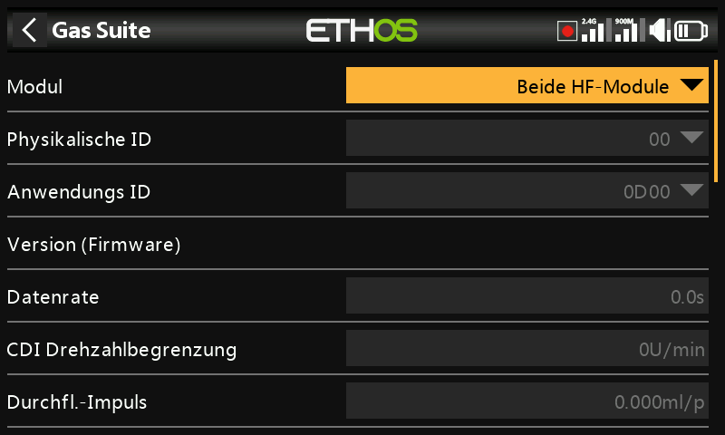

# Geräte

Im Menü **Gerätekonfiguration** genannt — Werkzeuge zur Konfiguration von
Peripheriegeräten, die über S.Port/FBUS angeschlossen sind: Sensoren,
Empfänger, die „Gas-Suite", Servos, VTX und ESC. **DIY-Sensoren** erscheint
automatisch, sobald ein DIY-Sensor erkannt wird. Ausführliche Informationen
finden Sie im jeweiligen Handbuch des Geräts; diese Seite behandelt die
Gemeinsamkeiten.

!!! note
    Dies hat nichts mit der Auswahl zu tun, über welches HF-Modul (intern
    oder extern) ein *Modell* sendet — das ist eine modellspezifische
    Einstellung und wird unter
    [RF System](../model-setup/rf-system.md) behandelt.

Die Gerätekonfiguration ist erweiterbar: Sowohl Anwender als auch FrSky
können hier Seiten per Lua hinzufügen.

## Sensor-IDs neu zuweisen

In den Bildschirmen der Gerätekonfiguration von Ethos können Sie die
S.Port-**Physical ID** und **Application ID** eines Geräts direkt ändern.
Wenn Sie mehrere Geräte mit derselben Funktion besitzen, schließen Sie
diese **einzeln nacheinander** an: Erkennen Sie jedes Gerät unter
[Telemetrie → Neue Sensoren suchen](../model-setup/telemetry.md), ändern Sie
hier in der Gerätekonfiguration dessen Physical ID und Application ID, und
führen Sie anschließend die Sensorsuche unter der neuen ID erneut durch.

## Beispiel Empfänger

Stabilisierte FrSky-Empfänger können hier konfiguriert werden, sobald das
zugehörige Lua-Einrichtungsskript installiert ist (ein Klick in der
Lua-Bibliothek von Ethos Suite). Je nach Empfängergeneration gibt es zwei
Konfigurationswege:

- **Stabilizer config** — neuere Empfänger mit „Advanced stabilization"
  (Gain-Regelung auf Kanal 13). Zwei unabhängige Stabilisierungsgruppen
  stehen zur Verfügung: Gruppe 1 umfasst die Kanäle 1–6, Gruppe 2 die
  Kanäle 7–11 — schalten Sie Gruppe 2 ab, wenn Sie die Pins 7–11 nicht zur
  Stabilisierung verwenden. Eine 6-Achsen-Kalibrierung ist integriert und
  muss bei einem neuen Empfänger einmalig durchgeführt werden, ebenso nach
  jedem Firmware-Update auf v3.0.x (im Anschluss an einen Werksreset).
  Unter der Kalibrierung jeder Gruppe wurde der frühere Schritt
  „Selbsttest" durch die unabhängige Kalibrierung von Fluglage,
  Kanalmitte und Kanalendpunkten ersetzt; jeder Kanal kann einzeln
  aktiviert bzw. deaktiviert werden. Konfigurationen (nicht die
  Kalibrierdaten) können auf einem PC gespeichert und von dort
  wiederhergestellt werden.
- **SxR** — ältere Empfänger, einschließlich Altgeräten sowie Archer und
  Archer Pro, außerdem Empfänger wie der SR10 Pro, die (trotz der
  Bezeichnung „SRx") Gain auf Kanal 9 statt auf Kanal 13 haben.

  

!!! warning "Nach dem Update auf Empfänger-Firmware v3.0.x"
    Führen Sie einen Werksreset durch (zu finden unter den
    Empfänger-Optionen in der HF-Einrichtung), binden Sie anschließend neu
    und konfigurieren Sie den Empfänger vollständig neu — insbesondere die
    Stab-Funktionen und die 6-Achsen-Kalibrierung. Dies ist wegen der neuen
    Funktion zur Speicherung der Failsafe-Daten in v3.0.x erforderlich;
    prüfen Sie die Failsafe-Funktion danach sorgfältig.

FrSky North America veröffentlicht eine ausführliche Anleitung zur
Einrichtung stabilisierter Empfänger; außerdem gibt es ein Video von FrSky
Team Pilot Juan Sanchez Garcia, das dieselben Inhalte Schritt für Schritt
behandelt.

## Konfiguration über den S.Port-Anschluss des Senders

S.Port- und FBUS-Geräte lassen sich auch direkt über den S.Port-Anschluss
an der Oberseite des Senders konfigurieren, ohne den Umweg über einen
gebundenen Empfänger.

1. Schließen Sie das Gerät an den S.Port-Anschluss des Senders an (weiße/gelbe
   Leitung zur gekerbten Seite hin).
2. Gehen Sie zu **System → Gerätekonfiguration**, scrollen Sie zum Gerät
   (z. B. einem Stromsensor FAS40 ADV) und drücken Sie `ENT`.
3. Setzen Sie auf der Konfigurationsseite **Module** auf **S.Port
   connector**.
4. Nehmen Sie Ihre Änderungen vor — Physical ID und Application ID müssen
   jeweils eindeutig sein — scrollen Sie dann nach unten und tippen Sie auf
   **Save to flash**.

Dies gilt sowohl für FBUS-Geräte (siehe auch [Anleitung: Ein FBUS-System
konfigurieren](../how-to/fbus-setup.md)) als auch für einfache
S.Port-Geräte wie ein Variometer.
