# Geräte Konfiguration

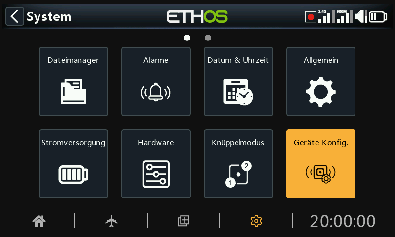

Sensor Konfig“ enthält Werkzeuge zur Konfiguration von Geräten wie Sensoren, Empfängern, der Gas-Suite, Servos und Video-Sendern.

Die folgenden Geräte werden derzeit unterstützt:

- Sensoren
- Akkuweichen & Co
- Servos
- Empfänger
- VTX (Videoübertragungssysteme)
- ESC (Regler)
- DIY-Sensoren (DIY wird unter der Gerätekategorie angezeigt, wenn ein DIY-Sensor erkannt wird).

Weitere Einzelheiten entnehmen Sie bitte dem Handbuch des Geräts.

Bitte beachten Sie, dass Sie im ETHOS-Menü „Gerätekonfiguration“ die physischen IDs der S.Port-Sensoren und die Anwendungs-IDs ändern können. Wenn Sie mehr als ein Gerät mit der gleichen Funktion haben, müssen Sie sie einzeln anschließen, sie in Telemetrie / „Neue Sensoren erkennen“ erkennen, dann in „Gerätekonfiguration“ die physikalische ID und die Anwendungs-ID ändern und dann zurückgehen und sie mit der neuen ID erneut erkennen.  Bitte lesen Sie den Abschnitt [Smart Port Telemetrie](../model-setup/telemetry.md).

Der Bereich Geräte Konfiguration ist jetzt erweiterbar und der Benutzer (und FrSky) können Seiten über LUA hinzufügen.

## Beispiel für Empfänger

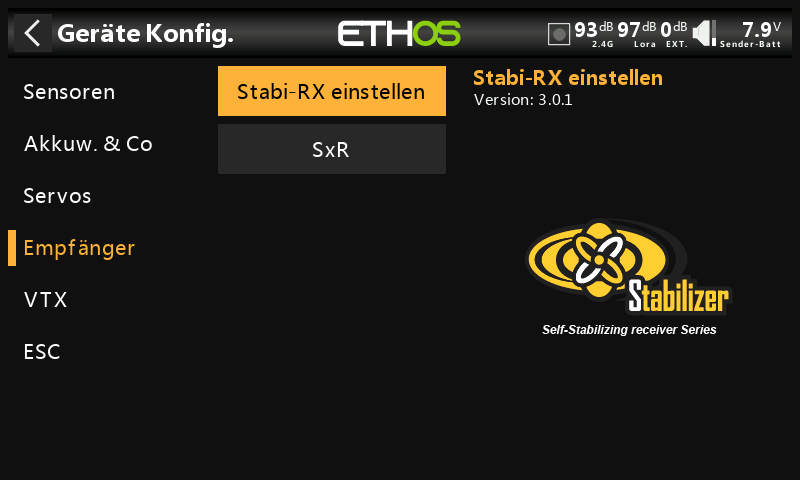

Die FrSky von stabilisiertem Empfänger können nun über 'Geräte Konfiguration' konfiguriert werden, nachdem die notwendigen Setup-Lua-Skripte installiert wurden. Diese können einfach mit einem Klick aus der LUA-Bibliothek in ETHOS Suite installiert werden, siehe dazu den Abschnitt [Lua-Bibliothek](../ethos-suite/operation.md) und suchen Sie nach der StabilizerConfig Lua-Datei.

### Übersicht

Man hat die Wahl zwischen „Stabi-RX einstellen“ für die neueren Empfänger und „SxR“ für die älteren Empfänger.

#### Option Stabi-RX einstellen ( Stabilizer config)

Die Option „Stabi-RX einstellen “ ist für die neueren Empfänger vorgesehen, wie beispielsweise den TD SR12, TD SR18, TD SR10, TD SR6, TW SR12, TW SR8, TW SR10, Archer+ SR10+, Archer+ SR8, Archer+ SR12+, SR6 Mini, SR6 Mini E, SR6BL15A und SR6Lite.

#### Option SxR

Die SxR-Option wird für ältere Empfänger verwendet, wie beispielsweise ACCST D16 S6R, ACCST D16 S8R, Archer SR6, Archer SR8 Pro, Archer SR10 Pro, R9 Stab, R9 Stab OTA sowie RB30S und RB40S. Weitere Informationen finden Sie unten unter der [SxR-Option](devices.md).

### Option Stabi-RX einstellen

Diese Option ist für neuere Empfänger vorgesehen, wie beispielsweise die oben aufgeführten Modelle.

#### Hinweis zu Version 3.0.x

Bitte beachten Sie, dass nach der Aktualisierung der Empfänger-Firmware auf Version 3.0.x ein Werksreset durchgeführt werden muss und anschließend alle Funktionen neu zugewiesen und neu konfiguriert werden müssen (insbesondere die Stabilisierungsfunktionen einschließlich der 6-Achsen-Kalibrierung). Dies ist auf die Einführung der neuen Funktion zur Speicherung von Failsafe-Daten auf Empfängerseite zurückzuführen. Beachten Sie, dass die Failsafe-Funktion nach dem Upgrade der Empfänger zurückgesetzt und sorgfältig überprüft werden muss. Die Werksrücksetzung des Empfängers finden Sie unter den Empfängeroptionen in den HF-Einstellungen.

Der Prozess zur Konfiguration des Kreiselempfängers wurde optimiert, wird Ihnen aber sofort vertraut vorkommen, wenn Sie bereits Erfahrung mit SxR oder SRx Lua haben.

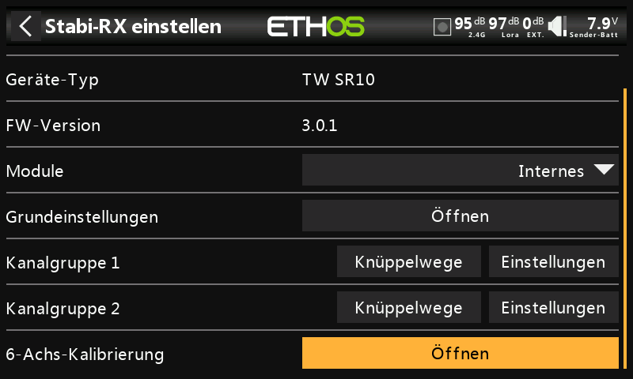

Fertiggestellte Konfigurationen können auf Ihrem PC gespeichert oder Sicherungskopien wiederhergestellt werden. Dies gilt nicht für Kalibrierungsdaten.

Neue Empfängermodelle haben zwei Stabilisierungsgruppen. Gruppe 1 deckt die Kanäle 1-6 ab, Gruppe 2 die Kanäle 7-11. Wenn Sie die Kanäle 7-11 nicht zur Stabilisierung verwenden, schalten Sie bitte die Stabilisierungsgruppe 2 aus.

Die 6-Achsen-Kalibrierungsfunktion ist jetzt integriert. Dies muss einmalig bei neuen Empfängern und beim Upgrade auf v3.0.x (nach dem Werksreset) durchgeführt werden.

#### Kalibrierung der Gruppen 1 und 2

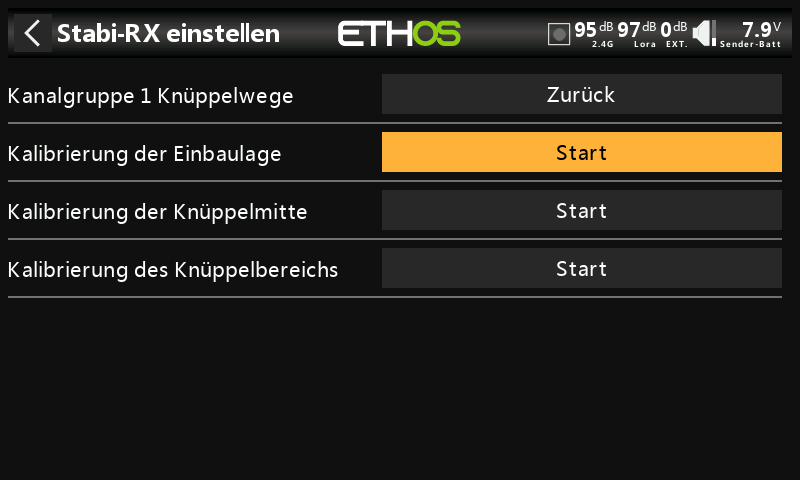

Im Rahmen der Kalibrierungsfunktion für die Gruppen 1 und 2 wurde der Selbsttest-Schritt durch eine weitaus leistungsfähigere, unabhängige Kalibrierung der gewünschten Lage für den „Selbstausrichtungsmodus“ (Automatikmodus), der Kanalmitte und der Kanalendpunkte ersetzt. Zudem kann nun jeder Kanal aktiviert bzw. deaktiviert werden.

#### Konfiguration der Kanalgruppen 1 und 2

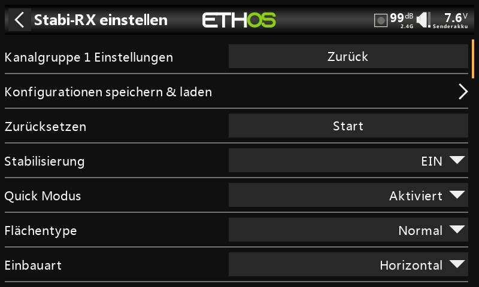

In diesem Abschnitt werden die Stabilisierungseinstellungen vorgenommen.

Abgeschlossene Konfigurationen können auf Ihrem PC gespeichert oder Sicherungskopien wiederhergestellt werden. Die Kalibrierungsdaten sind hier nicht enthalten.

FrSky North America hat einen [umfassenden Leitfaden](https://docs.google.com/document/d/1...it?usp=sharing) zur Einrichtung von stabilisierten Empfängern zusammengestellt, der alle Details abdeckt.

Es gibt auch ein [Video über den Einrichtungsprozess](https://youtu.be/0pKSzxyJrB8?si=PFuby_4TNiMnONvM) von FrSky Team Pilot Juan Sanchez Garcia.  Er erklärt die Einrichtung in allen Einzelheiten.

### Option SxR

Die älteren Empfängermodelle (wie z. B. ACCST D16 S6R, ACCST D16 S8R) sowie die Archer- und Archer Pro-Empfänger (wie z. B. Archer SR6, Archer SR8 Pro, Archer SR10 Pro), R9 Stab, R9 Stab OTA sowie RB30S und RB40S nutzen die SxR-Option.

Auch wenn die Archer-Empfänger die Bezeichnung SRx statt SxR tragen und die Verstärkung auf Kanal 9 zugewiesen ist, nutzen sie dennoch die SxR-Option.

Bei den neueren Empfängern mit „Erweiterter Stabilisierung“ und der Verstärkungsregelung auf Kanal 13 wird die [Option „Stabi-RX einstellen“](devices.md) verwendet.

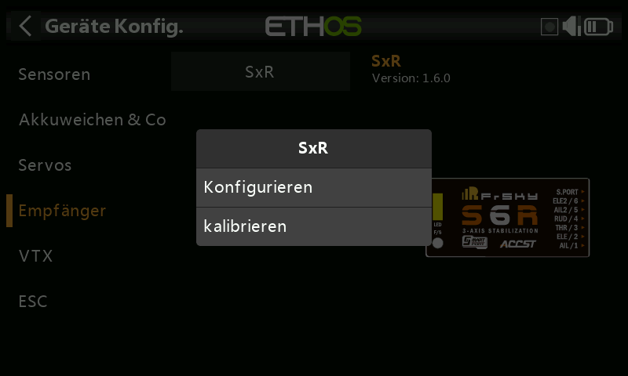

Die älteren SxR-Empfänger können über die Option „SxR“ kalibriert und konfiguriert werden.

## Konfiguration über S.Port-Anschluss am Sender

Über den S.Port-Anschluss am Sender können S.Port- und FBUS-Geräte direkt konfiguriert werden.

### FBUS-Geräte konfigurieren

Stecken Sie das FBUS-Gerät in den S.Port-Anschluss an der Oberseite des Senders. Das weiße oder gelbe Kabel wird an der Seite mit einer Kerbe angeschlossen.

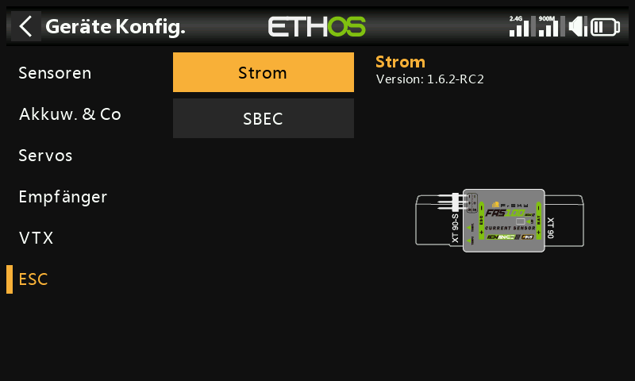

Gehen Sie zu System / Geräte Konfig. und blättern Sie zu Ihrem FBUS-Gerät, zum Beispiel einem FAS40 ADV Stromsensor. Drücken Sie Enter.

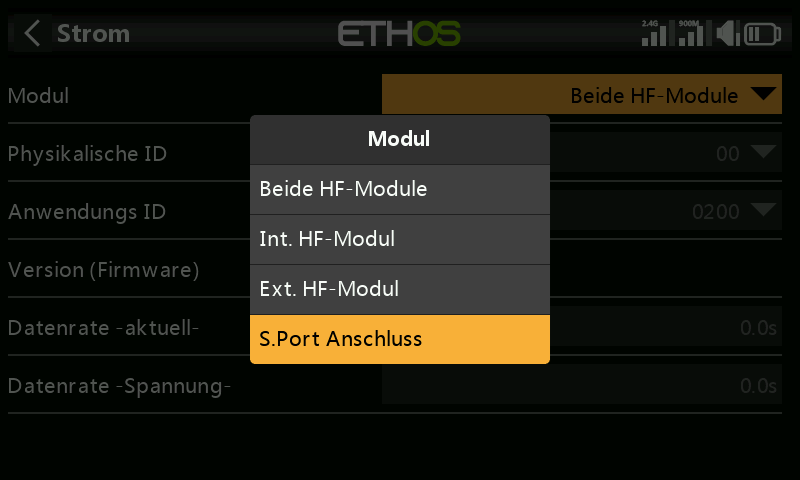

Sobald sich die Konfigurationsseite öffnet, klicken Sie auf Modul und wählen Sie „S.Port-Anschluss“.

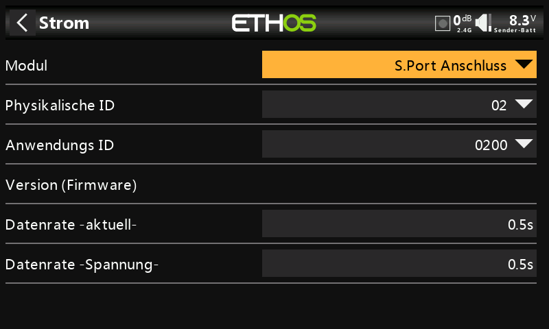

Nehmen Sie Ihre Konfigurationsänderungen vor und denken Sie daran, dass sowohl die physische ID als auch die Anwendungs-ID eindeutig sein müssen.

Scrollen Sie dann weiter nach unten und tippen Sie auf die Schaltfläche „Speichern int. Speicher“.

Weitere Beispiele finden Sie im Abschnitt „Wie konfiguriere ich ein FBUS-System“.

### S.Port-Geräte konfigurieren

Stecken Sie das S.Port-Gerät in den S.Port-Anschluss an der Oberseite des Senders. Das weiße oder gelbe Kabel wird an der Seite mit der Einkerbung angeschlossen.

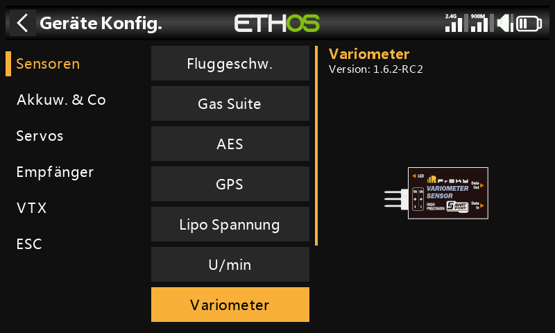

Gehen Sie zu System / Geräte Konfig. und blättern Sie zu Ihrem S.Port-Gerät, zum Beispiel einem Variometer. Drücken Sie Enter.

Sobald sich die Konfigurationsseite öffnet, klicken Sie auf Modul und wählen Sie „S.Port-Anschluss“.

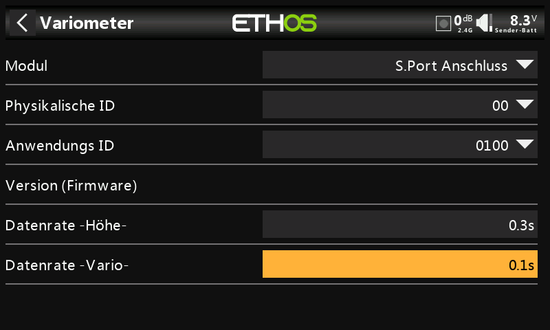

Nehmen Sie Ihre Konfigurationsänderungen vor und denken Sie daran, dass sowohl die physische ID als auch die Anwendungs-ID eindeutig sein müssen.
