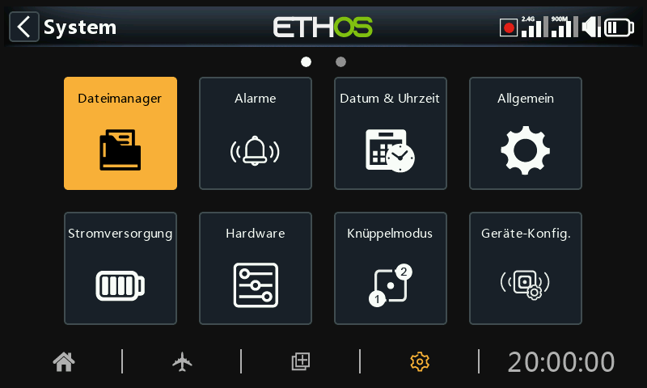
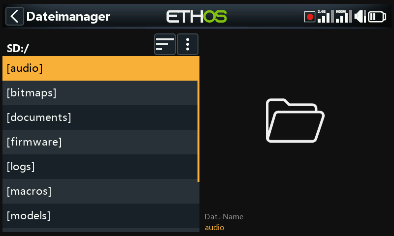
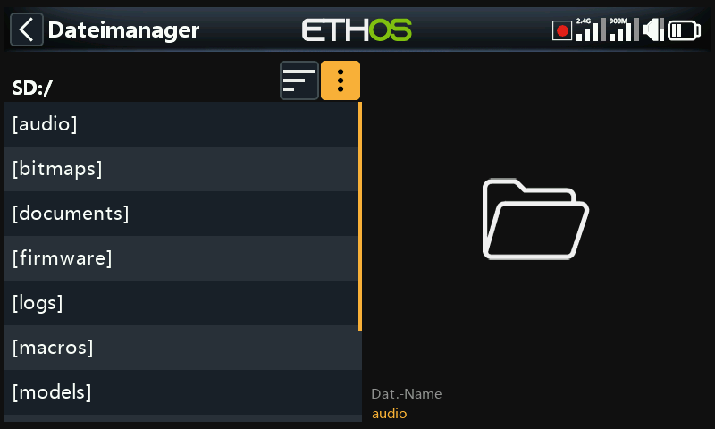
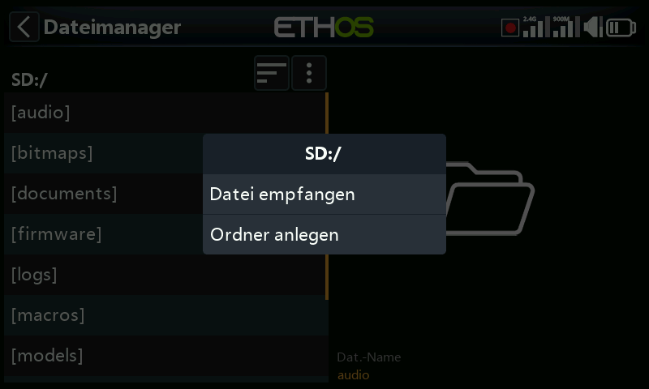
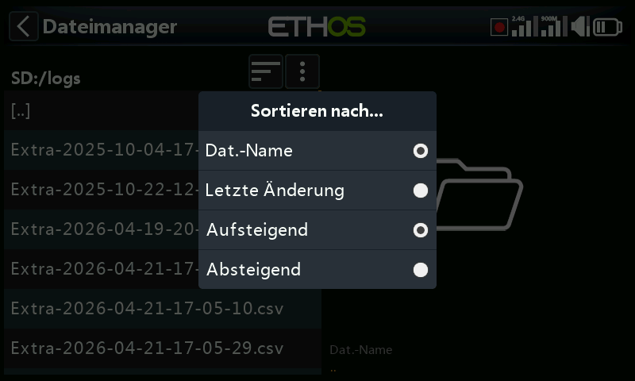
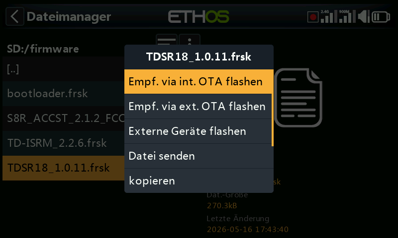
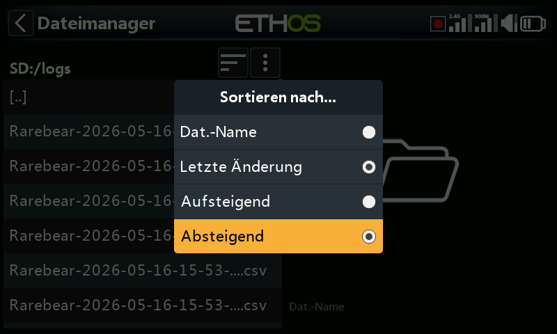
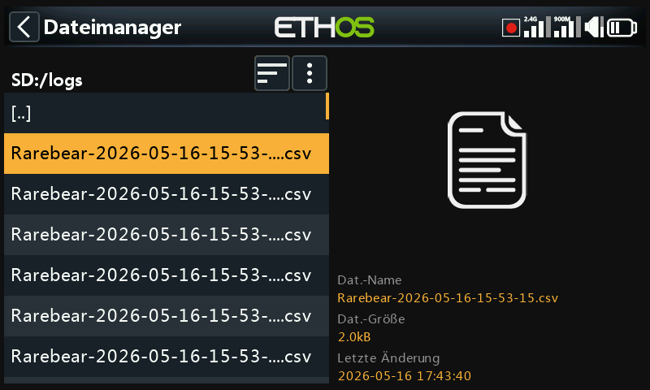

# Datei Manager

Der „Datei Manager“ dient der Verwaltung von Dateien und Ordnern sowie dem Zugriff auf Flash-Firmware für das RF-Modul, den externen S.Port, OTA-Geräte (Over The Air) und externe Module.

Beachten Sie, dass bei der Aktualisierung der System-Firmware möglicherweise auch die Dateien auf der SD- oder eMMC-Karte aktualisiert werden müssen.

Bitte beachten Sie, dass der Sender ab Ethos 26.1 nicht mehr den internen Flash-Speicher zum Speichern von Systembitmaps und Schriftarten verwendet. Diese Dateien sind nun Teil der Ethos-Firmware, wodurch die Startzeit verkürzt und die Geschwindigkeit der Benutzeroberfläche erhöht wird (kein dynamisches Laden von Bitmaps).

ETHOS verfügt über eine Bluetooth-Dateiübertragungsfunktion von Sender zu Sender. Bitte beachten Sie das Beispiel im Abschnitt „[Gemeinsame Nutzung von Dateien über Bluetooth](file-manager.md)“ weiter unten.

Hinweis: Sowohl der Bootloader als auch die System-Firmware sind im internen Flash-Speicher aller FrSky-Funkgeräte bis hin zum ursprünglichen X9D gespeichert.

Tippen Sie auf „Dateimanager“, um den Datei-Explorer zu öffnen.

Die X20/S/HD-Serie benötigt eine SD-Karte mit 32 GB oder weniger, die mit fat32 formatiert ist. SanDisk Ultra Micro SDHC Class 10 16gig Karten sind eine gute Wahl. Die Dateien finden Sie auf der FrSky-Website.

Die Funkgeräte X18 und X20 Pro/R/RS verwenden standardmäßig eine interne eMMC-Karte zur Dateispeicherung, es kann jedoch auch eine externe SD-Karte hinzugefügt werden. Tippen Sie auf die Registerkarte „Radio“, um den Speicher der eMMC-Karte zu erkunden. Mit der Taste \[Page\] können Sie auch zwischen den Laufwerken wechseln.

Das System erstellt einige der Ordner, wenn der Benutzer sie nicht selbst anlegt, z. B. Logs, Modelle und Screenshots. Der Ordner „Firmware“ wurde manuell erstellt, um Geräte-Firmware wie Empfänger usw. zu speichern.

SD-Karten-Laufwerkspfad bei Anschluss an einen PC:

SD-Karte (Laufwerksbuchstabe)/ oder

RADIO (Laufwerksbuchstabe)/ {Radios mit interner eMMC-Karte}

## Dateimanager-Menü

Der Dateimanager verfügt über ein Optionsmenü. Tippen Sie auf die drei vertikalen Punkte in der Menüleiste (oder scrollen Sie zurück).

Das Menü „Dateimanager“ enthält zwei Optionen:

- Sie können ein Modell über Bluetooth empfangen. Weitere Informationen finden Sie im Ordner „Modelle“ unten.
- Sie können einen neuen Ordner in dem Ordner erstellen, den Sie geöffnet haben, wenn Sie dieses Menü aufrufen.

## Sortieroptionen des Dateimanagers

Tippen Sie auf das Symbol „Sortieroptionen“ neben dem Dateimanager-Menüsymbol oben, um das Dialogfeld „Sortieren nach...“ zu öffnen:

- Sie können nach Dateinamen oder nach dem Datum der letzten Änderung der Datei sortieren.
- Sie können in aufsteigender oder absteigender Reihenfolge sortieren.

Diese Option ist äußerst nützlich, um die aktuelle Protokolldatei im Ordner „logs“ zu finden.

## Ordner der obersten Ebene

Die Ordner der obersten Ebene sind:

### audio/

Dieser Ordner ist für Audiodateien vorgesehen

#### audio/en/gb	English voice                **audio/de/default**        Deutsche männliche     
audio/en/us	American voice  oder                                       Standardsprache  
**audio/en/default**	default voice

Diese Ordner sind für Benutzer-Sounddateien gedacht, die mit der Sonderfunktion „Audio abspielen“ wiedergegeben werden können. Lesen Sie dazu den Abschnitt Modell / [Spezialfunktionen](../model-setup/special-functions.md) und den Abschnitt [Auswahl an Stimmen](#Lesezeichen 9).

Das Format sollte 16kHz oder 32kHz PCM linear 16 Bits oder alaw (EU) 8 Bits oder mulaw (US) 8bits sein. Die Namen von wav-Dateien dürfen 31 Zeichen plus Erweiterung enthalten.

#### audio/en/gb/system                            audio/de/default/system   
audio/en/us/system             oder          
a*udio/en/**default**/system*

Diese Ordner sind für System-Sounddateien gedacht, z. B.

| hello.wav | Die Begrüßung „Willkommen bei Ethos" |
| --- | --- |
| bye.wav	 | Diese wird nicht von Ethos zur Verfügung gestellt, aber Sie können Ihre eigene WAV-Datei zum Abschied hinzufügen, z.B. "Tschüss, bis zum nächsten Mal". |

Tippen Sie auf den Ordner \[audio\], um den Inhalt des Ordners anzuzeigen.

Tippen Sie auf eine WAV-Datei, und wählen Sie die Option Abspielen, um sie anzuhören.

Die Datei kann auch kopiert, verschoben, umbenannt oder gelöscht werden.  Es gibt auch Optionen zum Senden oder Empfangen der Datei über Bluetooth. Weitere Informationen finden Sie unter [Gemeinsame Nutzung von Dateien über Bluetooth](file-manager.md).

Hinweis: Alle drei Ordner werden von der Ethos Suite aktualisiert, unabhängig davon, welche(n) Sie in den Sprachoptionen ausgewählt haben.

### bitmaps/

Dieser Ordner ist für Bitmap-Dateien vorgesehen.

#### bitmaps/***models***/

In diesem Ordner befinden sich die Bilder der Benutzermodelle, die in „Modell / Modell bearbeiten“ oder in den Assistenten für neue Modelle konfiguriert werden.

Beachten Sie, dass der Dateimanager im rechten Fensterbereich Dateidetails wie den Dateinamen, die Dateigröße und das Datum der letzten Änderung anzeigt.

#### bitmaps/user/

Dieser Ordner ist für Benutzer-Bitmaps gedacht, die nicht zu den Modellbildern gehören, die unter 'Modell / Modell bearbeiten' eingerichtet wurden.

Das empfohlene Bildformat ist das folgende BMP-Format:

32bits BMP-Format

8 Bits pro Farbe

Alphakanal (wird für die Transparenz des Bildes verwendet)

Größe: 300 X 280px

Dieses Format reduziert die Rechenlast des integrierten Mikrocontrollers des Senders. Außerdem passt ETHOS die Größe von BMP-Bildern im laufenden Betrieb an, nicht aber die von PNG- oder JPG-Bildern.

Regeln für die Benennung von Bilddateien:

Regel 1: Verwenden Sie nur die folgenden Zeichen: A-Z, a-z, 0-9, ()!-\_@#;\[\]+= und Leerzeichen

Regel 2: Der Name darf nicht mehr als 11 Zeichen enthalten, plus 4 Zeichen für die Erweiterung. Wenn der Name länger als 11 Zeichen ist, wird er im Dateimanager angezeigt, erscheint aber nicht in der Modellbildauswahloberfläche.

#### Bildkonvertierungstools

Ethos Suite verfügt über Werkzeuge zur Bildkonvertierung. Bitte lesen Sie dazu den Abschnitt Bildmanager in Ethos Suite.

### ***documents***/

Dieser Ordner ist für Dokumente vorgesehen.

***documents***/***user***/

Dieser Ordner ist für Benutzer-Textdokumente vorgesehen. Sie können über das Widget „Text“ aufgerufen werden.

### ***Firmware***/

Dieser Ordner ist für Firmware-Dateien vorgesehen. Firmware-Updates für das interne Funkmodul, externe Module und andere Geräte wie Empfänger usw. werden hier gespeichert. Sie können dann von hier aus über den externen S.Port des Senders oder OTA (Over The Air) geflasht werden. Die neue Firmware muss in den Firmware-Ordner kopiert werden, nachdem der Sender in den Boot-Loader-Modus versetzt und über USB mit einem PC verbunden wurde

Hinweis: fügt man für jede Gerätegruppe (z.B. Empfänger, Vario usw.) je einen eigenen Ordner ein und fügt die entsprechende Firmware geordnet ein, so bleibt die Übersicht besser erhalten.

Tippen Sie auf den Ordner „Firmware“, um die Firmware-Dateien anzuzeigen, die in diesen Ordner kopiert wurden.  Wählen Sie die für Ihr Gerät geeignete Firmware aus und tippen Sie dann im Popup-Dialogfeld auf die Option „Flash“. Das obige Beispiel zeigt das interne HF-Modul, das aktualisiert werden soll.

Das obige Beispiel zeigt einen X8R-Empfänger, der über den S.Port-Anschluss des Senders aktualisiert werden soll (Externes Gerät flashen).

Das obige Beispiel zeigt einen TD-R18-Empfänger, der gerade über die drahtlose Verbindung zum gebundenen Empfänger via OTA (Over-The-Air) aktualisiert wird.

Das obige Beispiel zeigt den Bootloader, der aktualisiert werden soll.

Die Dateien können auch kopiert, verschoben oder gelöscht werden.

### I18n

Dieser Ordner enthält die Sprachübersetzungsdateien.

### Logs/

Hier werden Datenprotokolle gespeichert.

Um die Protokolle anzuzeigen, ist es am bequemsten, die Sortieroptionen des Dateimanagers auf „Letzte Änderung“ und „Absteigend“ zu ändern, damit die neuesten Protokolle ganz oben stehen.

Navigieren Sie zum Protokollordner und tippen Sie dann auf das Symbol „Sortieroptionen“ neben dem Dateimanager-Menüsymbol oben, um das Dialogfeld „Sortieren nach...“ zu öffnen. Tippen Sie auf „Nach letzter Änderung“ und „Absteigend“ sortieren.

Scrollen Sie zur gewünschten aktuellen Protokolldatei. Beachten Sie, dass der Dateimanager im rechten Fensterbereich Dateidetails anzeigt, darunter den vollständigen Dateinamen, was sehr nützlich ist, um den vollständigen Zeitstempel zu sehen, wenn er in der Ansicht auf der linken Seite abgeschnitten wurde.

Tippen Sie auf die Protokolldatei und wählen Sie „Öffnen“, um sie anzuzeigen. Weitere Informationen finden Sie im Abschnitt „Protokollanzeige“.

### models/

Der Sender speichert hier Modelldateien. Diese Dateien können vom Benutzer nicht bearbeitet werden, aber sie können von hier aus gesichert oder weitergegeben werden. Ursprünglich wurden die Modelle einfach mit model01.bin benannt, aber ab Ethos v1.2.11 wird der Modellname verwendet, z.B. hat ein Modell mit dem Namen „Extra“ den Dateinamen „Extra.bin“. Wenn es mehr als ein 'Extra' gibt, werden die zusätzlichen Modelle 'Extra01.bin' genannt usw.

Wenn Sie die Modellnamen im Bildschirm „Modell bearbeiten“ bearbeiten, wird auch der Dateiname des Modells (.bin) geändert. Der Modelldateiname wird ausschließlich in Kleinbuchstaben geschrieben (der eigentliche Modellname mit Groß- und Kleinschreibung wird in der bin-Datei gespeichert). Es werden nicht alle Zeichen für den Bin-Namen der Modelldatei unterstützt, so dass er möglicherweise nicht genau mit dem Modellnamen übereinstimmt.

Für jeden vom Benutzer erstellten Modellkategorie-Ordner gibt es Unterordner.

### screenshots/

Screenshots, die mit der Sonderfunktion Screenshot erstellt wurden, werden hier im PNG-Format gespeichert. Siehe dazu den Abschnitt Modell / [Spezialfunktionen](../model-setup/special-functions.md).

### scripts/

Dieser Ordner wird zum Speichern von LUA-Skripten verwendet. Skripte können in einzelnen Ordnern organisiert werden und haben Unterstützungsdateien in einer Ordnerstruktur enthalten.

**Achtung!** Bitte beachten Sie, dass LUA-Skripte die Startzeit des Senders verlängern. Wenn sie korrekt implementiert sind, sollte die Verzögerung nicht spürbar sein, aber wenn dies nicht der Fall ist, kann die Verzögerung fast unbegrenzt sein.

Zu den Lua-Skripttypen gehören Widgets, Aufgaben, Quellen und Werkzeuge. Sie werden auch zur Steuerung externer Module verwendet.

Widgets

Widgets werden in den Hauptansichten verwendet, um gewünschte Informationen wie Telemetrie, Funkstatus usw. anzuzeigen. Weitere Einzelheiten finden Sie im Abschnitt Bildschirme konfigurieren.

Aufgaben und Quellen

Mit Hilfe von Lua-Skripten ist es möglich, benutzerdefinierte Quellen, wie z. B. benutzerdefinierte Sensoren, oder Aufgaben zu erstellen, die benutzerdefinierte Aktionen durchführen, wie z. B. die Protokollierung von Daten in eine Datei nach dem Flug. Nach der Installation im Ordner scripts/ erscheint das Lua-Menü im Abschnitt Modell, um die Aufgabe oder Quelle für jedes Modell zu verwalten. Weitere Einzelheiten finden Sie auf der Lua-Seite.

Werkzeuge

Zum Beispiel die Werkzeuge zur Konfiguration des stabilisierten Empfängers, die in den Systemmenüs erscheinen.

#### Skripte für externe Sendemodule

Jedes externe Modul eines Drittanbieters hat seine eigene LUA-Datei und sollte in einem eigenen Ordner gespeichert werden.

scripts/multi

scripts/elrs

scripts/ghost

scripts/crossfire

Weitere Informationen finden Sie im Beitrag [Externe Module von Drittanbietern](https://www.rcgroups.com/forums/showpost.php?p=49550649&postcount=18844) im Thread X20 und Ethos auf rcgroups.

### radio.bin

Diese Datei befindet sich im Stammverzeichnis und wird vom Sendersystem bei der Initialisierung erstellt und enthält die Systemeinstellungen. Sie sollte zusammen mit dem obigen Ordner \[models\] gesichert werden, bevor die Firmware aktualisiert wird, um bei Bedarf ein Downgrade auf eine frühere Version zu ermöglichen.

Die Firmware-Aktualisierungsdatei firmware.bin sollte hier im Stammverzeichnis der SD-Karte oder eMMC gespeichert werden, wenn Sie ein Firmware-Update des Senders durchführen. Nach dem Speichern der neuen Datei firmware.bin wird das Update automatisch in das Funkgerät geflasht, wenn es vom PC getrennt wird.  (Bitte beachten Sie, dass Sie möglicherweise auch den Inhalt der SD-Karte oder des eMMC-Laufwerks gleichzeitig aktualisieren müssen.).

### sdcard.version

Diese Datei enthält die sdcard-Version und wird von der Ethos Suite verwendet und gepflegt.

## Gemeinsame Nutzung von Dateien via Bluetooth

ETHOS verfügt über eine Bluetooth-Dateiübertragungsfunktion von Sender zu Sender

Navigieren Sie auf dem empfangenden Sender mit dem Dateimanager zu dem Modellordner, in den Sie die Datei oder das Modell empfangen möchten. Tippen Sie dann auf das Symbol „Dateimanager-Menü“ in der obersten Zeile (oder scrollen Sie zurück und drücken Sie \[ENT\] auf dem Symbol). Wählen Sie dann „Datei empfangen“.

Navigieren Sie auf dem Sender zu der Datei, die Sie senden möchten, und tippen Sie auf sie. Wählen Sie dann „Datei senden“ und folgen Sie den Aufforderungen auf beiden Sendern.

Wenn der Sender bereits mit einem anderen Bluetooth-Gerät unter Telemetrie / Bluetooth oder Trainer / Verbindungsmodus / Bluetooth oder Allgemein / Audio / Bluetooth (nur X20S/Pro) verbunden ist, werden Sie gefragt, ob Sie die Verbindung zu diesem Gerät trennen möchten.
