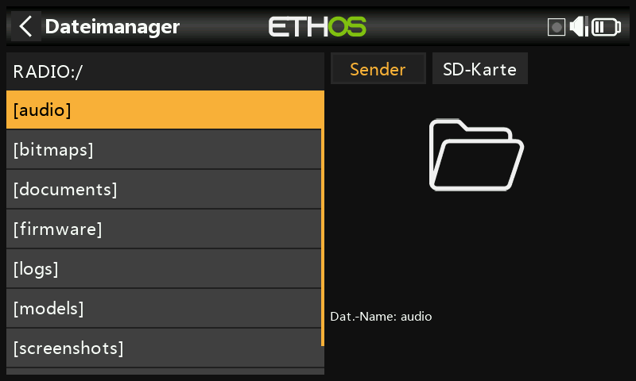
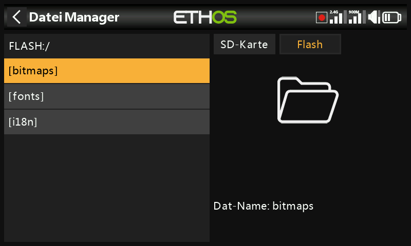
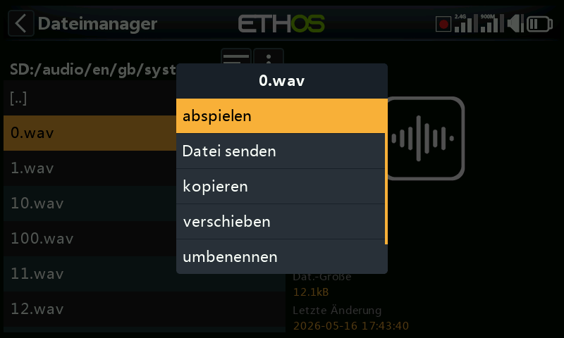
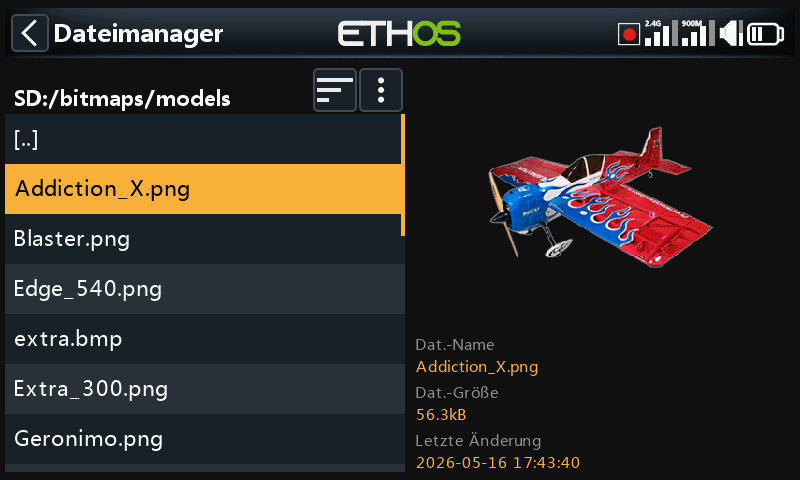
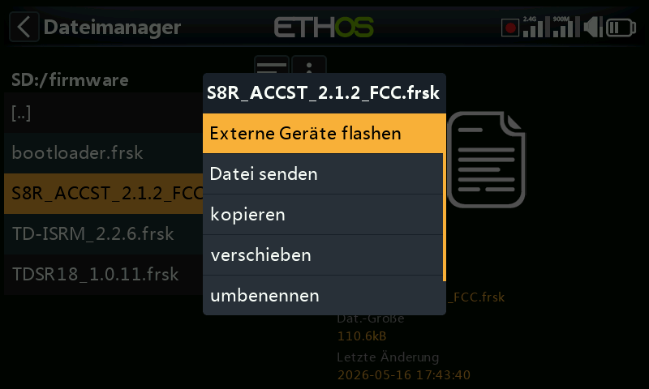
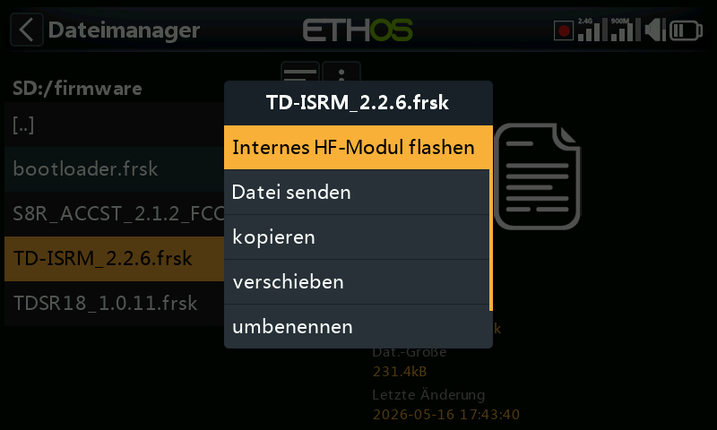
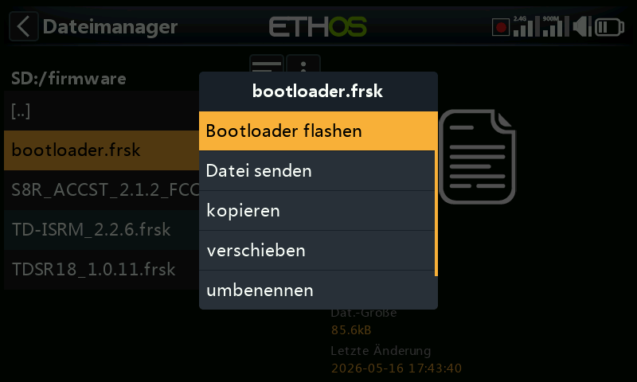
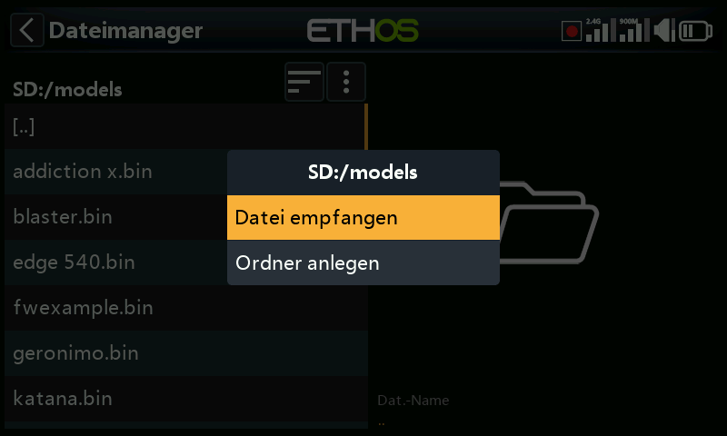
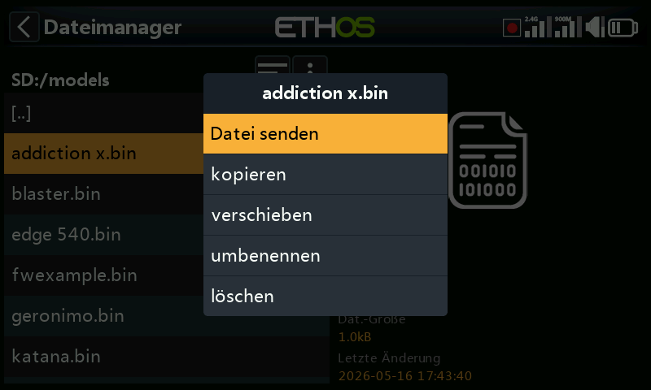

# Dateimanager

Der Dateimanager durchsucht den Speicher des Senders und flasht Firmware auf das
interne HF-Modul, auf per S.Port angeschlossene Geräte, auf OTA-Geräte
(Over-The-Air) sowie auf externe Module.

## Speicheraufbau

Tippen Sie auf **Flash** (oder drücken Sie `PAGE`, um zwischen den Laufwerken zu
wechseln), um das interne virtuelle USB-Flash-Laufwerk des Senders zu durchsuchen,
das für System-Bitmaps und Schriftarten verwendet wird:

- `bitmaps/system` — die Bitmaps für Bildschirmanzeigen und Symbole
- `fonts/` — Schriftarten für die verschiedenen Sprachauswahlen

Sowohl der Bootloader als auch die Systemfirmware selbst befinden sich in diesem
internen Flash-Speicher – bei jedem FrSky-Sender bis zurück zur ursprünglichen X9D.

Die Serie **X20/X20S/X20HD** nimmt eine FAT32-formatierte SD card mit maximal 32 GB
auf (eine SanDisk Ultra Micro SDHC Class 10 mit 16 GB ist eine solide Wahl).
Die **X18** und die **X20 Pro/R/RS** verwenden standardmäßig einen internen eMMC
(zusätzlich kann eine externe SD card eingesetzt werden) — tippen Sie auf **Radio**,
um ihn zu durchsuchen.
Ethos legt `Logs/`, `models/` und `screenshots/` automatisch an, falls sie fehlen;
`Firmware/` ist eine manuelle Konvention für Firmware-Dateien von Geräten wie
Empfängern.

## Ordner der obersten Ebene {: #top-level-folders }

- **`audio/`** — Benutzer- und System-Sounddateien, nach Stimme getrennt
  (`audio/en/gb`, `audio/en/us`, `audio/en/default`). Benutzerdateien werden
  über die [Sonderfunktion „Play Audio“](../model-setup/special-functions.md)
  abgespielt; zu den Systemdateien gehört `hello.wav` (die Begrüßung „Welcome to
  Ethos“ — eine `bye.wav` kann ergänzt werden, wird aber nicht mitgeliefert).
  Format: 16 kHz oder 32 kHz PCM, linear 16 Bit, oder A-law (EU)/µ-law (US) 8 Bit;
  Dateinamen bis zu 31 Zeichen plus Erweiterung. Alle drei Stimmordner werden von
  Ethos Suite synchron gehalten, unabhängig davon, welcher tatsächlich ausgewählt ist.

  

- **`bitmaps/`** — `bitmaps/models/` enthält die Modellbilder des Benutzers
  (festgelegt in [Model Edit](../model-setup/model-edit.md) oder in den Assistenten
  für neue Modelle); `bitmaps/user/` enthält alles Übrige. Empfohlenes Format:
  32-Bit-BMP, 8 Bit pro Farbe, mit Alphakanal, 300×280 px — dies hält den
  Dekodieraufwand im Sender gering. Ethos skaliert BMP-Dateien im laufenden Betrieb,
  PNG/JPEG jedoch nicht. Dateinamen dürfen nur die Zeichen `A-Z a-z 0-9 ()!-_@#;[]+=`
  sowie Leerzeichen enthalten und müssen 11 Zeichen oder kürzer sein (plus einer
  4-stelligen Erweiterung), um in der Modellbildauswahl zu erscheinen — längere Namen
  werden zwar weiterhin im Dateimanager angezeigt, sind dort aber nicht auswählbar.
  Die Bildkonvertierungswerkzeuge von Ethos Suite übernehmen die Formatumwandlung für Sie.

  

- **`documents/user/`** — Textdokumente des Benutzers, die über das
  **Text**-Anzeige-Widget aufgerufen werden.

- **`Firmware/`** — Firmware-Dateien für das interne HF-Modul, externe Module und
  andere Geräte (Empfänger usw.), die von hier aus per S.Port oder OTA geflasht
  werden. Kopieren Sie neue Firmware hierher, während sich der Sender im
  [Bootloader-Modus](../getting-started/usb-connection-modes.md) befindet und per USB
  verbunden ist; durch Antippen einer Firmware-Datei und Auswahl von **Flash** wird
  das Update gestartet:

  
  
  
  

- **`I18n/`** — Sprachübersetzungsdateien.

- **`Logs/`** — Datenaufzeichnungen.

- **`models/`** — die Modelldateien selbst. Sie können hier nicht direkt bearbeitet,
  sondern nur gesichert oder weitergegeben werden. Seit Ethos v1.2.11 wird ein Modell
  nach seinem Modellnamen benannt und nicht mehr fortlaufend als `model01.bin`
  (z. B. wird aus einem Modell namens „Extra“ die Datei `Extra.bin`; aus einem zweiten
  „Extra“ wird `Extra01.bin`). Das Umbenennen eines Modells in
  [Model Edit](../model-setup/model-edit.md) benennt auch dessen Datei um — immer in
  Kleinbuchstaben (der Anzeigename mit Groß- und Kleinschreibung wird in der Datei
  gespeichert), und nicht jedes Zeichen eines Modellnamens findet sich im Dateinamen
  wieder. Seit v1.1.0 Alpha 17 erhält jede vom Benutzer angelegte Modellkategorie
  einen eigenen Unterordner.

- **`screenshots/`** — Ausgabe der [Sonderfunktion
  „Screenshot“](../model-setup/special-functions.md).

- **`scripts/`** — Lua-Skripte, optional in eigenen Unterordnern mit Hilfsdateien
  organisiert. Skripttypen sind **Widgets** (siehe
  [Anzeigen](../displays/index.md)), **Tasks und Quellen** (benutzerdefinierte
  Sensoren oder Aktionen nach dem Flug — hier installiert, erscheinen sie im
  [Lua](../model-setup/lua-scripts.md)-Menü des Modells) sowie **Tools** (z. B. die
  Konfigurationswerkzeuge für stabilisierte Empfänger in den Systemmenüs).
  Externe Module von Drittanbietern erhalten jeweils ein eigenes Skript und einen
  eigenen Ordner, z. B. `scripts/multi`, `scripts/elrs`, `scripts/ghost`,
  `scripts/crossfire`.

  !!! warning
      Lua-Skripte verlängern die Startzeit des Senders. Bei einem gut geschriebenen
      Skript ist die Verzögerung nicht wahrnehmbar — ein schlecht geschriebenes kann
      den Start nahezu unbegrenzt verzögern.

- **`radio.bin`** (Stammverzeichnis) — die Datei mit den Systemeinstellungen, die
  vom Sender selbst bei der Initialisierung geschrieben wird. Sichern Sie sie
  zusammen mit `models/` vor einem Firmware-Update, damit Sie bei Bedarf zurückstufen
  können.

- **`firmware.bin`** (Stammverzeichnis) — legen Sie hier eine neue Sender-Firmware-Datei
  ab, damit sie beim nächsten Trennen des Senders vom PC automatisch geflasht wird.
  Der Inhalt von SD card/eMMC und internem Flash-Laufwerk muss dabei unter Umständen
  im selben Durchgang aktualisiert werden.

- **`sdcard.version`** (Stammverzeichnis) — die Versionsnummer des SD-card-Inhalts,
  gepflegt von Ethos Suite.

## Dateien per Bluetooth teilen

Ethos kann Dateien per Bluetooth von Sender zu Sender übertragen. Navigieren Sie am
**empfangenden** Sender im Dateimanager zum Zielordner, halten Sie `ENT` gedrückt und
wählen Sie **Receive file here**:

Tippen Sie am **sendenden** Sender auf die Datei, wählen Sie **Send file** und folgen
Sie den Anweisungen auf beiden Sendern:

Falls einer der beiden Sender bereits eine aktive Bluetooth-Verbindung hat
(Telemetrie, Lehrer-Schüler-Verbindung oder — bei X20S/Pro — Audio), werden Sie
gefragt, ob dieses Gerät zuvor getrennt werden soll.
