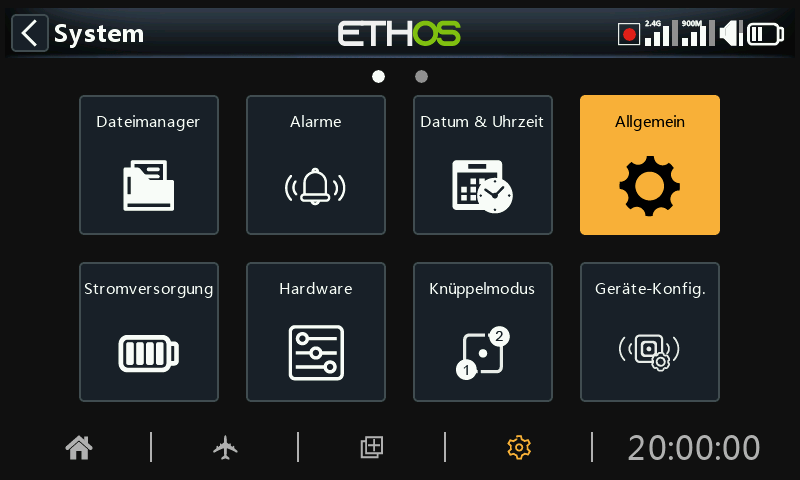
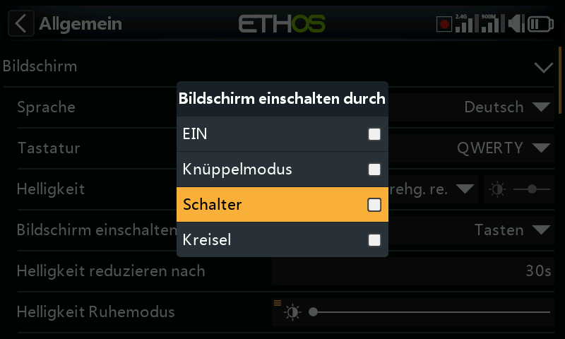
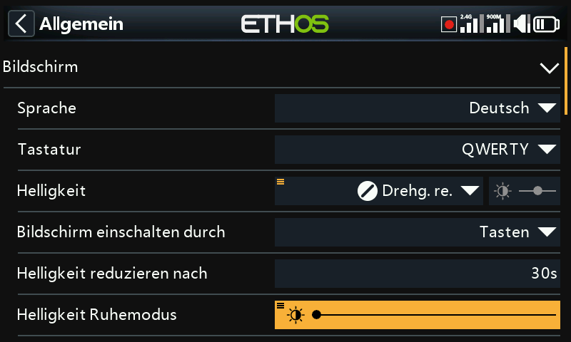
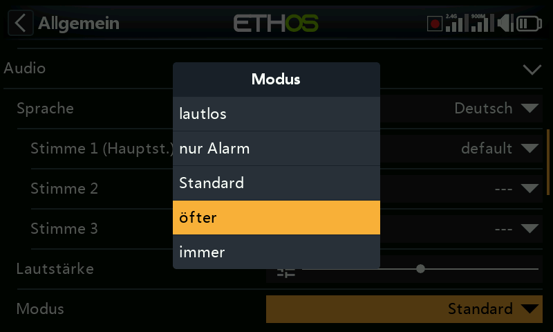
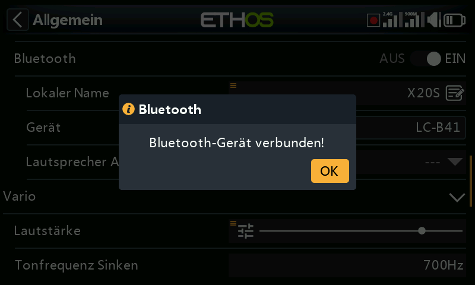
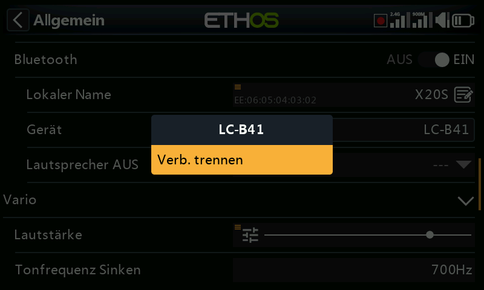
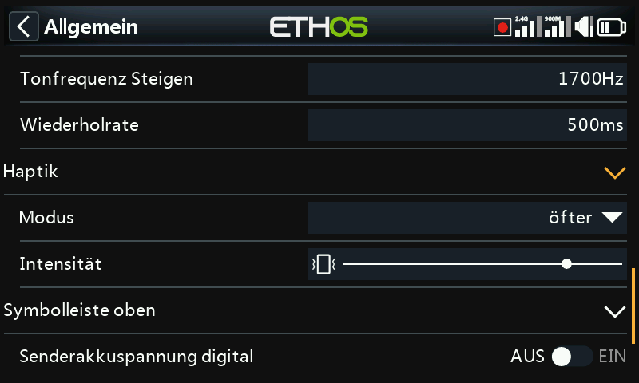
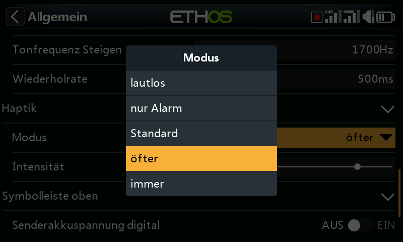

# Allgemein

Hier können folgende Einstellungen vorgenommen werden:

- Attribute der LCD-Anzeige
- die Audioeinstellungen
- Die Vario-Einstellungen
- Die Einstellungen für das haptische Feedback
- Die obere Symbolleiste

## Eigenschaften anzeigen

Hier können die Eigenschaften der LCD-Anzeige konfiguriert werden:

### Sprache

Die folgenden Sprachen werden für die Anzeigemenüs unterstützt:

English

中文

Česky

Deutsch

Español

Français

עִברִית

Italiano

Nederlands

Norsk

Português Brasileiro

Polish

Português

### Tastatur

Ermöglicht die Auswahl zwischen den virtuellen Tastaturlayouts QWERTY, QWERTZ und AZERTY

### Helligkeit

Verwenden Sie den Schieberegler, um die Helligkeit des Bildschirms einzustellen; von links nach rechts, um die Helligkeit von dunkel bis hell einzustellen. Durch langes Drücken von \[ENT\] werden Optionen zur Verwendung einer Quelle oder zur Einstellung auf Minimum oder Maximum aufgerufen.

Bitte beachten Sie, dass bei Helligkeit (für Hintergrundbeleuchtung EIN) = Ruhemodus-Helligkeit' (für ausgeschaltete Hintergrundbeleuchtung) ist, bleibt der Touchscreen aktiv.

#### Option Potis

Tippen Sie auf „Eine Quelle verwenden“ und wählen Sie dann einen Potis aus, den Sie als Helligkeitsregler verwenden möchten.

Im obigen Beispiel wird die Helligkeit über Drehgeber rechts gesteuert.

### Bildschirm einschalten durch

Die Hintergrundbeleuchtung des Bildschirms kann gemäß einer oder mehrerer der folgenden Optionen aus dem Ruhezustand geweckt werden:

#### EIN

Die Hintergrundbeleuchtung bleibt dauerhaft eingeschaltet.

#### Knüppel Mode

Die Hintergrundbeleuchtung schaltet sich ein, wenn Knüppel oder Tasten betätigt werden.

#### Schalter

Die Hintergrundbeleuchtung schaltet sich ein, wenn Schalter oder Tasten betätigt werden.

#### Kreisel

Die Hintergrundbeleuchtung schaltet sich ein, wenn Sie den Sender neigen oder wenn Tasten betätigt werden.

Beachten Sie, dass mehr als eine Option aktiviert sein kann.

### Helligkeit reduzieren nach

Die Dauer der Inaktivität, bevor die Hintergrundbeleuchtung ausgeschaltet wird. Wenn Sie „Immer an“ als Option für das Aufwachen des Displays wählen, wird die Option „Ruhezustand“ ausgegraut.

### Helligkeit im Ruhe-Modus

Verwenden Sie den Schieberegler, um die Helligkeit des Bildschirms während des Ruhezustands zu steuern, von links nach rechts, um die Helligkeit von dunkel bis hell einzustellen.

Bitte beachten Sie: Wenn die Helligkeit (bei eingeschalteter Hintergrundbeleuchtung) der „Helligkeit im Schlafmodus“ (bei ausgeschalteter Hintergrundbeleuchtung) entspricht, bleibt der Touchscreen aktiv.

### Grundfarben

### Ermöglicht die Auswahl zwischen verschiedenen Grundfarben für die Anzeige. Die Standard-Einstellung ist Dunkel („Dark“), wobei Hell „Light“) als Alternative zur Verfügung steht. Zusätzlich können weitere Lua-Themes installiert werden. Weitere Einzelheiten entnehmen Sie bitte dem Abschnitt „[Alternative Lua-Anzeigefarben](../lua-scripts/alternative-display-themes.md)“.

### Farbe hervorheben

Ermöglicht die Auswahl der Hervorhebungsfarbe, die in der Anzeige verwendet werden soll. Die Standardeinstellung ist gelb (#F8B038).

## Audio-Einstellungen

### Audio-Sprache

Ermöglicht die Auswahl der Sprache für die Sprachansagen.

#### Auswahl an Stimmen

Die Funktion des Mehrsprachensystems bietet die Möglichkeit, innerhalb einer bestimmten Sprache aus verschiedenen Stimmensätzen zu wählen.

##### Stimme 1 (Hauptstimme)

Die Hauptstimme wird für alle Systemansagen verwendet, die Teil des Ethos-Betriebssystems sind. Standardmäßig kann für Englisch zwischen einer amerikanischen (us) und einer englischen (gb) Stimme gewählt werden. Für Deutsch gibt es momentan nur eine Stimme.

Im obigen Beispiel wurde die deutsche 'weiblich'-Stimme als ' Stimme 1 (Hauptstimme)' und als Stimme 2 die default (Standard)-Stimme ausgewählt.

Die Dateien befinden sich in den folgenden Ordnern:

a*udio/**de**/system*

##### Benutzer-Sounddateien

Benutzer-Sounddateien können zur Verwendung mit der Sonderfunktion „Audio abspielen“ (früher „Track abspielen“ und „Sequenz abspielen“) installiert werden. Ihr Speicherort muss sein:

*audio/**de**/*

##### Stimme 2 und 3

Die alternativen Sprachpakete können als Stimme 2 oder 3 installiert werden.

Um die entsprechende Sprachausgabe für Stimme 2 oder 3 zu gewährleisten, müssen Sie Ihre benutzerdefinierten Sounddateien in eine Ordnerstruktur einfügen, die der oben unter Stimme 1 gezeigten Standardstruktur ähnelt. Wenn Sie zum Beispiel TTS und eine Stimme namens weiblich verwenden, wäre Ihre Ordnerstruktur wie folgt:

*audio/de/weiblich system*            für Ersatz-System-Sounddateien

*audio/de/weiblich*                       für Benutzer-Sounddateien

Bitte beachten Sie, dass jede Stimme über einen /system-Ordner verfügen muss, der die für „Audio abspielen und Stoppuhr-Ansagen benötigten Sounddateien enthält. Beachten Sie, dass eine Liste der standardmäßig mitgelieferten System-Sounddateien in Form einer .csv-Datei mit jeder Audioversion mitgeliefert wird.

Sie können dann die Stimme auswählen, die für jede Stoppuhr- und „Audio abspielen“-Spezialfunktion verwendet werden soll. Optional können Sie auch eine benutzerdefinierte Stimme als Stimme 1 (Hauptstimme) zuweisen, wenn Sie dies wünschen.

##### Stimme 'default'

Um Konvertierungsprobleme von 1.4.X zu vermeiden, wird auch eine „default“ –(Standard) Stimme installiert. Wenn während der Installation/des Upgrades die Systemaudiostimme 1 (Hauptstimme) noch nicht eingestellt ist, wird „Stimme 1 (Hauptstimme)“ auf „Standard“ gesetzt, da sichergestellt ist, dass der Ordner existiert.

Die Dateien befinden sich in diesem Ordner:

a*udio/**de**/**default**/system*

##### Benutzer-Sounddateien

Einige häufig nachgefragte benutzerdefinierte Sounddateien werden für die Verwendung mit der Sonderfunktion „Audio abspielen“ (früher „Track abspielen“ und „Sequenz abspielen“) bereitgestellt. Ihr Speicherort ist:

*audio/**de**/**default**/*

Weitere benutzerdefinierte Sounddateien können zu diesem Ordner hinzugefügt werden, wenn der Benutzer diese Standardstimme weiterhin verwenden möchte.

### Hauptlautstärke

Verwenden Sie den Schieberegler, um die Audiolautstärke zu regeln. Durch langes Drücken von \[ENT\] kann ein Poti verwendet werden. Pieptöne während der Einstellung helfen bei der Beurteilung der Lautstärke.

### Audio-Modus

#### lautlos

Kein Ton. Beachten Sie, dass beim Start ein Alarm ertönt, wenn die Option „Stiller Modus“ in System / Alarme aktiviert ist.

#### Nur Alarm

Nur Alarme werden per Audio ausgegeben.

#### Standard

Töne sind aktiviert.

#### öfter

Es werden zusätzlich Fehlertöne ausgegeben, wenn versucht wird, den Maximal- oder Minimalwert bei editierbaren Zahlen zu überschreiten.

#### immer

Zusätzlich zu den Tönen unter „Oft“ ertönen auch Pieptöne, wenn im Menü navigiert wird.

### Bluetooth (nur X20S/HD/Pro/R/RS)

Die Sendermodelle X20S, HD und X20 Pro/R/RS verfügen über einen zusätzlichen Audiomodus für die Weiterleitung des Tons an ein Bluetooth-Gerät wie z.B. ein Headset.

Tippen Sie auf „Gerät suchen“.

Auf dem Display wird „Warten auf Gerät“ angezeigt. Schalten Sie Ihr Bluetooth-Gerät ein und versetzen Sie es in den Kopplungsmodus.

Nachdem das Bluetooth-Gerät gefunden wurde, wird sein Name angezeigt. Tippen Sie darauf, um das Gerät auszuwählen.

Es wird 'Warten auf Gerät' angezeigt.

Wenn der Sender und das Gerät gekoppelt sind, wird „Bluetooth-Gerät verbunden“ angezeigt. Tippen Sie auf OK.

Das Bluetooth-Bildschirm wird wieder angezeigt und bestätigt die Verbindung. Das Audiogerät sollte nun betriebsbereit sein.

#### Trennen

Tippen Sie auf das Gerät, um die Option „Trennen“ aufzurufen.

#### Lautsprecher AUS

Um den Systemlautsprecher stumm zu schalten (z. B. bei Verwendung eines BT-Ohrhörers), wählen Sie zwischen „immer ein“, „nur ein“, wenn die Telemetrie aktiv ist, oder „gesteuert durch eine Quelle wie einen Schalter oder eine andere Bedingung“.

Das System merkt sich das Bluetooth-Gerät. Für den normalen Betrieb schalten Sie zunächst den Sender und dann das Bluetooth-Gerät ein. Das Bluetooth-Gerät stellt eine Verbindung her und es dauert einige Sekunden, bis die Stummschaltung des Lautsprechers wieder aktiviert wird.

## Vario

Hier können die Audioeigenschaften von Variotönen konfiguriert werden.

### Lautstärke

Die relative Lautstärke des Variotons.

### Tonfrequenz Sinken

Die Tonhöhe bei maximalem Sinken.

### Tonfrequenz Steigen

Die Tonhöhe bei maximaler Steigrate.

### Wiederholrate

Die Zeitabstand zwischen den Tönen.

Weitere Vario-Parameter entnehmen Sie bitte dem [VSpeed](../model-setup/telemetry.md)-Sensor in der Telemetrie und der Spezialfunktion [Vario abspielen](../model-setup/special-functions.md).

## Haptik

### Stärke

Verwenden Sie den Schieberegler, um die Stärke der haptischen Vibration einzustellen.

### Mode

Ähnlich wie im Audio-Modus oben.

## Speicherort (X18 und X20 Pro/R/RS)

Die Sender der Reihen X18 und X20 Pro/R/RS verfügen über eine 8-GB-eMMC (embedded MultiMediaCard), ein Speichergerät, das aus NAND-Flash-Speicher und einem einfachen Speicher-Controller besteht. Das ETHOS-System wählt standardmäßig den eMMC-Speicher und macht die Verwendung einer SD-Karte optional. Der Benutzer kann jedoch die Verwendung des eMMC-Speichers oder einer optionalen SD-Karte oder einer Kombination aus beidem wählen.

Bitte beachten Sie den Bildschirm zur Auswahl des Speicherortes oben. Wenn das System und die Modelle auf die SD-Karte verschoben werden, müssen diese Ordner und Dateien auf die SD-Karte kopiert werden, bevor die Auswahl getroffen wird. Dasselbe gilt für die Audio- und Bilder- (Bitmap-) Dateien.

## Symbolleiste oben

### Digitale Spannung

Der Batteriestatus in der oberen Symbolleiste kann von der standardmäßigen Balkenanzeige auf die Anzeige der Batteriespannung des Senders als Digitalwert geändert werden.

### Digitales RSSI

In ähnlicher Weise kann der RSSI-Status von einer Balkenanzeige in einen digitalen Wert für 2.4G und 900M geändert werden.

## Modell beim Einschalten auswählen

Wenn diese Option aktiviert ist, wird beim Einschalten der Bildschirm zur Modellauswahl angezeigt, so dass ein Modell ausgewählt werden kann, bevor die Checklistenwarnungen des zuvor ausgewählten Modells angezeigt werden. Dadurch wird vermieden, dass Sie die Checklistenwarnungen vor der Auswahl eines anderen Modells abbrechen müssen.

Standardmäßig (AUS) ist das zuletzt in der vorherigen Sitzung verwendete Modell zur Auswahl markiert.

## Vorwahl des USB-Modus

Die folgenden Voreinstellungen sind verfügbar, wenn das Funkgerät über ein USB-Kabel mit einem PC verbunden ist:

### nicht eingestellt

Wenn 'nicht eingestellt', erscheint beim Verbinden ein Dialog, in dem eine Auswahl getroffen werden kann.

### Joystick

Bei der Verbindung geht der Sender automatisch in den Joystick-Modus für die Verwendung mit einem RC-Simulator.

### Ethos Suite

Beim Anschließen wechselt der Sender automatisch in den 'Ethos-Modus' für die Kommunikation mit der Ethos Suite. Bitte beachten Sie den Abschnitt Ethos-Modus im Abschnitt Ethos Suite.

### seriell

Beim Anschließen wechselt der Sender automatisch in den seriellen Modus, in dem Lua-Debug-Spuren an USB-Serial gesendet werden, falls vorhanden. Die Baudrate beträgt 115200bps. Ein geeigneter virtueller COM-Port-Treiber für Windows kann [hier](https://www.st.com/en/development-tools/stsw-stm32102.html) gefunden werden.
