# Allgemein

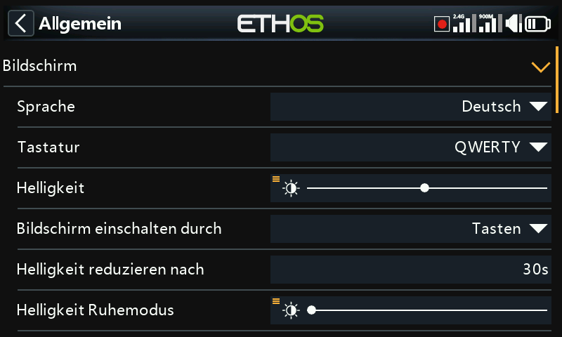

Umfasst Display-Eigenschaften, Audio, Vario, Haptik und die obere Statusleiste.

## Display-Eigenschaften

- **Sprache** — die Sprache der Bildschirmmenüs (English, 中文, Česky, Deutsch,
  Español, Français, עברית, Italiano, Nederlands, Norsk, Português
  Brasileiro, Polish, Português und weitere).
- **Tastatur** — virtuelles Tastaturlayout QWERTY, QWERTZ oder AZERTY.
- **Helligkeit** — ein Schieberegler für die Hintergrundbeleuchtung; mit einem
  langen Druck auf `ENT` kann sie stattdessen von einer Quelle gesteuert werden
  (z. B. von einem Schieberegler, siehe Beispiel unten) oder auf Minimum/Maximum
  festgelegt werden.

  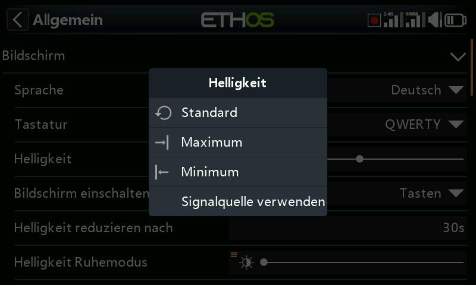
  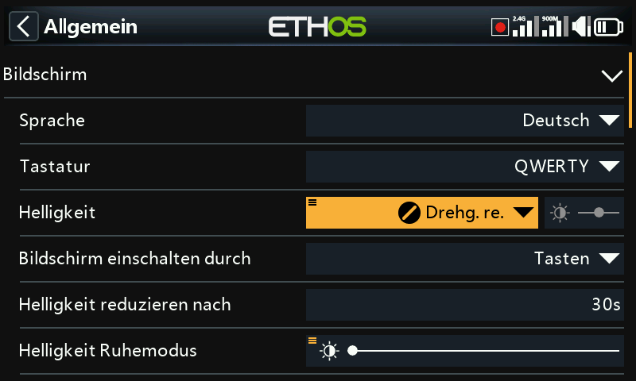

  !!! note
      Wenn **Helligkeit** und **Helligkeit im Ruhemodus** identisch sind, bleibt
      der Touchscreen auch im „Ruhezustand“ aktiv.

- **Aufwecken** — welche Ereignisse die Hintergrundbeleuchtung aus dem
  Ruhezustand wecken (es kann mehr als eines aktiviert werden): **Immer an**
  (kein Ruhezustand), **Steuerknüppel**, **Schalter**, **Gyro** (Neigen des
  Senders). Tasten wecken den Sender unabhängig von diesen Einstellungen immer
  auf.
- **Ruhezustand** — Zeit der Inaktivität, bevor die Hintergrundbeleuchtung
  abgeschaltet wird (ausgegraut, wenn Aufwecken auf Immer an steht).
- **Helligkeit im Ruhemodus** — Helligkeit der Hintergrundbeleuchtung im
  Ruhezustand.
- **Dunkler Modus** — helles oder dunkles Anzeigethema.
- **Akzentfarbe** — die Akzentfarbe der Benutzeroberfläche (Standard `#F8B038`).

## Audioeinstellungen {: #audio-settings }

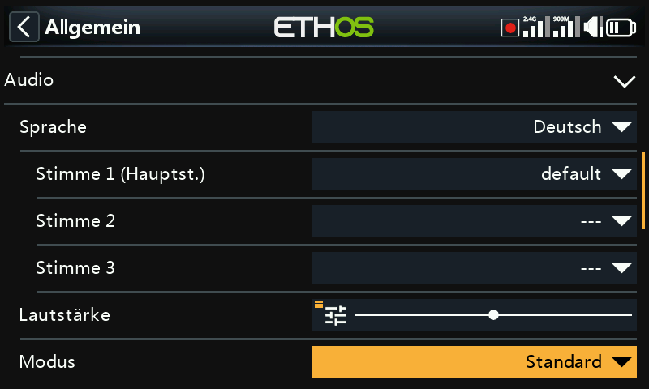

- **Audiosprache** — Sprache der Sprachansagen.
- **Auswahl der Stimmen** — Ethos unterstützt mehrere gleichzeitig installierte
  Sprachpakete:

  - **Stimme 1 (Haupt)** — wird für alle integrierten Systemansagen verwendet.
    Für Englisch besteht die Standardauswahl zwischen dem amerikanischen (`us`)
    und dem britischen (`gb`) Paket, die aus `audio/en/us/system` bzw.
    `audio/en/gb/system` gelesen werden. Eigene Sounddateien für die
    [Sonderfunktion Play Audio](../model-setup/special-functions.md) gehören
    entsprechend nach `audio/en/us/` oder `audio/en/gb/`.
  - **Stimme 2 / Stimme 3** — zusätzliche Pakete, beispielsweise eine eigene
    TTS-Stimme. Jede benötigt dieselbe Ordnerstruktur wie Stimme 1 — eine Stimme
    namens „Susan“ benötigt also `audio/en/Susan/` für eigene Sounds und
    `audio/en/Susan/system` für ihre Systemsounds (jede Stimme benötigt einen
    Ordner `/system`, da **Play Value** und Timeransagen daraus lesen; eine
    `.csv`-Liste der Standard-Systemsounddateien liegt jeder Audio-Version bei).
    Nach der Installation kann eine Stimme je Timer und je Play-Audio-Funktion
    zugewiesen oder sogar als Stimme 1 gesetzt werden, um die Systemansagen
    vollständig zu ersetzen.
  - **Stimme „default“** — wird automatisch als sichere Rückfallebene installiert
    (und dient dazu, Umwandlungsprobleme bei Installationen aus 1.4.x zu
    vermeiden): Ist Stimme 1 bei einer Installation/Aktualisierung noch nicht
    gesetzt, wird sie auf `default` gesetzt und liest aus
    `audio/en/default/system`. Häufig nachgefragte eigene Sounddateien für Play
    Audio liegen in `audio/en/default/`.

- **Hauptlautstärke** — ein Schieberegler für die Gesamtlautstärke (langer Druck
  auf `ENT`, um sie von einem Potentiometer steuern zu lassen); während der
  Einstellung ertönen Signaltöne, sodass der Pegel nach Gehör beurteilt werden
  kann.
- **Audiomodus**:
  - **Stumm** — keine Audioausgabe (löst beim Start dennoch den [Hinweis auf den
    Stummmodus](alerts.md) aus, sofern aktiviert).
  - **Nur Alarme** — nur Alarme sind hörbar.
  - **Standard** — normale Töne.
  - **Häufig** — ergänzt Fehlertöne, wenn ein Wert über sein Minimum/Maximum
    hinaus verstellt wird.
  - **Immer** — ergänzt zusätzlich zu „Häufig“ Töne bei der normalen
    Menünavigation.
  - **Bluetooth** (nur X20S/HD/Pro/R/RS) — leitet das Audiosignal an ein
    gekoppeltes Bluetooth-Gerät (Headset usw.) weiter. Wählen Sie **Geräte
    suchen**, versetzen Sie das Zielgerät in den Kopplungsmodus und wählen Sie
    es aus, sobald es gefunden wurde:

    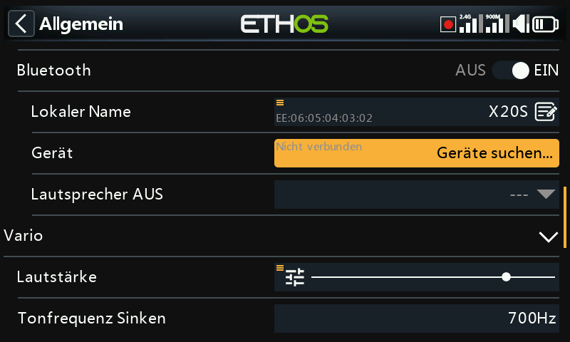
    
    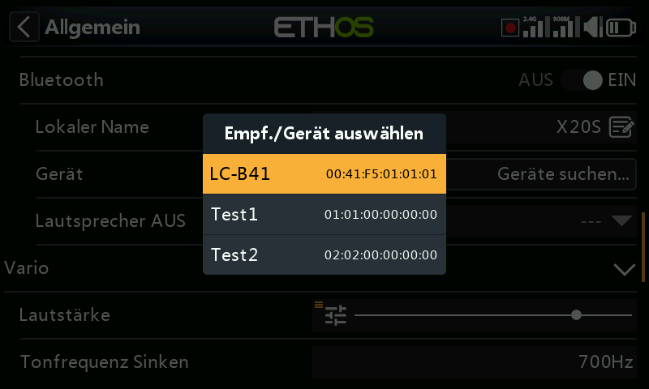
    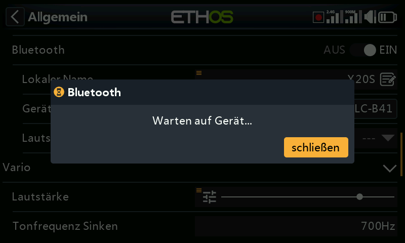
    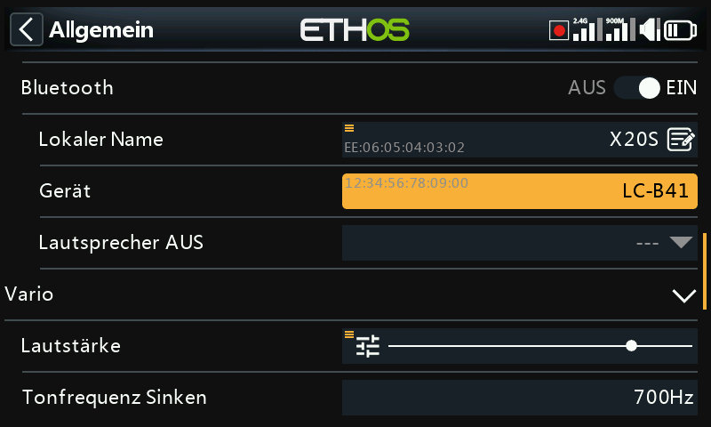

    **Lautsprecher stumm** steuert dann den eingebauten Lautsprecher — immer
    aktiv, nur bei aktiver Telemetrie oder gesteuert von einer Quelle (z. B.
    einem Schalter). Der Sender merkt sich das gekoppelte Gerät; schalten Sie
    für den normalen Betrieb den Sender vor dem Bluetooth-Gerät ein und geben
    Sie nach dem Verbindungsaufbau einige Sekunden Zeit, bis die
    Lautsprecherstummschaltung wieder greift.

## Vario {: #vario }

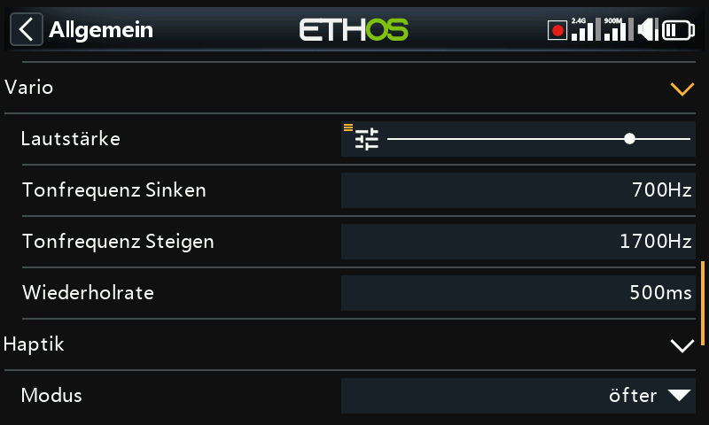

- **Lautstärke** — relative Lautstärke des Variotons.
- **Tonhöhe Null** — Tonhöhe bei Steigrate null.
- **Tonhöhe Max** — Tonhöhe bei maximaler Steigrate.
- **Wiederholung** — Pause zwischen den Tönen bei Tonhöhe Null.

Siehe auch den Sensor VSpeed unter [Telemetrie](../model-setup/telemetry.md)
und die [Sonderfunktion Play Vario](../model-setup/special-functions.md)
für weiteres Vario-Verhalten.

## Haptik

- **Stärke** — ein Schieberegler für die Vibrationsintensität.
- **Modus** — dieselben Optionen wie beim Audiomodus oben.

## Speicherort (X18 und X20 Pro/R/RS) {: #storage-location-x18-and-x20-prorrs }

Diese Sender verfügen über einen internen 8-GB-eMMC-Speicher. Ethos verwendet
ihn standardmäßig, wodurch eine SD card optional wird — Sie können jedoch den
eMMC, eine SD card oder eine Kombination aus beiden auswählen. Wenn Sie System
und Modelle auf eine SD card verschieben, kopieren Sie die betreffenden
Ordner/Dateien (einschließlich Audio und Bitmaps) **vor** dem Umschalten des
Speicherorts.

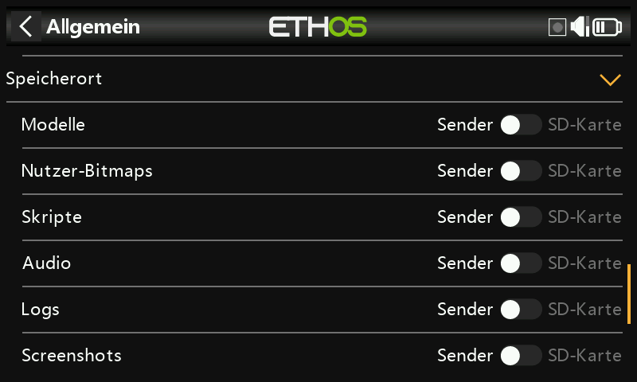

## Obere Statusleiste

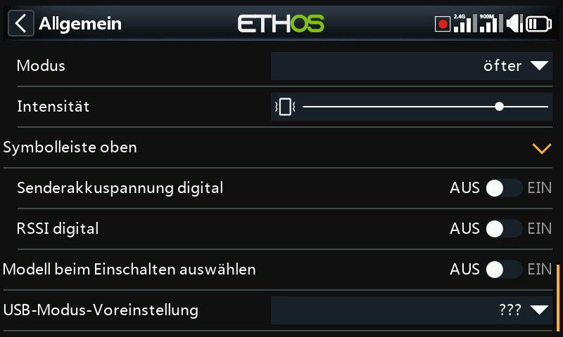

- **Digitale Spannung** — zeigt die Akkuspannung des Senders in der oberen
  Statusleiste als Zahl statt als Balken an.
- **Digitaler RSSI** — dasselbe für den RSSI von 2,4 GHz und 900 MHz.
- **Modell beim Einschalten wählen** — zeigt beim Start den
  Modellauswahlbildschirm an, bevor die Checklistenhinweise des zuvor
  verwendeten Modells erscheinen, sodass Sie das Modell wechseln können, ohne
  diese zuvor bestätigen zu müssen. Das zuletzt verwendete Modell ist
  standardmäßig hervorgehoben.

  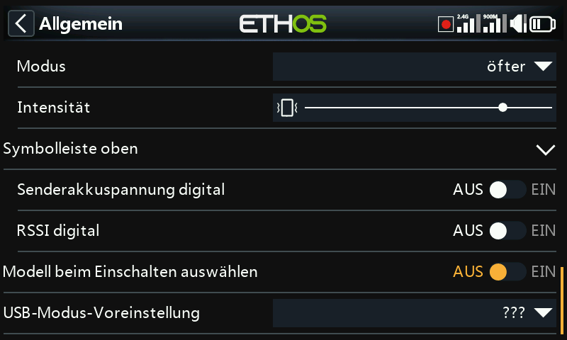

## USB-Modus-Vorauswahl

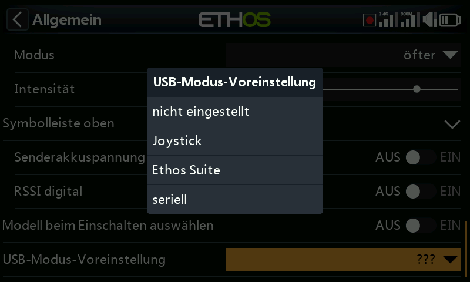

Was automatisch geschieht, wenn der Sender per USB mit einem PC verbunden wird:

- **Nicht gesetzt** — fragt beim Verbinden nach einer Auswahl.
- **Joystick** — wechselt sofort in den Joystick-Modus für einen RC-Simulator.
- **Ethos Suite** — wechselt sofort in den Ethos-Modus für [Ethos
  Suite](../ethos-suite/index.md).
- **Seriell** — wechselt sofort in den seriellen Modus und leitet
  Lua-Debug-Ausgaben mit 115200 bps über USB-Seriell weiter (unter Windows kann
  ein Treiber für den virtuellen COM-Port erforderlich sein).
