# Hardware

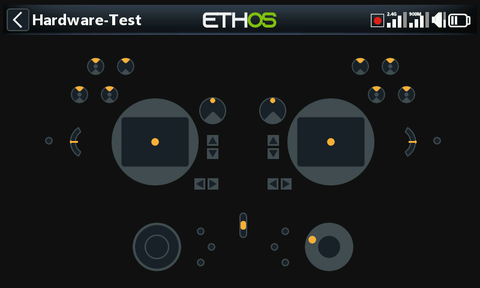

Im Abschnitt „Hardware“ werden alle Eingänge getestet und kalibriert, die
Schaltertypen festgelegt sowie die Startseite Tastaturbelegung eingestellt.

## Hardware Test {: #hardware-check }

Mit der Hardwareprüfung können alle Eingänge auf ihre Funktionstüchtigkeit
überprüft werden.

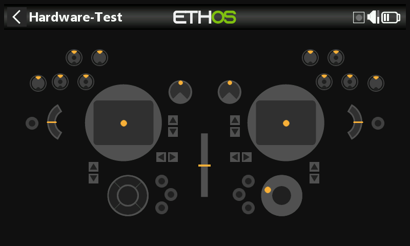
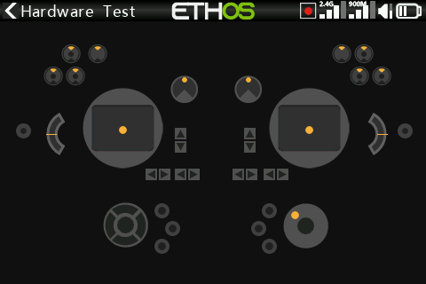

- **X20 Pro/R/RS** — prüft zusätzlich die beiden rastenden
  Drucktastenschalter **K** und **L** auf der Rückseite sowie die
  zusätzlichen Trimmtaster **T5**/**T6**.
- **X18** — prüft ebenfalls die zusätzlichen Trimmtaster **T5**/**T6**.

## Kalib. analoge Geber {: #analogs-calibration }

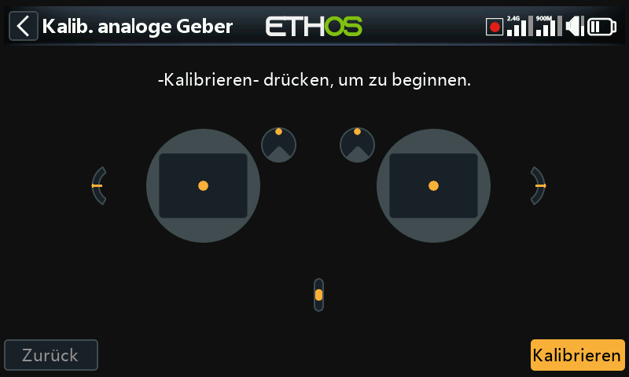

Die analoge Kalibrierung wird durchgeführt, damit der Sender genau weiß, wo
die Mittelpunkte und Grenzen der einzelnen Knüppel, Potis und Schieberegler
liegen. Sie wird bei der ersten Inbetriebnahme automatisch durchgeführt und
sollte nach dem Austausch eines Knüppelaggregats, Potis oder Schiebereglers
wiederholt werden.

## Kreisel-Kalibrierung

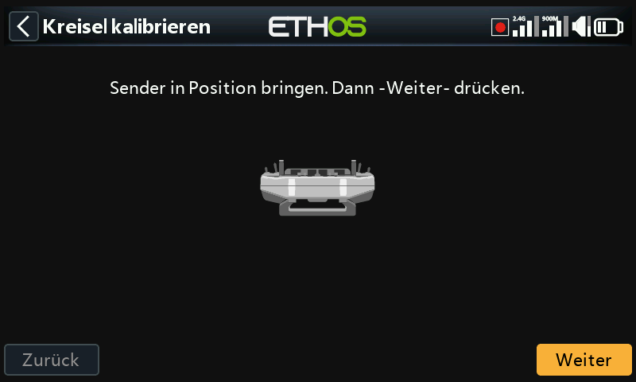

Die Kreiselkalibrierung wird durchgeführt, damit die Ausgänge des
Kreiselsensors korrekt auf die Neigung des Senders reagieren — als
„waagerechte“ Position gilt dabei der Winkel, in dem Sie das Funkgerät
normalerweise halten. Sie wird ebenfalls beim ersten Start automatisch
durchgeführt.

## Analoge Filter

Der Analog-Digital-Wandler-Filter für die Knüppel kann mit dieser
Einstellung ein-/ausgeschaltet werden. Der Standardwert ist EIN, was das
Zittern um die Knüppelmitte verbessern kann. Dies ist die **globale**
Einstellung; es gibt zusätzlich eine **modellspezifische** Option „Analoge
Filter“ unter [Modell bearbeiten](../model-setup/model-edit.md).

## Einstellungen der Potis/Schieberegler {: #potssliders-settings }

Die Potis und Schieberegler können hier mit eigenen Namen versehen werden.
Der **X20 Pro/R/RS** hat zusätzlich die Möglichkeit, zwei weitere Potis
**Ext1**/**Ext2** zu verwenden. Diese werden typischerweise bei der
Installation von 3-Achsen-Knüppeln verwendet.

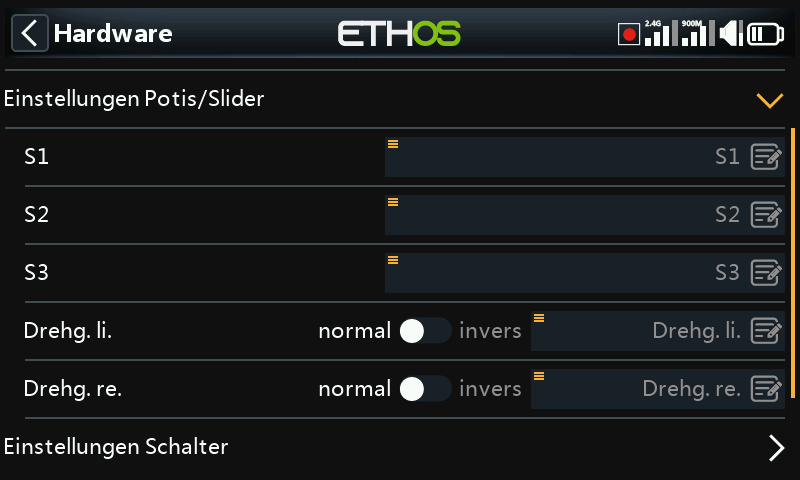
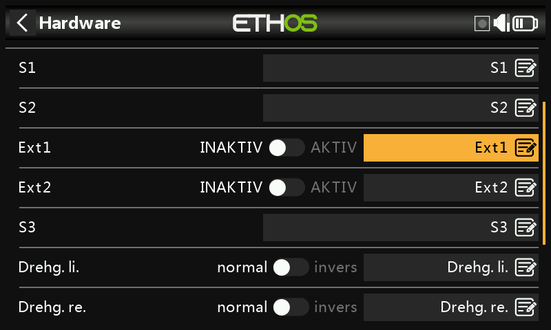

## Einst. Schalter {: #switches-settings }

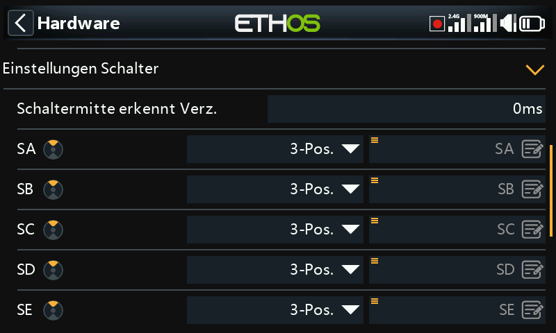

- **Verzögerung der Erkennung der Schaltermitte** — diese Einstellung
  stellt sicher, dass die Mittelstellung bei Dreiwegeschaltern nicht
  erkannt wird, wenn der Schalter in einer Bewegung von der oberen in die
  untere Stellung und umgekehrt umgelegt wird; sie sollte nur erkannt
  werden, wenn der Schalter in der mittleren Position stehen bleibt. Die
  Voreinstellung beträgt 0 ms, um den kreiselstabilisierten
  FrSky-Empfängern bei der Erkennung beim „Selbsttest“ auf CH12 gerecht zu
  werden.
- **Schaltertyp** — die Schalter SA bis SJ können jeweils als **keine
  Auswahl**, **Taster**, **2 POS** oder **3 POS** definiert werden. Dadurch
  können die Schalter ausgetauscht werden, z. B. kann der Tastschalter SH
  mit dem 2-Positionen-Schalter SF ausgetauscht werden. Beachten Sie, dass
  es möglicherweise nicht möglich ist, einen Taster oder einen
  2-Positionen-Schalter durch einen 3-Positionen-Schalter zu ersetzen, wenn
  die Verkabelung des Senders dies nicht zulässt.

  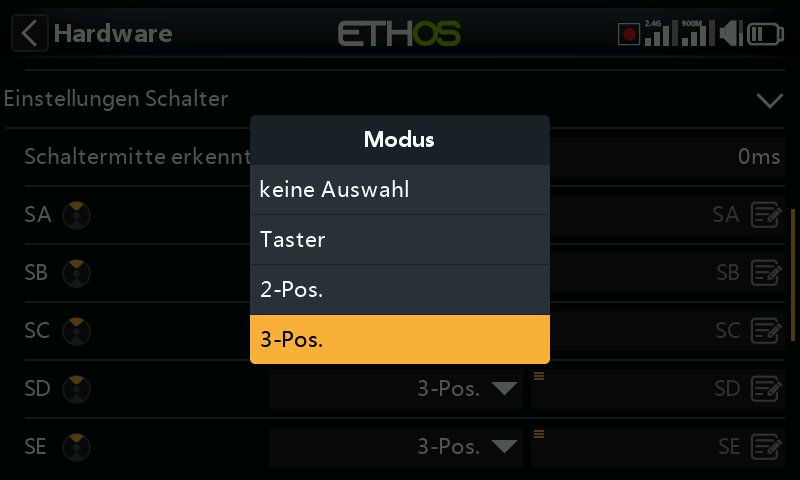
  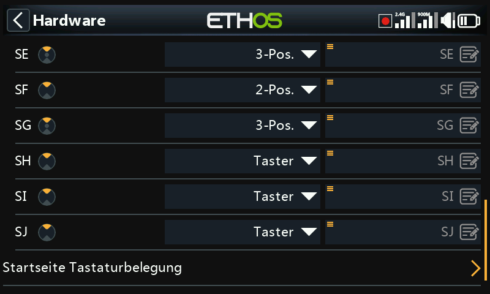

- **Umbenennen** — die Schalter können auch von den Standardnamen SA bis SJ
  in benutzerdefinierte Namen umbenannt werden; diese Namen gelten global
  für alle Modelle.
- **X20 Pro** — verfügt zusätzlich über die rastenden Drucktastenschalter
  **K**/**L** auf der Rückseite. Darüber hinaus können die
  Schalterpositionen **M**/**N** mit der Platine verdrahtet werden, die
  normalerweise für Knüppelendschalter verwendet werden.

## Startseite Tastaturbelegung

Die Home-Tasten `SYS`, `MDL` und `DISP` (`TELE` bei älteren Sendern) können
nach Belieben umbelegt werden.

- **`DISP`** — sowohl kurz als auch lang gedrückt können einer beliebigen
  Modellseite, Systemseite, der Seite „Bildschirm konfig.“, der Startseite
  oder dem Flugdatensatz zugewiesen werden. Aus Gründen der Konsistenz mit
  der X10-Serie wird `DISP` lang konventionell der Seite „Bildschirm
  konfig.“ zugewiesen.
- **`SYS`/`MDL`** — hier können nur die Optionen für langes Drücken neu
  zugewiesen werden (auf dieselben Ziele); ein kurzer Druck öffnet stets
  den System- bzw. Modellbereich.

## Senderspezifische Hardware-Optionen {: #radio-specific-hardware-options }

- **Aktivieren von haptischen Knüppelmotoren** (X20 Pro, X20R) — die
  X20 Pro AW und X20RS haben MC20R Steuerknüppel mit haptischen
  Feedback-Motoren (Stick Shaker). Wenn MC20R Steuerknüppel als Option in
  X20 Pro oder X20R nachgerüstet wurden, können Sie die Knüppel-Motoren
  hier aktivieren (Details zur Konfiguration der Motoren selbst finden Sie
  unter [Sonderfunktionen](../model-setup/special-functions.md)).

  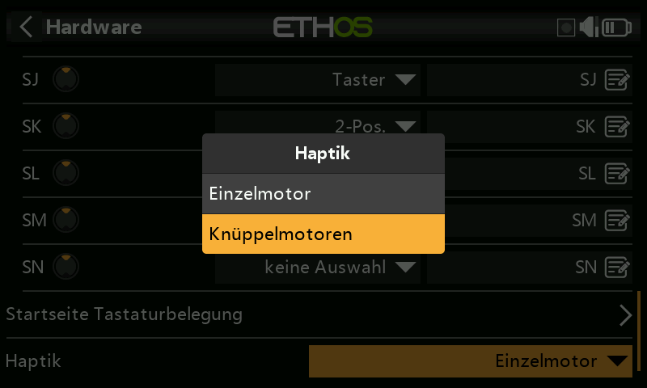
  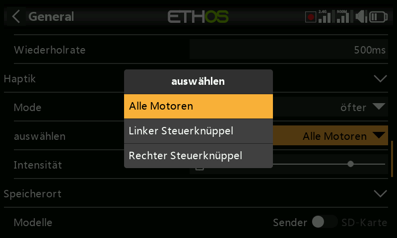

- **Encoder-Option** (X20 Pro AW, X20R/RS) — diese Modelle verfügen über
  einen verbesserten Drehgeber mit höherer Empfindlichkeit. Die Option
  **Halbe Schritte** kann aktiviert werden, um die Empfindlichkeit zu
  verringern.

  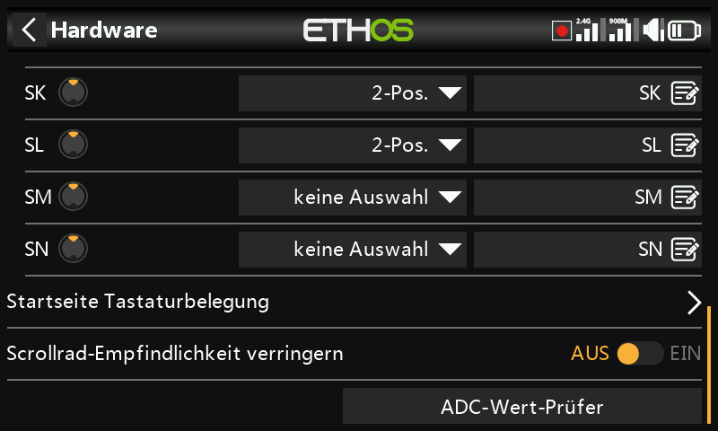

## ADC-Wert-Prüfer {: #adc-value-inspector }

Zeigt die Analog-Digital-Wandlungswerte (ADC) für die von der CPU gelesenen
Analogeingänge an:

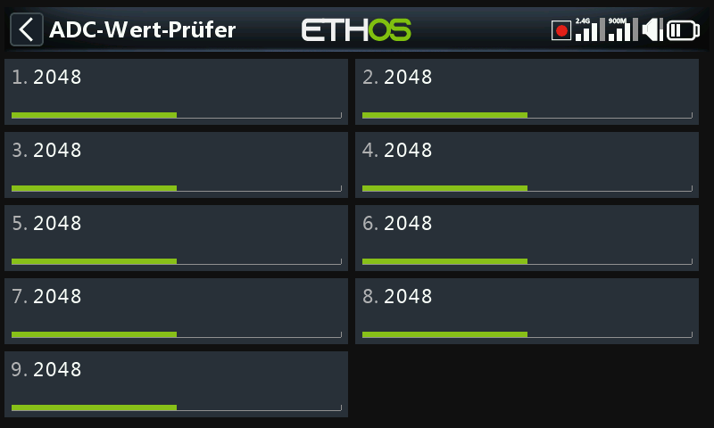
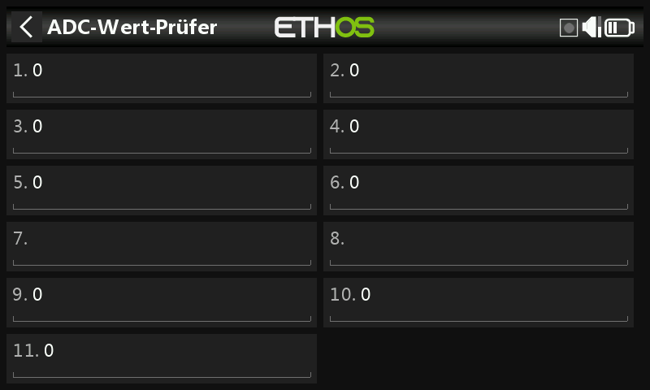

**X20S**: 1 Linker Knüppel horizontal, 2 Linker Knüppel vertikal, 3 Rechter
Knüppel vertikal, 4 Rechter Knüppel horizontal, 5 Poti 1, 6 Poti 2,
7 Mittlerer Schieberegler, 8 Linker Schieberegler, 9 Rechter Schieberegler.

**X20 Pro**: wie oben, jedoch mit zwei zusätzlichen Kanälen für externe
Potis (7 Ext1, 8 Ext2 — z. B. mit Knüppel montierte Potis), die vor den
Schiebereglern eingefügt sind; diese verschieben sich auf 9 Mittlerer
Schieberegler, 10 Linker Schieberegler, 11 Rechter Schieberegler.
