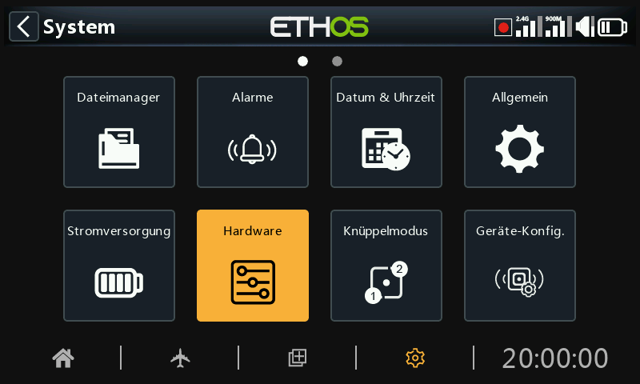
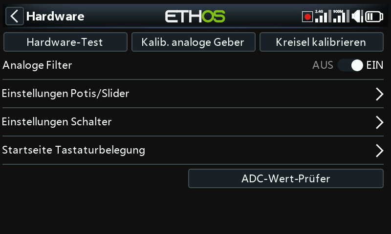
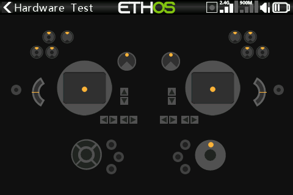
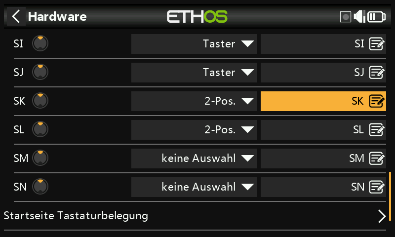
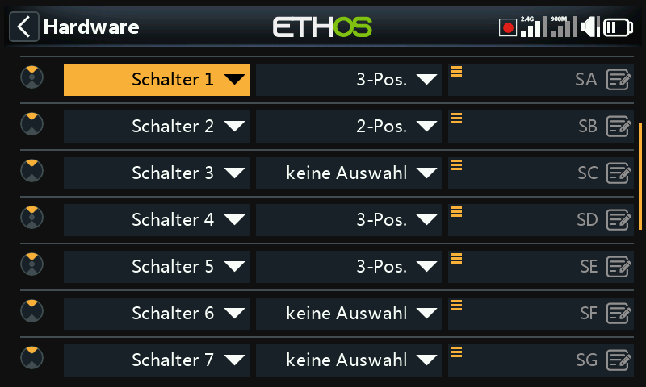
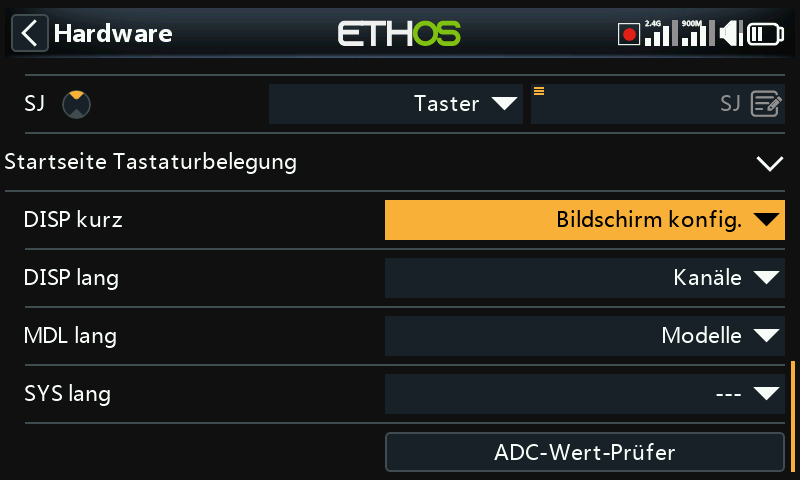
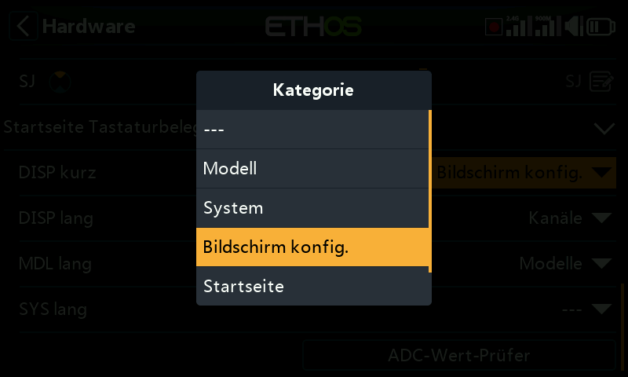
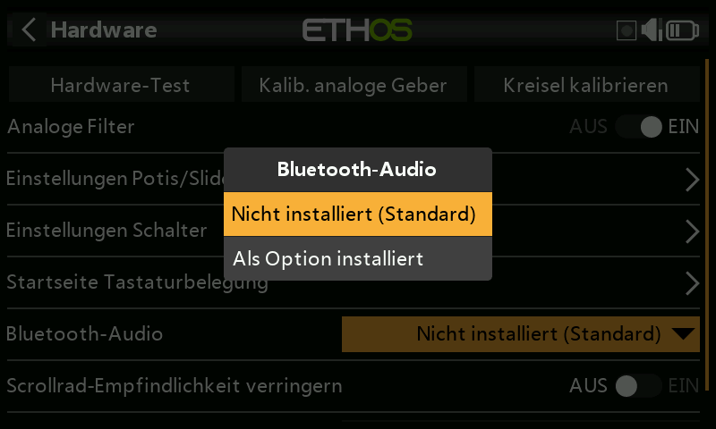

# Hardware

Der Abschnitt „Hardware“ dient zum Testen aller Eingänge, zur Durchführung der Analog- und Gyro-Kalibrierung sowie zum Einstellen der Schaltertypen und der „Home-Taste“-Zuordnung.

## Hardware-Test

Mit der Hardwareprüfung können alle Eingänge auf ihre Funktionstüchtigkeit überprüft werden.

### X20 Pro/R/RS

Der Hardware-Check für die X20 Pro/R/RS-Funkgeräte umfasst die beiden rastenden Drucktastenschalter SK und SL auf der Rückseite sowie die zusätzlichen Trimmtaster T5 und T6.

### X18

Die X18-Sender haben ebenfalls die zusätzlichen Trimmtaster T5 und T6.

## Kalib. analoge Geber

Die analoge Kalibrierung wird durchgeführt, damit der Sender genau weiß, wo die Mittelpunkte und Grenzen der einzelnen Knüppel, Potis und Schieberegler liegen. Sie wird bei der ersten Inbetriebnahme automatisch durchgeführt. Sie sollte nach dem Austausch eines Knüppelaggregate, Potis oder Schiebereglers wiederholt werden.

## Kreisel-Kalibrierung

Die Kreiselkalibrierung kann durchgeführt werden, damit die Ausgänge des Kreiselsensors korrekt auf die Neigung des Senders reagieren. Sie wird beim ersten Start automatisch durchgeführt. Die „waagerechte“ Position des Funkgeräts wäre zum Beispiel der Winkel, in dem Sie das Funkgerät normalerweise halten.

## Analoge Filter

Der Analog-Digital-Wandler-Filter für die Knüppel kann mit dieser Einstellung ein-/ausgeschaltet werden. Der Standardwert ist EIN, was das Zittern um die Knüppelmitte verbessern kann. Dies ist eine globale Einstellung hier auf der Hardware-Seite. Es gibt eine modellspezifische Option, die im Abschnitt „Modell bearbeiten“ unter [Analoge Filter](hardware.md) verfügbar ist.

## Einstellungen der Potis/Schieberegler

Die Potis und Schieberegler können hier mit eigenen Namen versehen werden.

### X20 Pro/R/RS

Der X20 Pro/R/RS hat die Möglichkeit, zwei zusätzliche Potis Ext1 und Ext2 zu verwenden. Diese können typischerweise bei der Installation von 3-Achsen-Knüppel verwendet werden.

## Einst. Schalter

### Verzögerung der Erkennung der Schaltermitte

Diese Einstellung stellt sicher, dass die Mittelstellung des Schalters bei Dreiwegeschaltern nicht erkannt wird, wenn der Schalter in einer Bewegung von der oberen in die untere Stellung und umgekehrt umgelegt wird. Es sollte nur erkannt werden, wenn der Schalter in der mittleren Position stehen bleibt. Die Voreinstellung wurde auf 0ms geändert, um den kreiselstabilisierten FrSky-Empfängern bei der Erkennung beim „Selbsttest“ auf CH12 gerecht zu werden.

Die Schalter SA bis SJ können wie folgt definiert werden:

- Keine Auswahl
- Taster
- 2 POS
- 3 POS

Dadurch können die Schalter ausgetauscht werden, z. B. kann der Tastschalter SH mit dem 2-Positionen-Schalter SF ausgetauscht werden. Beachten Sie, dass es möglicherweise nicht möglich ist, einen Taster oder einen 2-Positionen-Schalter durch einen 3-Positionen-Schalter zu ersetzen, wenn die Verkabelung des Senders dies nicht zulässt.

Die Schalter können auch von den Standardnamen SA bis SJ in benutzerdefinierte Namen umbenannt werden. Beachten Sie, dass diese Namen global für alle Modelle gelten.

### X20 Pro

Der X20 Pro verfügt über zwei zusätzliche rastende Drucktastenschalter K und L auf der Rückseite. Darüber hinaus können die Schalterpositionen M und N mit der Platine verdrahtet werden, die normalerweise für Knüppelendschalter verwendet werden.

### Nur XE-Serie

Bei der XE-Serie sind die Schalter als S1 bis S14 gekennzeichnet; standardmäßig entsprechen sie in Ethos den Bezeichnungen SA bis SN. Bei Bedarf können die Bezeichnungen in Ethos auf S1 bis S14 geändert werden, um der Beschriftung am Sender zu entsprechen, oder es kann eine beliebige andere Benennung gewählt werden.

Beachten Sie, dass aufgrund der zusätzlichen Abstraktionsebene jeder Schalter einer beliebigen Ethos-Schalterposition zugewiesen werden kann.

## Startseite Tastaturbelegung

Die Home-Tasten \[SYS\], \[MDL\] und \[DISP\] (TELE bei älteren Modellen) können nach Belieben um belegt werden.

### Taste \[DISP\]

Für die Taste \[DISP\] können sowohl kurz als auch lang gedrückte Optionen einer beliebigen Modellseite, Systemseite, der Seite „Bildschirme konfigurieren“, der Startseite oder dem Flugdatensatz zugewiesen werden. Aus Gründen der Konsistenz mit der X10-Serie kann die \[Tele lang\] -Taste konventionell der Seite „Bildschirm konfig.“ zugewiesen werden.

### \[SYS\]- und \[MDL\]-Tasten

Für die Tasten \[SYS\] und \[MDL\] können nur die Optionen für langes Drücken auf eine beliebige Modellseite, Systemseite, die Seite „Bildschirm konfig.“, die Startseite oder die Flugseite neu zugewiesen werden.

## Bluetooth-Audio option (X20, X20R, X20RS)

Ein Bluetooth-Audiomodul kann zum X20, X20R oder X20RS hinzugefügt werden, um beispielsweise die Verwendung von Bluetooth-Ohrhörern zu ermöglichen. Diese Hardware-Auswahloption aktiviert das Modul, wenn es installiert ist.

Bitte beachten Sie, dass das Modul nicht Plug-and-Play-fähig ist, sondern oberflächenmontiert gelötet werden muss.

## Aktivieren von haptischen Knüppelmotoren (X20 Pro und X20R)

Die X20 Pro AW und X20RS haben MC20R Steuerknüppel mit haptischen Feedback-Motoren (Stick Shaker). Wenn MC20R Steuerknüppel als Option in X20 Pro oder X20R nachgerüstet wurden, können Sie die Knüppel-Motoren hier aktivieren. Bitte lesen Sie den Abschnitt '[Haptische Motoren auswählen](../model-setup/special-functions.md)' für Details zur Konfiguration der Motoren.

Die Modelle X20 Pro AW und X20R/RS verfügen über einen verbesserten Drehgeber mit höherer Empfindlichkeit. Die Option „Halbe Schritte“ kann aktiviert werden, um die Empfindlichkeit zu verringern.

## Drehgeberoption (X20 Pro AW und X20R/RS)

Die Modelle X20 Pro AW und X20R/RS verfügen über einen verbesserten Drehgeber, der empfindlicher ist. Die Option „Halbschritte” kann aktiviert werden, um die Empfindlichkeit zu verringern.

## ADC-Wert-Prüfer

Zeigt die Analog-Digital-Wandlungswerte (ADC) für die von der CPU gelesenen Analogeingänge an.

1. Linker Knüppel horizontal
2. Linker Knüppel vertikal
3. Rechter Knüppel vertikal
4. Rechter Knüppel horizontal
5. Potis 1
6. Potis 2
7. Mittlerer Schieber 
8. Linker Schieberegler 
9. Rechter Schieberegler

### X20 Pro

Der (ADC) Index für die X20 Pro ist:

1. Linker Stick horizontal
2. Linker Knüppel vertikal
3. Rechter Knüppel vertikal
4. Rechter Knüppel horizontal
5. Potis 1
6. Potis 2
7. Ext1 (externes Potis, z.B. mit Knüppel)
8. Ext1 (externer Potis, z.B. mit Knüppel montiert)
9. Mittlerer Schieberegler 
10. Linker Schieberegler 
11. Rechter Schieberegler
