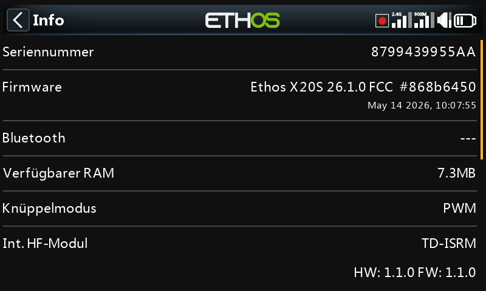
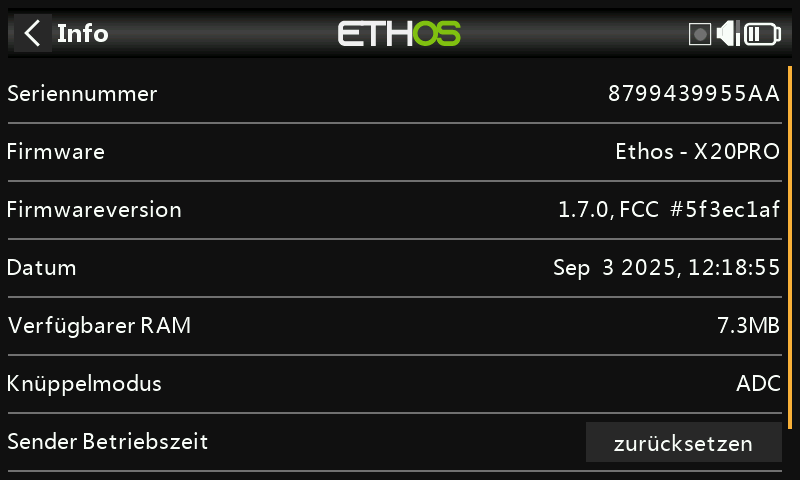
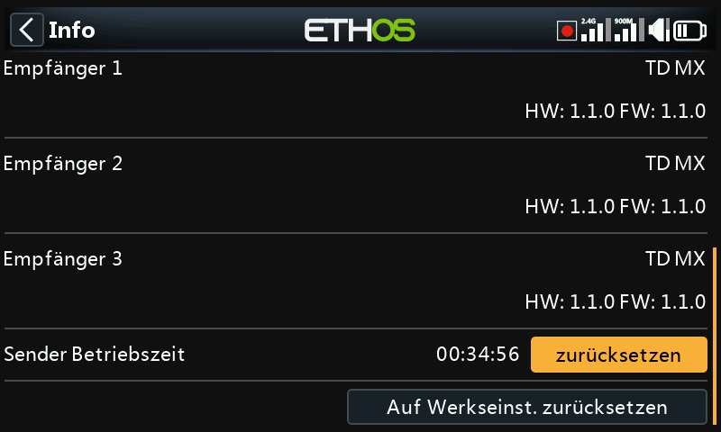
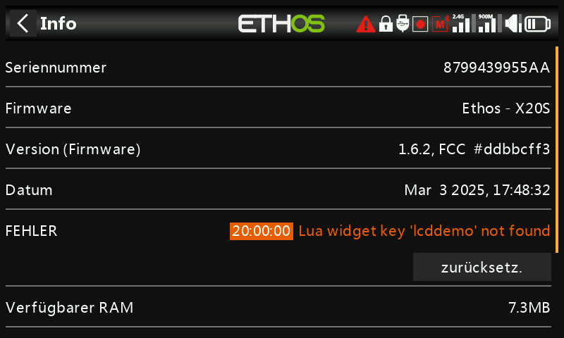
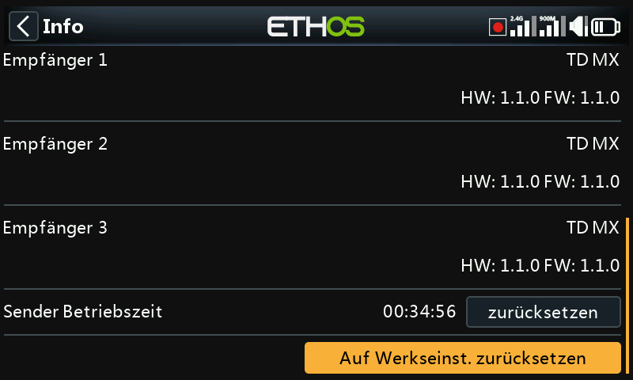
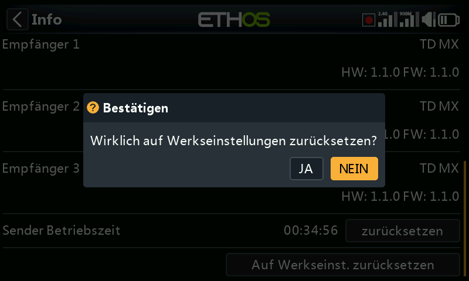

# Informationen

Auf der Info-Seite werden Angaben zur System-Firmware, zum Steuerknüppel-Typ, zum
internen/externen HF-Modul, zum gebundenen Empfänger, zur Sender-Laufzeit sowie
Fehlermeldungen und das Zurücksetzen auf die Werkseinstellungen angezeigt.

## Senderinformationen

- **Seriennummer** — Seriennummer des Senders.
- **Firmware** — Ethos-Version und Typ des Senders (z. B. X20).
- **Version (Firmware)** — Build-Variante, z. B. FCC, LBT oder Flex.
- **Datum** — Datum und Uhrzeit der Firmware-Version.
- **Verfügbarer RAM** — zeigt das verfügbare System-RAM an. Dies ist nützlich, um nach
  fehlerhaften Lua-Skripten zu suchen; der Wert ist auch als System-[Quelle](../getting-started/user-interface-and-navigation.md#choosing-a-source)
  verfügbar, so dass er z. B. in einem Widget angezeigt werden kann.
- **Knüppel Mode** — die installierte Knüppel-Hall-Sensor-Version (bzw. „ADC“ bei
  analogen Knüppeln).
- **Internes Modul** — Angaben zum internen HF-Modul, einschließlich Hardware- und
  Firmware-Versionen.
- **Empfänger** — die Angaben zum aktuell gebundenen Empfänger werden nach dem
  internen Modul angezeigt. Wenn ein redundanter Empfänger an denselben Steckplatz wie
  der Hauptempfänger gebunden ist, werden die Empfängerdetails abwechselnd auf dem
  Display angezeigt (z. B. ein Archer SR10 Pro neben seinem redundanten R9MM-OTA unter
  „Empfänger1“).
- **Externes Modul** — Angaben zu einem externen FrSky-HF-Modul (falls vorhanden),
  einschließlich Hardware- und Firmware-Versionen, falls ACCESS-Protokoll.
  Multi-protocol-Module werden hier nicht angezeigt.

## Sender-Laufzeit

Diese Uhr für die Laufzeit des Senders zeigt die Gesamtnutzung des Senders an; mit
**zurücksetz.** kann sie auf Null zurückgesetzt werden.

## Fehlermeldungen

Ein rotes dreieckiges Fehlerwarnsymbol in der oberen Leiste der Hauptansicht bedeutet,
dass Ethos einen Fehler festgestellt hat; die Fehlertafel zeigt die Fehler im Detail an.
Fehler können verursacht werden durch:

- **Lua-Skript-Fehler** — ein Problem in einem laufenden Lua-Skript.
- **Fehler bei der RAM-Sicherung** — ein Modell kann so groß sein, dass es den
  Sicherungsspeicher übersteigt. Ethos hat den RAM-Speicherplatz für die Modellsicherung
  von 4k auf 32k erweitert, so dass eine Überschreitung unwahrscheinlich ist; tritt sie
  dennoch auf, ist dies ein schwerwiegender Fehler: Das Modell wird bei ausgelöstem
  [Notfallmodus](../getting-started/emergency-mode.md) langsamer von der SD card statt aus
  dem Backup-RAM geladen.
- **Ausführen einer nächtlichen Firmware-Version** — ein Hinweis darauf, dass
  Nightly-Builds nicht zum Fliegen geeignet sind.

**Reset** ermöglicht das Löschen der protokollierten Fehler — praktisch zum Beispiel
während Lua-Debug-Sitzungen.

## Auf Werkseinstellungen zurücksetzen

Ermöglicht das Zurücksetzen des Senders auf die Werkseinstellungen. Es ist keine
PC-Verbindung erforderlich, alles wird im Sender durchgeführt.

!!! danger
    Wenn Sie bestätigen, löscht der Sender **alle** Modelle, Protokolldateien,
    Screenshots, Dokumente, Skripte, Bitmaps und die Grundeinstellungen des Senders.
    Während des Löschvorgangs ist ein Fortschrittsbalken zu sehen. Danach werden alle
    Laufwerke getrennt und der Sender neu gestartet.

Die Info-Seite des X20 Pro/R/RS zeigt ähnliche Informationen für diese Senderfamilie an.
