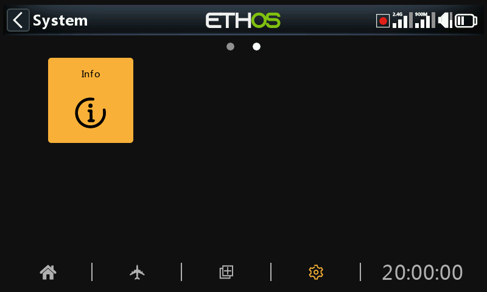

# Info (System Seite2)

Auf der Info-Seite werden Informationen zur System-Firmware, zum Steuerknüppel-Typ, zur Firmware-Version des internen Moduls, zur ACCESS, TD- oder TW-Empfänger-Firmware und zum externen Modul angezeigt.

## X18 und X20

### Seriennummer

Seriennummer des Senders.

### Firmware

Ethos-Firmware und Typ des Senders (z. B. X20).

### Version (Firmware)

Aktuelle Firmware-Version und Typ, z. B. FCC, LBT oder Flex.

### Datum

Das Datum und die Uhrzeit der Firmware-Version.

### Verfügbarer RAM

Zeigt das verfügbare System-RAM an. Dies ist nützlich, um nach fehlerhaften LUA-Skripten zu suchen. Dieser Wert ist auch als Systemwert verfügbar, so dass er z. B. in einem Widget angezeigt werden kann.

### Knüppel Mode

Die installierte Knüppel-Hall-Sensor-Version. ADC ist für analog.

### Internes Modul

Angaben zum internen HF-Modul, einschließlich Hardware- und Firmware-Versionen.

### Empfänger 1 bis 3

Die Angaben zum gebundenen Empfänger werden nach dem internen Modul angezeigt. Wenn ein redundanter Empfänger an denselben Steckplatz wie der Hauptempfänger gebunden ist, werden die Empfängerdetails abwechselnd auf dem Display angezeigt. Das obige Beispiel zeigt einen Archer SR10 Pro und seinen redundanten R9MM-OTA neben den Empfängerdetails von Empfänger1.

### Sender-Laufzeit

Diese Uhr für die Laufzeit des Senders zeigt die Gesamtnutzung des Senders an. Mit einer Reset-Taste kann er auf Null zurückgesetzt werden.

### Fehlermeldungen

Wenn ETHOS einen Fehler feststellt, wird in der oberen Leiste der Hauptansicht ein rotes dreieckiges Fehlerwarnsymbol angezeigt. Die Fehlertafel zeigt die Fehler an.

Fehler können verursacht werden durch:

#### LUA-Skript-Fehler

Probleme mit dem LUA-Skript führen zu Fehlermeldungen.

#### Fehler bei der RAM-Sicherung

Ein Modell kann so groß sein, dass es den Sicherungsspeicher übersteigt. ETHOS hat nun den RAM-Speicherplatz für die Modellsicherung von 4k auf 32k erweitert, so dass eine Überschreitung unwahrscheinlich ist. Dies ist ein schwerwiegender Fehler, der dazu führt, dass das Modell im Notfallmodus langsamer aus dem SD- statt aus dem Backup-RAM geladen wird.

#### Fehler protokollieren

Eine Warnung vor einem Protokollschreibfehler wird ausgelöst, wenn die Spezialfunktion „Logs schreiben“ auf Probleme stößt – voraussichtlich aufgrund von Fehlern an der SD-Karte.

#### Ausführen eines nächtlichen (nightlies) Firmware-Version

Wenn ein nächtlicher Firmware-Version geladen wurde, dient das Warnsymbol dazu, den Benutzer daran zu erinnern, dass diese Firmware-Version nicht zum Fliegen geeignet ist.

Eine Reset-Schaltfläche ermöglicht das Löschen von Fehlern, zum Beispiel während LUA-Debug-Sitzungen.

### Externes Modul

Angaben zu einem externen FrSky RF-Modul (falls vorhanden), einschließlich Hardware- und Firmware-Versionen, falls ACCESS-Protokoll

Multimodule werden nicht angezeigt.

### Auf Werkseinst. zurücksetz.

Ermöglicht das Zurücksetzen des Senders auf die Werkseinstellungen. Es ist keine PC-USB-Verbindung erforderlich, alles wird im Sender durchgeführt.

Wenn Sie bestätigen, dass Sie auf die Werkseinstellungen zurücksetzen möchten, löscht der Sender alle Modelle, Protokolldateien, Screenshots, Dokumente, Skripte, Bitmaps und die Grundeinstellungen des Senders.

Während des Löschvorgangs ist ein Fortschrittsbalken zu sehen. Danach werden alle Laufwerke getrennt und der Sender neu gestartet.

## X20 Pro/R/RS

Ähnliche Informationen für den X20 Pro/R/RS.
