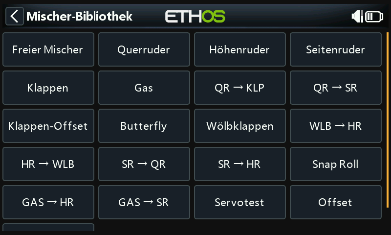

# Grundlegendes Beispiel für ein Flächenflugzeug

Dieses einfache Beispiel für ein Flugzeug umfasst die Konfiguration eines Modells mit einem Motor, 2 Querrudern (und optional Einziehfahrwerken und 2 Klappen) und einem Servo für jede Fläche.

## Schritt 1. Bestätigen Sie die Systemeinstellungen

Beginnen Sie mit dem obigen „Beispiel für die Ersteinrichtung des Senders“, das zur Konfiguration der Teile des Senders dient, die allen Modellen gemeinsam sind. Für dieses Beispiel verwenden wir die standardmäßige AETR (Querruder, Höhenruder, Gas, Seitenruder) Kanalreihenfolge.

## Schritt 2. Identifizieren Sie die benötigten Servos/Kanäle

Die Mischer-Funktionen bildet das Herzstück des Senders. Sie ermöglicht es, jede der vielen Eingangsquellen nach Belieben zu kombinieren und einem der Ausgangskanäle zuzuordnen. Ethos verfügt über 100 Mischer-Kanäle für die Programmierung Ihres Modells. Normalerweise werden die Kanäle mit der niedrigsten Nummer den Servos zugewiesen, da die Kanalnummern direkt den Kanälen im Empfänger zugeordnet sind. Das X20 Interne HF- (Radio Frequency) Modul hat bis zu 24 Ausgangskanäle zur Verfügung.

Die oberen Mischer-Kanäle können als 'virtuelle Kanäle' in einer fortgeschrittenen Programmierung oder als echte Kanäle unter Verwendung mehrerer HF-Module (intern + extern) und SBus verwendet werden. Die Kanalreihenfolge ist eine Frage der persönlichen Vorliebe oder Konvention, oder sie kann vom Empfänger vorgegeben werden. Für unser Beispiel werden wir AETR verwenden.

Unser Beispielflugzeug hat die folgenden Servos/Kanäle:

1 Motor

2 Querruder

2 Klappen

1 Höhenruder

1 Seitenruder

Später werden wir auch Einziehfahrwerke hinzufügen.

## Schritt 3. Erstellen Sie ein neues Modell.

Lesen Sie den Abschnitt Modell-Setup / Modellauswahl, um Ihr neues Modell zu erstellen. Lesen Sie auch den Abschnitt „Menü-Navigation“, um sich mit der Benutzeroberfläche des Senders vertraut zu machen, so dass Sie die benötigten Funktionen leicht finden können.

Tippen Sie auf die Registerkarte Modell (Flugzeugsymbol), und wählen Sie die Funktion Modellauswahl. Um ein neues Modell zu erstellen, wählen Sie die Modellkategorie, unter der Sie das Modell erstellen möchten, und tippen Sie dann auf das Symbol \[+\], um den Assistenten zum Erstellen eines Modells zu starten. Möglicherweise müssen Sie zuerst Ihre Modellkategorien erstellen. Weitere Informationen hierzu finden Sie im Abschnitt [Neues Modell](../model-setup/model-select.md) hinzufügen.

In unserem Beispiel tippen Sie auf das Flugzeugsymbol, um den Wizard zur Modellerstellung zu starten.

Der Wizard bietet die Möglichkeit, voreingestellte Mischer für stabilisierte FrSky-Empfänger einzurichten. Für dieses Beispiel wählen wir die Option „Nicht stabilisierter Empfänger“.

Übernehmen Sie die Voreinstellung von 1 Kanal für den Motor, in dem sie auf den Pfeil rechts unten drücken. Mit dem linken Pfeil kann man die vorherige Seite erneut aufrufen.

Akzeptieren Sie die Standardeinstellung von 2 Kanälen für Querruder und wählen Sie 2 Kanäle für Klappen.

Akzeptieren Sie die Voreinstellung Traditionelles Heck (mit Höhen- und Seitenruder).

Übernehmen Sie die Standardeinstellung 1 Kanal für Höhenruder und 1 Kanal für Seitenruder.

Wir werden das Modell „FWexample“ nennen und dem Assistenten bis zum Ende folgen, was dazu führt, dass das Modell „FWexample“ in der Gruppe „Flugzeuge“ erstellt wird. Beachten Sie, dass Modellnamen bis zu 15 Zeichen lang sein können. Es wird auch zum aktiven Modell gemacht, so dass wir mit der Konfiguration seiner Funktionen fortfahren können. Zusätzlich kann man hier ein Modellbild auswählen.

## Schritt 4. Überprüfung und Konfiguration der Mischer

Tippen Sie auf das Symbol Mischer, um die vom Flugzeug-Assistenten erstellten Mischer zu überprüfen.

Hier eine Liste der

Der Assistent hat zwei Querruder auf den Kanälen 1 und 5 erstellt, gefolgt von den Kanälen für Höhenruder, Gas, Seitenruder und Klappen. Beachten Sie bei den Klappen, dass das „--“ bedeutet, dass ihnen noch keine Steuerquelle zugewiesen wurde.

### Querruder

Um den Querrudermischer zu überprüfen, tippen Sie auf die Zeile „Querruder“ und wählen Sie im Popup-Menü „Bearbeiten“.

#### Gewichtung/Anteile

Es ist eine gute Idee, verschiedene Gewichtungen für Ihr Modell einzustellen, besonders wenn Sie es noch nicht geflogen haben. Mit den Gewichtungen wird das Verhältnis der Knüppelbewegung zur Kanalbewegung festgelegt. Beim sportlichen Fliegen wollen Sie zum Beispiel normalerweise relativ geringe Ausschläge auf den Steuerflächen haben, so dass Sie den Weg auf etwa 30 % reduzieren sollten. Für das 3D-Fliegen hingegen wollen Sie so viel Weg wie möglich, d.h. 100%.

Klicken Sie auf „Gewichtung hinzufügen” und stellen Sie eine Rate von 60 % für den Schalter SB in der mittleren Position ein.

Klicken Sie erneut auf „Neues Gewicht hinzufügen” und stellen Sie eine Rate von 30 % für den Schalter SB in der unteren Position ein. „SB-“ wird fett dargestellt, was bedeutet, dass dies die aktuelle Position ist. Die vertikale Achse im Diagramm auf der rechten Seite zeigt nun, dass in dieser mittleren Position des Schalters nur 60 % des Hubs verfügbar sind. Beachten Sie, dass die Rate bei Schalter SB in der oberen Position 100 % beträgt.

#### Expo

In den obigen Beispielen für die Steuerknüppel können Sie sehen, dass das Ausgangsverhalten linear ist. Um zu vermeiden, dass die Reaktion in der Knüppelmitte zu unruhig ist, können Sie eine Expo-Kurve verwenden, um die Ruderbewegung in der Knüppelmitte zu reduzieren und sie zu erhöhen, wenn sich der Knüppel weiter von der Mitte entfernt. Für dieses Beispiel haben wir drei Expo-Raten auf 60 %, 40 % und 25 % an den entsprechenden SB-Schalterpositionen eingestellt, und die Grafik zeigt nun eine gekrümmte Reaktion, die in der Knüppelmitte flacher ist.

#### Differenzierung

Für die Querruder gibt es eine weitere spezielle Einstellung, die Differenzierung genannt wird. Wenn sich das linke und das rechte Querruder um den gleichen Betrag nach oben oder unten bewegt, verursacht das sich nach unten bewegendem Querruder mehr Widerstand als das sich nach oben bewegende Querruder, wodurch der Flügel in die entgegengesetzte Richtung der Kurve giert. Dies wird als negatives Gieren bezeichnet. Um dies zu verringern, führt ein positiver Wert in der Differenzialeinstellung zu einer geringeren Abwärtsbewegung des Querruders, wie in der Grafik zu sehen ist. Dadurch wird das ungünstige Gieren reduziert und die Kurvenflug- und Handlingseigenschaften werden verbessert. Eine übliche Einstellung für die Querruderdifferenz ist 50%.

Sie können die Differenz jedoch einem Poti zuweisen, um den Wert im Flug zu optimieren. Drücken Sie lange die Eingabetaste, um das Dialogfeld „Optionen“ aufzurufen, und wählen Sie „Signalquelle verwenden“ aus.

Wählen Sie Pot1 aus der Liste der Quellen. Die Auswirkung von Pot1 können Sie im Diagramm rechts sehen.

Nachdem Sie die Querruderdifferenz im Flug optimiert haben, können Sie den Wert des Potentiometers ganz einfach zu Ihrer dauerhaften Einstellung machen. Drücken Sie lange die Eingabetaste, um das Dialogfeld „Optionen“ aufzurufen, und wählen Sie „In Wert umwandeln“.

#### Trim

Bietet die Möglichkeit, den zugehörigen Trimmer eines Mischers zu trennen, ohne ihn zu deaktivieren, damit er anderweitig verwendet werden kann.

### Höhen- und Seitenruder

Ähnlich wie bei den Querrudern können wir auch für die Höhen- und Seitenruder am Schalter SC dreifache Raten und Expositionszeiten einstellen. Im Gegensatz zum Seitenruder ist beim Höhenrudermischer zusätzlich eine Differenzierung möglich.

### Gas

Für das Gas werden wir den Eingang auf dem Gasknüppel belassen. Wir brauchen keine Raten oder Expo, aber wir brauchen einen Sicherheitsschalter, damit der Motor nicht unerwartet anspringt. Das ist extrem wichtig, denn Modellmotoren können zu schweren Verletzungen oder zum Tod führen.

#### Leerlauf-Trimmung

Bei Glüh- und Benzinmotoren verwenden wir die „Leerlauf-Trimmung“, um die Leerlaufdrehzahl einzustellen. Die Leerlaufdrehzahl kann je nach Wetterlage usw. variieren, daher ist es wichtig, eine Möglichkeit zu haben, die Leerlaufdrehzahl anzupassen, ohne die Vollgasposition zu beeinflussen.

Wenn die „Leerlauf-Trimmung“ aktiviert ist, geht der Gaskanal auf eine Leerlaufposition von -75%, wenn der Gasknüppel in der unteren Position steht, wie im obigen Beispiel gezeigt. Mit dem Gasknüppel-Trimmhebel kann dann die Leerlaufdrehzahl zwischen -100% und -50% eingestellt werden. Gas AUS kann dann so konfiguriert werden, dass der Motor mit einem Schalter abgeschaltet wird.

#### Motor AUS

Die Gasabschaltung bietet einen Sicherheitsverriegelungsmechanismus für das Gas. Sobald die aktive Bedingung in unserem Beispiel mit dem Schalter SA in der unteren Position erfüllt ist (der Schalter SA unten ist fett dargestellt, um anzuzeigen, dass er aktiv ist), wird der Gasausgang auf -100% gehalten, sobald der Gaswert unter -85% fällt. (Vergleichen Sie das erste Diagramm oben mit dem zweiten).

Wenn jedoch „SR FlipFlop“ aktiviert ist, wird das Gas in dem Moment abgeschaltet, in dem der Schalter SA nach unten geht, wie im obigen Beispiel gezeigt.

Sobald der aktive Zustand aufgehoben ist (d.h. der Schalter SA nicht in der unteren Position), muss der Gasknüppel oder der Regler unter -85% gebracht werden, bevor er erhöht werden kann. Dadurch wird verhindert, dass der Motor unerwartet in einer hohen Gasposition anläuft, wenn der Schalter SA zurückgeschaltet wird.

#### Gasstellung halten

„Gasstellung halten“ wird verwendet, um den Motor im Notfall von jeder Gasposition aus abzuschalten. Wenn die „Gaststellung halten“-Bedingung erfüllt ist, wird der Gasausgang sofort auf -100% (oder den eingegebenen Wert) reduziert. Wie in der obigen Grafik zu sehen ist, wurde der Gasausgang auf -100% reduziert, obwohl sich der Gasknüppel z.B. auf Halbgas steht.

### Klappen

In diesem Beispiel weisen wir die Klappen dem Schalter SE zu.

Erhöhen Sie außerdem die Gewichtung beider Ausgangskanäle auf 100 %.

## ***Schritt 5. Binden*** ***des*** ***Empfänger******s***

Verwenden Sie die Funktion [HF-System](../model-setup/rf-system.md), um Ihren Empfänger zu registrieren (wenn Ihr Empfänger ACCESS ist) und zu binden, um die Konfiguration der Kanäle vorzubereiten.

Bitte lesen Sie den nächsten Abschnitt über die Konfiguration der Kanäle durch, bevor Sie fortfahren. Um Schäden durch versehentliches Übersteuern Ihrer Servos zu vermeiden, wäre es ratsam, die Servoanlenkungen zu trennen oder den Servoweg zu reduzieren, bis Sie bereit sind, die Servo-Min/Max-Grenzen zu konfigurieren.

## Schritt 6. Konfigurieren der  Kanäle

Der Abschnitt „Kanäle“ ist die Schnittstelle zwischen der „Logik“ des Setups und der realen Welt mit Servos, Anlenkungen und Rudern sowie Motoren oder Triebwerken. Bisher haben wir die Logik für die Funktionen der einzelnen Steuerelemente festgelegt. Jetzt können wir sie an die mechanischen Eigenschaften des Modells anpassen. Die verschiedenen Kanäle sind Ausgänge, z.B. entspricht CH1 dem Servostecker #1 an Ihrem Empfänger.

Tippen Sie auf das Symbol „Kanäle“, um die Ausgänge zu konfigurieren.

Tippen Sie auf einen Ausgangskanal, um ihn zu konfigurieren.

### Beispiel 1: Querruder links

Beginnen Sie mit der Einstellung der Servo-Mittelpunkte mit Hilfe der PWM Mitte-Einstellung, nachdem Sie die mechanischen Anlenkungen optimiert haben.

Die Servo- oder Kanalgrenzen sollten dann mit den Einstellungen Min und Max konfiguriert werden. Zur Vereinfachung können Sie vorübergehend ein Potentiometer für Min und Max zuweisen. Drücken Sie lange auf den Wert und wählen Sie dann „Quelle verwenden“, wie im obigen Beispiel für die Querruderdifferenzierung gezeigt.

### Klappen

Beachten Sie, dass Klappen normalerweise einen großen Ausschlag nach unten benötigen, um wirksam zu bremsen. Um diesen großen Ausschlag nach unten zu erreichen, können Sie bei der Herstellung der Anlenkungen einen Teil des Ausschlags nach oben opfern. Dies bedeutet, dass sich die Klappen in der Servomitte in einer halb ausgefahrenen Position befinden. Die Min- und Max-Werte werden so eingestellt, dass die gewünschte Klappenstellung nach oben und die volle Klappenstellung erreicht wird.

Die Kurven können auch dazu dienen, Probleme mit dem Ansprechverhalten in der Praxis zu korrigieren, z.B. um sicherzustellen, dass Querruder und Wölbklappen einander richtig folgen. Eine 5-Punkt-Kurve wird üblicherweise auf einer Seite verwendet, damit die Flächenbewegungen an 5 Punkten angepasst werden können.

### Balancierung der Kanäle

Schließlich können Sie die Kanalausgleichsfunktion in den Kanälen verwenden, um die Bewegung von linken und rechten Flächen wie Querruder und Klappen zu synchronisieren. Bitte lesen Sie den Abschnitt [Kanäle ausgleichen](../model-setup/outputs.md)

## Schritt 7. Einführung in die Flugphasen

Flugphasen sind eine hervorragende Möglichkeit, ein Modell für verschiedene Aufgaben zu konfigurieren. Zum Beispiel kann ein Segelflugzeug Flugphasen für Aufgaben wie Normalflug, Speed, Thermik, Start und Landung haben. Jede Flugphase kann sich seine eigenen Trimmeinstellungen merken. Wenn Sie das Flugzeug also einmal so getrimmt haben, dass es in jedem Modus gut fliegt, müssen Sie Ihre Trimmungen während des Fluges nicht mehr ändern, wenn Sie die Aufgaben wechseln. Der Flugphasen-Schalter ist ein bisschen wie das Schalten beim Auto. Die Flugphasen werden in anderer Firmware manchmal als „Bedingungen“ bezeichnet.

Der Einfachheit halber werden in diesem Beispiel nur die Flugphasen Normal, Klappen halb und Klappen voll gezeigt.

Es gibt 20 Flugphasen, einschließlich des Standardmodus, die verwendet werden können. Die erste Flugphase, bei dem die aktive Bedingung eingeschaltet ist, ist der aktive Modus. Wenn keiner dieser Modi aktiviert ist, ist der Standardmodus aktiv. Dies erklärt, warum der Standardmodus nicht über eine Schalterauswahloption verfügt.

Für unser Beispiel haben wir de Standard-Flugphase als Normal konfiguriert und zwei zusätzliche Flugphasen namens Klappe Halb (Schalter SE-Mitte) und Klappen Voll (Schalter SE-oben) hinzugefügt.

Bei den Klappen möchten Sie vielleicht den Übergang zwischen den Flugphasen verlangsamen. Das obige Beispiel zeigt Ein- und Ausblendzeiten von 1 Sekunde.

## Schritt 8. Konfigurieren Sie die Trimmungen

### Option - Unabhängige Trimmungen

Als nächstes gehen wir in den Bereich Trimmungen. Die erste Option ist die Änderung des Höhenruder-Knüppels auf 'Unabhängige Trimmungen pro Flugphase'. Dies ermöglicht Ihnen eine unabhängige Höhenruderkompensation für die beiden ausgefahrenen Klappeneinstellungen. Die Taster für die Höhenrudertrimmung schalten automatisch zwischen den unabhängigen Einstellungen um, wenn Sie die Klappen am Schalter SE betätigen.

Da die Trimmungen völlig unabhängig sind, müssen Sie das Höhenruder in jeder Flugphase sozusagen „von Grund auf“ trimmen. Sie können die Funktion „Sofortige Trimmung“ verwenden, um zunächst die Trimmung für den Normalflug und dann die Trimmung für jede Klappenposition vorzunehmen. Sie könnten auch nach der Trimmung für den Normalflug landen, um den Trimmwert auf die Klappenmodus-Trimmung zu übertragen, als Starttrimmwert für diese Modi.

### Option - Basis Trimmung mit Offset

Eine weitere Möglichkeit besteht darin, die beiden Klappenmodi so zu konfigurieren, dass eine Basistrimmung mit einem Offset für jede Klappenposition verwendet wird. Auf diese Weise trimmen Sie für den Normalflug in der Flugphase 'FM0 Basis', und wenn Sie zu den Klappenpositionen wechseln, wird wieder diese Basistrimmung verwendet, aber jetzt werden alle Trimmeinstellungen für den Höhenruderausgleich als Offset zur Basistrimmung hinzugefügt.

Wir beginnen mit der Einstellung der Schrittweite auf Mittel, damit es einfacher ist, die gewünschte Trimmung schnell zu erreichen. Die Schrittgröße kann dann für die Feinabstimmung verringert werden.

Stellen Sie als Nächstes den Modus auf Benutzerdefiniert und klicken Sie auf „Neue Aktion hinzufügen“.

Für die 'Aktive Bedingung' wählen Sie die Flugphase 'FM1 Flaps Half'.

Wählen Sie als nächstes für den Modus „Offset + Standard“.

Das erste Verhalten wurde bereits konfiguriert. In der Flugphase 1 'FM1 Flaps Half' (halbe Klappenstellung) ist der Trimmwert die Summe aus der Basis- oder Standardtrimmung plus der Offset-Trimmung, die sich aus den Trimmeinstellungen ergibt, die in der Flugphase 1 'FM1 Flaps Half' vorgenommen wurden.

Wiederholen Sie dies für die Flugphase 2 'FM2 Flaps Full' (volle Klappenstellung).

Der Höhenruderausgleich kann nun unabhängig voneinander für die Flugphasen 'Flaps Half' und 'Flaps Full' getrimmt werden. Wird jedoch die in der Flugphase 'FM0 Basis' verwendete Basis- oder Standardtrimmung verstellt, werden auch die beiden Trimmungen für den Klappenausgleich um den gleichen Betrag verändert. Dies kann nützlich sein, wenn z.B. die Standard-Trimmung aufgrund von thermischer Drift des Servos angepasst werden muss.

## Schritt 9. Einrichten einer Motorlaufzeit-Zeitschaltuhr

Tippen Sie auf Stoppuhr 1 im Bereich Modell / Stoppuhren, wählen Sie Bearbeiten. In diesem Beispiel konfigurieren wir einen abwärts zählende Stoppuhr mit einem Startwert von fünf Minuten. Sie wird immer dann laufen, wenn das Systemereignis „Drossel aktiv“ wahr ist, vorausgesetzt, er wird nicht in der Reset-Stellung gehalten.

Wenn Sie eine proportionale Zeitquelle zuweisen, dann hängt die Geschwindigkeit der Stoppuhr von der Position des Gasknüppels ab (zum Beispiel). Bei Vollgas zählt die Stoppuhr in Echtzeit, wird aber langsamer, wenn der Gashebel reduziert wird.

Einzelheiten zur Konfiguration der übrigen Stoppuhr-Parameter finden Sie im Abschnitt [Stoppuhren](../model-setup/timers.md).

## Schritt 10. Hinzufügen eines Mischers für Einziehfahrwerke

Im Hauptbildschirm für die Mischer (siehe unten) können neue Mischungen hinzugefügt werden, indem Sie auf das Symbol „+“ neben den Spaltenüberschriften tippen.

Dadurch wird die Mischer-Bibliothek geöffnet. Wählen Sie „Freien Mischer“ aus.

Benennen Sie in diesem Beispiel den Freien Mischer mit „Retracts“ (Fahrwerk). Der Mischer kann immer eingeschaltet sein, und die Quelle kann mit Schalter SF umgeschaltet werden.

Die Standard-Mischer-Aktion von Gewicht = 100 % ist in Ordnung.

Die untere Hälfte der Freien Mischer-Einstellungen zeigt, dass Kanal 8 den Einziehvorrichtungen zugewiesen wurde.
