# Beispiel für ein einfaches Flächenmodell

Eine vollständige Schritt-für-Schritt-Anleitung für ein Flugzeug mit Motor + 2 Querrudern + 2 Klappen + Höhenruder + Seitenruder, mit je einem Servo pro Ruderfläche, komplett mit dem Assistenten aufgebaut.
Führen Sie zuvor die [Grundeinrichtung des Senders](initial-radio-setup.md) durch.

## Schritt 1. Systemeinstellungen prüfen

Dieses Beispiel verwendet die Standard-Kanalreihenfolge **AETR**.

## Schritt 2. Benötigte Servos/Kanäle bestimmen

[Mischer](../model-setup/mixes.md) sind das Herzstück des Senders — bis zu 100
Mischkanäle, wobei üblicherweise die niedrigsten Nummern den Servos zugewiesen werden (da
die Kanalnummern direkt auf die Empfängerkanäle abgebildet werden; das interne HF-Modul des X20
unterstützt bis zu 24 Ausgangskanäle). Höhere Kanäle stehen frei für
virtuelle Kanäle oder zusätzliche reale Kanäle über mehrere HF-Module und
SBUS. Unser Modell:

| Funktion | Kanäle |
|---|---|
| Motor | 1 |
| Querruder | 2 |
| Klappen | 2 |
| Höhenruder | 1 |
| Seitenruder | 1 |

(Das Einziehfahrwerk wird später ergänzt, in [Schritt 10](#step-10-add-a-mix-for-retracts).)

## Schritt 3. Neues Modell anlegen

Wählen Sie in der [Modellauswahl](../model-setup/model-select.md) eine Kategorie,
tippen Sie auf **+** und starten Sie den Assistenten **Airplane**. Wählen Sie für dieses Beispiel **Non stabilized
receiver**.

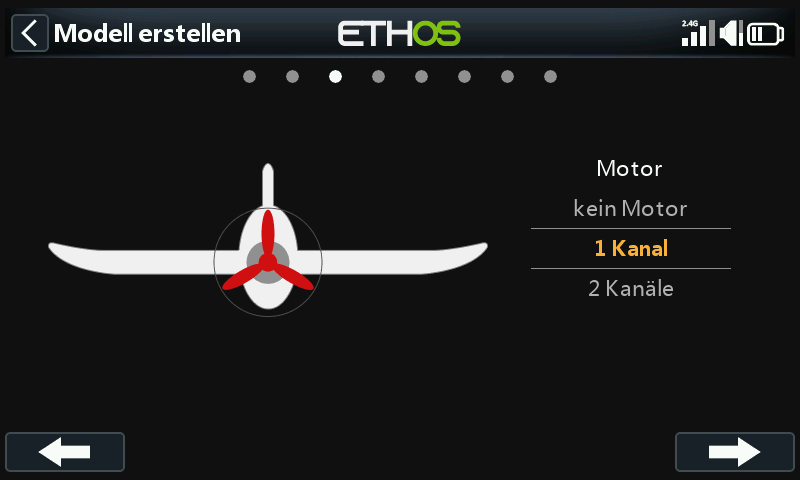
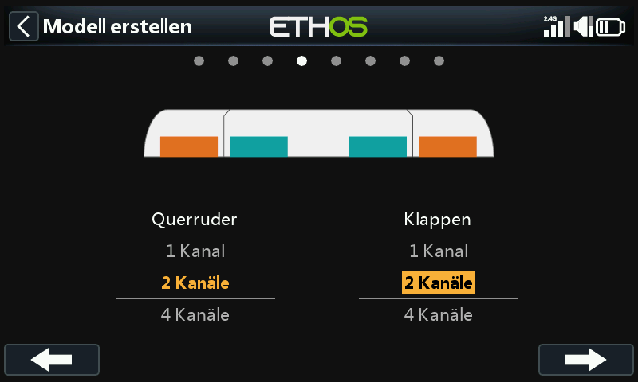

Übernehmen Sie 1 Motorkanal, danach 2 Querruderkanäle und wählen Sie 2 Klappenkanäle.

Übernehmen Sie das voreingestellte **Traditional Tail** mit je 1 Höhenruder- und 1 Seitenruderkanal.

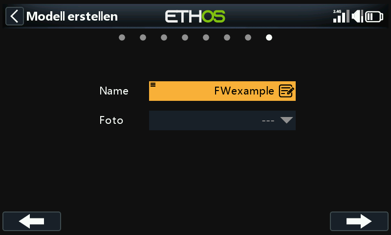
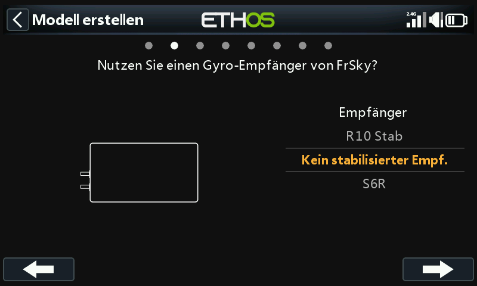

Vergeben Sie einen Namen (z. B. "FWexample" — bis zu 15 Zeichen), schließen Sie den Assistenten ab, und
das Modell wird als aktives Modell in der Kategorie Airplane angelegt.

## Schritt 4. Mischer prüfen und konfigurieren

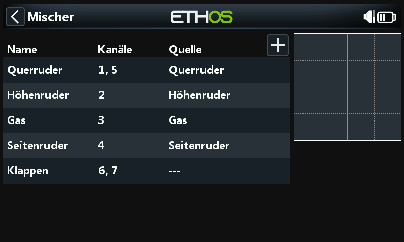

Der Assistent hat bereits Mischer für Querruder (Kanäle 1 und 5), Höhenruder,
Gas, Seitenruder und Klappen angelegt (die Klappen zeigen `---` — es ist noch keine Quelle zugewiesen).

### Querruder {: #ailerons }

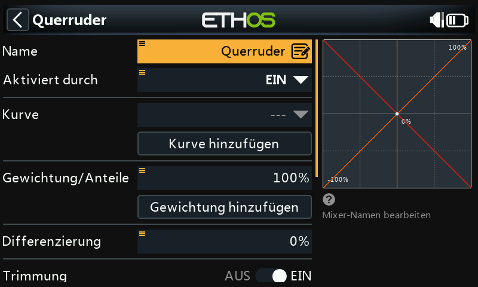
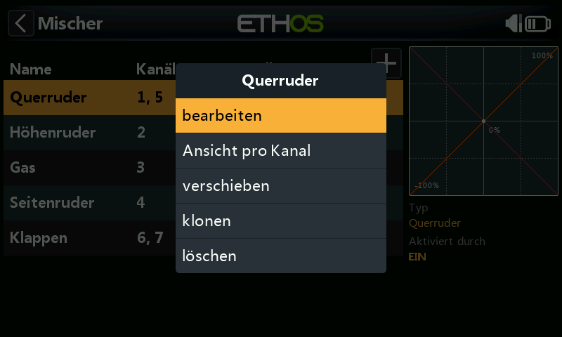

**Weight/Rates** — legen Sie die Ruderausschläge fest, bevor Sie etwas Neues fliegen: moderate Ausschläge
(z. B. 30 %) eignen sich für den Sportflug, volle 100 % für 3D. Fügen Sie einen Wert von 60 % für
Schalter SB Mitte und 30 % für SB unten hinzu — der Standardwert (SB oben) bleibt
bei 100 %:

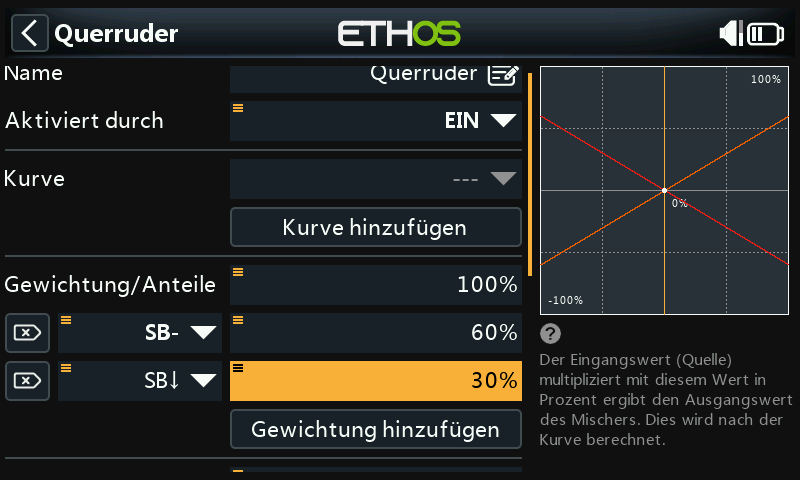

**Expo** — eine lineare Kennlinie kann um die Mittelstellung herum nervös wirken; fügen Sie Expo-Werte
hinzu (z. B. 60 %/40 %/20 % für dieselben SB-Positionen), um die Kennlinie nahe der Mitte abzuflachen,
ohne den maximalen Ausschlag zu verringern:

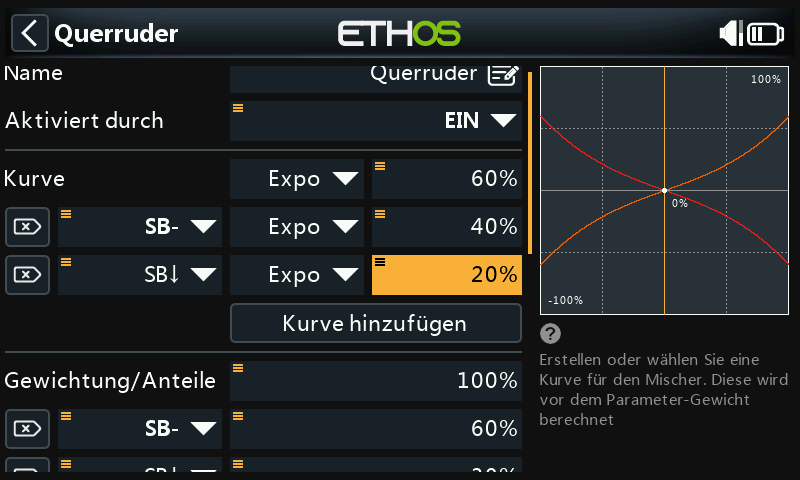

**Differential** — gleich große Ausschläge nach oben und unten erzeugen am nach unten
ausschlagenden Querruder mehr Widerstand als am nach oben ausschlagenden, wodurch das Modell aus der Kurve
herausgiert ("negatives Wendemoment"). Ein positives Differential (50 % ist üblich) verringert
den Ausschlag nach unten gegenüber dem nach oben und wirkt dem entgegen:

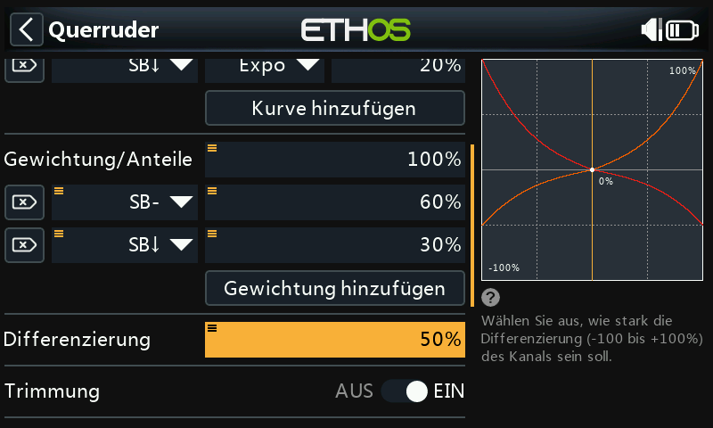

Um das Differential im Flug abzustimmen, drücken Sie lange `ENT` auf dem Wert, wählen **Use a
source** und dann Pot1:

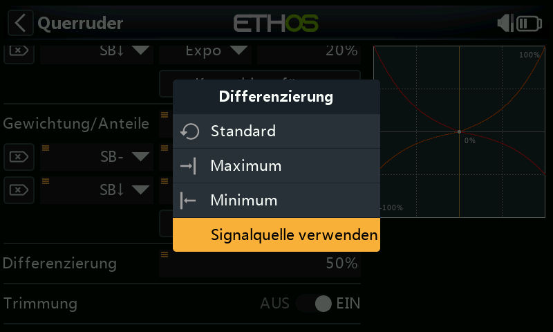
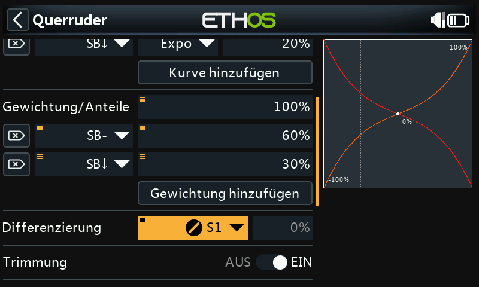

Wenn der im Flug ermittelte Wert passt, drücken Sie erneut lange und wählen **Convert to
value**, um ihn dauerhaft festzuschreiben:

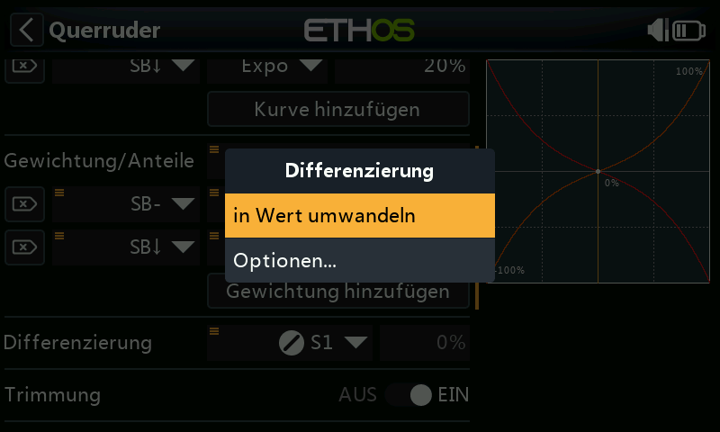

**Trim** — hiermit lässt sich dieser Mischer von der zugehörigen Trimmung trennen, ohne die Trimmung
selbst zu deaktivieren, sodass diese für einen anderen Zweck frei wird:

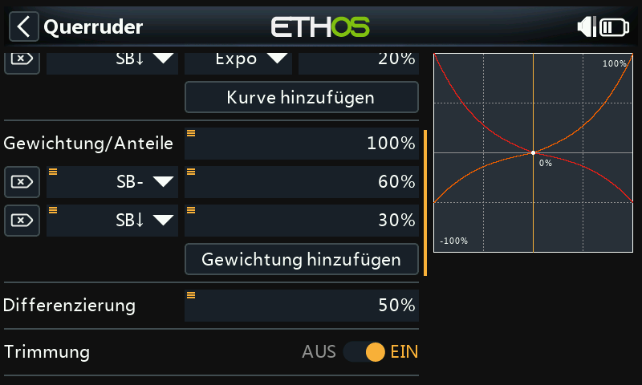

### Höhen- und Seitenruder

Dasselbe Schema mit drei Ausschlagstufen + Expo, hier auf Schalter SC:

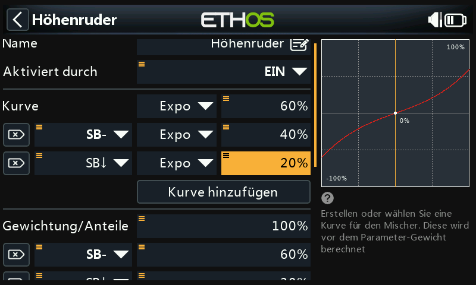

### Gas

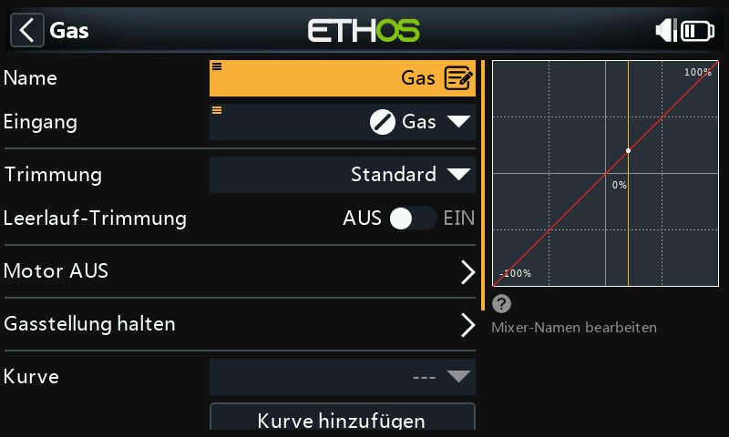

Belassen Sie die Eingabe auf dem Gasknüppel — Ausschlagstufen/Expo sind nicht nötig —, aber ein
Sicherheitsschalter ist unverzichtbar; ein unerwartet anlaufender Verbrennungsmotor oder Elektromotor
kann schwere Verletzungen verursachen.

**Low position trim** (Verbrenner) — regelt die Leerlaufdrehzahl
unabhängig vom Vollgas:

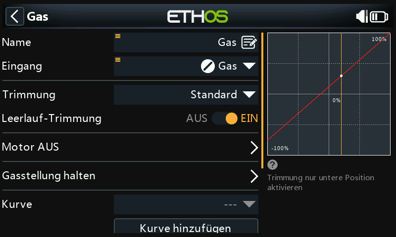

Ist diese Option aktiviert, liegt der Gaskanal bei Knüppelstellung Leerlauf bei −75 %;
der Gas-Trimmhebel verstellt den Leerlauf dann zwischen −100 % und −50 %.

**Gas-Abschaltung** — eine Sicherheitsverriegelung. Mit Schalter SA unten als aktiver
Bedingung (bei Aktivität fett dargestellt) bleibt der Gasausgang auf −100 %, sobald
der Knüppel unter −85 % fällt:

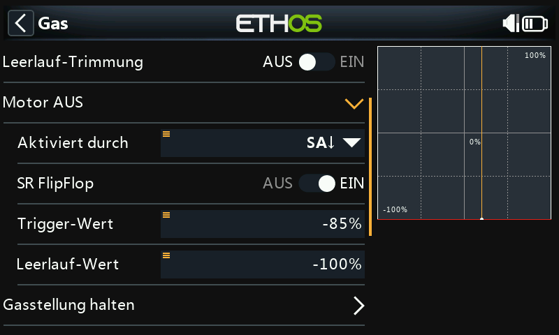

Ist stattdessen **Sticky** aktiviert, wird das Gas **sofort** abgeschaltet, wenn SA nach unten
geschaltet wird, unabhängig von der Knüppelstellung:

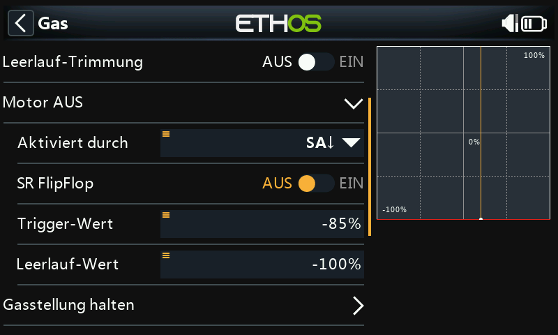

In beiden Fällen muss der Knüppel nach Wegfall der aktiven Bedingung erst wieder unter
−85 % gebracht werden, bevor das Gas erhöht werden kann — so springt der Motor nicht
in dem Moment auf hohe Drehzahl, in dem der Abschaltschalter gelöst wird.

**Leerlaufsperre** — eine Notabschaltung aus *jeder* Knüppelstellung heraus, die den Ausgang
sofort auf −100 % (oder einen konfigurierten Wert) setzt, sobald ihre Bedingung erfüllt ist:

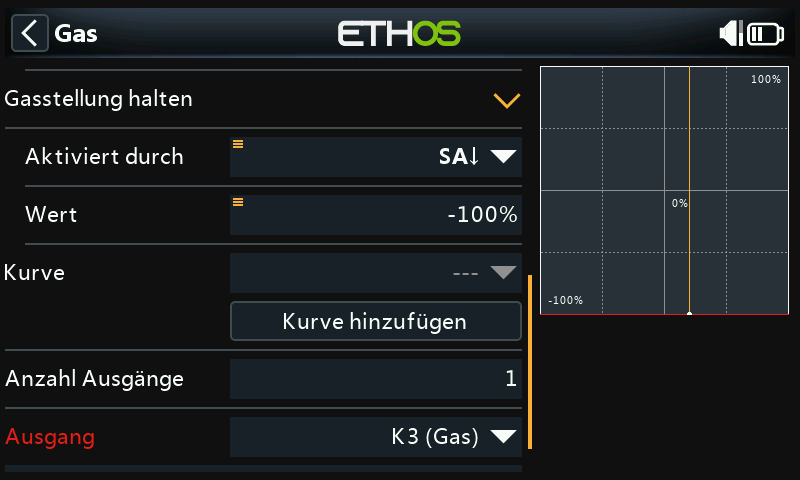

### Klappen

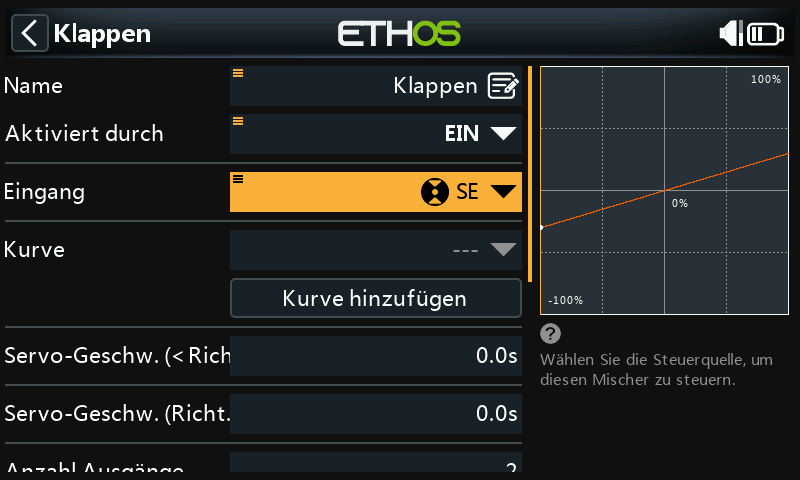

Weisen Sie die Klappen dem Schalter SE zu und setzen Sie beide Ausgangskanal-Gewichtungen auf 100 %:

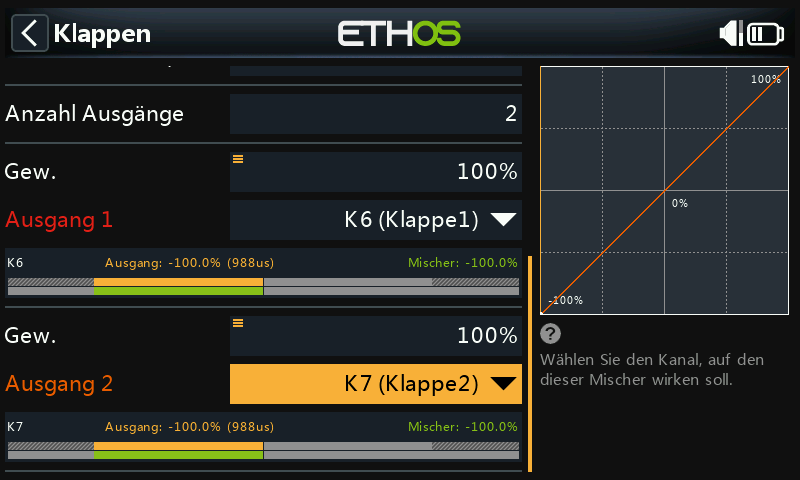

## Schritt 5. Empfänger binden

Registrieren (bei ACCESS) und binden Sie über [RF System](../model-setup/rf-system.md).
Bevor Sie zu den Ausgängen weitergehen, sollten Sie in Erwägung ziehen, die Servoanlenkungen zu lösen oder
den Servoweg vorübergehend zu reduzieren, um beim Einstellen der Min-/Max-Grenzen nichts zu überlasten.

## Schritt 6. Ausgänge konfigurieren

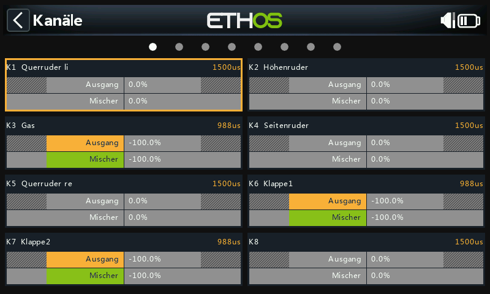

[Ausgänge](../model-setup/outputs.md) passen die Logik des Mischers an die tatsächliche
Mechanik des Modells an.

**Querruder 1** — zentrieren Sie das Servo mit **PWM center**, nachdem Sie die
mechanische Anlenkung optimiert haben, und stellen Sie dann **Min**/**Max** ein. Ein vorübergehend
Min (und danach Max, genau wie im Differential-Beispiel oben) zugewiesenes Potentiometer
beschleunigt das Einstellen:

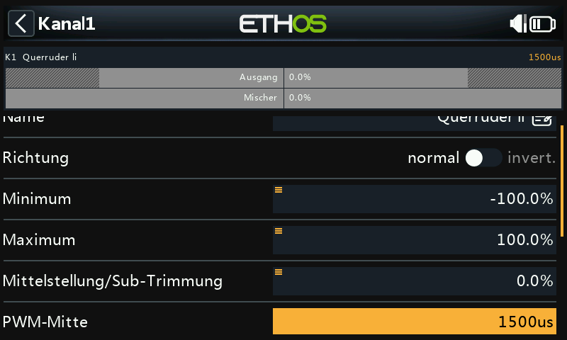

**Klappen** — Klappen benötigen für eine wirksame Bremswirkung meist einen großen Ausschlag nach unten;
dafür opfert man in der Anlenkung etwas Weg nach oben, sodass die Klappe bei Servomittelstellung
halb ausgefahren steht, und legt anschließend mit Min/Max die tatsächlichen Positionen "eingefahren"
und "voll ausgefahren" fest. Eine 5-Punkt-Kurve ist ein gängiges Mittel, um einen daraus resultierenden
Versatz zwischen Klappe und Querruder auszugleichen. Schließen Sie mit **[Balance
channels](../model-setup/outputs.md#balance-channels)** ab, um linke und rechte Querruder und Klappen zu synchronisieren.

## Schritt 7. Einführung in Flugphasen

[Flugphasen](../model-setup/flight-modes.md) ermöglichen es, aufgabenbezogene
Einstellungen im Modell zu hinterlegen — vergleichbar mit einem Gangwechsel. Von den 20 verfügbaren nutzt dieses
Beispiel drei: **Default**, **Flaps Half** (Schalter SE Mitte) und
**Flaps Full** (SE oben). Aktiv ist die erste Flugphase, deren Bedingung erfüllt ist; die
Flugphase **Default** hat überhaupt keine Bedingung und greift immer dann, wenn keine andere zutrifft —
deshalb bietet sie auch keine Schalterauswahl. Ein Ein-/Ausblenden über 1 Sekunde glättet den Übergang beim Ausfahren der Klappen.

## Schritt 8. Trimmungen konfigurieren

Es gibt zwei Möglichkeiten, eine mit der Klappenstellung variierende Höhenrudertrimmung zu handhaben:

**Unabhängige Trimmungen je Flugphase** — die einfachste Variante: Die Höhenrudertrimmung wird
je Flugphase völlig unabhängig und wechselt automatisch mit der Stellung von SE. Da jede Flugphase
von Grund auf neu getrimmt wird, hilft die [Sofort-Trimmung](../model-setup/trims.md#instant-trim) — trimmen Sie
zuerst für den Normalflug, landen Sie und nutzen Sie dieses Ergebnis als Ausgangspunkt für die Klappen-Flugphasen.

**Basistrimmung mit Offset** — einmal in Default trimmen, wobei die Höhenruderkompensation jeder
Klappen-Flugphase als Offset darübergelegt wird:

1. Setzen Sie die Trimm-**Schrittweite** auf Medium (für schnelleres Grundtrimmen; später zur
   Feinabstimmung verringern), den **Mode** auf Custom und fügen Sie ein neues Verhalten hinzu.
2. **Aktive Bedingung**: `FM1(Flaps Half)`, Modus **Offset + Default** —
   die Trimmung von Flaps Half ergibt sich dann aus der Basistrimmung plus dem Offset, der
   bei aktiver Flugphase eingestellt wird:

   
   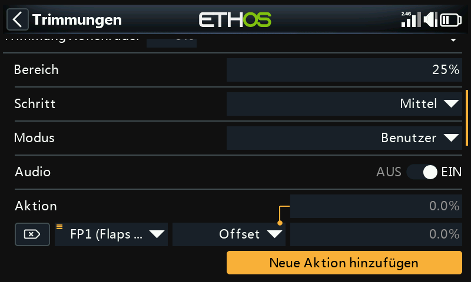

3. Wiederholen Sie dies für `FM2(Flaps Full)`:

   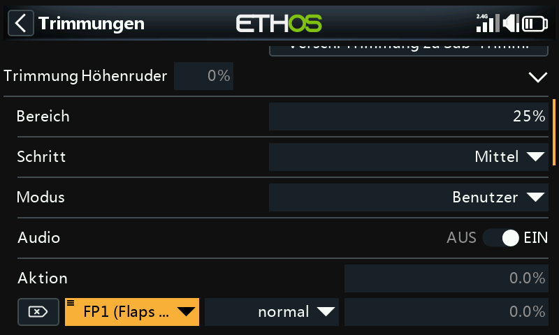
   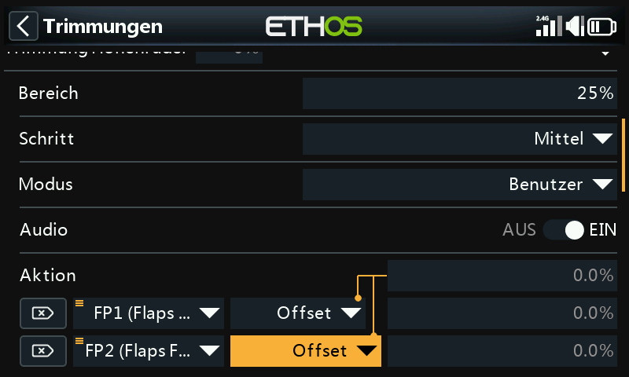

Jede Klappen-Flugphase lässt sich nun unabhängig trimmen, doch eine spätere Änderung der
Basistrimmung in Default (z. B. zum Ausgleich thermischer Servodrift) verschiebt automatisch beide
Klappen-Flugphasentrimmungen um denselben Betrag.

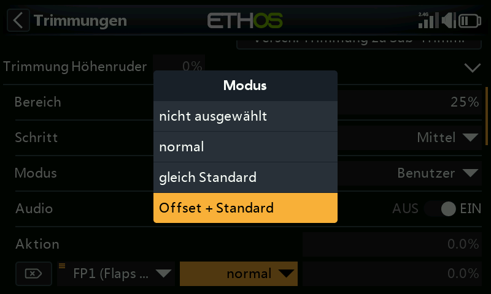

## Schritt 9. Timer für den Flugakku einrichten

Bearbeiten Sie unter [Timer](../model-setup/timers.md) den Timer 1: Modus **Down**, Startwert 5
Minuten, laufend, solange **Throttle active** wahr ist (und der Timer nicht im Reset gehalten wird).
Optional können Sie eine proportionale Zeitquelle zuweisen (z. B. den Gasknüppel), sodass der Timer bei
Vollgas in Echtzeit läuft und bei zurückgenommenem Gas langsamer.

## Schritt 10. Mischer für das Einziehfahrwerk hinzufügen {: #step-10-add-a-mix-for-retracts }

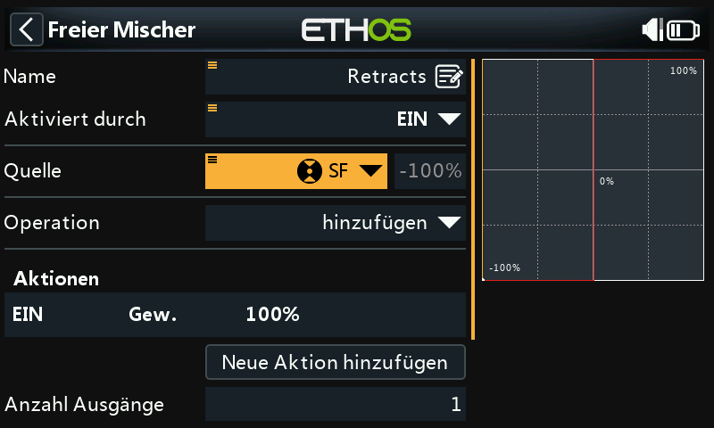

Tippen Sie auf einen Mischer, wählen Sie **Add Mix** → **Free Mix**, benennen Sie ihn "Retracts", setzen Sie die
Bedingung auf Always und die Quelle auf Schalter SF. Die Standardaktion mit Weight = 100 % ist
in Ordnung — damit wird dem Einziehfahrwerk z. B. Kanal 8 zugewiesen:

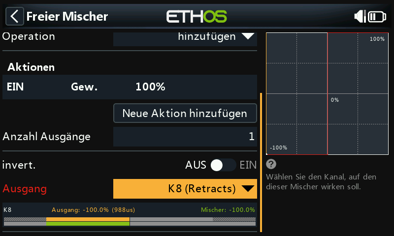
