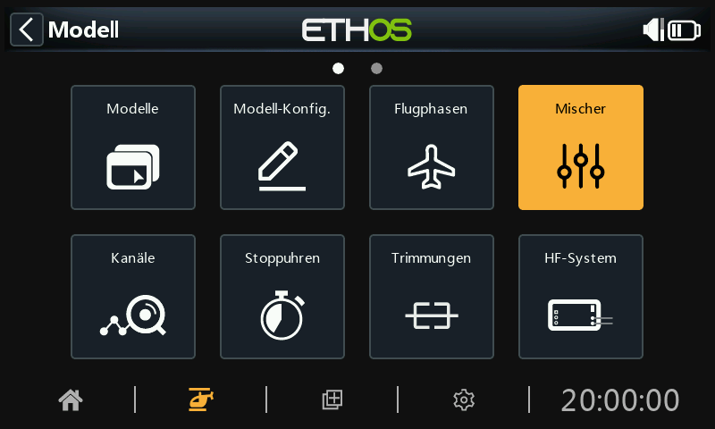
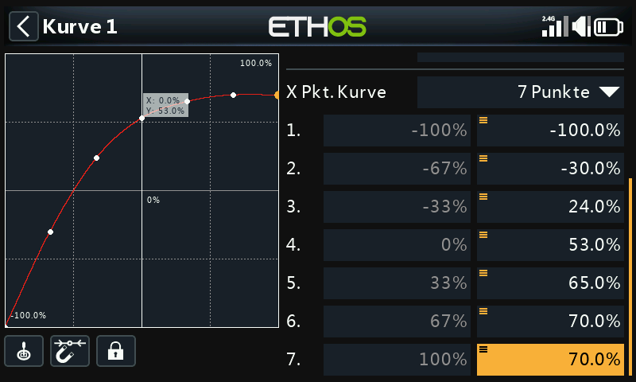
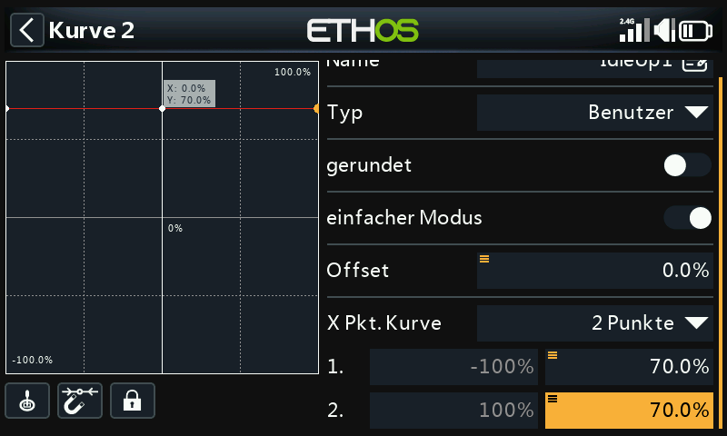

# Beispiel für einen einfachen Flybarless Helikopter

Dieses grundlegende Beispiel für einen Flybarless-Hubschrauber behandelt die Konfiguration eines einfachen Hubschraubers mit einem FBL-Regler wie dem Spirit.

Im Gegensatz zu Flugzeugen mit V-Form sind Hubschrauber von Natur aus instabil und benötigen einen Flugregler mit Kreiseln und Beschleunigungsmessern, um einen stabilen Flug zu gewährleisten.

Kreisel, die die Drehrate um eine Achse messen, und Beschleunigungsmesser, die Bewegung und Geschwindigkeit erfassen, um die Bewegung und Orientierung zu verfolgen, sind die Hauptfaktoren für die Bestimmung von Gieren, Nicken und Rollen für die Flugberechnungen, die für einen stabilen Flug erforderlich sind. Die Stabilität wird durch einen Software-Algorithmus erreicht, der als PID-Regelkreis (Proportional Integral Derivative) bezeichnet wird. Der PID-Regelkreis muss so eingestellt werden, dass ein stabiler Flug erreicht wird, wobei die Reaktionsfähigkeit erhalten bleibt und das Überschwingen minimiert wird. Die Abstimmungsparameter sind eine Funktion der physikalischen und elektrischen Eigenschaften des Hubschraubers.

In diesem Beispiel wird nur die Funkprogrammierung der Hubschraubereinrichtung behandelt. Den Rest des Setups entnehmen Sie bitte der Dokumentation Ihrer FBL Setup App. Gute Kenntnisse der Hubschraubertechnik und -bedienung werden vorausgesetzt.

**Warnung!** Um Verletzungen zu vermeiden, stellen Sie vor Beginn sicher, dass die Rotorblätter entfernt wurden, damit Sie das Setup sicher durchführen können.

## Schritt 1. Bestätigen Sie die Systemeinstellungen

Beginnen Sie mit dem obigen 'Beispiel für die Ersteinrichtung des Senders, mit dem Sie die Teile der Hardware konfigurieren, die für alle Modelle gleich sind. In diesem Beispiel verwenden wir die AETR-Kanalreihenfolge (Querruder, Höhenruder, Gas, Seitenruder), und die Einstellung „Erste vier Kanäle fest“ sollte auf „AUS“ stehen.

Verwenden Sie die Funktion [HF-System](../model-setup/rf-system.md), um Ihren Empfänger zu registrieren (wenn Ihr Empfänger ACCESS ist) und zu binden, um die Konfiguration des Modells vorzubereiten.

## Schritt 2. Identifizieren Sie die benötigten Servos/Kanäle

Die Mixer-Funktion bildet das Herzstück des Senders. Sie ermöglicht es, jede der vielen Eingangsquellen nach Belieben zu kombinieren und einem der Ausgangskanäle zuzuordnen.

Unser Hubschrauber-Beispiel hat die folgenden Servos/Kanäle:

1 x Roll (Querruder)

1 x Pitch (Höhenruder)

1 x Gas

1 x Gieren (Seitenruder)

1 x Kreiselverstärkung

1 x kollektiver Pitch

1 x Einstellungen Bank

1 x Rettung

## Schritt 3. Erstellen Sie ein neues Modell.

Lesen Sie den Abschnitt Modell-Setup / Modellauswahl, um Ihr neues Modell zu erstellen. Lesen Sie auch den Abschnitt „Menü-Navigation“, um sich mit der Benutzeroberfläche des Funkgeräts vertraut zu machen, damit Sie die benötigten Funktionen leicht finden können.

Vergewissern Sie sich im Abschnitt System / [Knüppelmode](../system-setup/controls.md), dass die Kanalreihenfolge AETR ist, und setzen Sie die Einstellung 'Erste vier Kanäle fest' auf 'EIN', um sicherzustellen, dass die vom Assistenten erstellte Kanalreihenfolge für das FBL-Gerät geeignet ist. Die Spirit FBL-Einheiten erwarten, dass die SBUS-Kanäle in dieser Reihenfolge angeordnet sind, obwohl sie bei der Einrichtung TAER verwenden.

Tippen Sie auf die Registerkarte Modell (Flugzeugsymbol), und wählen Sie die Funktion Modellauswahl. Legen Sie eine Kategorie „Heli“ an, falls noch nicht vorhanden, und wählen Sie sie aus. Tippen Sie auf das „+“-Symbol, das Ihnen eine Auswahl an Assistenten zur Modellerstellung bietet, z. B. Flugzeug, Segelflugzeug, Heli, Multirotor oder Sonstige. Der Assistent übernimmt Ihre Auswahl und erstellt die Mixer-Linien, die für die Implementierung der gewünschten Funktionalität erforderlich sind.

In unserem Beispiel tippen Sie auf das Symbol Heli, um den Wizard zur Modellerstellung zu starten.

Select Flybarless.

Definieren Sie einen Namen und ein Modellbild für Ihr Modell.

## ***Schritt 4. Überprüfung und Konfiguration der Misch******er***

Tippen Sie auf das Symbol Mischer, um die vom Heli-Assistenten erstellten Mischer zu überprüfen.

Der Assistent hat wie erwartet Querruder, Höhenruder, Gas und Seitenruder in der AETR-Sequenz erstellt und Pitch auf Kanal 6 und FBL Bank auf Kanal 7 erstellt.

Die kollektive Neigung liegt normalerweise auf Kanal 6. Bestätigen Sie, dass Pitch auf Kanal 6 liegt:

| CH6 | kollektiver Pitch |
| --- | --- |

| CH7 | FBL Bank |
| --- | --- |

Wir müssen auch zusätzliche Mischer für Kreiselverstärkung und Rettung/Stabi hinzufügen. Tippen Sie auf das Symbol „+“ neben den Spaltenüberschriften, um die erforderlichen zusätzlichen Kanäle mithilfe von Freien Mischern hinzuzufügen:

| CH5 | Kreiselverstärkung |
| --- | --- |

| CH8 | Rettung / Stabi |
| --- | --- |

### Überprüfung Querruder / Höhenruder / Seitenruder

Auf diesen Kanälen muss nichts hinzugefügt werden. Bitte beachten Sie, dass Einstellungen wie Gewichtungen und Expo von der BLUFF-Einheit gehandhabt werden, so dass der Sender nur die linearen Steuereingänge an die BLUFF-Einheit weitergibt.

### Kollektiv Pitch konfigurieren

Kollektiv Pitch ist einfach eine lineare Kurve, so dass Sie nur den Ausgangskanal (normalerweise Kanal 6) bestätigen müssen. Bitte beachten Sie, dass Dinge wie Gewichtung und Expo von der FBL-Einheit übernommen werden, so dass der Sender nur „saubere“ Eingänge sendet.

### Konfigurieren des FBL-Bank-Mischers

Die Spirit FBL-Einheit verfügt über drei Einstellungsbänke, mit denen sich verschiedene Konfigurationen einrichten lassen. Die Bankumschaltung eignet sich hervorragend zum Umschalten zwischen verschiedenen Flugstilen, unterschiedlichen Sensorverstärkungen für niedrige oder hohe Drehzahlen oder für Anfänger, Acro oder 3D, alternativ kann sie auch nur zum Abstimmen Ihrer Einstellungen verwendet werden.

Wir werden den Mix dem 3-Positionen-Schalter SE zuweisen.

### Kreisel-Verstärkung konfigurieren

Im Hauptbildschirm für Mischer (siehe oben) können neue Mischer hinzugefügt werden, indem man auf das „+“-Symbol neben den Spaltenüberschriften tippt.

Die Gyro-Verstärkung ist in der Regel ein fester Wert, daher setzen wir die Quelle auf „Spezial/Teil – 0“ und stellen dann den erforderlichen Verstärkungswert mit „Offset“ ein. Der endgültige Verstärkungswert muss möglicherweise während des Fluges bestimmt werden. Scrollen Sie weiter nach unten und weisen Sie den Ausgangskanal 5 zu. (Die Verstärkung befindet sich normalerweise auf Kanal 5).

### Flugphasen konfigurieren

Wir werden die Flugphasen verwenden, um die drei Flugphasen zu konfigurieren, die für Normal, Drehzahl 1 (IdleUp1) und Drehzahl 2 (IdleUp2) benötigt werden. Für unser Beispiel haben wir die „Standard-Flugphase“ in „Normal“ umbenannt und zwei zusätzliche Flugphasen für Drehzahl 1 und 2 am Schalter SD hinzugefügt.

### Konfigurieren Sie den Gasmischer

Der Gaskanal wird durch drei Gaskurven für die drei Flugphasen gesteuert, d.h. Normal, Drehzahl 1 und Drehzahl 2.

#### Normalmodus-Kurve

Der Normalmodus wird für das Hochfahren und den Start verwendet, d.h. die Kurve beginnt bei -100% (Motor aus) und steigt dann für den Start gleichmäßig an. Die endgültigen Kurvenwerte müssen möglicherweise im Flug ermittelt werden.

In diesem Beispiel haben wir eine 7-Punkte-Kurve mit „Glätten ein“ verwendet, um eine glatte Kurve zu erhalten.

#### Kurve Drehzahl 1

Drehzahl1 wird für die meisten Flüge verwendet. Die geradlinige Kurve bedeutet, dass wir eine konstante Gaseinstellung haben werden, um die Rotoren mit einer gleichmäßigen Geschwindigkeit drehen zu lassen. Der endgültige Wert für das Gas muss eventuell im Flug ermittelt werden. Die Bewegung des Hubschraubers wird durch die kollektiven Pitch-, Querruder- (Roll) und Höhenruder- (Nick) Regler gesteuert.

Beachten Sie, dass es keinen großen Sprung zwischen Normal und Drehzahl 1 geben sollte, damit der Übergang fließend erfolgt.

Beachten Sie auch, dass die meisten FBL-Geräte über eine Governor-Funktion verfügen, die dafür sorgt, dass die Rotordrehzahl auch bei aggressiven Flugmanövern konstant gehalten wird. Einzelheiten dazu finden Sie im Spirit FBL-Handbuch.

#### Kurve Drehzahl 2

Drehzahl 2 wird für aggressivere Flüge verwendet, z. B. Kunstflug und 3D. Der endgültige Wert für die Drosselklappe muss möglicherweise im Flug ermittelt werden.

#### Einstellung des Gaskanalmischers

##### Gasabschaltung

Wenn wir den Schalter SG↑ der Funktion „Gas AUS“ zuordnen und er auf „EIN“ steht, wird der Gashebel abgeschaltet, sobald Sie den Schalter in die Position „vorn“ bringen. Aufgrund der SF FlipFlop-Einstellung kann der Gashebel jedoch nur neu aktiviert werden, wenn er sich in der unteren Position (aus) befindet.

##### Gaskurve

Jetzt können wir den Gasmischer für die drei Gaskurven konfigurieren, die von den Flugphasen gesteuert werden.

Die Spirit FBL-Einheit verfügt über drei Einstellungsbänke, mit denen sich verschiedene Konfigurationen einrichten lassen. Die Bankumschaltung eignet sich hervorragend zum Umschalten zwischen verschiedenen Flugstilen, unterschiedlichen Sensorverstärkungen für niedrige oder hohe Drehzahlen oder für Anfänger, Acro oder 3D. Sie kann aber auch einfach nur zum Abstimmen Ihrer Einstellungen verwendet werden.

### Konfigurieren Sie den Rettungs/Stabi-Mischers

In ähnlicher Weise kann der Rettungs-Mischer beispielsweise dem Schalter SA zugewiesen werden.

## Schritt 5. FBL-Einrichtung

### Installieren Sie das FBL-Konfigurationsprogramm

Beginnen Sie mit der Installation der Spirit Settings-Software auf Ihrem PC.

### Verbinden Sie Ihren Empfänger mit dem FBL-Gerät

Schließen Sie Ihren Empfänger an Ihr FBL-Gerät an, wie im Abschnitt „Verkabelung“ des FBL-Handbuchs beschrieben. Der SBUS-Ausgang des Empfängers sollte mit dem RUD-Anschluss der FBL-Einheit verbunden werden (beachten Sie, dass einige Spirit-Modelle einen SBUS-Adapter benötigen). Alternativ können Sie eine Verbindung über F.Port 1 oder FBUS herstellen.

### Verbinden Sie das FBL-Gerät mit Ihrem PC

Verbinden Sie Ihren PC mit Ihrem FBL-Gerät gemäß dem Abschnitt Konfiguration im Spirit FBL Handbuch, entweder mit dem mitgelieferten Kabel oder über Bluetooth.

Stellen Sie eine erfolgreiche Verbindung zu Ihrem FBL-Gerät her. Sie sind nun bereit, die Senderprogrammierung Ihres Hubschraubers zu konfigurieren. Wie bereits erwähnt, sollten Sie die Spirit FBL-Konfigurationsdokumentation im Handbuch zu Rate ziehen, um die restlichen Einstellungen vorzunehmen.

**Achtung!** Schließen Sie noch keine Servos an!

### Überprüfen Sie die FBL-Firmware-Version

Aktualisieren Sie ggf. die FBL-Firmware auf die neueste Version (siehe Registerkarte „Update“ im Spirit-Einstellungstool).

### Allgemeine Einstellungen

Siehe die Registerkarte Allgemein in der Spirit-Einstellungssoftware.

- Stellen Sie den Empfängertyp auf 'Futaba SBUS' oder 'FrSky F.Port' (je nach Bedarf) und starten Sie das System neu.
  - Klicken Sie auf die Schaltfläche 'Kanäle', um zum Dialog für die Zuordnung der Empfängerkanäle zu gelangen. Wenn Sie die AETR-Kanalreihenfolge im Heli-Assistenten verwendet haben, können Sie die Kanäle wie folgt zuordnen:

|  |  |
| --- | --- |
|  |  |
|  |  |
|  |  |
|  |  |
|  |  |
|  |  |
|  |  |

### Kanal-Grenzwerte

Bitte beachten Sie die Registerkarte „Diagnose“ in der Spirit-Einstellungssoftware.

Für den ordnungsgemäßen Betrieb der FBL-Einheit müssen die Senderkanalgrenzen kalibriert und die Mitten überprüft werden.

Stellen Sie am Sender sicher, dass alle Subtrimmungen und Trimmungen auf Null gestellt sind. Stellen Sie den kollektiven Pitch auf die mittlere Knüppelposition ein, um eine Ausgabe von 1500us auf dem „Kanälen“-Bildschirm zu erhalten. Schalten Sie nun die FBL-Einheit ein und überprüfen Sie, ob die Quer-, Höhen-, Nick- und Seitenruderkanäle auf 0% in der Diagnoseregisterkarte zentriert sind. Das FBL-Gerät erkennt die Neutralstellung automatisch bei jeder Initialisierung.

Bewegen Sie die Knüppel an ihre Grenzen und passen Sie die entsprechenden Einstellungen für den minimalen und maximalen Ausschlag auf der Seite „Kanälen“ für jeden Kanal an, um einen Wert von +100% und -100% auf der Registerkarte „Diagnose“ zu erreichen. Die Bewegungsrichtung der Balken muss ebenfalls mit den Knüppeln übereinstimmen. Verwenden Sie für diese Kanäle keine Subtrim oder Trimmfunktionen Ihres Senders, da die Spirit FBL-Einheit diese als Eingangsbefehl betrachtet.

Passen Sie den Offset-Wert in dem Gyro Verstärkungs-Mischer an, um sicherzustellen, dass Heading Lock erreicht wird.

Nach diesen Einstellungen sollte alles in Bezug auf den Sender konfiguriert sein. Sie können nun mit dem Rest des FBL-Setups gemäß dem Spirit FBL-Handbuch fortfahren.
