# Beispiel für einen einfachen Flybarless Helikopter

Grundlegende Konfiguration eines Flybarless-Hubschraubers (FBL), am
Beispiel eines FBL-Reglers wie dem Spirit. Anders als ein Flächenmodell ist
ein Hubschrauber von Natur aus instabil — die FBL-Einheit nutzt Kreisel
(Drehrate um eine Achse) und Beschleunigungsmesser (Bewegung/Orientierung),
um über einen abgestimmten PID-Regelkreis (Proportional Integral
Derivative) die Korrekturen für Gieren, Nicken und Rollen zu berechnen.
Dabei werden Stabilität, Reaktionsfähigkeit und Überschwingen anhand der
physikalischen und elektrischen Eigenschaften des jeweiligen Hubschraubers
gegeneinander abgewogen.

Dieses Beispiel behandelt nur die **Funkprogrammierung** — den Rest des
Setups entnehmen Sie bitte der Dokumentation Ihrer FBL-Einheit. Gute
Kenntnisse der Hubschraubertechnik und -bedienung werden vorausgesetzt.

!!! danger
    Um Verletzungen zu vermeiden, entfernen Sie vor Beginn die Rotorblätter.

## Schritt 1. Bestätigen Sie die Systemeinstellungen

Kanalreihenfolge **AETR**, **[Erste vier Kanäle
fest](../system-setup/controls.md#first-four-channels-fixed)** auf **AUS**
— die Spirit FBL-Einheiten erwarten, dass die SBUS-Kanäle genau in dieser
Reihenfolge angeordnet sind, obwohl sie bei der eigenen Einrichtung
intern TAER verwenden. Registrieren Sie den Empfänger (wenn Ihr Empfänger
ACCESS ist) und binden Sie ihn über die Funktion
[HF-System](../model-setup/rf-system.md).

## Schritt 2. Identifizieren Sie die benötigten Servos/Kanäle

| Funktion | Kanal |
|---|---|
| Roll (Querruder) | — |
| Pitch (Höhenruder) | — |
| Gas | — |
| Gieren (Seitenruder) | — |
| Kreiselverstärkung | 5 |
| Kollektiver Pitch | 6 |
| Einstellungen Bank | 7 |
| Rettung | 8 |

## Schritt 3. Erstellen Sie ein neues Modell

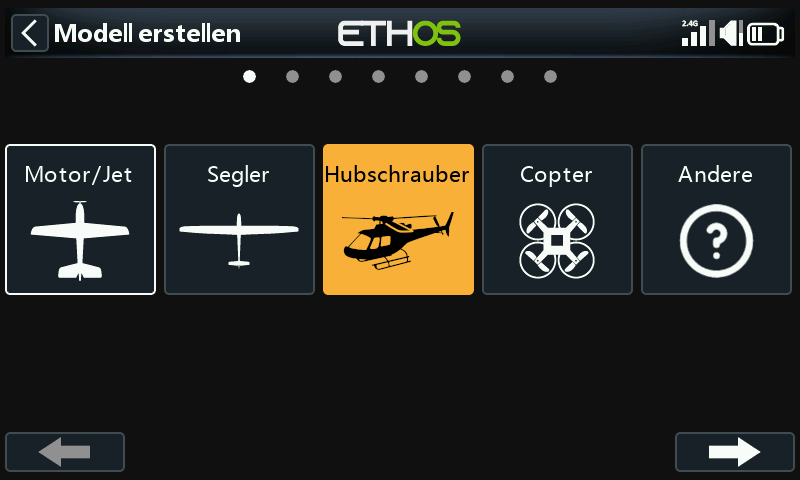

Legen Sie in der [Modellauswahl](../model-setup/model-select.md) eine
Kategorie „Heli“ an bzw. wählen Sie sie aus, starten Sie den Assistenten
zur Modellerstellung und wählen Sie **Flybarless**:

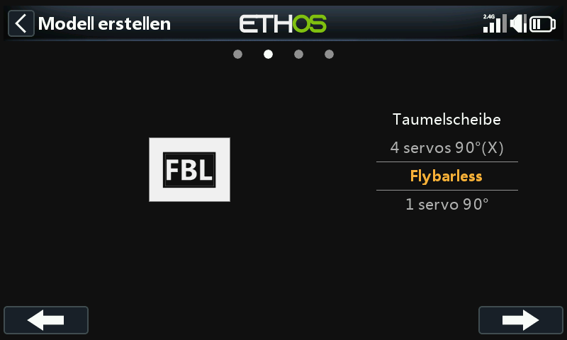
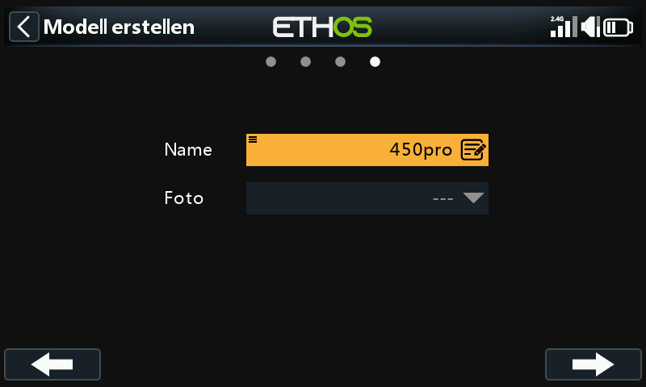

Definieren Sie einen Namen und ein Modellbild für Ihr Modell.

## Schritt 4. Überprüfung und Konfiguration der Mischer

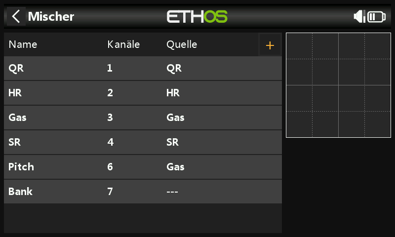

Der Assistent erstellt Querruder, Höhenruder, Gas und Seitenruder in der
AETR-Sequenz, Pitch auf Kanal 6 und FBL Bank auf Kanal 7:

Bestätigen Sie, dass auf Kanal 6 der kollektive Pitch liegt. Zwei weitere
Kanäle müssen manuell mit [Freien
Mischern](../model-setup/mixes.md#mix-libraries) hinzugefügt werden:
**Kreiselverstärkung** (Kanal 5) und **Rettung/Stabi** (Kanal 8).

**Querruder / Höhenruder / Seitenruder** — auf diesen Kanälen muss nichts
hinzugefügt werden; Gewichtungen und Expo werden von der FBL-Einheit
gehandhabt, so dass der Sender nur die linearen Steuereingänge weitergibt.

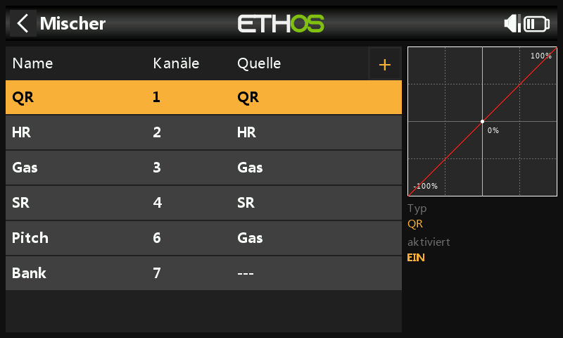

**Kollektiver Pitch** — einfach eine lineare Kurve; Sie müssen nur den
Ausgangskanal (normalerweise Kanal 6) bestätigen. Wie oben werden
Gewichtung und Expo von der FBL-Einheit übernommen, nicht hier.

**FBL Bank** — die drei Einstellungsbänke des Spirit (verschiedene
Flugstile, unterschiedliche Sensorverstärkungen für niedrige oder hohe
Drehzahlen oder für Anfänger, Acro und 3D — alternativ auch nur zum
Abstimmen Ihrer Einstellungen), zugewiesen auf einen 3-Positionen-Schalter,
z. B. SE:

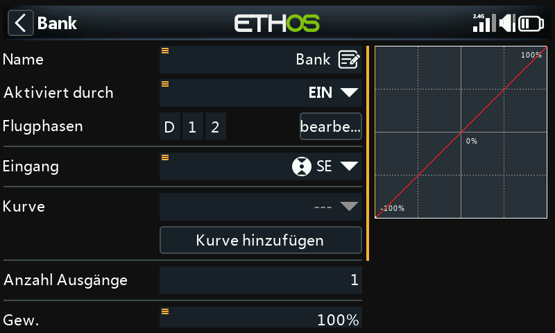

**Kreiselverstärkung** — als freien Mischer nach dem letzten Kanal
hinzufügen. Die Kreiselverstärkung ist in der Regel ein fester Wert: Setzen
Sie die **Quelle** auf Spezial > Wert = 0 und wählen Sie dann den
gewünschten Verstärkungswert mit **Offset** (der endgültige Wert muss
eventuell im Flug ermittelt werden). Weisen Sie als Ausgangskanal 5 zu:

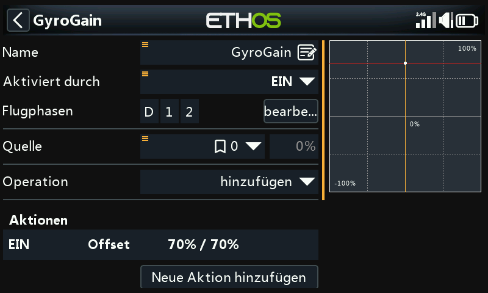

### Flugphasen konfigurieren

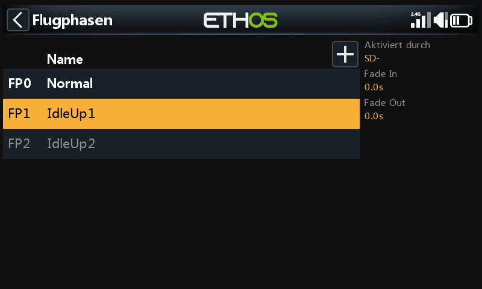

Drei [Flugphasen](../model-setup/flight-modes.md): Benennen Sie den
Standard-Flugmodus in **Normal** um und fügen Sie **Idle Up 1** und
**Idle Up 2** am Schalter SD hinzu.

### Konfigurieren Sie den Gasmischer

Drei Gaskurven, eine je Flugphase, jeweils als [benutzerdefinierte
Kurve](../model-setup/curves.md):

- **Normal** — für das Hochfahren und den Start: Die Kurve beginnt bei
  −100 % (Motor aus) und steigt dann gleichmäßig an. Eine 7-Punkte-Kurve
  mit „Glätten ein“ hat sich bewährt; die endgültigen Kurvenwerte müssen
  möglicherweise im Flug ermittelt werden.

  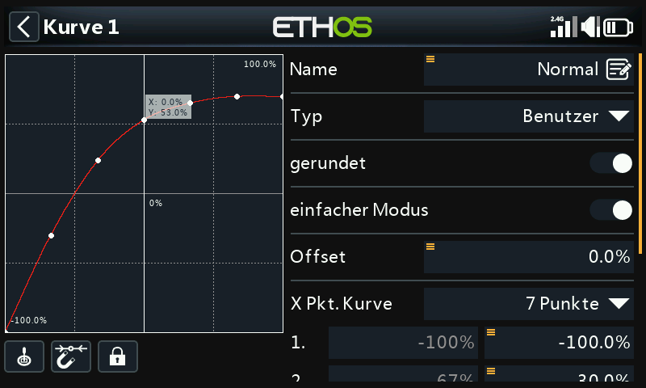

- **Idle Up 1** — für die meisten Flüge: Die geradlinige Kurve bedeutet
  eine konstante Gaseinstellung, um die Rotoren mit gleichmäßiger Drehzahl
  drehen zu lassen; die Bewegung des Hubschraubers wird stattdessen durch
  den kollektiven Pitch, das Querruder (Roll) und das Höhenruder (Nick)
  gesteuert. Achten Sie darauf, dass es keinen großen Sprung zwischen
  Normal und Drehzahl 1 gibt, damit der Übergang fließend erfolgt. (Die
  meisten FBL-Geräte verfügen zudem über eine **Governor**-Funktion, die
  die Rotordrehzahl auch bei aggressiven Flugmanövern konstant hält —
  Einzelheiten dazu finden Sie im Handbuch der FBL-Einheit.)

  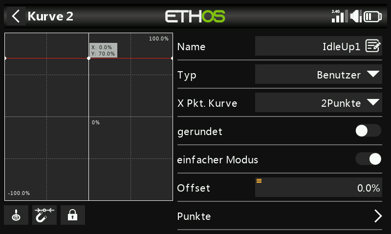

- **Idle Up 2** — für aggressivere Flüge (Kunstflug und 3D); der endgültige
  Wert muss ebenfalls im Flug ermittelt werden.

  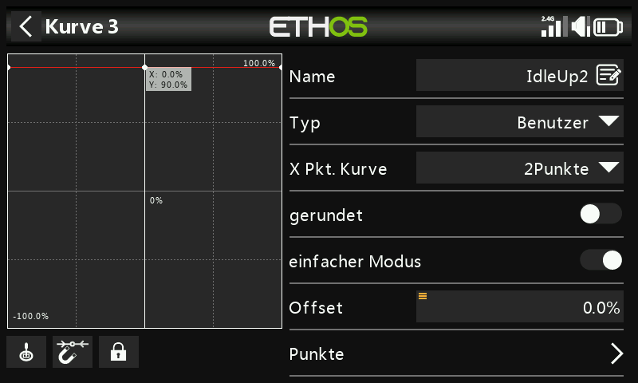

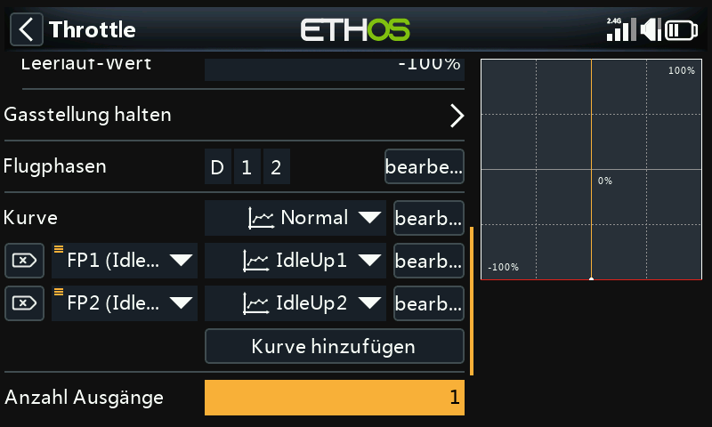

**Gasabschaltung** — weisen Sie z. B. den Schalter SG↑ zu und schalten Sie
**FlipFlop** ein: Sobald Sie den Schalter nach oben bringen, wird der
Gashebel abgeschaltet, und aufgrund der FlipFlop-Einstellung kann er nur
neu aktiviert werden, wenn sich der Gasknüppel zuvor in der unteren
Position (aus) befindet.

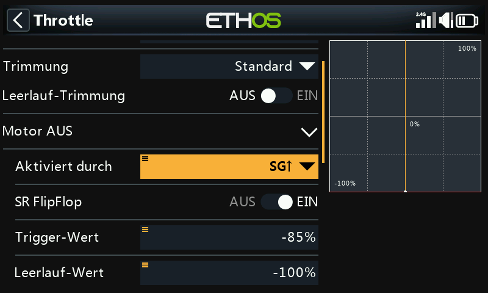

**Rettung/Stabi** — in ähnlicher Weise zuweisen, z. B. dem Schalter SA auf
Kanal 8.

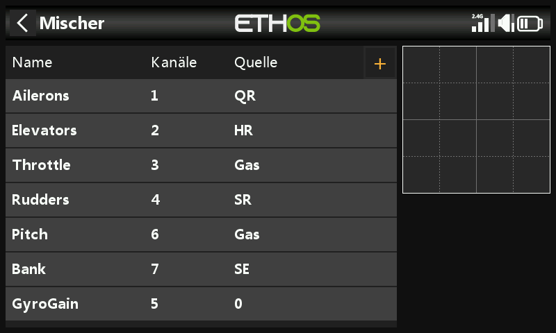

## Schritt 5. FBL-Einrichtung

1. **Installieren Sie das FBL-Konfigurationsprogramm** — z. B. die Spirit
   Settings-Software auf Ihrem PC.
2. **Verbinden Sie Ihren Empfänger mit dem FBL-Gerät** gemäß dessen
   Verkabelungsplan — üblicherweise den SBUS-Ausgang des Empfängers mit dem
   RUD-Anschluss der FBL-Einheit (beachten Sie, dass einige Spirit-Modelle
   einen SBUS-Adapter benötigen), alternativ über F.Port1 oder FBUS.
3. **Verbinden Sie das FBL-Gerät mit Ihrem PC** — entweder mit Kabel oder
   über Bluetooth, gemäß dessen Handbuch.

   !!! danger
       Schließen Sie noch keine Servos an!

4. **Aktualisieren Sie ggf. die FBL-Firmware** auf die neueste Version
   (siehe Registerkarte „Update“ im Einstellungstool).
5. **Allgemeine Einstellungen** (Registerkarte „Allgemein“ in der
   Spirit-Einstellungssoftware):
   - Empfängertyp: **Futaba SBUS** oder **FrSky F.Port** (je nach Bedarf),
     anschließend das System neu starten.
   - Kanalzuordnung (bei AETR aus dem Assistenten):

     | Funktion | Kanal |
     |---|---|
     | Gas | 1 |
     | Querruder | 2 |
     | Höhenruder | 3 |
     | Seitenruder | 4 |
     | Kreisel | 5 |
     | Pitch | 6 |
     | Bank | 7 |
     | Rettung/Stabi | 8 |

     (Diese Reihenfolge ergibt sich daraus, dass die Spirit-Einheit
     Annahmen über die Position der Kanäle im SBUS-Datenstrom macht.)

6. **Kanal-Grenzwerte** (Registerkarte „Diagnose“) — für den
   ordnungsgemäßen Betrieb der FBL-Einheit müssen die Senderkanalgrenzen
   kalibriert und die Mitten überprüft werden:

   - Stellen Sie zunächst am Sender sicher, dass alle Subtrimmungen und
     Trimmungen auf Null gestellt sind.
   - Stellen Sie den kollektiven Pitch auf die mittlere Knüppelposition
     ein, um in den [Ausgängen](../model-setup/outputs.md) exakt 1500 µs zu
     erhalten.
   - Schalten Sie die FBL-Einheit ein und überprüfen Sie, ob die Quer-,
     Höhen-, Nick- und Seitenruderkanäle auf der Registerkarte „Diagnose“
     jeweils auf 0 % zentriert sind (das FBL-Gerät erkennt die
     Neutralstellung automatisch bei jeder Initialisierung).
   - Bewegen Sie die Knüppel an ihre Grenzen und passen Sie die
     entsprechenden Werte **Min**/**Max** auf der Seite „Ausgänge“ für jeden
     Kanal so an, dass die Registerkarte „Diagnose“ exakt +100 % bzw.
     −100 % anzeigt. Die Bewegungsrichtung der Balken muss ebenfalls mit
     den Knüppeln übereinstimmen.

   !!! warning
       Verwenden Sie für diese Kanäle niemals Subtrim- oder Trimmfunktionen
       Ihres Senders — die Spirit FBL-Einheit betrachtet diese als
       Eingangsbefehl und nicht als Kalibrierung.

7. Passen Sie den **Offset**-Wert im Kreiselverstärkungs-Mischer an, um
   sicherzustellen, dass Heading Lock erreicht wird.

Danach sollte alles in Bezug auf den Sender konfiguriert sein — fahren Sie
mit dem Rest des Setups gemäß dem Handbuch der FBL-Einheit fort.
