# Beispiel für ein Nurflügel-Flugzeug (Elevon)

Dieses einfache Nurflügler-Beispiel behandelt die Konfiguration eines Modells mit 2 Servos für die Höhenruder. Wir werden die von Dreamflight Weasel empfohlenen Raten, Expo- und Mischungsverhältnisse verwenden.

## Schritt 1. Bestätigen Sie die Systemeinstellungen

Beginnen Sie mit dem obigen „Beispiel für die Ersteinrichtung des Senders“, das zur Konfiguration der Teile des Senders dient, die allen Modellen gemeinsam sind. In diesem Beispiel verwenden wir die Standard-Kanalreihenfolge AETR (Querruder, Höhenruder, Gas, Seitenruder). Stellen Sie sicher, dass die Einstellung 'Erste vier Kanäle fest' auf EIN steht.

Verwenden Sie die Funktion [HF-System](../model-setup/rf-system.md), um Ihren Empfänger zu registrieren (wenn Ihr Empfänger ACCESS ist) und zu binden, um die Konfiguration des Modells vorzubereiten.

## Schritt 2. Identifizieren Sie die benötigten Servos/Kanäle

Die Funktion „Mischer“ ist das Herzstück des Senders. Bei einem Nurflügelmodell werden die Mischer verwendet, um die Querruder- und Höhenrudersteuerungen zu kombinieren, damit beide auf die Höhenruderflächen wirken.

Unser Nuri-Beispiel hat die folgenden Servos/Kanäle:

2 Kanäle, die die Querruder- und Höhenrudereingänge kombinieren

## Schritt 3. Erstellen Sie ein neues Modell.

Lesen Sie den Abschnitt Modell-Setup / Modellauswahl, um Ihr neues Modell zu erstellen. Lesen Sie auch den Abschnitt „Menü-Navigation“, um sich mit der Benutzeroberfläche des Senders vertraut zu machen, damit Sie die benötigten Funktionen leicht finden können.

Tippen Sie auf die Registerkarte Modell (Flugzeugsymbol), und wählen Sie die Funktion Modellauswahl. Tippen Sie dann auf das '+'-Symbol, das Ihnen eine Auswahl an Assistenten zur Modellerstellung bietet.

In unserem Beispiel tippen Sie auf das Flugzeugsymbol, um den Wizard zur Modellerstellung zu starten.

Der Wizard bietet die Möglichkeit, voreingestellte Mischer für stabilisierte FrSky-Empfänger einzurichten. Für dieses Beispiel wählen wir die Option „Nicht stabilisierter Empfänger“. Drücken Sie auf den rechten unteren Pfeil, um zur nächsten Seite zu gelangen. Mit dem linken Pfeil gelangen Sie zur vorherigen Seite.

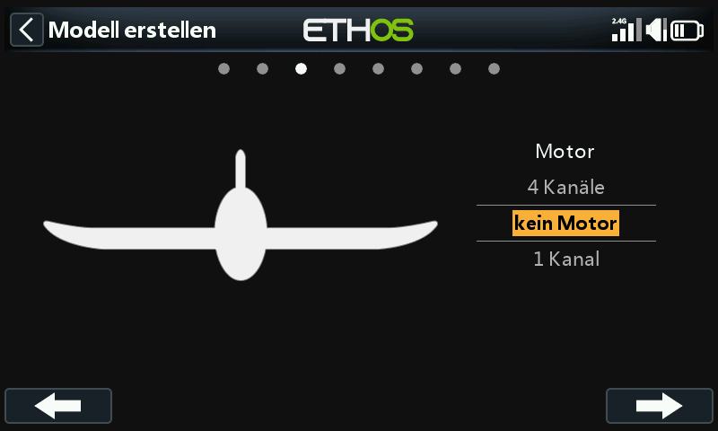

Wählen Sie für den Motor „Kein Motor“.

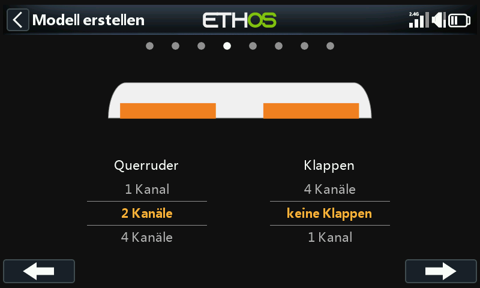

Akzeptieren Sie die Standardeinstellung von 2 Kanälen für die Querruder und wählen Sie 'Keine Klappen'.

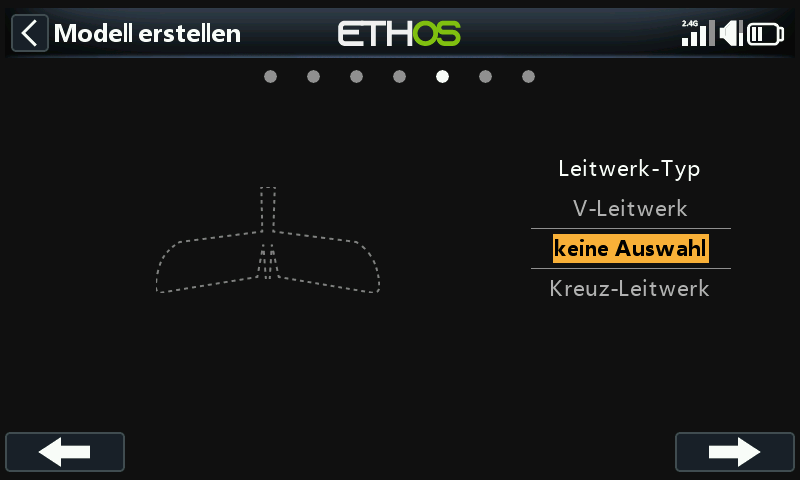

Wählen Sie 'Keine Auswahl' für das Heck. Dadurch wird eine Höhenrudermischung mit Querruder- und Höhenrudereingängen erstellt. Die Kanalbelegung sieht man dann auf der folgenden Seite.

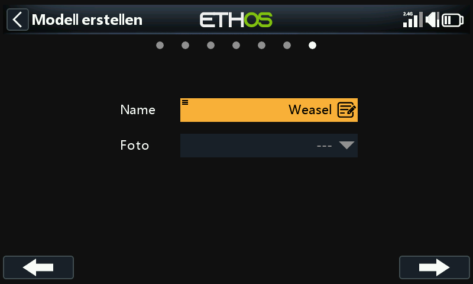

Wir geben dem Modell den Namen „Wiesel“, wählen ein Bitmap-Bild dafür aus und folgen dem Assistenten bis zum Ende, was dazu führt, dass das Modell „Wiesel“ in der Gruppe „Flugzeug“ erstellt wird. Es wird auch zum aktiven Modell gemacht, so dass wir mit der Konfiguration seiner Funktionen fortfahren können.

## ***Schritt 4. Überprüfung und Konfiguration der Misch******er***

Tippen Sie auf das Symbol Mischer, um die vom Flugzeug-Assistenten erstellten Mischer zu überprüfen.

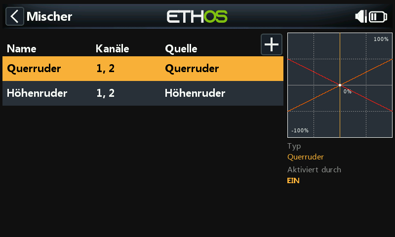

Der Wizard hat einen Querrudermischer auf den Kanälen 1 und 2 erstellt, gefolgt von einem Höhenrudermischer, ebenfalls auf den Kanälen 1 und 2. Das bedeutet, dass beide Eingangssteuerungen auf die beiden Höhenruderkanäle wirken.

### Querruder

Um den Querrudermischer zu überprüfen, tippen Sie auf die Zeile „Querruder“ und wählen Sie im Popup-Menü „Bearbeiten“.

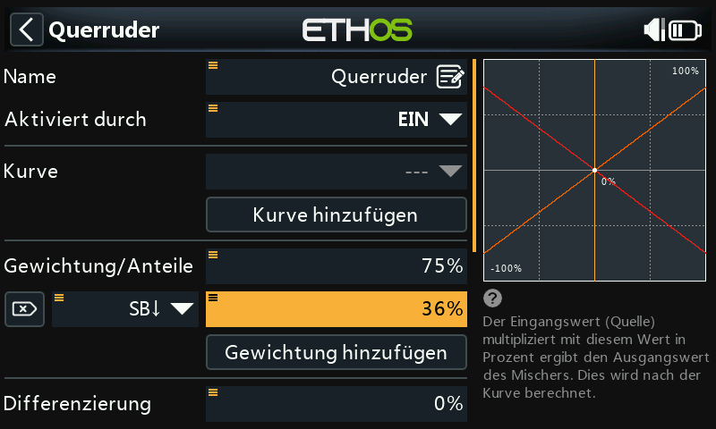

#### Gewichtung/Anteile

Im Weasel-Handbuch sind die empfohlenen Ausschläge für das Querruder etwa dreimal größer als für das Höhenruder. Wir wollen kombinierte Gewichte von 100%, also sollte das Querrudergewicht 75% und das Höhenruder 25% betragen.

Nach dem Weasel-Handbuch sollten die niedrigen Werte etwa 50% der hohen Werte betragen. Daher werden wir 36% für die niedrigen Raten des Querruders und 12% für die niedrigen Raten des Höhenruders verwenden.

#### Expo

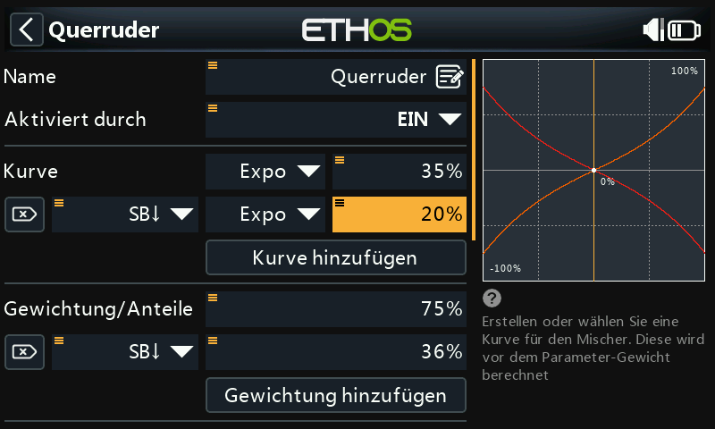

In den obigen Beispielen für die Steuerknüppel können Sie sehen, dass das Ausgangsverhalten linear ist. Um zu vermeiden, dass die Reaktion in der Knüppelmitte zu unruhig ist, können Sie eine Expo-Kurve verwenden, um die Steuerflächenbewegung in der Knüppelmitte zu reduzieren und sie zu erhöhen, wenn sich der Knüppel weiter von der Mitte entfernt. Die von Weasel empfohlenen Expo-Werte sind 35% für hoch und 20% für niedrig, also fügen wir eine Kurve hinzu, die in der SB-Schalterstellung nach unten aktiv wird. Das Diagramm zeigt nun eine gekrümmte Reaktion, die in der Knüppelmitte flacher ist.

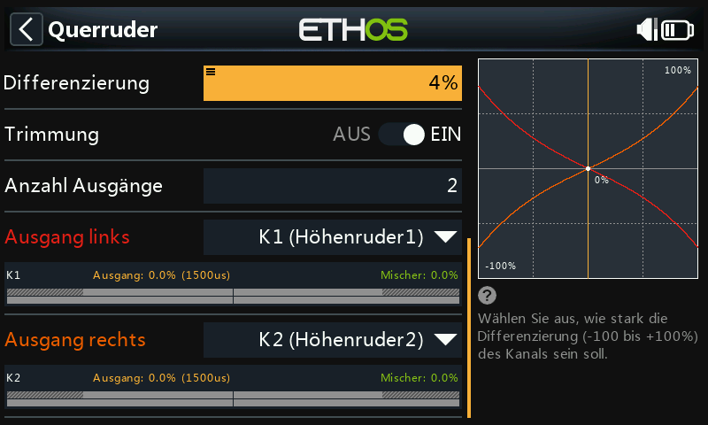

Für die Querruder gibt es eine weitere spezielle Einstellung, die Differenzierung genannt wird. Wenn sich das linke und das rechte Querruder um den gleichen Betrag nach oben oder unten bewegt, verursacht das sich nach unten bewegendem Querruder mehr Widerstand als das sich nach oben bewegende, wodurch der Flügel in die entgegengesetzte Richtung der Kurve giert. Dies wird als negatives Gieren bezeichnet. Um dies zu reduzieren, führt ein positiver Wert in der Differential-Einstellung zu einer geringeren Abwärtsbewegung des Querruders, wodurch das ungünstige Gieren reduziert und die Kurvenflug-/Handlingseigenschaften verbessert werden. Die vom Weasel empfohlene Differenzierung ist recht klein und entspricht etwa 4%.

### Höhenruder

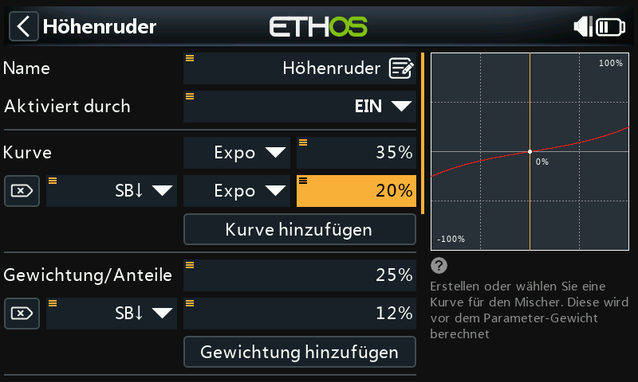

Ähnlich wie bei den Querrudern können wir auch für das Höhenruder die Gewichtung/Anteile einstellen. Wir verwenden einen Wert von 25% und 12% und wir verwenden die gleichen Expo-Werte wie für die Querruder.

### Seitenruder

Der Weasel hat kein Seitenruder, er braucht auch keines. Andere Nurflügel-Modelle benötigen möglicherweise ein Seitenruder. Da für Nuris in der Kategorie Motormodelle keinen fertiger Seitenrudermischer in der Mischerbibliothek vorgesehen ist, verwenden wir in diesem Fall einen Freier Mischer, um ein Seitenruder auf Kanal 3 hinzuzufügen. In der Kategorie Segler ist er aber vorhanden.

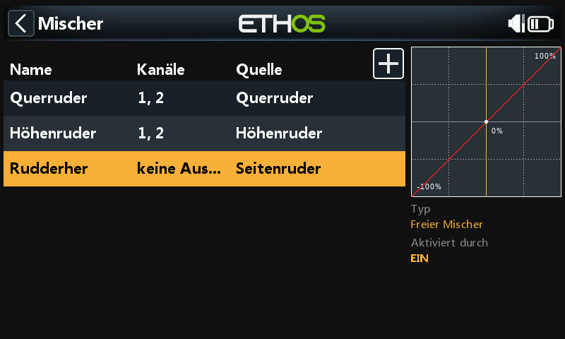

## ***Schritt 5. Binden*** ***des*** ***Empfänger******s***

Verwenden Sie die Funktion [HF-System](../model-setup/rf-system.md), um Ihren Empfänger zu registrieren (wenn Ihr Empfänger ACCESS ist) und zu binden, um die Konfiguration der Kanäle vorzubereiten.

Bitte lesen Sie die nächsten beiden Abschnitte über die Überprüfung Ihrer Mischer und die Konfiguration der Kanäle durch, bevor Sie fortfahren. Um Schäden durch versehentliches Übersteuern Ihrer Servos zu vermeiden, wäre es ratsam, Ihre Servoanlenkungen zu trennen oder den Servoweg zu reduzieren, bis Sie bereit sind, die Servo-Min/Max-Grenzen zu konfigurieren.

## Schritt 6. Überprüfen Sie die Mischer

Sie können den Bildschirm „Kanäle“ verwenden, um die Mischungen zu überprüfen. Die Ausgangskanäle 1 und 2 können in Elevon1 und Elevon2 umbenannt werden.

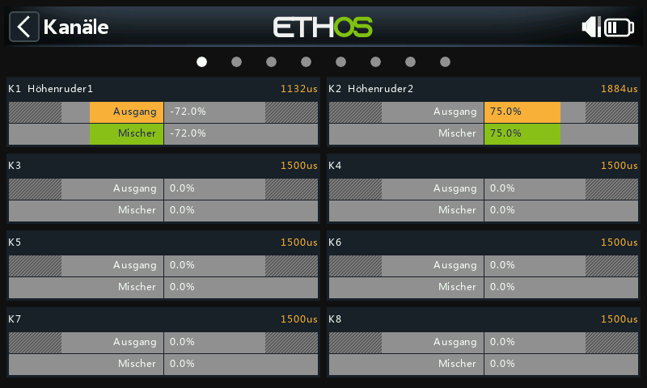

Das obige Beispiel zeigt, dass das rechte Querruder voll ausgefahren wurde, so dass Kanal 1 auf 75 % steht, während das linke abwärts gerichtete Querruder aufgrund der Querruderdifferenz -72 % beträgt.

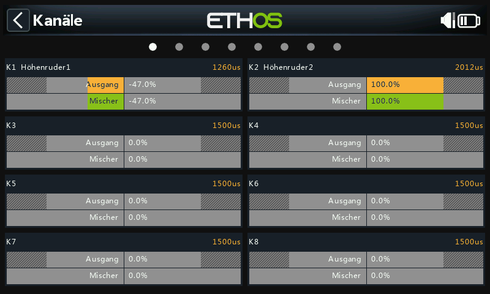

In diesem Beispiel wurde sowohl das rechte Querruder als auch das Höhenruder voll ausgefahren, so dass Kanal 1 bei 75+25 = 100 % liegt, während das linke, nach unten gerichtete Querruder aufgrund der Querruderdifferenz -72+25 = -47 % beträgt.

## Schritt 7. Konfigurieren Sie die maximalen Servowege

Beginnen Sie mit der Einstellung der Servo-Mittelpunkte mit Hilfe der PWM-Mitte-Einstellung.

Schließlich sollten die tatsächlichen maximalen Servoausschläge konfiguriert werden, um die empfohlenen Ausschläge einzustellen und um ein Überschreiten der mechanischen Servogrenzen zu vermeiden. Die vom Weasel empfohlenen maximalen Ausschläge sind 25mm (Querruder) + 10mm (Höhenruder) = 35mm. Stellen Sie die maximalen Ruderausschläge ein und achten Sie darauf, dass die Servo- und Anlenkungsgrenzen nicht überschritten werden.

#### Min/Max

Die Minimal- und Maximalwerte für den Kanal sind „harte“ Grenzwerte, d.h. sie können nicht überschrieben werden. Sie sollten so eingestellt werden, dass eine mechanische Blockierung vermieden wird. Beachten Sie, dass sie als Verstärkungs- oder „Endpunkt“-Einstellungen dienen, d. h. eine Verringerung dieser Grenzwerte verringert den Übersteuerungsgrad und führt nicht zum Abschneiden der oberen Werte. Beachten Sie, dass die Grenzwerte standardmäßig auf +/- 100,0 % eingestellt sind, hier aber bei Bedarf auf +/- 150,0 % erhöht werden können.

#### Kurve

Kurven sind ein schnellerer und flexiblerer Weg, die Mitte und die Min/Max-Grenzen der Kanäle zu konfigurieren, und Sie erhalten eine schöne Grafik. Verwenden Sie eine 3-Punkt-Kurve für die meisten Ausgänge, aber verwenden Sie eine 5-Punkt-Kurve für Dinge wie das zweite Höhenruder, damit Sie den Weg an 5 Punkten synchronisieren können. Bei Verwendung einer Kurve empfiehlt es sich, Min, Max und Subtrim auf den Werten -100, 100 bzw. 0 zu belassen (bzw. -150, 150 und 0, wenn Sie erweiterte Grenzwerte verwenden).
