# There are 3 scenarios:

- Existing models with the default 1.6.x channel order counting from the right will have the output assignments in the Aileron mixes rearranged to ensure that the aileron differential continues to work correctly. However in Channels the channel allocation is kept the same so no wiring changes are required, and the model will continue to operate correctly. Please refer to section A below.
- Existing models that have had their channels swapped to count from the left will have the output assignments in the Aileron mixes rearranged to ensure that the aileron differential continues to work correctly. In Channels the channel allocation is already from the left, so the model will continue to operate correctly. Please refer to section B below.
- Existing models that have had their channels swapped by inverting the Aileron mix and renaming the output channels will work correctly after the upgrade but will suffer a mismatch in the channel naming. This is because Ethos does not know that the channels were renamed and assumes that they count from right to left. Details for resolving this are given in section C below.

## A. Models with default channel usage, i.e. CH1 is Ail Right.

In Ethos 1.6.x by default channel 1 is Aileron Right.

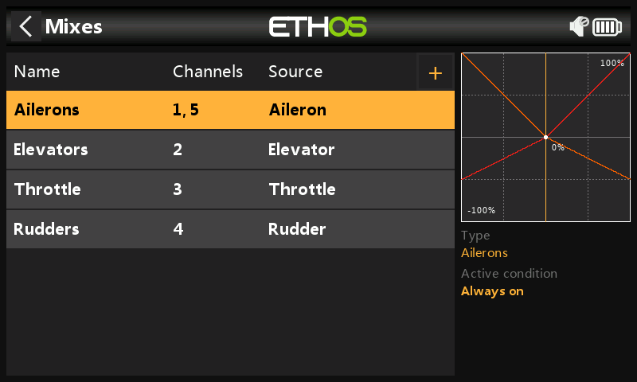

1. In 1.6.x, before the conversion, the above Mixes screen shows the Ailerons as channels 1,5.

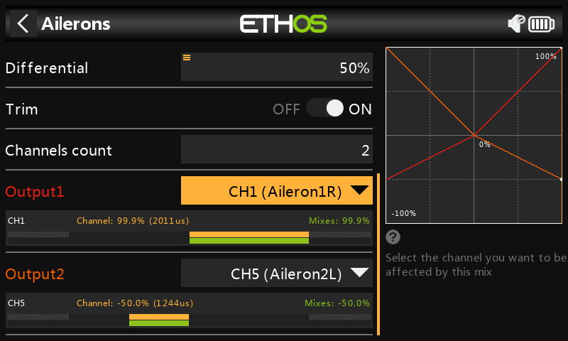

2. Before the conversion, the Aileron mix shows Output1 going to CH1 (Aileron1) or Aileron Right, and Output2 going to CH5 (Aileron2) or Aileron Left. Note, for the purpose of these examples, that CH1 has been renamed to from Aileron1 to Aileron1R and CH5 has been renamed from from Aileron2 to Aileron2L in Outputs in order to clarify the right and left channels. The Aileron stick is being held to the right.

In the model CH1 is wired to the Aileron Right servo.

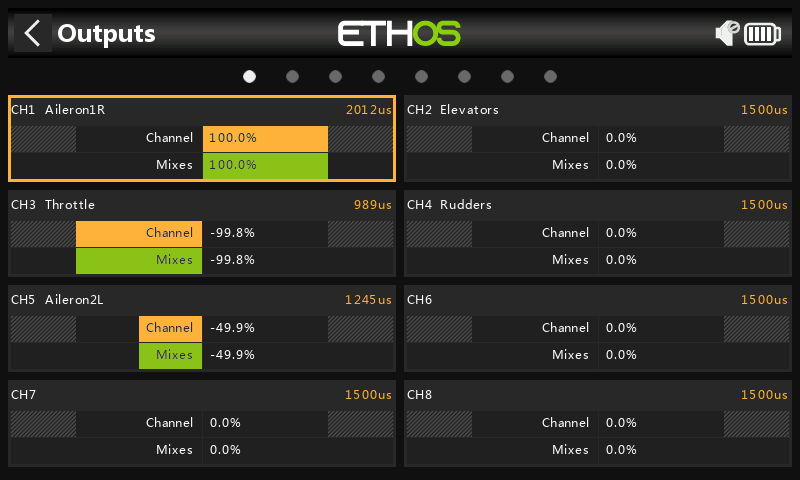

3. Before the conversion, the Output page shows CH1 going to (Aileron1R) or Aileron Right and CH5 going to (Aileron2L). The Aileron stick is being held to the right.

4. After conversion to 26.1.x, in the Mixes the Ailerons are shown as 5,1.

5. After conversion to 26.1.x, the Ailerons mix shows Output Left as mapped to CH5 (Aileron2L) or Aileron Left, and Output Right is mapped to CH1 (Aileron1R) or Aileron Right.

The Aileron stick is being held to the right. The CH1 (Aileron1R) correctly shows the mix weight of +100%, and CH5 (Aileron2L) correctly shows the weight of -50% with a positive differential value of 50%.

In the conversion Ethos rearranged the mixes to suit the new channel order, but did not make any changes to channel output assignments.

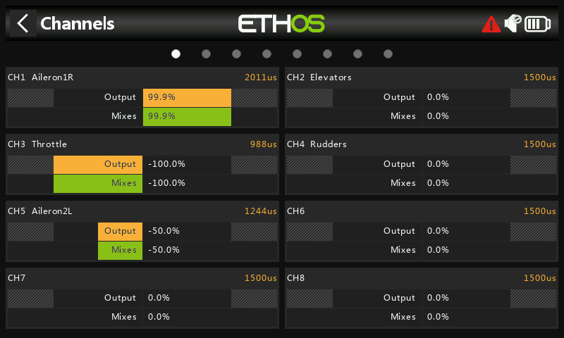

6. After the conversion, the Channels page shows CH1 going to (Aileron1R) or Aileron Right and CH5 going to (Aileron2L). This shows that the channel assignments are the same as before (see step 3 above). The Aileron stick is being held to the right.

In the model CH1 is wired to the Aileron Right servo, so the conversion has been done correctly. No wiring changes are required in the model.

## B. Models with opposite channel usage, i.e. CH1 is used as Ail Left by swapping mix output channels.

In Ethos 1.6.x channel 1 is Aileron Right, but some users elected to swap the Aileron mix output channels so that CH1 is wired to Aileron Left. This is achieved by using the ‘Swap Channels’ function in the Outputs (now Channels).

1. In 1.6.x, before the conversion, this model has had its Aileron channels swapped in Outputs so that CH1 is Ail Left and CH5 is Ail Right. The Mixes screen shows the Ailerons as channels 5,1.

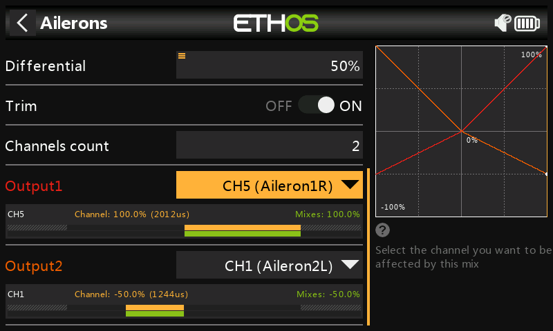

2. Before the conversion, the Aileron mix shows Output1 going to CH5 (Aileron1) or Aileron Right, and Output2 going to CH1 (Aileron2) or Aileron Left. Note that the CH5 has been renamed to from Aileron1 to Aileron1R and CH5 has been renamed from Aileron2 to Aileron2L in Outputs in order to clarify the right and left channels. The Aileron stick is being held to the right.

3. Before the conversion, the Output page shows CH1 going to (Aileron2L) or Aileron Left and CH5 going to (Aileron1R). The Aileron stick is being held to the right.

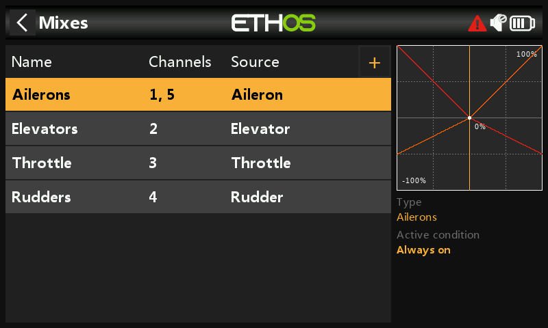

4. After conversion to 26.1.x, in the Mixes the Ailerons are shown as 1,5.

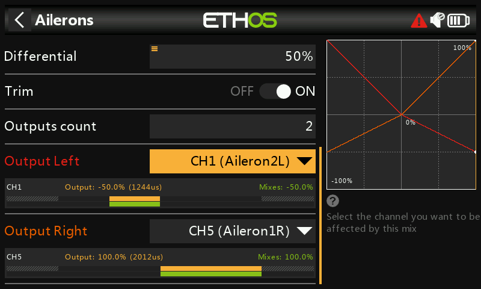

5. After the conversion to 26.1.x, the Ailerons mix shows that Output Left **still** goes to CH1 (Aileron2L), and Output Right goes to CH5 (Aileron1R). Note that the output assignments in the mix have been rearranged to ensure that the aileron differential continues to work correctly.

The CH5 (Aileron1R) correctly shows the mix weight of 100%, and CH1 (Ailerons2L) correctly shows the weight of -50% with a positive differential value of 50%.

6. After the conversion, the Channels page shows CH1 still going to (Aileron2L) or Aileron Left and CH5 still going to (Aileron1R). This shows that the channel assignments are the same as before (see step 3 above). The Aileron stick is being held to the right.

## C. Models with opposite channel usage, i.e. CH1 is used as Ail Left by inverting the mix and renaming the output channels.

In Ethos 1.6.x channel 1 is Aileron Right, but instead of swapping the mix output channels as described in section B above, some users elected to invert the mix itself by using a negative Weight value. As a result these models also needed a negative differential value.

Please note that Ethos does not look at the user naming for the conversion, so it still considers channel 1 as Aileron Right.

Please also note that the model will operate correctly after conversion to 26.1.x, but due to the naming conflicts described below it is recommended that this is addressed using the steps outlined below.

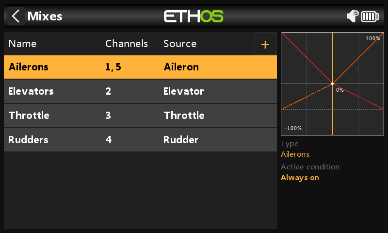

1. In 1.6.x, before the conversion, the Mixes screen shows the Ailerons as channels 1,5.

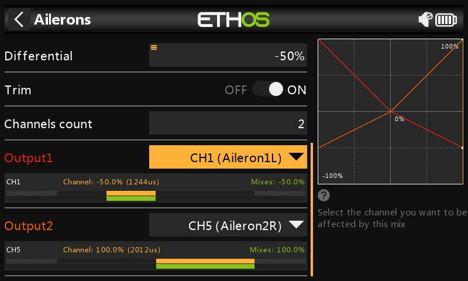

2. Before the conversion, the Aileron mix has been inverted by changing the Weight from a positive to a negative value, and likewise the Differential to a negative value. The Ailerons mix above shows Output1 going to CH1 (Aileron1L). Note that the CH1 has been renamed to Aileron1L and CH5 has been renamed Aileron2R in Outputs. The Aileron stick is being held to the right.

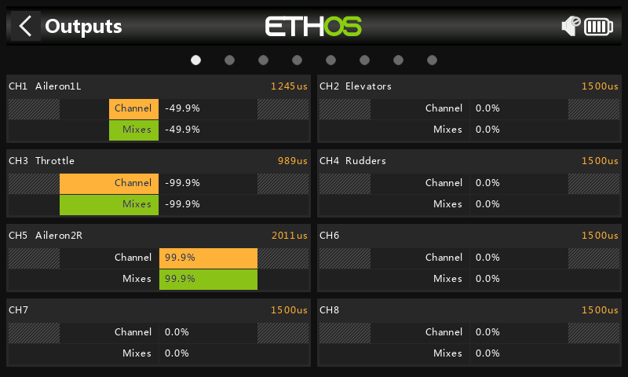

3. Before the conversion, the Output page shows CH1 going to (Aileron1L) or Aileron Left and CH5 going to (Aileron2R). The Aileron stick is being held to the right.

4. After conversion to 26.1.x, in the Mixes the Ailerons are shown as 1,5.

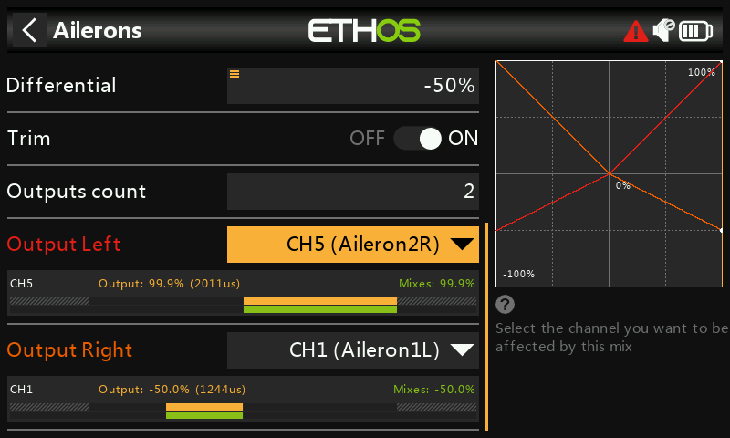

5. After conversion to 26.1.x, we see that Ethos has swapped the channel it considered as Aileron Right to the Output Right position. This brings about the naming conflict between ‘Output Right’ and CH1 (Aileron1L) as well as between ‘Output Left’ and CH5 (Aileron2R). Remember that in the model CH1 is wired to Aileron Left.

The Aileron stick is being held to the right, so we can see that ‘Output Right’ is incorrectly showing a mix value of -50% and ‘Output Left’ is incorrectly showing a mix value of +100%.

The solution is to undo the mix inversion performed in 1.6.x.

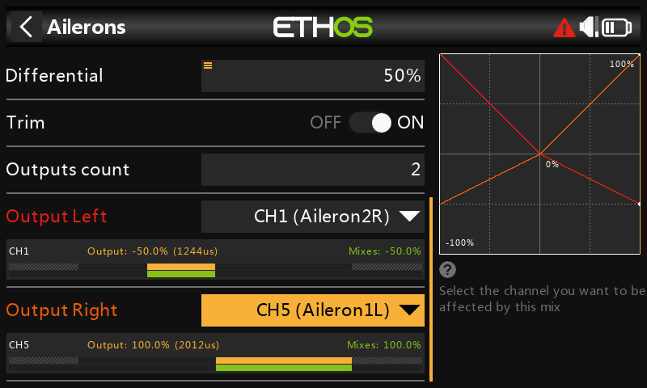

6. We have re-inverted the mix by changing both the Weight and Differential to positive values, and have used the ‘Swap channels’ function in Channels to swap CH1 and CH5.

The Aileron stick is being held to the right, so we can see that ‘Output Right’ is now correctly showing a mix value of +100% and ‘Output Left’ is now correctly showing a mix value of -50%.

All that remains is to rename the output channels to resolve the naming conflict.

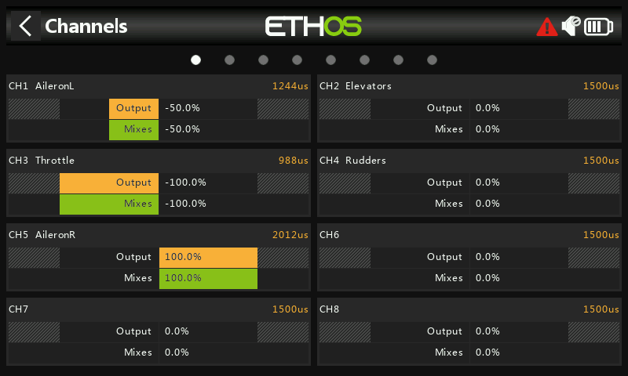

7. In the Channels screen rename CH1 to ‘AileronL’, and CH5 to ‘AileronR’.

The Aileron stick is being held to the right, so we can see that the output left and right channels are correct.

8. Back in the Aileron mix everything also now looks correct.

By making these changes you have brought the model into line with the new 26.1.x way of doing things, i.e. channels starting from the left and alternating from the outside in.

The conversion is now working correctly, with output channels starting from the left, and the naming conflicts resolved. No wiring changes are required in the model.
