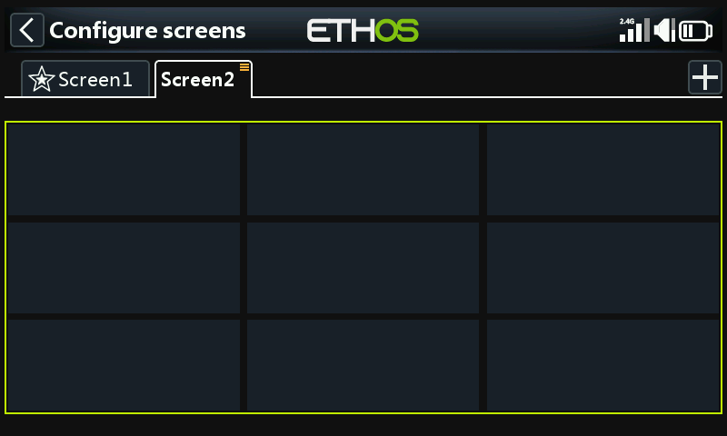

# Adding additional **screens**

Tap on the ‘+’ button on the right of the ‘Screen1’ tab to add an additional screen.

A dialog will open allowing you to select from 15 different layouts (including full screen and a choice of four home screens) having up to 9 widgets. You can also assign any screen to be your Home Screen.

In this example a 9 widget screen has been selected. Tap on any widget to configure it as detailed above.
