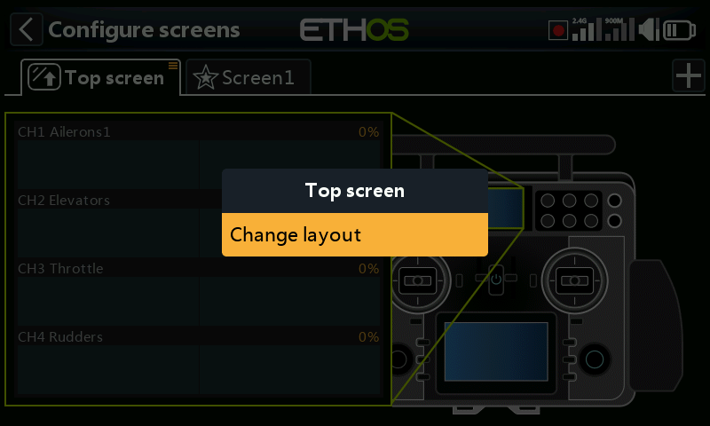
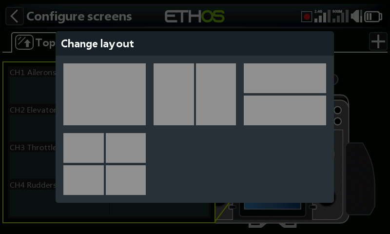

# Managing main screens

Screens may have their layout changed, be set as the main screen, and re-ordered or deleted. The screen management dialog is invoked by a long touch on the screen’s tab, or long press Enter.

## Managing the top screen (XE series only)

On the XE series the top screen may have its layout changed. The screen management dialog is invoked by a long touch on the screen’s tab, or long press Enter.

A dialog will open allowing you to select from 4 different top screen layouts.
