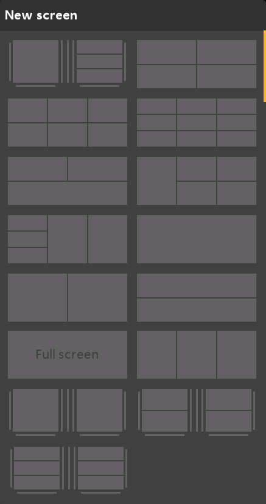

# Adding additional **screens**

Tap on the ‘+’ button next to ‘Screen1’ to add an additional screen.

You can select from 15 different layouts (including full screen and a choice of two home screens) having up to 9 widgets. These can then be configured as for screen 1.

Screens may be re-ordered or even deleted. The screen editing dialog is invoked by tapping on Screen1, or Screen2, etc.
