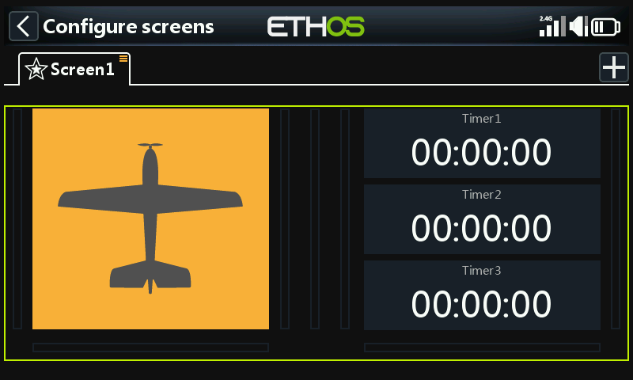
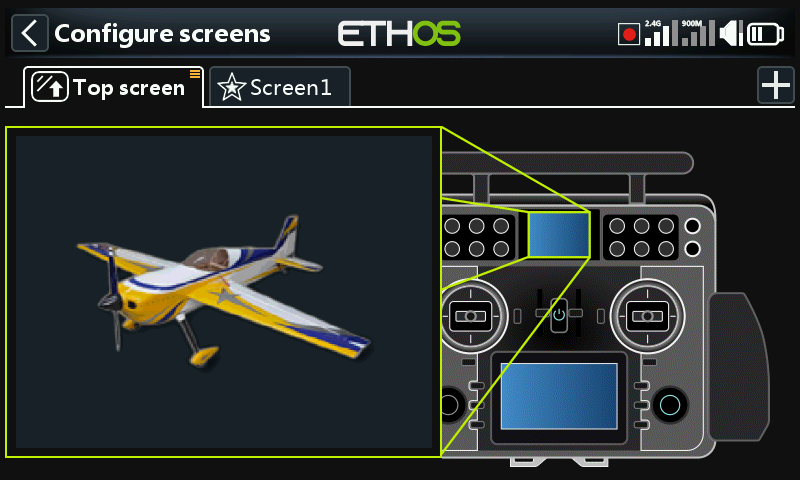
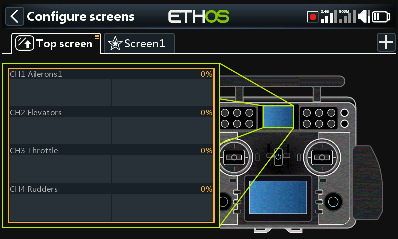

# Configuring the main **screen**

A green outline denotes that we are in configuration mode. A widget may be configured by touching it.

## Configure the model bitmap

Tap on the model bitmap widget to enter edit mode.

By default the bitmap widget on the main screen has the ‘Bitmap type’ set to ‘Model bitmap’. The bitmap cannot be selected here, it is configured in ‘Model / [Edit model](../model-setup/model-edit.md)’ or the new model wizards. The model bitmap must be located in the [/bitmaps/model](../system-setup/file-manager.md) folder.

By default the three widgets on the right display the three timers.

They can be reconfigured to display other parameters by selecting each widget and then changing the widget type when the dialog opens. See below for more details.

Custom Lua widgets will also appear in the list.

## Main screen widgets example

In the example above, on the left the Model Bitmap widget is displaying the model image that was configured in Model / Edit model / Picture. The top widget on the right is displaying the receiver battery voltage, the middle widget is displaying RSSI, while the lower widget is displaying ‘Throttle ACTIVE’. This is the Status widget available in the FrSky - ETHOS Lua Script Programming thread on rcgroups.

Tap on any widget from the main screens to bring up a dialog to go to Model / Edit to configure the model bitmap, or to configure the widget, or to go to the main [Configure Screens](index.md) function.

### Top screen widgets (XE series only)

On the XE series radios the default top screen widget is the ‘Bitmap type’ set to ‘Model bitmap’. The bitmap cannot be selected here, it is configured in ‘Model / [Edit model](../model-setup/model-edit.md)’ or the new model wizards. The model bitmap must be located in the [/bitmaps/model](../system-setup/file-manager.md) folder.

To change the widget tap on the model bitmap widget to enter edit mode. Please refer to the standard widgets below to select a different widget for display in the top screen.

In the example above the Channels widget has been selected.
