# Displays

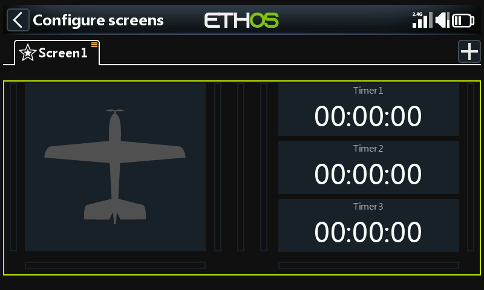

The home screen is one or more **display screens**, each built from
**widgets** you place and configure yourself. Pressing `DISP` opens the
display editor for the current screen.

Up to **eight** screens are available, each starting from one of
**fifteen** layouts (holding up to **nine** widget cells). Widgets can
show telemetry, but also any of seventeen other information categories —
model/radio status, timers, channels, and more. Configured screens are
reached by touch-swiping or `PAGE` up/down; the top and bottom bars stay
visible on every screen except a full-screen layout.

## Adding a widget

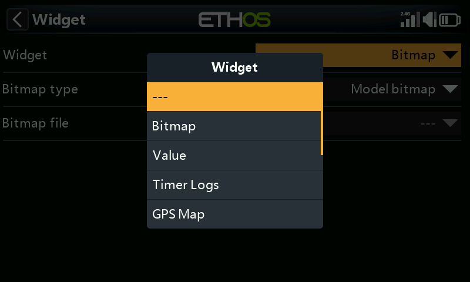

Every screen is a grid; tapping an empty cell opens the widget picker.
Widgets range from simple text and numeric readouts to gauges, charts, and
full telemetry logs. Once placed, tapping a widget again opens the same
options menu used to resize, move, or remove it:

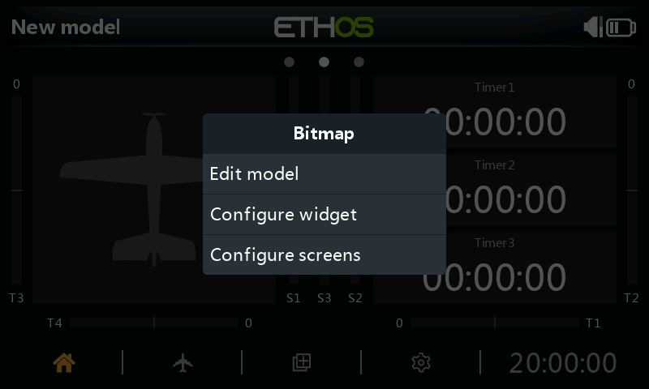

Selecting a widget's own settings opens a widget-specific configuration
form. The **source** field — what value the widget shows — uses the same
[source picker](../getting-started/user-interface-and-navigation.md#choosing-a-source)
as everywhere else in Ethos:

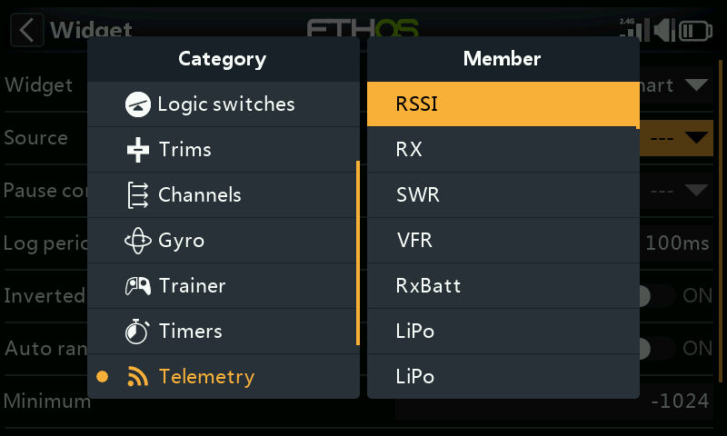

## Widget types {: #widget-types }

**Value** — a single numeric or telemetry reading, shown as text:

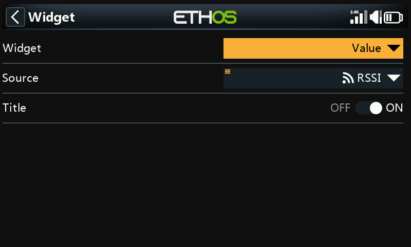

Most sources also support reducing to a live **min** or **max** — after
selecting the source, long-press it and choose Min or Max — useful for
things like worst-case RSSI over a flight:

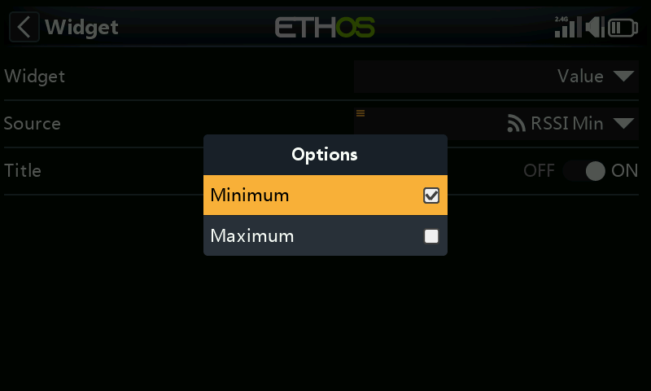
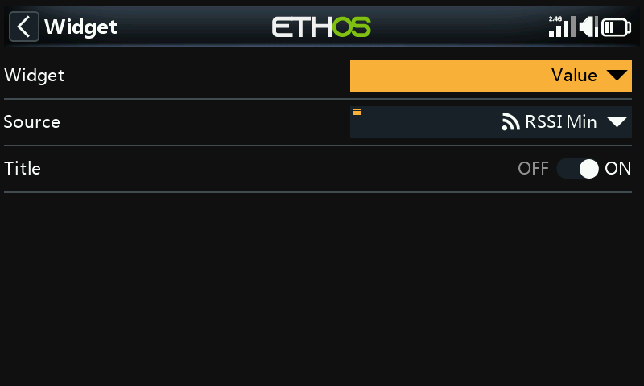

Once placed, it renders as a plain readout on the screen:

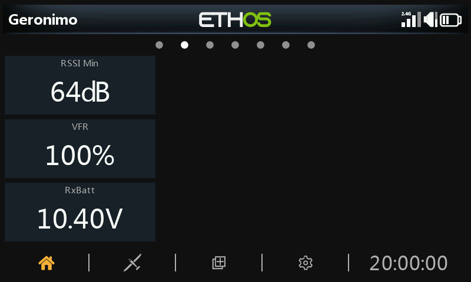

**Bitmap** — displays a static image (e.g. a model photo), or a set of
images swapped based on a source's value (e.g. a battery icon that changes
with voltage):

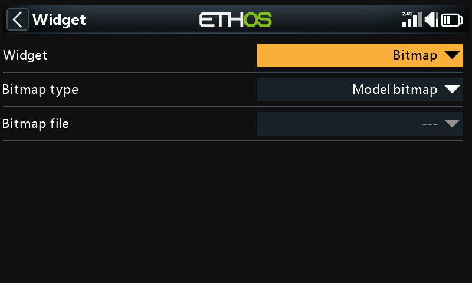
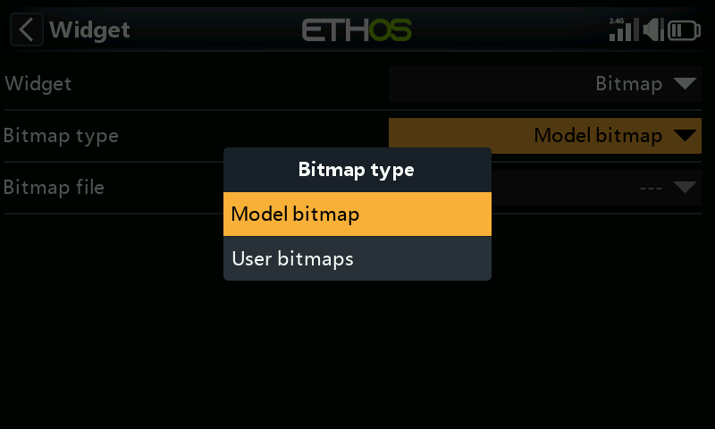

**LiPo** — a purpose-built battery gauge reading from a sensor like
FLVSS: total pack voltage, cell count, and each individual cell voltage.
Falling below the configured **Low voltage** threshold turns the display
red — in the example below, a 3.3V threshold triggers on the lowest cell:

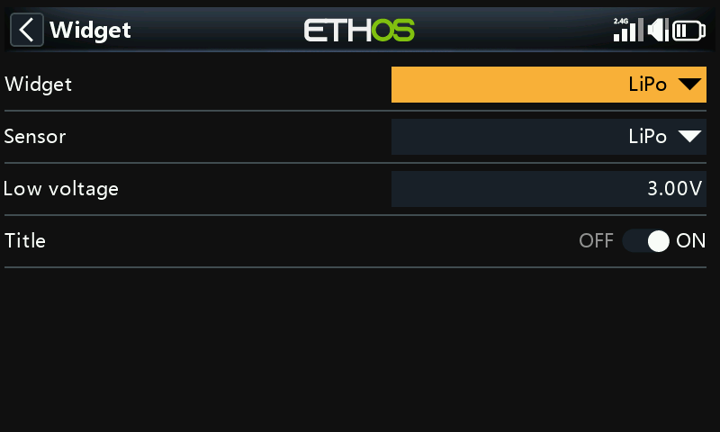
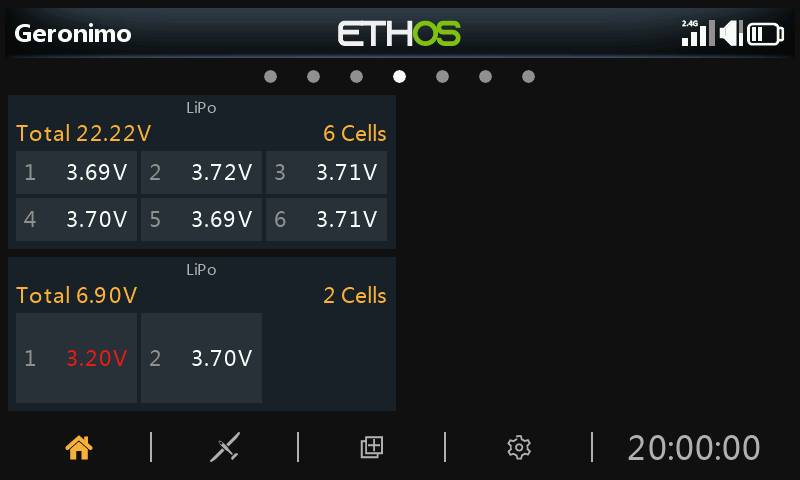

**Channels** — up to 8 output channels as a bar chart, horizontal or
vertical:

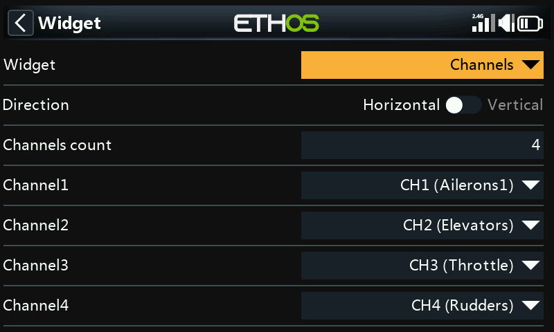

**Line Chart** — plots a source's value over time, resetting on a Flight
Reset:

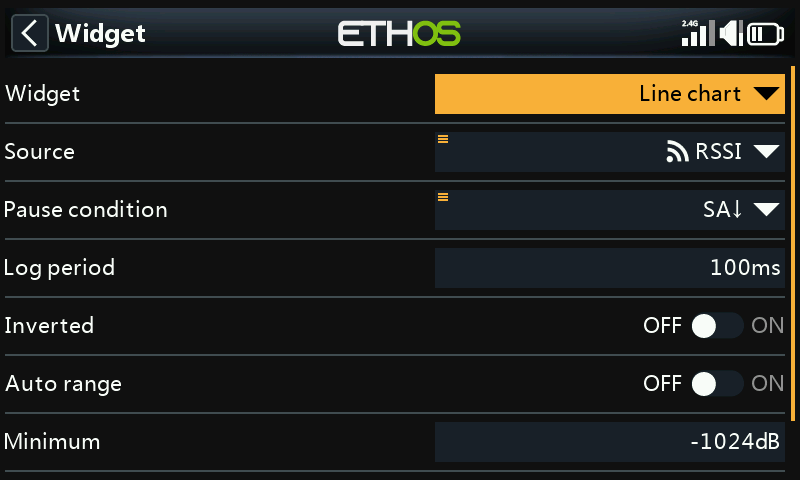
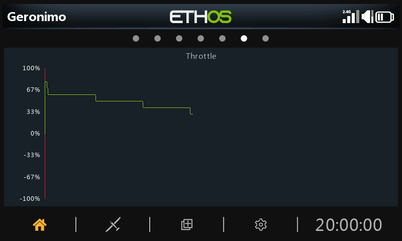

- **Source** — what's being charted.
- **Pause condition** — a source that pauses/resumes logging (or just tap
  the running widget, if no source is free for this).
- **Log period** — sampling interval; 500ms covers roughly 6 minutes
  before scrolling, 1s roughly 12 minutes.
- **Inverted** — flips the chart vertically.
- **Auto range** — scales the vertical axis to fit the data automatically;
  turned off, it uses fixed **Min**/**Max** values instead (e.g. a steady
  −100%…+100% range).

Tapping a running chart brings up **Pause/resume**, **Reset** (clear and
restart), **Configure widget**, or jump to **Configure screens**:

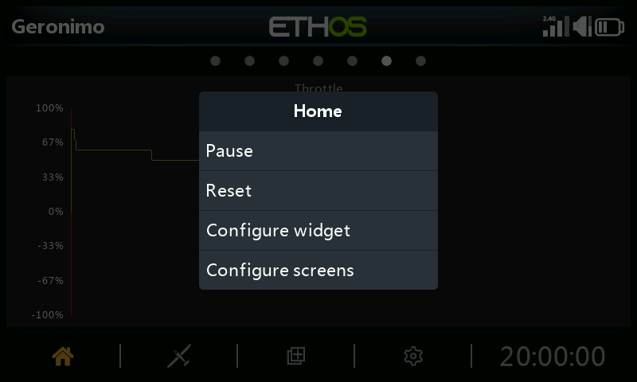

**Text** — renders a Markdown text file's contents (read from
`documents/user/` — see [File
Manager](../system-setup/file-manager.md#top-level-folders)):

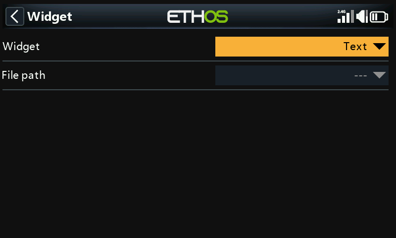
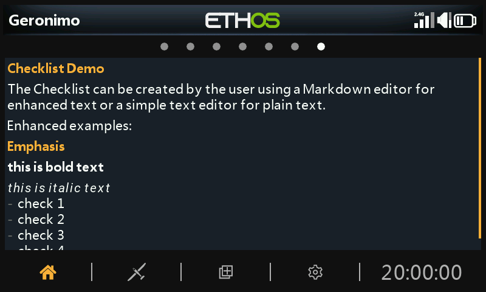

**Timer Log** — a scrollable log of a chosen timer's past values, written
each time that timer is reset (useful for tracking flight-pack usage
across a session); **Reverse** puts the newest entry at the top:

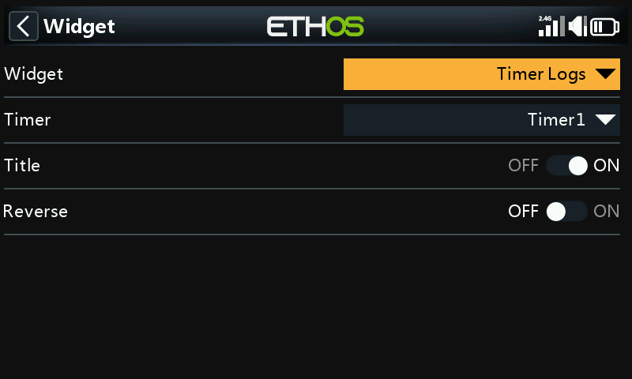
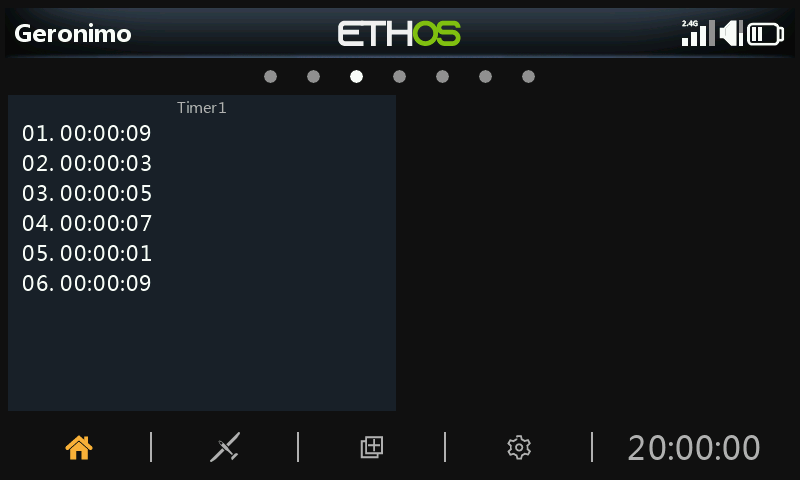

Long-press an entry (or the widget) for **Clear logs**, edit/reset the
underlying timer, or jump to widget/screen configuration:

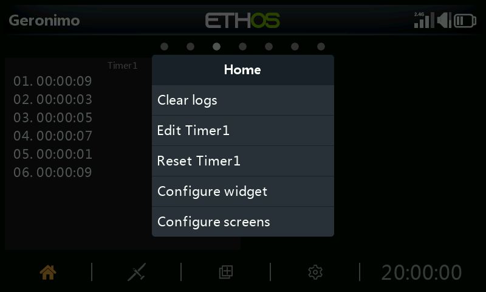

**GPS Map** — plots live GPS position as a track, for models with a GPS
sensor (see the *FrSky - ETHOS Lua Script Programming* thread on
rcgroups, post #8854, for more detail on this widget specifically):

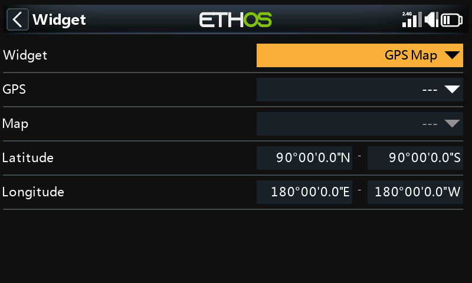

## Screen-level options

Beyond individual widgets, each screen has its own settings — layout grid
size, background, and which screens are included in the `PAGE` cycle:

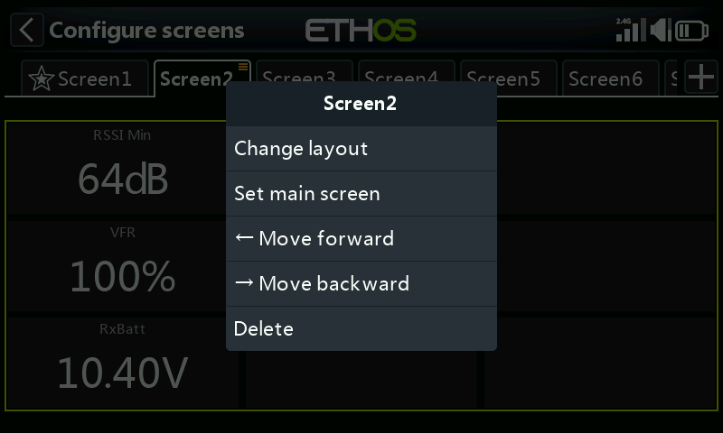

A fully configured home screen combines several widgets into one glanceable
layout:

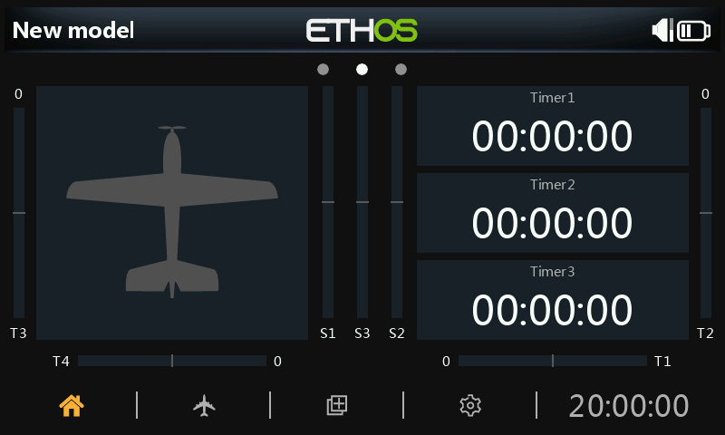

See [Additional Displays](additional-displays.md) for adding more screens
beyond the default, and [Custom Widgets](custom-widgets.md) for
Lua-scripted widgets beyond the built-in set.
