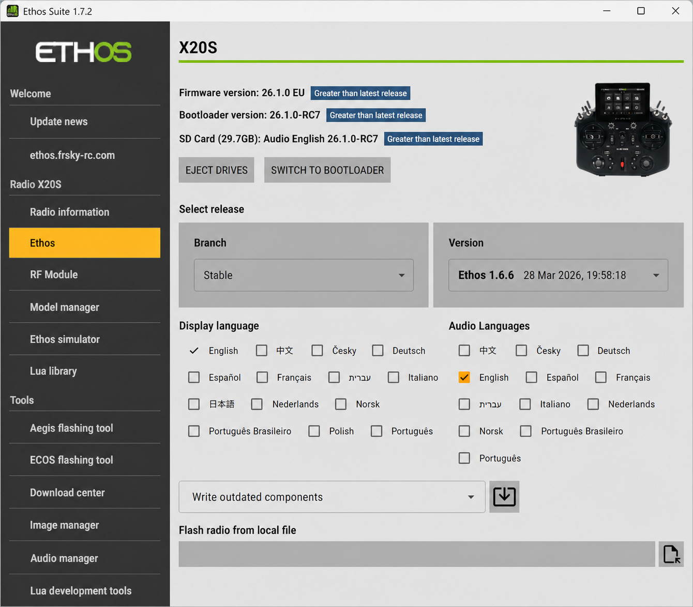

# Ethos Suite

Ethos Suite is the companion Windows/Mac application for managing a radio
running Ethos, connected over USB.

Once connected, Ethos Suite can:

1. Read the radio's type, ID, and installed versions — firmware,
   bootloader, internal RF module, flash memory files, and SD card/eMMC
   files.
2. Switch the radio between bootloader mode and running Ethos, and back.
3. Compare installed versions against current and update automatically —
   outdated components only, everything regardless, or components
   individually.
4. Back up models to disk via **Model Manager**, or restore a previous
   backup (needed since model files aren't backwards-compatible across
   firmware versions).
5. Download any firmware from the FrSky download site via the **Download
   center**, and use the radio as a proxy to flash a module, sensor,
   servo, or receiver directly.
6. Convert images and audio files to Ethos's native formats.
7. Provide **Lua development tools** — API docs, demo scripts, and a
   debug terminal.
8. Flash the radio's bootloader in DFU mode (a power-off connection),
   independent of whether the radio's own firmware still runs.
9. Repair internal storage on X18/S, TW Lite, XE, and X20 Pro/R/RS radios
   via the **Repair Tool**, if NAND can't be read or settings won't save.
10. Eject the radio's USB drives cleanly.
11. Notify at startup when a Suite update itself is available (installed
    on exit).

## Connection modes

Beyond its Tools, Suite operates in three distinct radio connection
states:

- **Radio in Bootloader mode** — the **Radio** tab checks/updates
  firmware and the flash/SD-card/eMMC files; **Model Manager** backs up
  or restores the radio.
- **Radio in Ethos mode** — Suite uses the radio as a proxy (via the
  **FRSK Flasher**/Download center tools) to flash the internal module,
  or any connected sensor/servo/receiver, directly.
- **Radio in DFU mode** — power-off connection, used by the **DFU
  Flasher** to flash the bootloader itself, e.g. when firmware corruption
  prevents the radio from powering up normally.

See [Migration](migration.md) for moving an existing radio to Ethos
Suite for the first time, and [Operation](operation.md) for the Suite
interface itself.
