# Operation

## Welcome Section

Update News

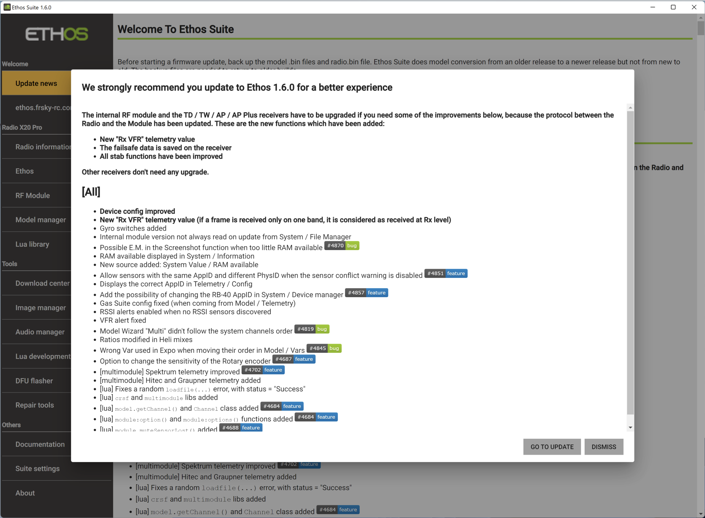

Ethos 1.6.0 offers significant improvements, but the internal RD module and TD/TW/AP/AP Plus receivers have to be upgraded to v3.0.1 to make use of the them.

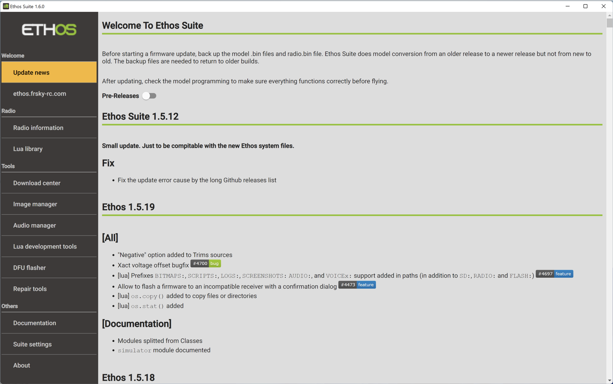

The update news tab gives recommendations for backups prior to doing updates.

It also lists details of the latest release as well as historical releases.

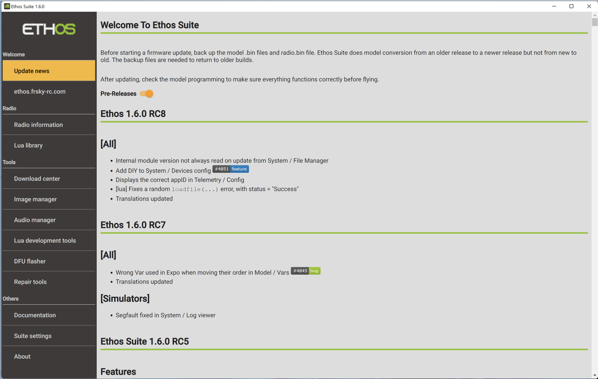

If the ‘Pre-releases’ option is enabled, details of pre-releases will also be shown if the server setting in ‘Suite settings’ has been changed from ‘FrSky Server’ to ‘GitHub’. Please refer to the [Server location](operation.md) section below.

Ethos web page

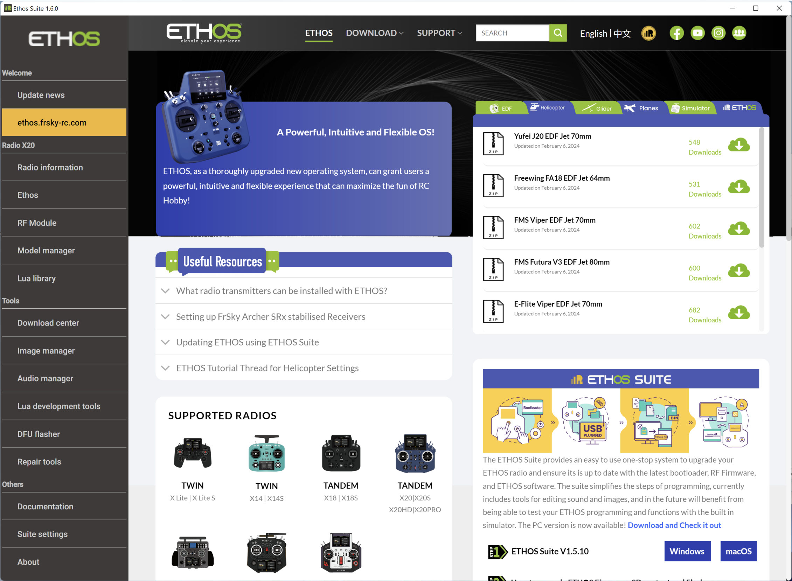

The web page at ethos.frsky-rc.com is shown, which includes information such as:

- Useful resources
- Links to model templates
- Supported radios

## ***Radio*** Section

The Radio tab is used for managing the radio.

Power the radio on in bootloader mode (hold the enter key down, keep it down and then press power ON) and connect the system to the PC with a data USB cable.

In the example below the ‘X20’ next to ‘Radio’ appears upon connection to show that an X20 is connected.

Radio Information

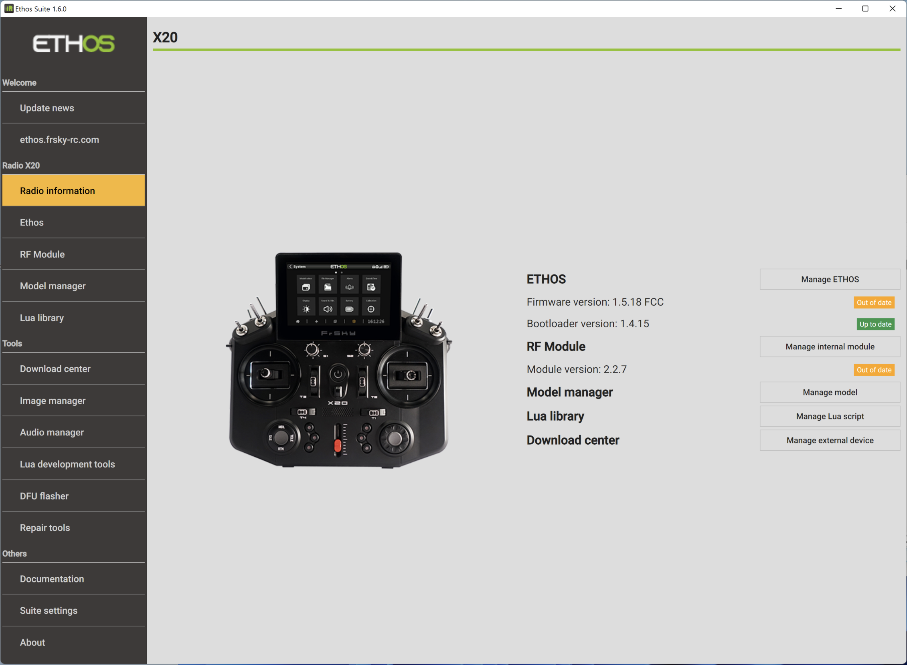

The ‘Radio information’ page displays the attached radio’s details if the radio is attached:

Ethos

The installed Ethos firmware and bootloader versions. If they are out of date, clicking on the ‘Manage Ethos’ button will take you to the Ethos tab to update them.

RF Module

The installed RF module firmware version. If the internal RF module firmware is out of date, clicking on the ‘Manage internal module’ button will take you to the ‘RF Module’ section to update it.

Model manager

The button links to the Model Manager tab for backing up the radio and restoring files to it.

Lua library

The button links to the Lua library tab that has access to FrSky’s remote lua library.

Download center

The button links to the Download center tab that can be used to download any firmware from the FrSky download site.

Ethos

Bootloader Mode

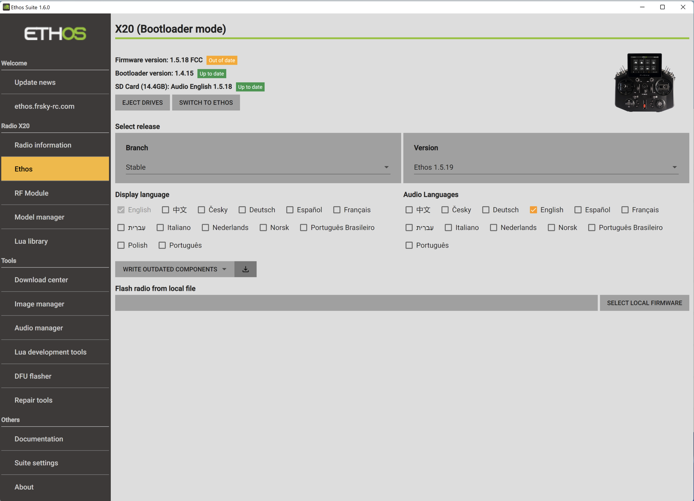

The example above shows that an X20 is connected in Bootloader Mode, which allows the radio to be updated.

The Firmware, Bootloader, SD card or eMMC (Radio Internal Storage) Audio files, and the flash memory System Bitmaps versions are shown. The Firmware version is shown as being out of date. The bootloader and audio files versions are up to date.

Please note that the system files in Flash memory are now updated together with the firmware, so they need not be managed separately any longer.

There are buttons for:

- Ejecting the radio connection drives \[Eject Drives\]
    - Switching the radio into Ethos mode for flashing modules \[Switch to Ethos\]
    - Writing outdated components, writing all components, writing the firmware and flash memory system files, writing the bootloader, or writing the SD card or eMMC audio files.
    - There is also an option for flashing the radio from a local file, with a button for selecting the local firmware file.

##### Performing Updates

##### Pre-release update options

If you wish to update to pre-release versions of firmware, the server setting in ‘Suite settings’ must be changed from ‘FrSky Server’ to ‘GitHub’. Please refer to the [Server location](operation.md) section below.

##### Updating Options

If the radio is not up to date, you:

1. Select the desired release, by first selecting the desired branch such  
as ‘Stable’ or ‘Testing version, then selecting the desired version. 
2. Then you can ‘Write outdated components’ by clicking on the dark grey update button on the right.

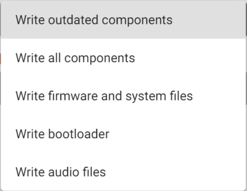

Alternatively, clicking on the ‘Write outdated components’ option itself will open a drop-down list showing the alternative options to write all components, or to only write the firmware and system files (needed to run the firmware), or the bootloader, or the audio files individually.

##### Updating the Firmware

Select the ‘Write outdated components’ or ‘Write firmware’ option, then click on the dark grey update button next to the selected option.

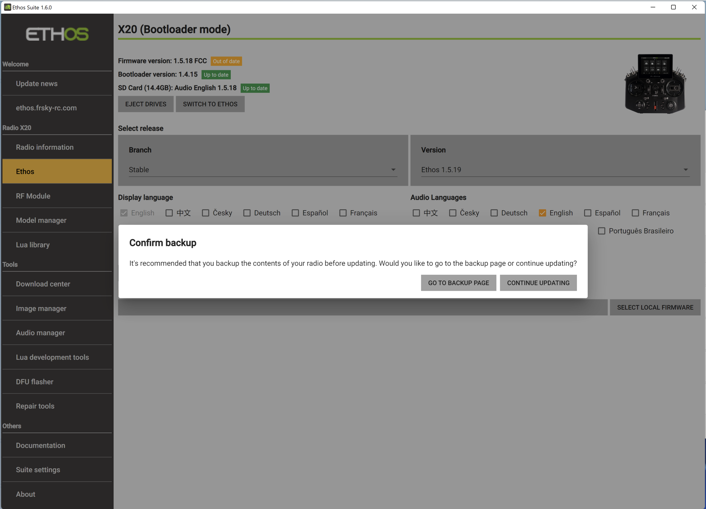

You will be prompted to perform a backup of your radio before continuing.

Click on ‘Go to backup page’ to do a backup before continuing.

##### Mandatory update of the internal RF module to v3.0.1

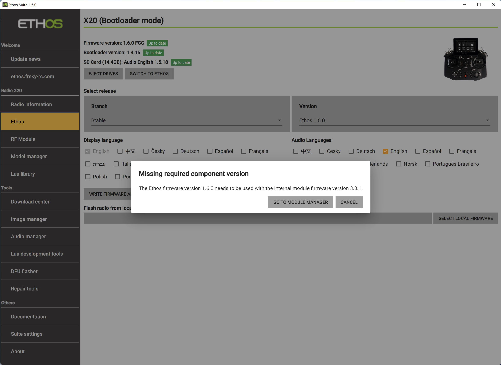

If your internal RF module is not on version 3.0.1 or later, you will need to upgrade the RF module before you will be able to continue to install 1.6.0 or later.

Click on ‘Go to Module manager’ to upgrade the internal RF module.

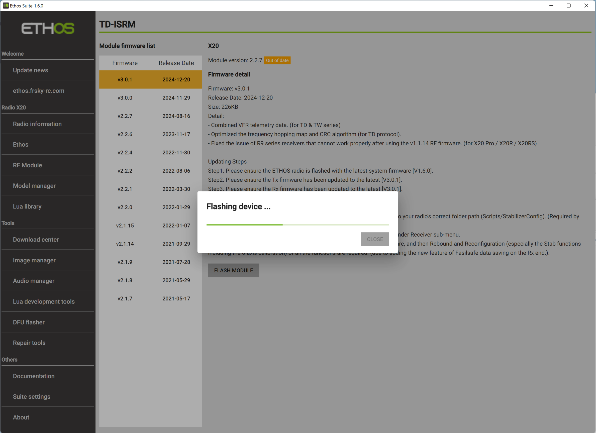

Flashing of the internal RF module will automatically commence.

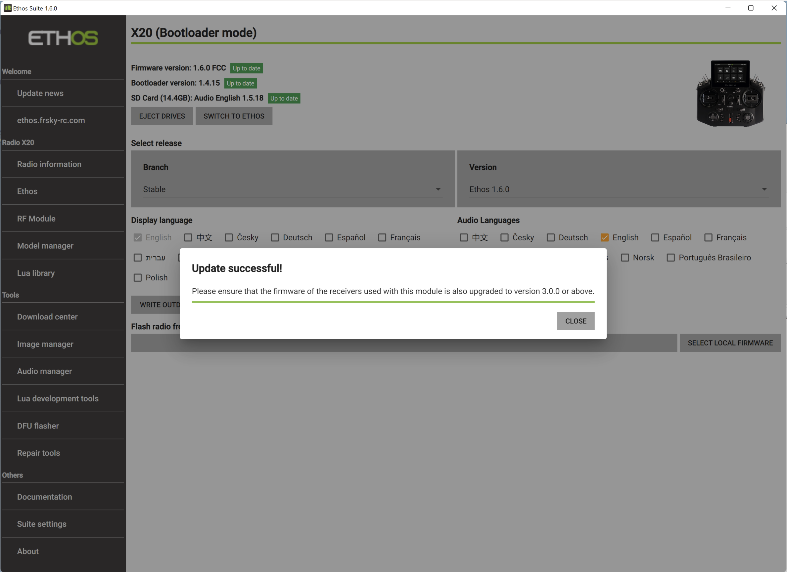

Once completed, you will be reminded to also upgrade your receivers. On at least TD, TW, AP and AP Plus receivers you will need to delete telemetry and rediscover sensors to get the updated telemetry names.

The Ethos update will automatically continue, see below.

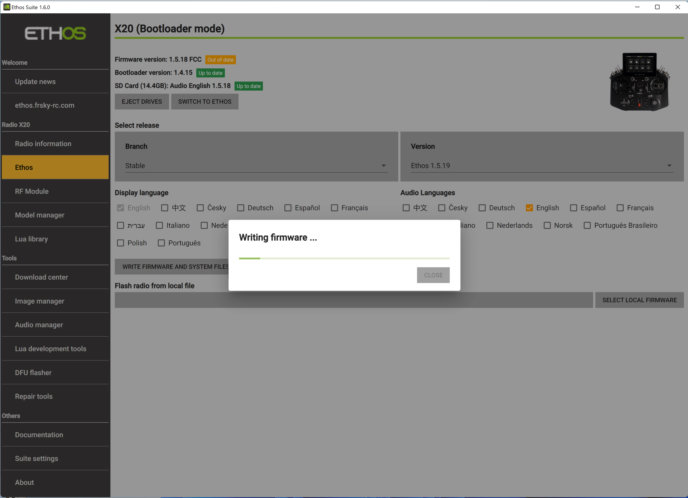

The updating firmware progress messages will be:

Switching to Bootloader

- Downloading firmware…
  - Copying firmware…
  - Unmounting drives… (on Mac computers)
  - Writing firmware… (see screenshot above; at this point the radio display will also be showing the progress)
  - Refreshing radio information
  - Update successful!

Note that with Pre Release updates the files may change without the version number being changed, a situation which Ethos Suite does not detect. You should therefore always flash the release again when it becomes a full release. In the case of the radio firmware the date can be checked on the System /  Info page.

##### Updating from older versions

If you are updating from 1.2.8 or earlier, Ethos Suite may not be able to flash the firmware automatically. In this case the following guide dialog will pop up to provide guidance with completing the flash manually:

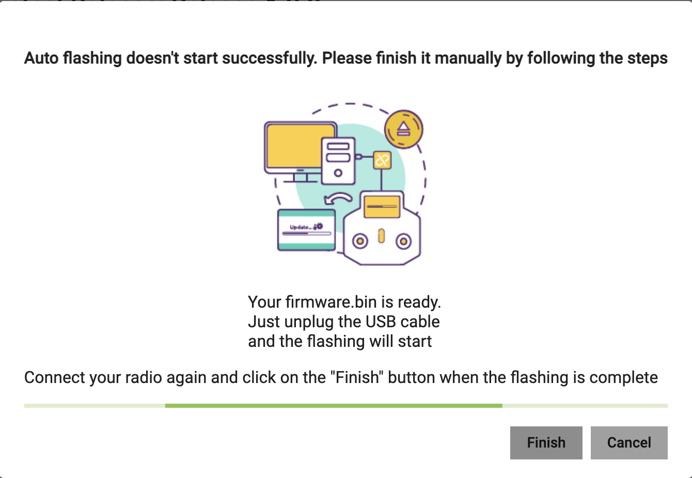

It would also be prudent to eject the drives manually before unplugging the USB cable.

##### Updating the System Bitmap files

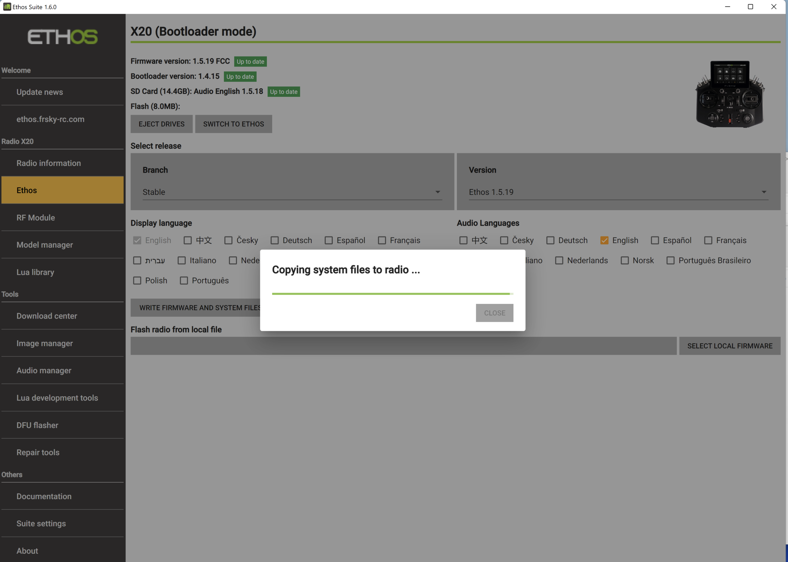

Ethos Suite will then automatically download the corresponding release of system bitmap files to the radio. These no longer have to be managed seperately.

The update system bitmap files progress messages will be:

- Downloading the system bitmap files… 
  - Copying system files to radio…
  - Update Successful!

##### Updating the Audio files

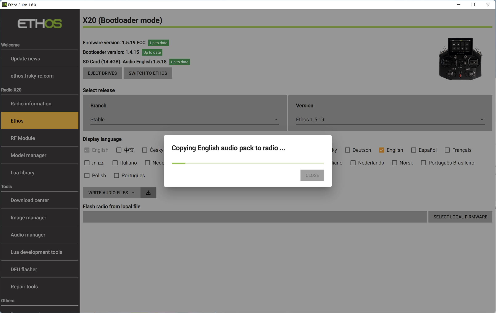

Select the ‘Write all components’ or ‘Write audio files’ option, then click on the dark grey update button next to the selected option.

The update audio progress messages will be:

- Downloading English audio pack… (or your selected language)
  - Copying English audio pack to radio…
  - Update Successful!

##### Updating the ***Bootloader***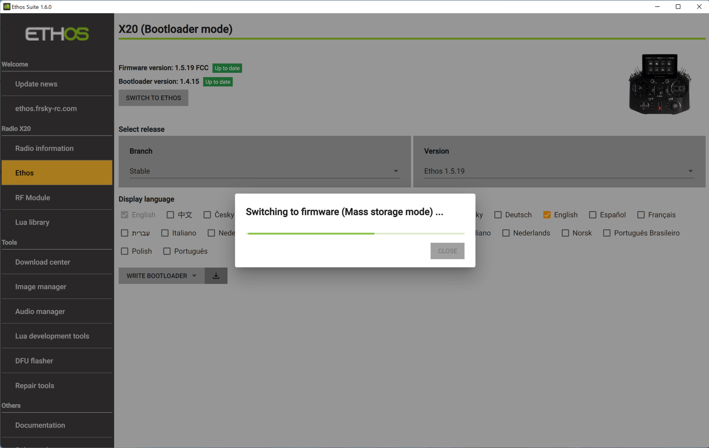

Select the ‘Write bootloader’ option, then click on the dark grey download button next to the selected option. Ethos Suite will download the latest bootloader to the radio, which will be shown in the versions list after completion. In the example above bootloader 1.4.15 was re-written.

The updating firmware progress messages will be:

- Switching to firmware…(switches to Ethos mode)
  - Waiting for disk...
  - Copying bootloader to flash…
  - Flashing bootloader… (see example screenshot above)
  - Update Successful!

##### Updating from older versions

If you are updating from 1.2.8 or earlier, Ethos Suite may not be able to flash the bootloader automatically. In this case the following guide dialog will pop up to provide guidance with completing the flash manually:

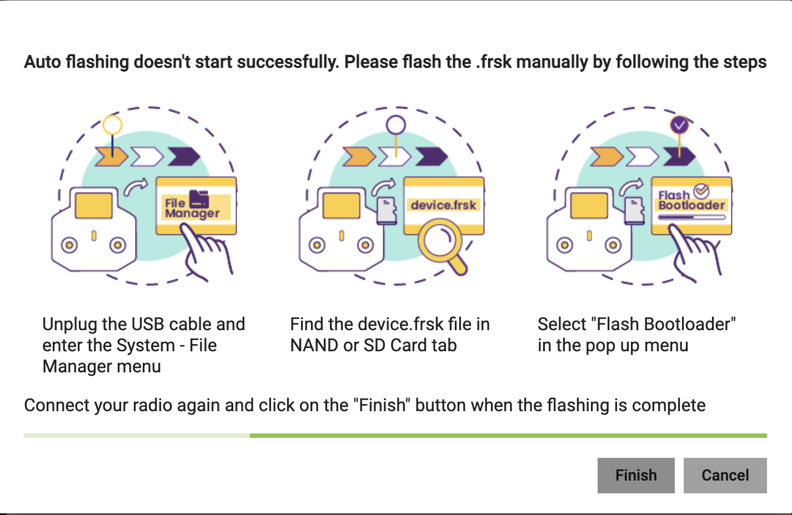

It would also be prudent to eject the drives manually before unplugging the USB cable.

RF Module Manager

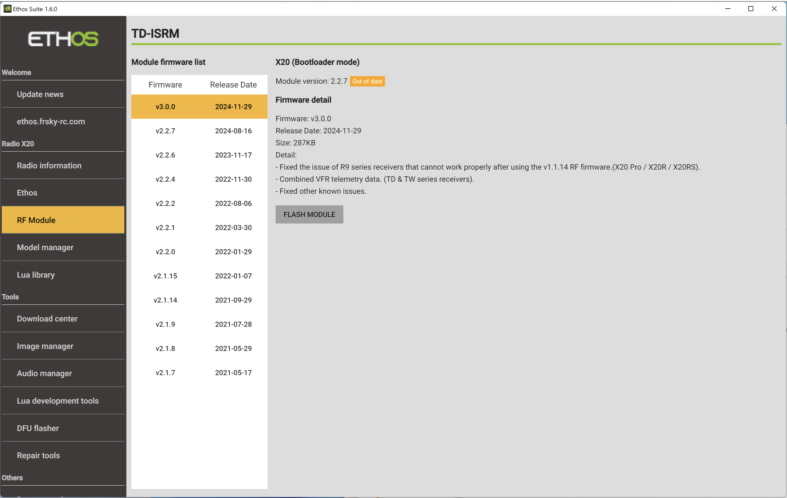

The RF module manager is used to update the RF module firmware.

Select the desired version (normally the latest) and click on ‘Flash module’ to write the firmware to the internal RF module.

The ‘FRSK has been flashed successfully’ dialog appears on completion.

##### Mandatory update of the internal RF module to v3.0.1

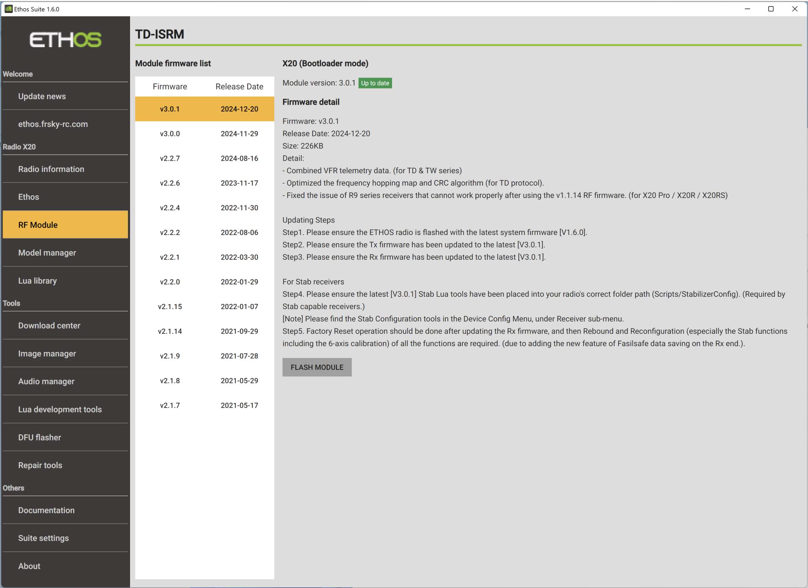

Ethos v1.6.0 or above requires a mandatory upgrade of the internal RF module to v3.0.1. This occurs automatically when clicking on ‘Go to Module manager’ during the firmware upgrade to Ethos 1.6.0, see above.

Ethos Mode

This switches the radio from running in bootloader mode to starting and running Ethos, with the option of switching back again. Ethos Mode is required so that Ethos Suite can use the radio as a proxy and use the ‘Download center’ tab to flash modules, receivers, sensors, servos, etc.

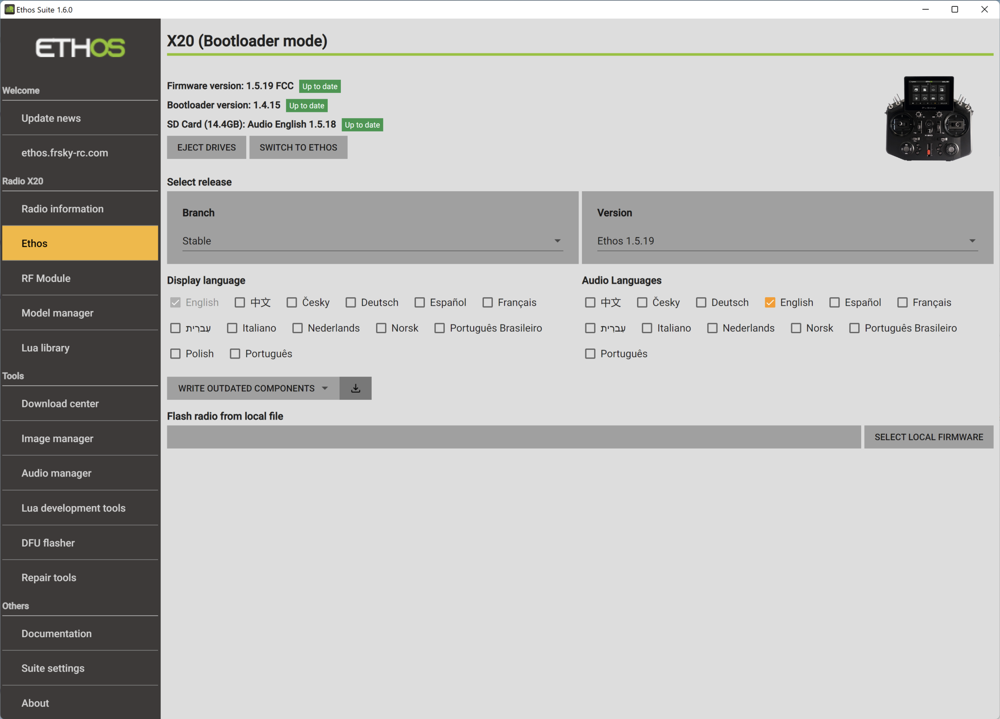

Click on the ‘Switch to Ethos’ button to switch into Ethos Mode.

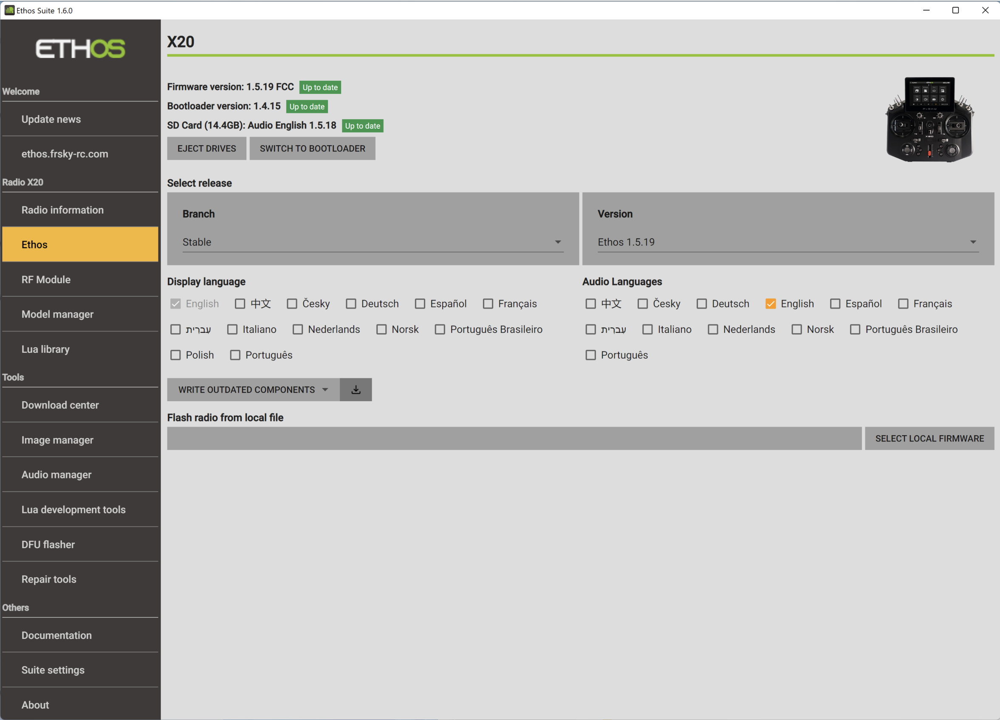

A ‘Switching to firmware’ message pops up, then the radio will reboot into Ethos mode and display a round green USB icon. The top of the page changes from ‘X20 (Bootloader Mode)’ to just ‘X20’ to indicate that Ethos Suite is now running in Ethos Mode.

Note that the ‘Switch to Ethos’ button has changed to ‘Switch to Bootloader’, which allows you to switch back into bootloader mode.

In Ethos Mode the ‘Download center’ tab in the Tools section can be used to flash any sensor, servo, or receiver. Please refer to the ‘Download center’ section below for more details.

Disconnecting the Radio

Click on the ‘Eject Drives’ button to disconnect the radio.

Model Manager

Using the Model Manager a backup of the models and settings on the radio can be saved to disk, or a previously saved backup may be restored to the radio. Models are not backwards compatible, so the older model files have to be restored from the PC when downgrading to older firmware.

Warning!

The restore does NOT restore the firmware! After restoring your models and settings, you still have to use Suite to rewrite the firmware using the version that matches your backup. Please refer to the ‘[Updating the firmware](operation.md)’ section above.

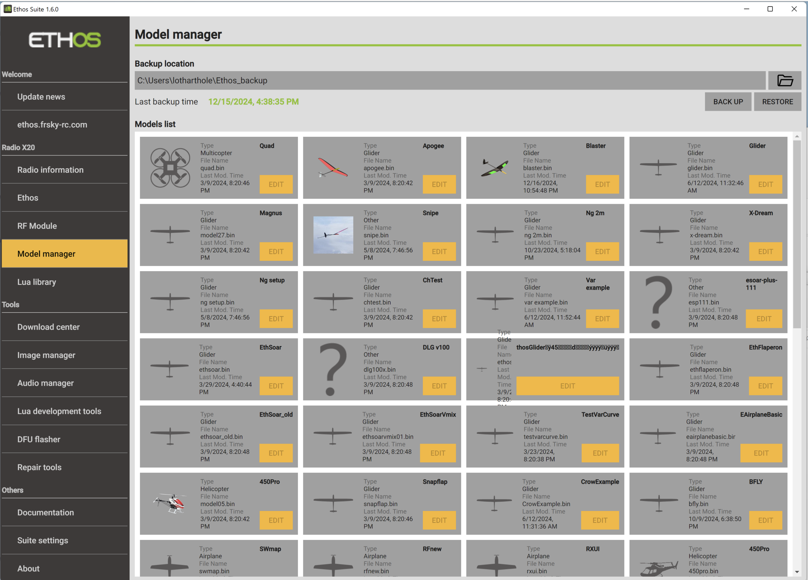

Backup Location

Click on the folder icon to browse to and select the desired backup location.  The backup path will be saved for each radio type.

The last backup date and time is displayed below the location.

Backup

Click on Backup to make a backup of the model files on the radio. The current Ethos version will be recorded when creating the backup.

Restore

Click on Restore to restore previously backed up model files to the radio. This may be needed when downgrading the radio firmware to an older version.

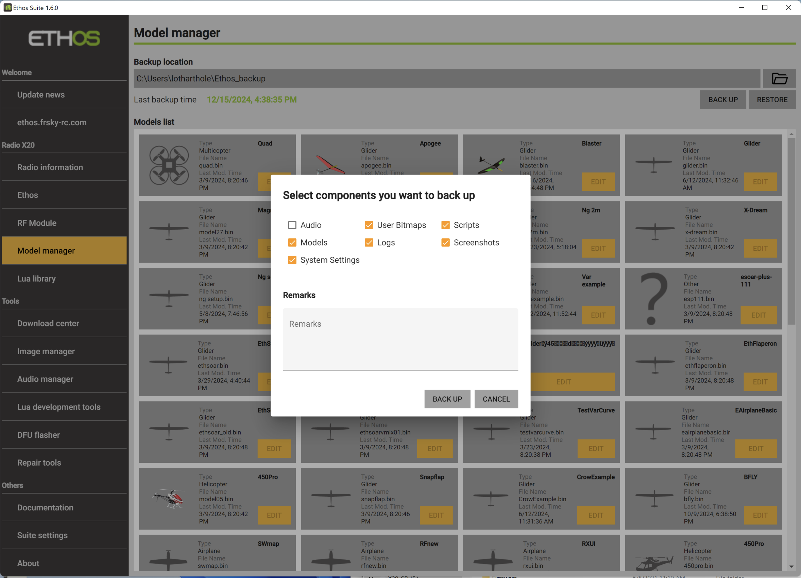

Select the components you want to back up, i.e.

- Audio (not selected by default)
- Scripts
- Screenshots

- System Bitmaps (not selected by default)

- Models (includes user defined Checklist text files stored in the Models folder)
- Language
- User Bitmaps
- Logs
- System Settings

Note that System Bitmaps are now managed by Ethos Suite together with the firmware. These no longer have to be managed seperately.

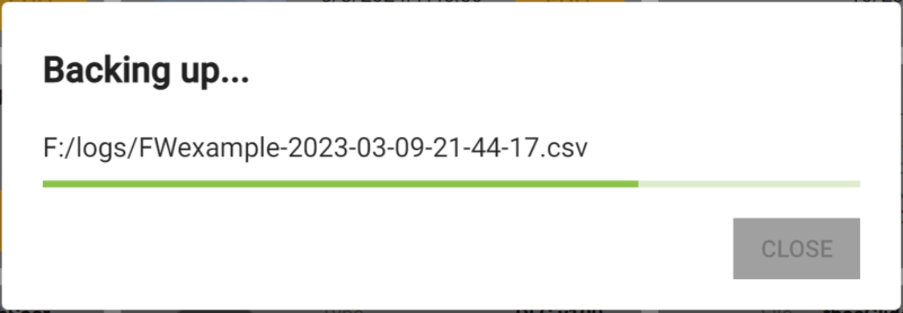

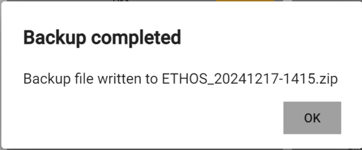

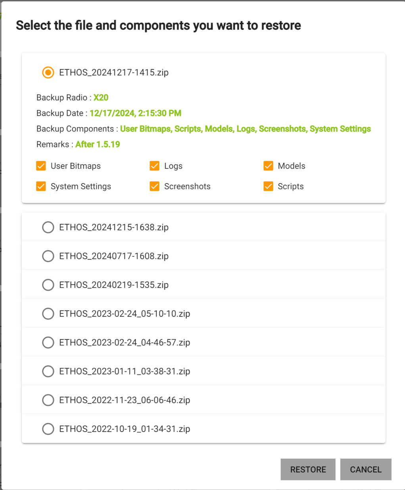

Lua library

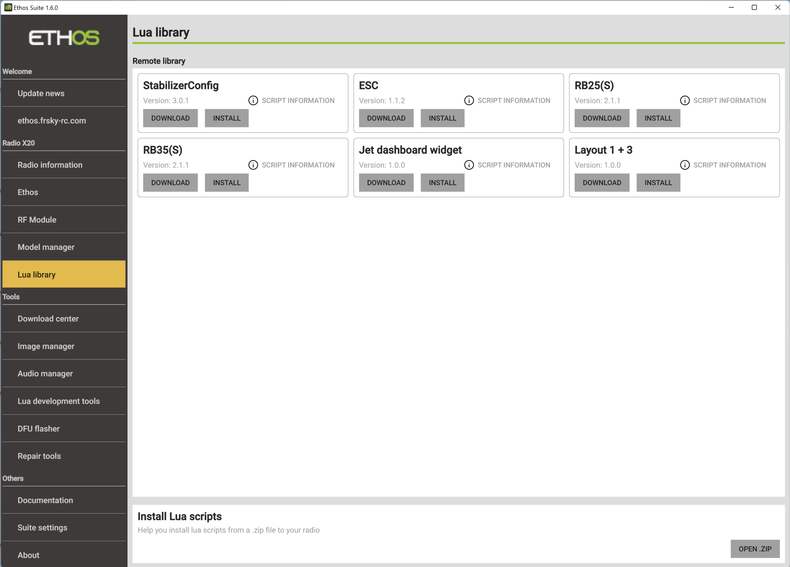

The Lua library contains download links and installation options for varios Lua tools and scripts.

It can also install Lua scripts from a local zip file to your radio.

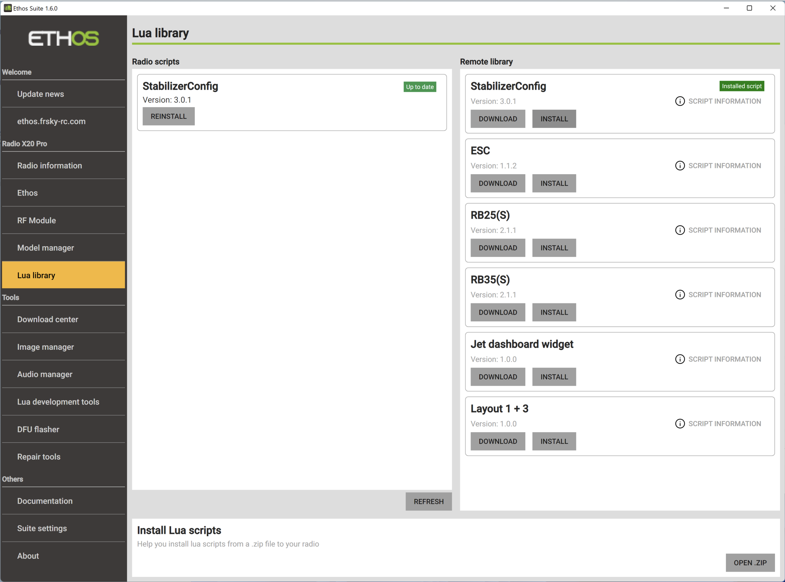

Once you have installed some scripts on the radio, the Lua library tool will show the installed scripts in the left pane, and the remote library in the right hand pane.

## Tools Section

The Tools section comprises of:

1. The ‘Download center’ tab for flashing modules, sensors, servos, or receivers directly from Ethos Suite.
2. The ‘Image manager’ for converting images to ETHOS format.
3. The ‘Audio manager’ for converting audio files to ETHOS format.
4. Lua development tools for debugging Lua scripts.
5. The ‘DFU Flasher’ tab for flashing the radio bootloader using a power off connection if the radio firmware has been corrupted for any reason.
6. The ‘Repair tool’ is for repairing the NAND flash on X18/S, TW Lite, XE, X20 Pro/R/RS radios.

Download center

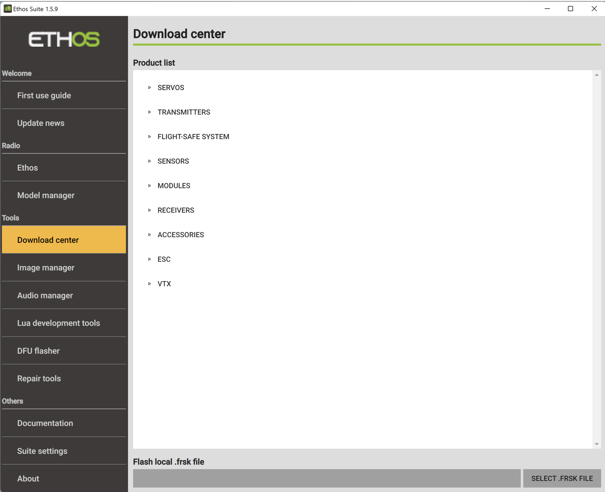

The download centre can be used to download any firmware from the FrSky download site, and to use the radio as a proxy to flash any module, sensor, servo, or receiver directly from Ethos Suite.

Flash a sensor, servo, or receiver.

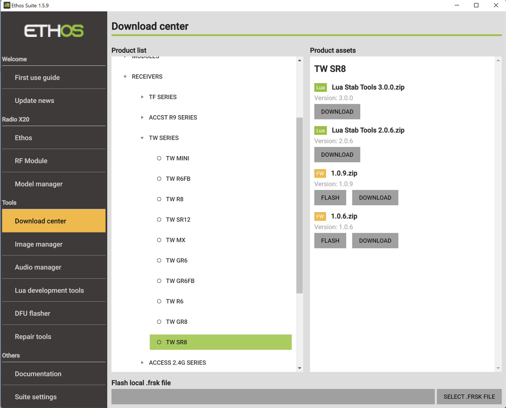

In the Product list, browse to select the device to be flashed. In the example above, a TW SR8 receiver has been selected. The Download center will then list the ‘assets’ that are available.

Clicking on a Download button will open a browse window to select the destination folder and download the file. Clicking on Flash will attempt to Flash the receiver or accessory which must be connected to the radio via an SPort upgrade connection.

In the example above, after connecting the receiver to the radio via an SPort cable connection, the ‘Flash’ button was pressed to start flashing the desired firmware version. A ‘Flashing device’ progress bar appears.

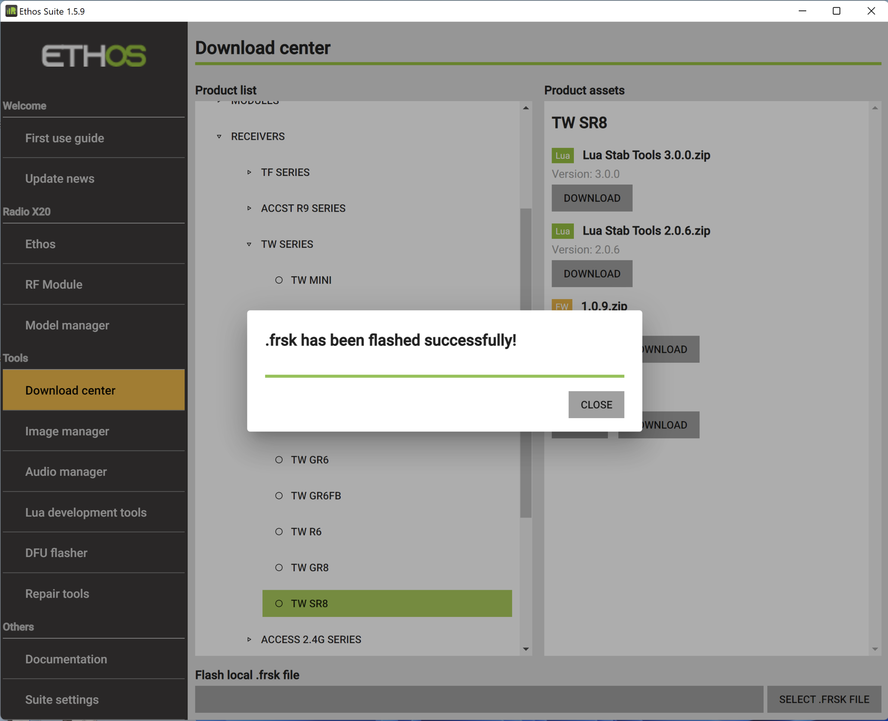

Followed by ‘.frsk has been flashed successfully!’. Click ‘Close’ to continue.

Image manager

The Image manager will convert your images to the following format:

Dimensions:	As user specified, but maintaining the aspect ratio.

Format:	32bit BMP

Colour Space:	RGB

Alpha Channel:	Will add alpha only if needed if option checked.

Note that model images for X20 are 300x280 pixels, and for X18 are 180x168.

Full screen images for X20 are 800x480 pixels, and for X18 are 480x320.

Please refer to the [bitmaps](../system-setup/file-manager.md) section in File Manager for the file naming rules.

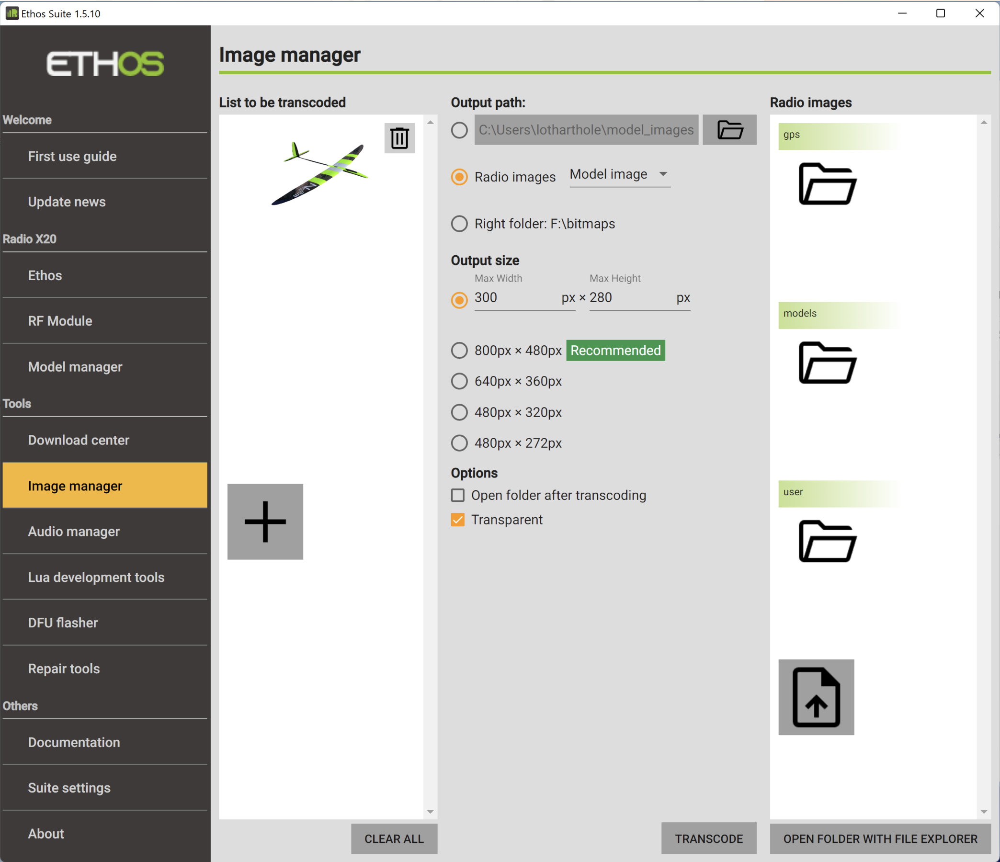

The Image manager can be used to transcode images to the correct size, and to manage the image folders on the radio.

The above example shows the bitmaps folders on the radio in the right hand window, i.e.

bitmaps/gps

bitmaps/models

bitmaps/user

Click on the folder icon to open the folder. The upload button can be used to upload images to current folder.

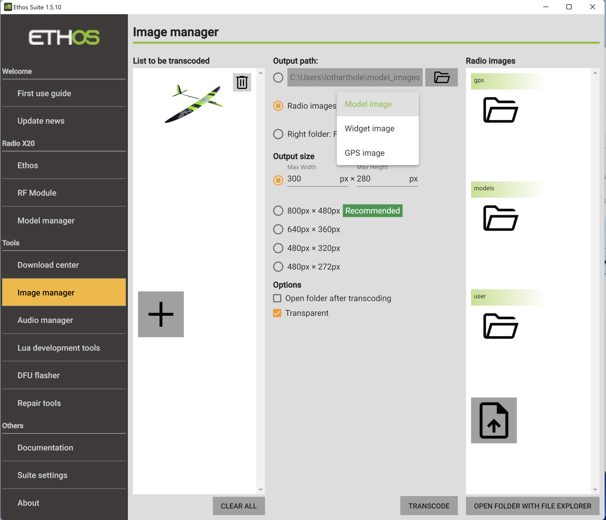

Click on the ‘+’ button in the ‘List to be transcoded’ window on the left to browse and select the image to be transcoded (converted). This process can be repeated to add images to the list. Please note that TIFF format is not supported.

Next select the Output Path from three options:

- a local PC folder which can be selected via the browse button
- directly to the radio, with a drop-down dialog to select between:  
a) a model image (will be saved in bitmaps/models),   
b) a user image  (will be saved in bitmaps/user),
- c) or a gps image  (will be saved in bitmaps/gps).
- the current folder open in the right hand ‘Radio images’ window.

Finally there are Options to:

- open the directory (folder) after transcoding, and 
- whether to add an Alpha channel for transparency. Note that it will add the Alpha channel only if not already there.

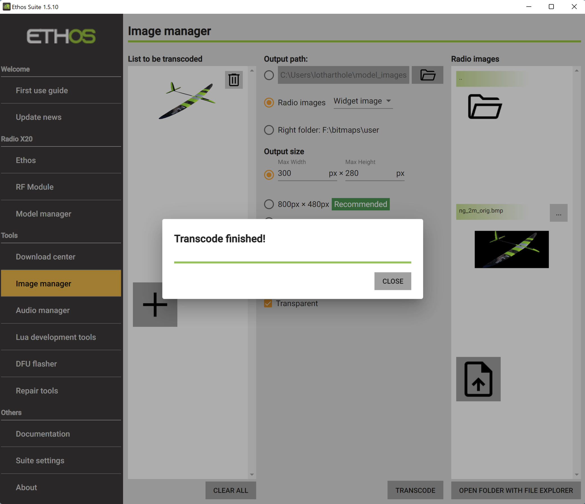

Example of a completed conversion.

Audio manager

The Audio manager will convert your audio files to the following format:

Format:	PCM linear

Sample Rate:	32kHz

Channels:	1 (mono)

Bits per sample:	16 bits, low endian (pcm\_s16le)

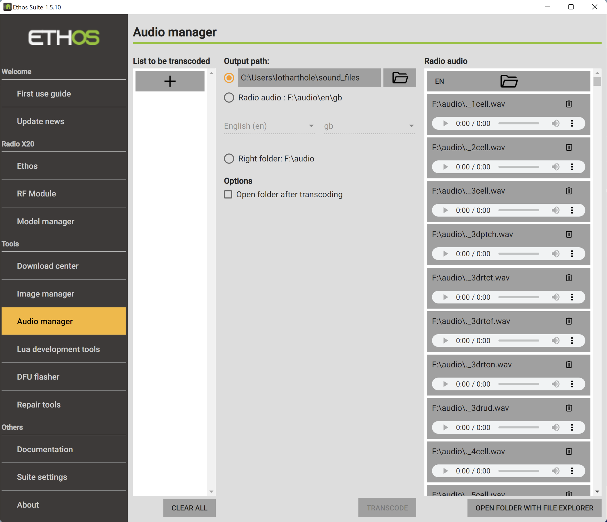

Click on the ‘+’ button in the ‘List to be transcoded’ window to browse and select the audio files to be converted. This process can be repeated to add audio files to the list.

Next select the Output Path from two options:

- a local PC folder which can be selected via the browse button
- directly to the radio, the converted file will be saved in the audio folder. You will then have to move it to the folder holding your custom audio files.

Finally there is an Option to open the directory (folder) after conversion.

Lua development tools

This section allows you to view the Ethos Lua documentation and access the Lua demo scripts, as well as providing a terminal for debugging.

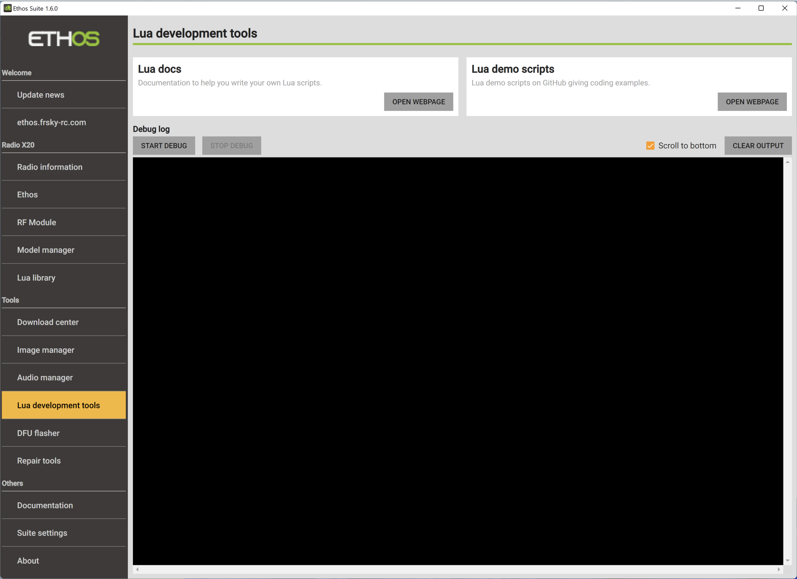

Lua Docs

Provides a link to the Ethos Lua reference guide.

Please also refer to the [FrSky - ETHOS Lua Script Programming](https://www.rcgroups.com/forums/showthread.php?4018791-FrSky-ETHOS-Lua-Script-Programming) thread on rcgroups for additional information and user scripts and widgets.

Lua Demo Scripts

This button opens the web page on the Ethos-Feedback Community on Github where links to some Lua demo scripts giving coding examples may be found.

Debug

The debug function provides a debug log window for displaying Lua debug traces sent to USB-Serial while the radio is in Serial mode.

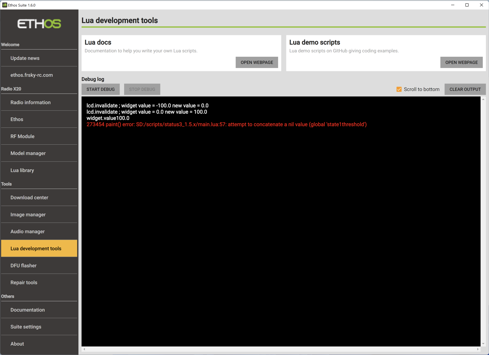

1. First you connect the transmitter to Suite as usual.

2. Switch to Ethos mode. You can now edit your lua directly on the radio, using Windows Explorer or macOS Finder and your favorite code editor.

3. Open the Lua Development Tools tab.

4. Click on ‘START DEBUG’, this will switch the transmitter into ‘debug mode’ , which is the serial mode.

5. Your transmitter reboots and re-initializes the lua scripts. All print outputs of the lua scripts which are active in your model are sent to the integrated terminal window of Suite via the serial mode.

6. If a problem or an error has been detected, the dev tool is used to switch back to Ethos mode by clicking on ‘STOP DEBUG’.

7. The lua script can be edited again

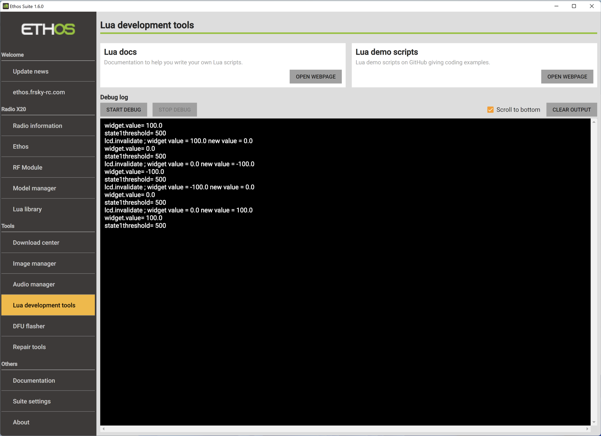

8. The error shown in the example above has been fixed, and normal running can be confirmed.

DFU Flasher

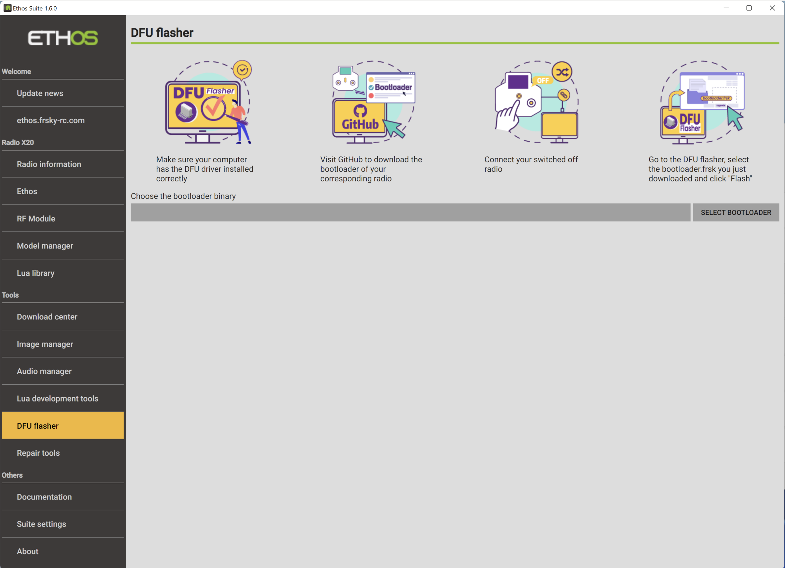

Click on the ‘DFU Flasher’ tab.

Click on the “Select Bootloader’ button to browse to your downloaded bootloader file and select it.

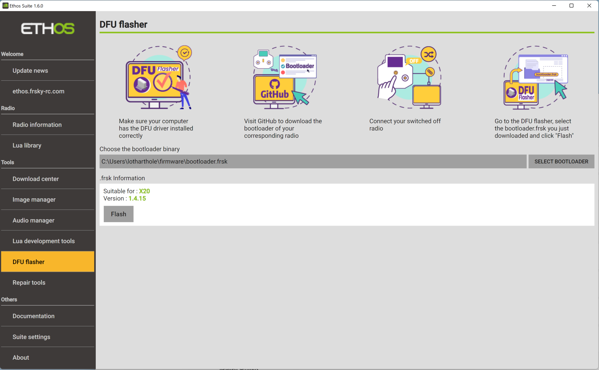

Ethos Suite will assess the selected file and report on it’s version and suitability.

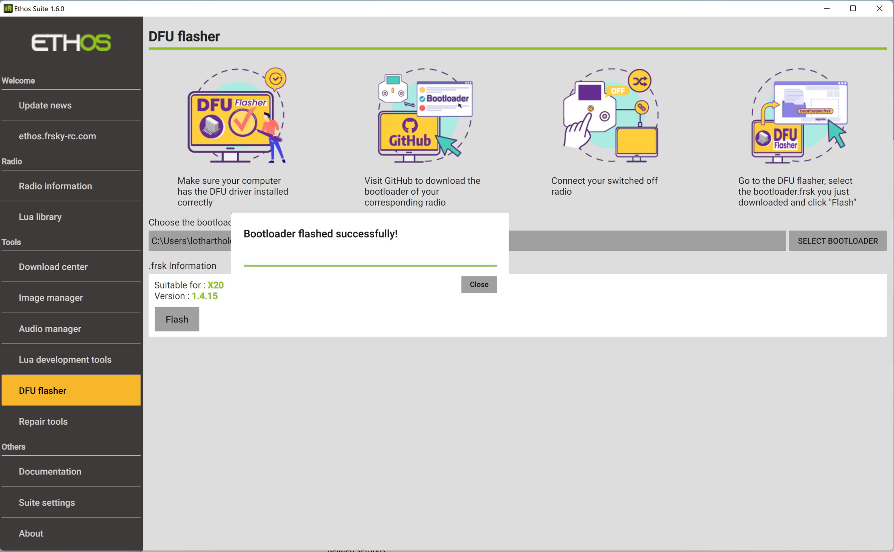

Now connect your switched off radio off to the PC with a USB lead. Click on the ‘Flash’ button to flash the selected bootloader. It will report success when completed.

In case of a ‘Radio connection is not detected!’ error, you will need to install the correct DFU driver. On most Windows 10 or later PCs the Tandem systems connect using the default Windows USB DFU driver and are ready to flash the bootloader. However, Windows updates often replace drivers with generic drivers that may not work with the radio.

Check Device Manager to see if your DFU device (i.e. your radio) is recognized and working. In this situation programs like the Impulse Driver Fixer can be used to correct the driver. It can be downloaded from [https://impulserc.com/pages/downloads](https://impulserc.com/pages/downloads). For more information please see also this [Ethos Suite Update](https://www.rcgroups.com/forums/showpost.php?p=48919119&postcount=15884) post.

Note for Horus X10 users: Windows 10 will not by default install the STM32bootloader USB device driver needed for Horus systems. It will need to be installed with a program like the Impulse Driver Fixer or Zadig.

Repair Tool

The Repair Tool is for the X18/S, TW Lite, XE, X20 Pro/R/RS radios. If your radio cannot read from NAND or the settings cannot be saved, this tool will reformat the internal storage.

## Others Section

Documentation

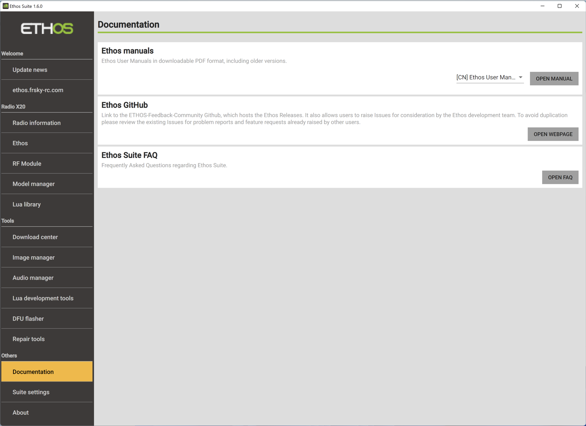

The documentation section has links to the Ethos-Feedback Community on Github, the Ethos Manuals, and an Ethos Suite FAQ.

Ethos Manuals

The current Ethos manual may be downloaded here.

Ethos Github

The button will open the Ethos-Feedback Community web page on Github, where you can access Ethos releases or raise an issue if you believe you have found a bug. However, to avoid duplication, please do a search through the existing issues before posting.

FAQ (Frequently Asked Questions)

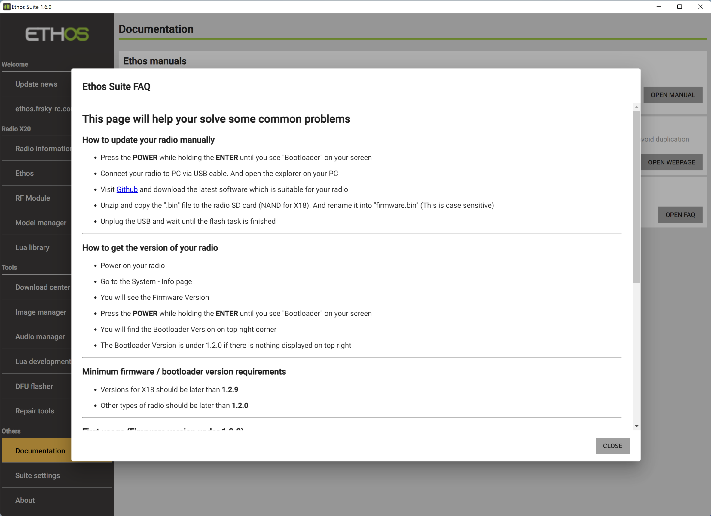

The FAQ section provides answers to commonly asked questions.

Suite Settings

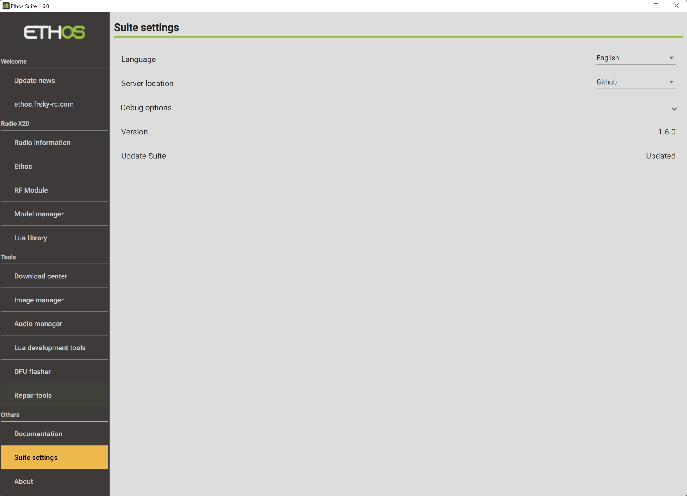

Language

The Suite language can be selected between Czech, German, English, Spanish, French, Hebrew, Italian, Dutch, Norwegian, Portuguese, Slovenian and Chinese.

Server location

The server location can be either Github or the FrSky server. For Suite v1.6.0 the Server was reset to the FrSky server (just this time). Any changes will be saved after modification.

Debug options

- A popup dialog when a fatal error occurs may be enabled or disabled.
- The Suite Debug mode will log all the traces (not only the crashes) in Suite.
- Open the logs folder to review the crash logs.

Version

The current Suite version is displayed.

Update Suite

It will indicated ‘Updated’ if current, or else click on the button to check for Suite updates.

About

An acknowledgment page for all the reused components.

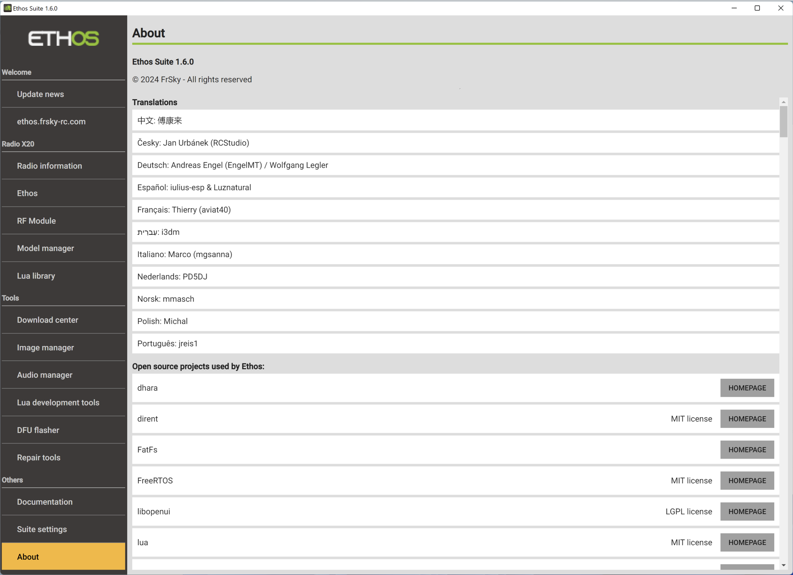
