# Operation

## Devices Section

FrSky Suite supports three FrSky device types, i.e. Ethos radios, ECOS radios and Aegis flight controllers. Please refer to their respective sections below for details.

### Ethos

FrSky Suite opens in the Ethos devices section by default, with the view shown above if no Ethos radio has been detected at startup.

You can connect the radio in bootloader mode or while powered up in ‘FrSky Suite’ mode. Please refer to the [USB Connection To PC modes](../usb-connection-to-pc-modes/index.md) section for more information.

Once an Ethos radio has been detected, its details are listed as shown in the example above. The ‘Radio connection not detected’ status message has been replaced by ‘Connected to X20 Pro’ to show that an X20 Pro is connected.

#### Radio information

##### Connected

The current firmware and bootloader versions are listed, with red ‘Out of date’ or green ‘Up to date’ tags.

Below that a message confirms compatibility of the firmware and bootloader. If for example you updated only the firmware, you might receive a message stating that the firmware requires a newer bootloader version.

The status of the RF module is shown next to the ‘Radio information’ panel, please refer to the RF module section below.

##### Backup and recovery

Before performing updates, it is prudent to click on the ‘[Backup and recovery](../frsky-suite/operation.md)’ option to make backups of the current state of your radio.

##### Eject Drives

After checking the radio’s status information, it may be disconnected by clicking on the ‘Eject drives’ button.

##### Manage Ethos

Click on the ‘Manage Ethos’ button to open the update page.

The example above shows that an X20 Pro is connected in Bootloader mode. If desired, click on the ‘Switch to Ethos’ button to change the mode, for example to flash a receiver or module. Generally you do not need to worry about the mode you are in, because Suite will automatically switch between modes when required.

The Firmware, Bootloader and the Audio files (either SD card or Radio Internal Storage) versions are shown. The Firmware version is shown as being out of date. The bootloader and audio files versions are up to date.

Please note that the system files in Flash memory are now updated together with the firmware, so they need not be managed separately any longer.

##### Performing updates

##### Pre-release update options

If you wish to update to pre-release versions of firmware, the server setting in ‘Suite settings’ must be changed from ‘FrSky Server’ to ‘GitHub’. Please refer to the [Server location](../frsky-suite/operation.md) section below.

##### Selecting the update options

If the radio is not up to date, you:

1. Select the desired release, by first selecting the desired branch such as ‘Stable’ or ‘Testing version’, then selecting the desired version as well as the display and audio languages.
2. Then you can ‘Write all components’ by clicking on the ‘Write all components’ button.
3. Alternatively, clicking on the down-arrow button on the right will open a drop-down list showing the alternative options to write outdated components, or to only write the firmware and system files (needed to run the firmware), or the bootloader, or the audio files individually.	

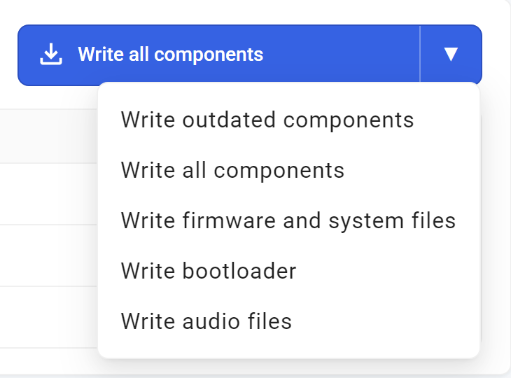

##### Performing the updates

Once you have selected the desired scope of the update, click on the selected option to proceed. In the example above we have selected the ‘Write firmware and system files’ option.

After clicking on the ‘Write firmware and system files’ option, you will be prompted do first go to the backup page and do a full backup before proceeding. Please refer to the [Backup & recovery](../frsky-suite/operation.md) section.

This is especially important because after the update your model files will be updated to the new version as soon as you load them. This is a one-way process, so once upgraded the models will no longer be able to be loaded if you decide to downgrade your radio to an earlier version. After downgrading your firmware you will need to recover your models etc. from your backups.

Having done a backup, return to the ‘Manage Ethos’ page and click on the ‘Write firmware and system files’ option, then select the ‘Continue updating’ option.

If your internal RF module is not on version 3.0.1 or later, you will need to upgrade the RF module before you will be able to continue to install 1.6.0 or later. Click on ‘Manage internal module’ on the home page to upgrade the internal RF module, then return to this page to continue.

A progress bar will be displayed in the page as well as on the radio.

On completion, an ‘Update successful’ message will be displayed. The firmware version is now shown as up to date.

In a similar way, the alternative options to write outdated components, or the bootloader, or the audio files individually may be executed.

It is always prudent to eject the drives manually with the ‘Eject drives’ button before unplugging the USB cable.

##### Flash radio from local file

##### Flash local .frsk file

##### Eject drives

Click on the ‘Eject Drives’ button to disconnect the radio.

#### RF Module

The RF module manager is used to update the RF module firmware.

##### Manage internal module

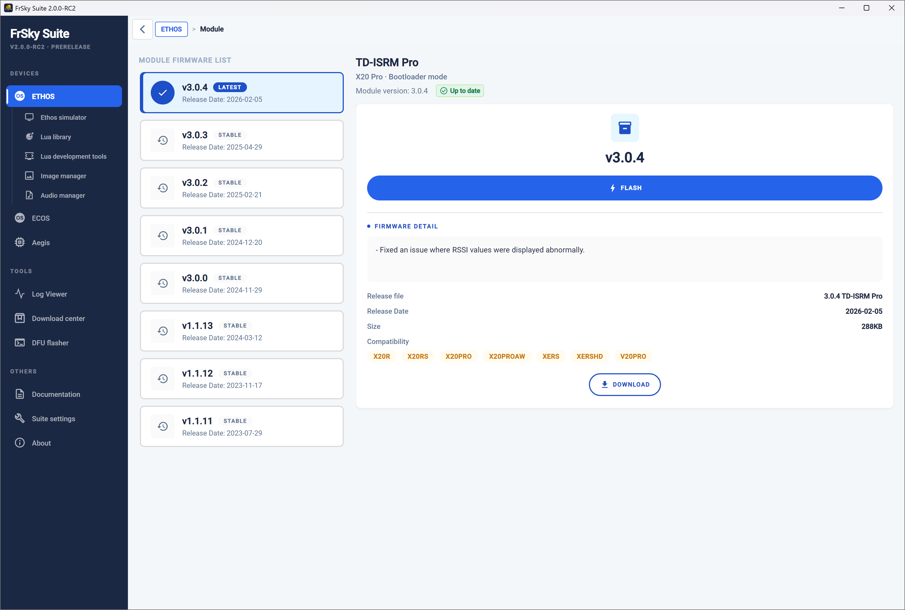

Select the desired version (normally the latest). The firmware details for the selected version are displayed in the right hand panel.

Click on ‘Flash’ to write the firmware to the internal RF module.

The ‘FRSK has been flashed successfully’ dialog appears on completion.

#### Backup & recovery

Using the Backup & recovery’ function a backup of the models and settings on the radio can be saved to disk, or a previously saved backup may be restored to the radio. Models are not backwards compatible, so the older model files have to be restored from the PC when downgrading to older firmware.

##### Warning!

The recovery does NOT restore the firmware! After recovering your models and settings, you still have to use Suite to rewrite the firmware using the version that matches your backup. Please refer to the ‘[Updating the firmware](#Updating the Firmware)’ section above.

##### Backup Location

Click on the folder icon to browse to and select the desired backup location.  The backup path will be saved for each radio type.

The last backup date and time is displayed below the location.

##### Start backup

Select the models and ‘Internal storage’ areas to be backed up, and add some relevant remarks.

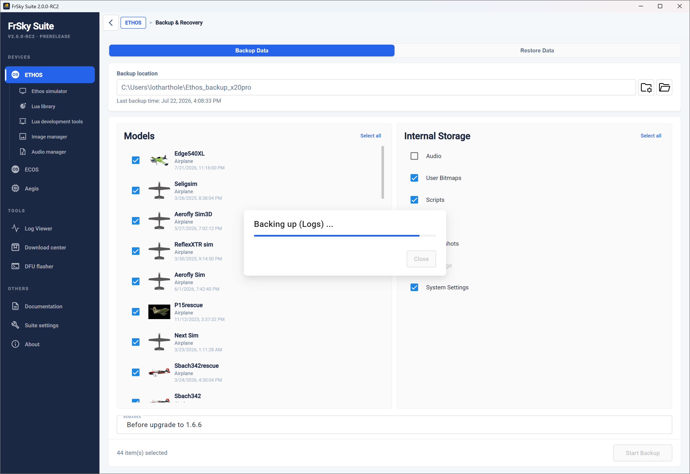

Click on ‘Start backup’ to make a backup of the selected model files and storage areas on the radio. The current Ethos version will be recorded when creating the backup.

##### Restore data

Click on ‘Restore data’ to restore previously backed up model files to the radio. This may be needed when downgrading the radio firmware to an older version.

##### Backup history

The backup history lists all the backups found at the selected backup location. Select one to review its backup data.

The right hand panel will display the details such as the backup date, the ‘created at’ Ethos version, the backup radio, the backup size and the saved backup remarks.

The components backed up will also be listed.

##### Recovery

The components selected under ‘Advanced’ will be restored to the radio. Note that existing files with the same name will be overwritten in the recovery process.

Click on ‘Start restore’ to restore the selected backup files to the radio.

#### Update news

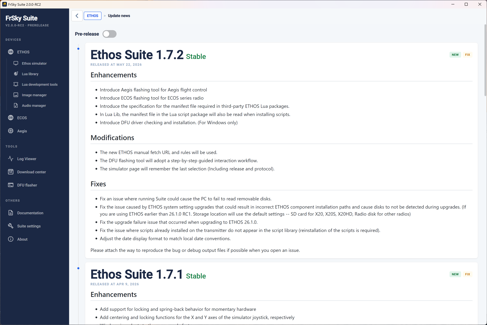

Click on ‘Update news’ to view Ethos firmware update history and release notes.

Enable ‘Pre-release’ at the top of the page to include pre-release versions in the Ethos firmware update history and release notes.

#### ethos.frsky-rc.com

Click on the ‘ethos.frsky-rc.com’ button to visit the official Ethos website.

The website includes the following categories:

- an Ethos introduction, 
        - a ‘Getting Started’ section including information on the Ethos update process and download links for FrSky Suite etc.
        - a ‘How to use Ethos’ section including important guides, FAQs, a ticket system for support
        - the ‘Ethos Resource Centre’ which includes Model Templates, LUA Scripts, Widgets, etc.
        - the third-party collaboration process and application details

### Ethos simulator

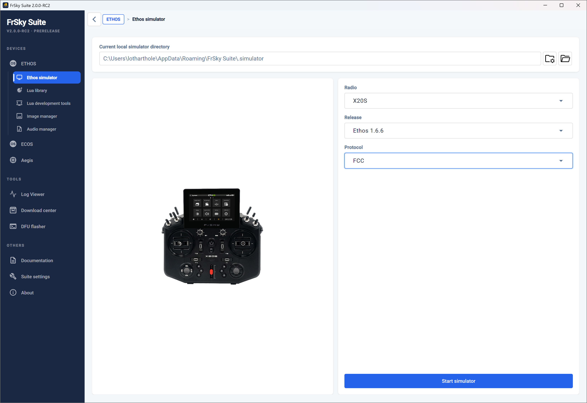

The Ethos simulator lets you explore the radio capabilities and test functionality or planned model enhancements without the actual radio. It also lets you explore new releases before upgrading your radio.

To begin, select the radio type to be simulated, the desired Ethos release version and the RF protocol. Then click ‘Start Simulator’.

Please note that pre-release Nightly versions will only be offered if ‘GitHub’ has been selected as the [server location](../frsky-suite/operation.md) in the ‘Suite settings’ tab.

#### Simple setup

If no valid radio data is found, an initialization sequence is started.

For a quick exploration simply use the new model wizard that starts after clicking OK. This will allow you to explore the simulator with minimum effort or to evaluate Ethos before purchasing an FrSky radio.

In the above example, the new model wizard has been completed and the model named ‘TestModel’.

The ‘Display’ panel on the left mimics the radio LCD, while the ‘[Controls](#Controls Panel)’ panel mimics the hardware controls on the chosen radio.

At the top of the window the ‘Current local simulator directory’ is shown.

#### Recommended setup

It is best to replicate your radio’s setup in the simulator. This will provide the same functionality as you have in your radio, making it easy to test enhancements to your models without affecting your flying or modeling environment until everything works as planned.

Alternatively you can create and test a whole new model, perhaps by basing it on one of your templates, or by making a clone of an existing model and modifying it. These approaches maximize re-use without having to program a model from scratch. Once completed, the .bin model file can be copied from the /models folder in the simulator path to the /models folder on the radio provided the simulator is not running on a higher Ethos firmware release.

The recommended setup steps are:

1. Make a backup of your radio using the Suite [Backup & recovery](../frsky-suite/operation.md) function.

2. It is best to initially complete the new model wizard for a simple model. This makes it easier to find and replace this setup with your radio backup. Please refer to the ‘Simple setup’ section above.

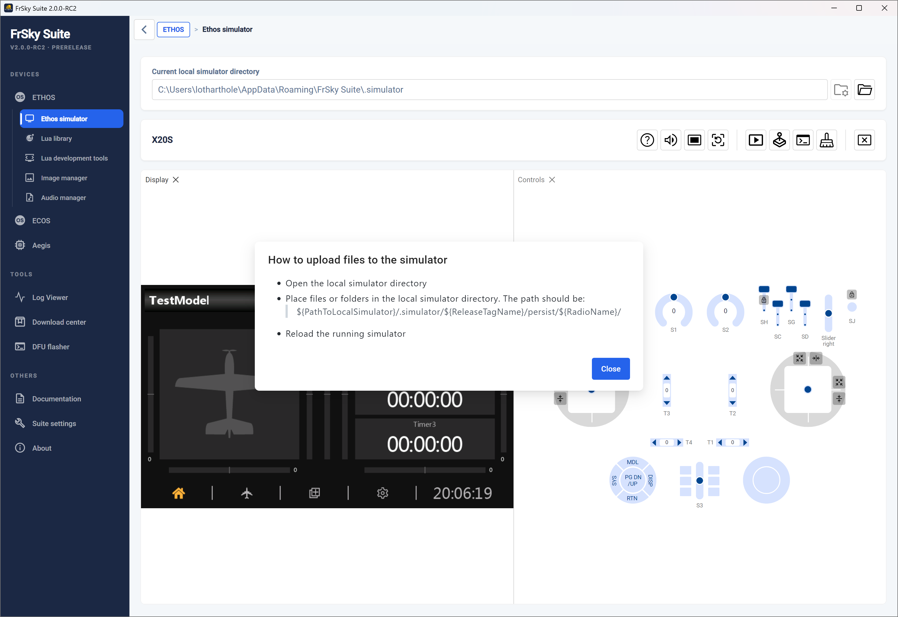

3. Determine the simulator file path by clicking on the help icon . The pop-up help dialog explains the simulator file path structure (see above).

The ‘Current local simulator directory’ is also shown at the top of the window.

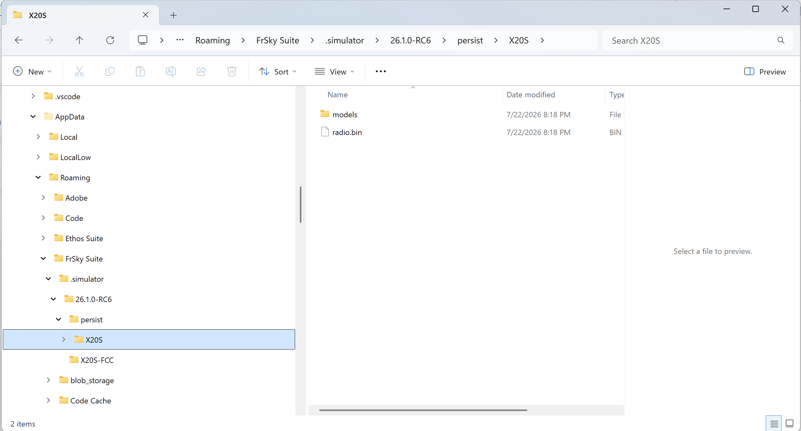

4. Using Windows Explorer find and navigate to the chosen radio’s folder in the simulator file path structure. An example structure is shown above.

5. Important: Close FrSky Suite before continuing.

Inside the chosen radio’s folder replace the current contents (i.e. model folder and radio.bin) with your radio backup. (If you leave the models folder in place, the contents will be merged with the models from your radio backup.) An example structure is shown above, which should look very familiar being the same as that on your radio.

6. Restart FrSky Suite and the simulator.

It should start with the model that was current on your radio when you made the backup. In this example a Spitfire was the current model.

7. Open the console panel by clicking on the ‘Open console panel’ icon . It will open next to the Display panel.

8. Drag the ‘Console’ panel tab down towards the bottom of the Suite window until a thin shaded bar appears across both panels right at the bottom. The ‘Console’ panel should now occupy the lower half of the simulator which makes it easier to read longer lines in the log, while keeping the Display and Controls panel visible. The console is useful for confirming the simulator startup sequence, and for monitoring events and error messages.

#### Simulator task bar

The simulator task bar has the following controls:

##### General

	Help

	Speaker mute on/off

	Reload simulator

##### Panel controls

	Open Display panel (mimics the radio LCD)

	Open Controls panel (mimics the radio controls)

	Open Console panel which outputs a text log of simulator execution

	Clear Console output

##### Macro Controls

	Run macro - Asks for the path to your macros, and then lists any macros found and offers to execute one or more

	Will start execution of the loaded macro

	Will execute one line of the macro at a time

	Will pause the macro

	Stop macro execution

##### Exit

	Close the simulator

#### Controls Panel

The ‘Controls’ panel mimics the hardware controls on the chosen radio.

##### Gimbals

The sticks can be operated by dragging them with a mouse. During debugging it is useful to constrain or restrict the stick movement.

	Will auto-center the stick in one or both axes.

	Will constrain the stick to vertical movement only.

	Will constrain the stick to horizontal movement only.

##### Momentary switches and buttons

	Will latch momentary switches and buttons so that they can toggle between on and off but will remain in the selected on or off state for debugging.

### Lua library

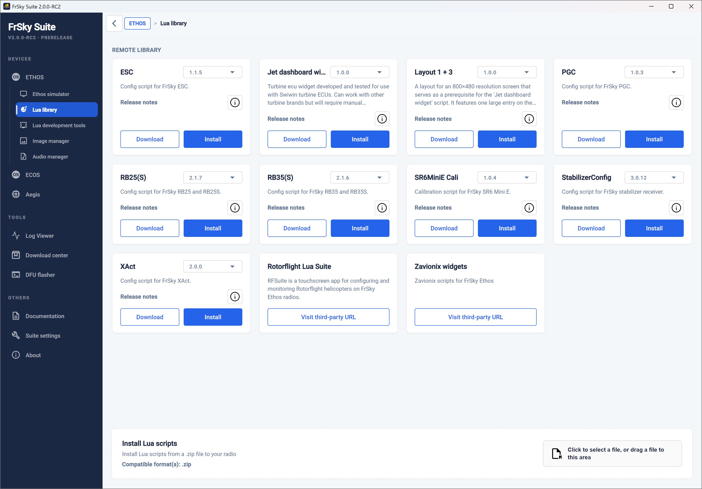

The Lua library contains download links and installation options for varios Lua tools and scripts.

It can also install Lua scripts from a local zip file to your radio.

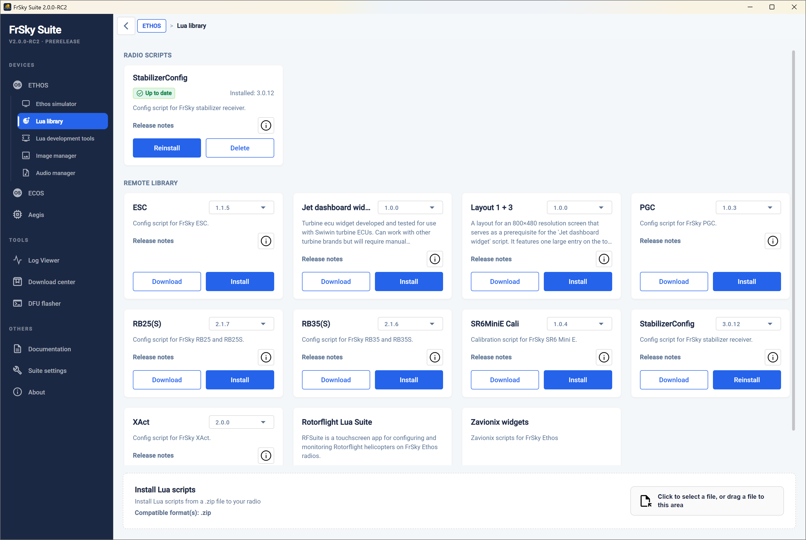

Once you have installed some scripts on the radio, the Lua library tool will show the installed scripts in the left pane, and the remote library in the right hand pane.

### Lua development tools

This section allows you to view the Ethos Lua documentation, and access the Lua demo scripts, and prepare a Lua package as well as providing a terminal for debugging.

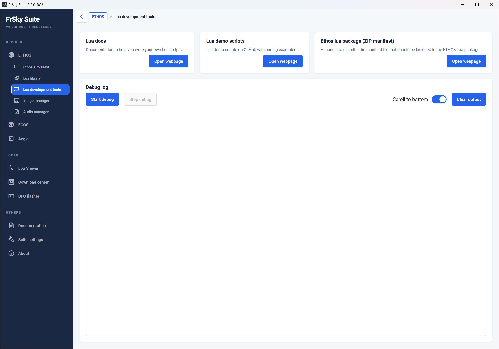

#### Lua Docs

Provides a link to the Ethos Lua reference guide.

Please also refer to the [FrSky - ETHOS Lua Script Programming](https://www.rcgroups.com/forums/showthread.php?4018791-FrSky-ETHOS-Lua-Script-Programming) thread on rcgroups for additional information and user scripts and widgets.

#### Lua Demo Scripts

This button opens the web page on the Ethos-Feedback Community on Github where links to some Lua demo scripts giving coding examples may be found.

#### Ethos lua package (ZIP manifest)

This button opens the web page that describes how to prepare a ETHOS Lua script ZIP package that can be correctly recognized and installed by the Lua Library installer.

#### Debug

The debug function provides a debug log window for displaying Lua debug traces sent to USB-Serial while the radio is in Serial mode.

1. First you connect the transmitter to Suite as usual.

2. Switch to Ethos mode. You can now edit your lua directly on the radio, using Windows Explorer or macOS Finder and your favorite code editor.

3. Open the Lua Development Tools tab.

4. Click on ‘START DEBUG’, this will switch the transmitter into ‘debug mode’ , which is the serial mode.

5. Your transmitter reboots and re-initializes the lua scripts. All print outputs of the lua scripts which are active in your model are sent to the integrated terminal window of Suite via the serial mode.

6. If a problem or an error has been detected, the dev tool is used to switch back to Ethos mode by clicking on ‘STOP DEBUG’.

7. The lua script can be edited again

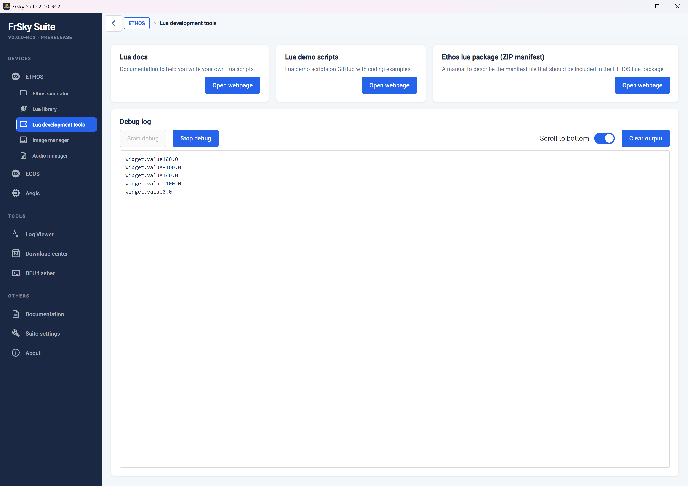

8. The error shown in the example above has been fixed, and normal running can be confirmed.

### Image manager

The Image manager can be used to crop an image and adjust its size before transcoding to the Ethos format.

Dimensions:	As user specified, but can maintain the aspect ratio.

Format:	32bit BMP

Colour Space:	RGB

Alpha Channel:	Will add alpha only if needed if option checked.

Note that full screen images for X20 are 800x480 pixels, and for X18 are 480x320.

Please refer to the [bitmaps](../system-setup/file-manager.md) section in File Manager for the file naming rules.

#### List to be transcoded

Create the list of images to be transcoded in the left panel.

The ‘Clear all’ button will clear the list.

#### Resolution settings

Enter or select the desired image size. Generally Ethos will automatically resize an image

#### Keep aspect ratio

The aspect ratio may be locked.

#### Transparent

Will add an Alpha channel for transparency only if not already there.

#### Output path

Enter or browse to the desired output folder.

#### Open folder after transcoding

There is an option to open the directory (folder) after transcoding.

#### Transcode

The Image manager will transcode images to the desired size and the selected Fill/Fit/Stretch option, and save the image(s) to the selected output path.

Note: Any changes made above "Output Path" are tied to the currently selected image. Even if you switch to another image in the list on the left and then switch back, those changes will be preserved until the image is transcoded and exported.

### Audio manager

The Audio manager will convert your audio files to the following format:

Format:	PCM linear

Sample Rate:	32kHz

Channels:	1 (mono)

Bits per sample:	16 bits, low endian (pcm\_s16le)

#### List to be transcoded

Create the list of audio files to be transcoded in the left panel.

The ‘Clear all’ button will clear the list.

#### Output path

Enter or browse to the desired output folder.

#### Transcode

The Audio manager will transcode sound files to the desired size, and save the image(s) to the selected output path.

#### Options

Finally there is an Option to open the directory (folder) after conversion.

### ECOS

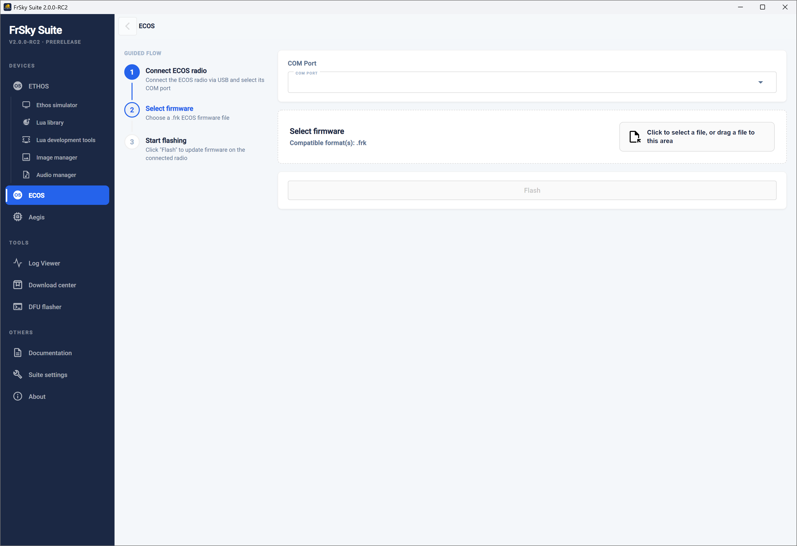

ECOS is an all-new, simplified operating system developed by FrSky and introduced with the FrSky EX14 transmitter. It is a streamlined, entry-level version derived from the color-touchscreen ETHOS OS, built specifically for budget-friendly, black-and-white screen radios targeting newcomers and educational programs.

Download the radio’s instruction manual from the from the Downloads section of frsky-rc.com for guidance on the ECOS system.

#### Com port

Connect your ECOS radio to your PC with a USB cable. Select the Com port it connects to. (You may need to check in Device Manager.)

#### Select firmware

Using the ‘FrSky product page’ below, download the desired firmware update for your ECOS radio. Unzip the download and identify the version required, either EU or FCC or SRRC. Select or drag that file into the designated area on the page.

#### Flash

Having selected the Com port and firmware file above, click Flash to write the file to the radio.

### Aegis

Aegis is a new flight controller from FrSky.

Follow the guide flow on the Aegis page to update your FC.

## Tools

### Log viewer

The log viewer is used to view log files generated by Ethos when the ‘Write logs’ special function is enabled.

#### Select CSV file

Select the csv log file to be viewed.

The entire log will be loaded and displayed.

#### Channels

On the left, select the desired channels to be viewed.

#### Display

These controls may be used to focus on the area of interest:

Scroll to zoom the x-axis (time)

Ctrl-scroll to zoom the y-axis (or toggle ‘Swap wheel zoom’)

Click and drag to pan the chart

Hover the cursor to read all spot values at that instant (double click to lock)

#### Refresh data

Click on ‘Refresh data’ to reload the file. This will also clear the cursor if you have locked it.

### FrSky product page

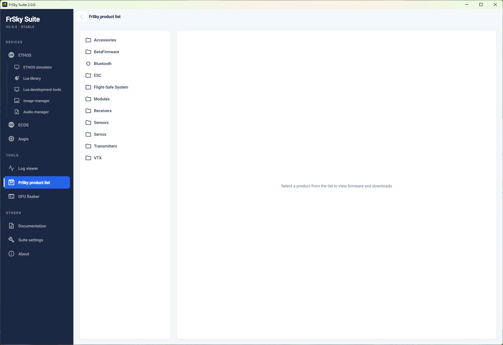

The FrSky product page can be used to download any firmware from the FrSky download site, and to use the radio as a proxy to flash any module, sensor, servo, or receiver directly from FrSky Suite.

In the Product list, browse to select the device to be flashed. In the example above, a TW SR8 receiver has been selected. The Download center will then list the ‘assets’ that are available.

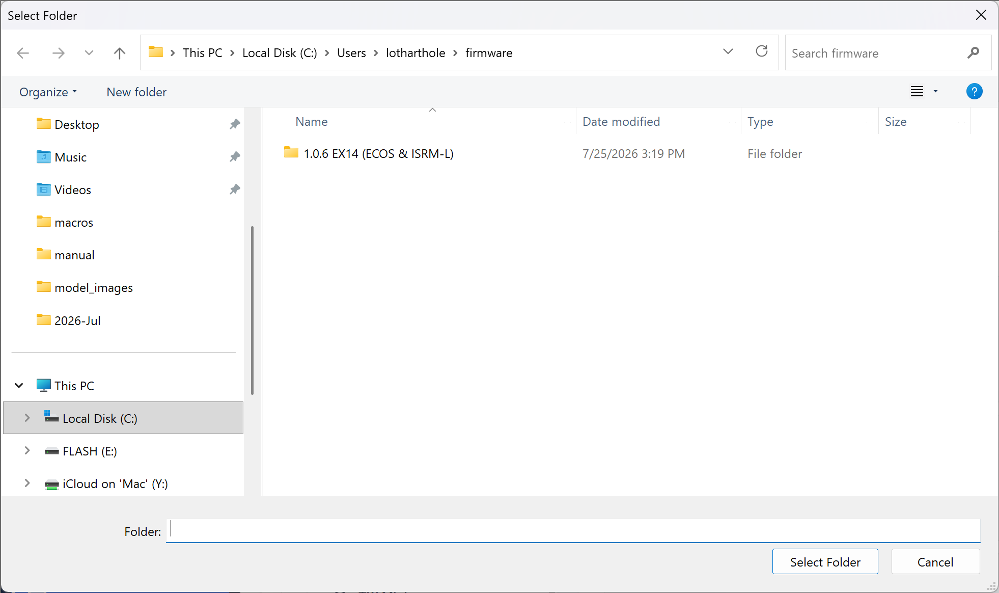

Clicking on a Download button will open a browse window to select the destination folder and download the file.

The file has been downloaded successfully.

### DFU Flasher

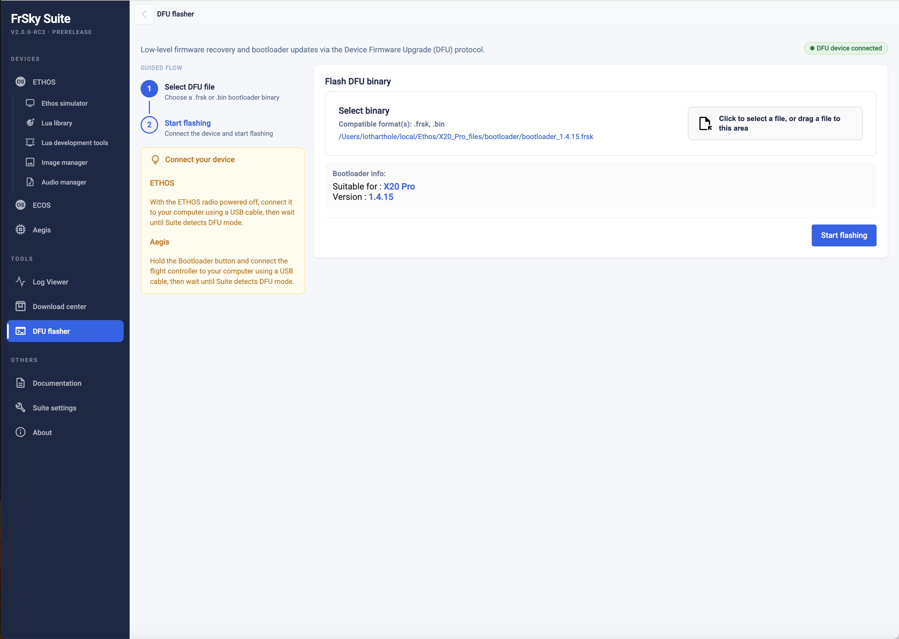

Click on the ‘DFU Flasher’ tab.

Connect your switched off radio off to the PC with a USB lead. You should get a green ‘DFU device connected’ message.

Click on the “Select binary’ button to browse to your downloaded bootloader file and select it. FrSky Suite will assess the selected file and report on it’s version and suitability.

Click on the ‘Start flashing’ button to flash the selected bootloader. It will report success when completed.

In case of a red ‘No DFU device’ error, you will need to install the correct DFU driver. You can use the ‘Refresh DFU driver status’ and ‘Install DFU driver’ buttons to install a DU driver.

On most Windows 10 or later PCs the Tandem systems connect using the default Windows USB DFU driver and are ready to flash the bootloader. However, Windows updates often replace drivers with generic drivers that may not work with the radio.

Check Device Manager to see if your DFU device (i.e. your radio) is recognized and working. If FrSky Suite was unable to install a DFU driver, another option may be to see if the Impulse Driver Fixer can be used to correct the driver. It can be downloaded from [https://impulserc.com/pages/downloads](https://impulserc.com/pages/downloads). For more information please see also this [Ethos Suite Update](https://www.rcgroups.com/forums/showpost.php?p=48919119&postcount=15884) post.

Note for Horus X10 users: Windows 10 will not by default install the STM32bootloader USB device driver needed for Horus systems. It will need to be installed with a program like the Impulse Driver Fixer or Zadig.

### Repair Tool

The Repair Tool is for the X18/S, TW Lite, XE, X20 Pro/R/RS radios. If your radio cannot read from NAND or the settings cannot be saved, this tool will reformat the internal storage.

## Others Section

### Documentation

The documentation section has links to the Ethos Manuals, and the Ethos-Feedback Community on Github.

#### Ethos Manuals

The current Ethos manual may be downloaded here.

#### Ethos Github

The button will open the Ethos-Feedback Community web page on Github, where you can access Ethos releases or raise an issue if you believe you have found a bug. However, to avoid duplication, please do a search through the existing issues before posting.

### Suite Settings

##### Language

The Suite language can be selected between Czech, German, English, Spanish, French, Hebrew, Italian, Dutch, Norwegian, Portuguese, Slovenian and Chinese.

##### Server location

The server location can be either Github or the FrSky server. For Suite v1.6.0 the Server was reset to the FrSky server (just this time). Any changes will be saved after modification.

#### Suite version

##### Version

The current Suite version is displayed.

##### Update Suite

It will indicated ‘Updated’ if current, or else click on the button to check for Suite updates.

#### More settings

##### Proxy

Proxy settings may be updated here.

##### Debug options

- A popup dialog when a fatal error occurs may be enabled or disabled.
- The Suite Debug mode will log all the traces (not only the crashes) in Suite.
- Open the logs folder to review the crash logs.

### About

Displays the version and copyright information.
