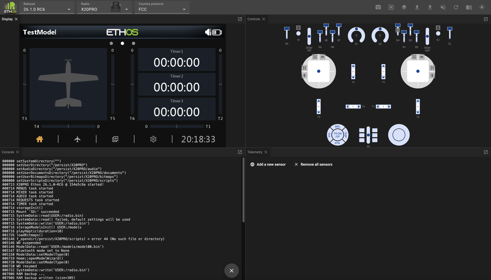
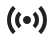
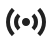

# Ethos Web Simulator

The Ethos web simulator is built as a WebAssembly (abbreviated Wasm), which is a portable solution enabling deployment on the web. This means it runs within a browser and does not need installation on a PC. Chrome is the recommended browser.

The Ethos web simulator lets you explore the radio capabilities and test functionality or planned model enhancements without the actual radio. It also lets you very easily explore new releases before upgrading your radio.

The web simulator may be found at [https://ethos-simulator.frsky-rc.com/](https://ethos-simulator.frsky-rc.com/)

The default initial selections are the 26.1.0-RC6 release (at the time of writing), the X20 Pro radio, and the FCC protocol. To start select the display language.

When it first loads, no valid model data will be found, so it will then start running the new model wizard.

Complete the wizard to configure a basic test model.

If the default release and radio are not the desired selections, select the desired Ethos release version, the radio type to be simulated, and the RF protocol.

 Click on the Panels icon in the top menu bar, and select the Console.

The Console will appear next to the Display panel.

Click and drag the Console title bar, and drag it downwards. Move the mouse until the Console occupies the bottom left quadrant.

The console is useful for confirming the simulator startup sequence, and for monitoring events and error messages.

Click the Panels icon again, and repeat with the Telemetry panel, moving it to the bottom right quadrant.

In the Telemetry panel, repeatedly click on ‘Add a new sensor’ and add the sensors you want access to in your simulations.

 To save your sensors for future sessions click on the icon and select ‘Save telemetry settings’. The telemetry settings will be saved to a file called ‘telemetry.json’ in your downloads path. Move this to a convenient location. In subsequent simulator sessions, click on the ‘Upload’ icon and select ‘Upload a JSON telemetry file’, then browse to your saved ‘telemetry.json’.

You are now ready to start simulating. The browser will remember your panel layout so you don’t need to keep arranging it.

### Recommended setup

It is best to replicate your radio’s setup in the simulator. This will provide the same functionality as you have in your radio, making it easy to test enhancements to your models without affecting your flying or modeling environment until everything works as planned.

The recommended setup steps are:

1. Make a backup of your radio using the Suite [Backup & recovery](operation.md) function.

2. In the Upload menu select ‘Upload a radio backup’ and browse to your saved backup file. (Refer to the menus below.)

3. It should start with the model that was current on your radio when you made the backup. In this example an Ng2 glider was the current model.

With your familiar radio environment you can now create and test a whole new model, perhaps by basing it on one of your templates, or by making a clone of an existing model and modifying it. These approaches maximize re-use without having to program a model from scratch. Once completed, use the ‘Download a model file’ option to download the .bin model file to your downloads path. Then copy it to your radio.

### Simulator task bar

The simulator task bar has the following controls:

	Screenshot (to downloads folder)

	Start record (records a macro – beyond the scope of this overview)

	Panels (lists panels that have not been opened yet)

	Upload… (see menu below)

	Download... (see menu below)

	Audio On/Off

	Restart simulator

	Documentation (contains a link to the latest manual)

	Light/Dark mode

##### Upload menu

	Upload a model file (.bin)

	Upload a radio backup (.bin)

	Upload an audio pack (.zip)

	Upload a Lua plugin (.zip)

	Upload a CSV translations file (.csv)

	Upload a JSON telemetry file (.json)

	Start a macro (.zip)

##### Download menu

	Save the current model file (.bin)

	Edit the current model

	Edit the current model file (JSON)

	Save all screenshots (browse to target folder, save as .png)

	Save a radio backup (.zip)

	Save telemetry settings (.json)

##### Controls Panel

The ‘Controls’ panel mimics the hardware controls on the chosen radio.

###### Gimbals

The sticks can be operated by dragging them with a mouse. During debugging it is useful to constrain or restrict the stick movement.

	Will auto-center the stick in one or both axes.

	Will constrain the stick to vertical movement only.

	Will constrain the stick to horizontal movement only.

###### Momentary switches and buttons

	Will latch momentary switches and buttons so that they can toggle between on and off but will remain in the selected on or off state for debugging.
