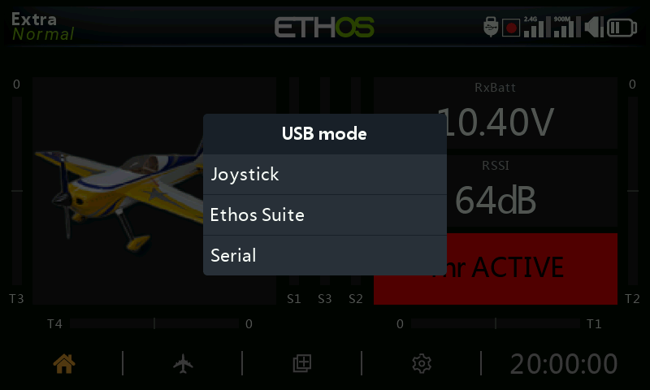

# USB Connection Modes

What a USB connection to a PC does depends on how the radio was powered
when you plugged it in.

## Power Off mode

Connecting the radio to a PC via USB **while it's powered off** puts it
into DFU mode, used for flashing the bootloader itself.

## Bootloader mode

Power the radio on **with `ENT` held down** to boot into bootloader mode
(the screen shows "Bootloader"). Connecting USB now changes the status to
"USB Plugged" and the PC mounts **two** drives: the radio's internal flash
memory, and the SD card/eMMC content. This is the mode for reading and
writing files directly to either storage area, and it's also how [Ethos
Suite](../ethos-suite/index.md) updates the radio's firmware — see Ethos
Suite's own Bootloader Mode section.

## Power On mode

Connecting USB while the radio is **powered on normally** brings up a mode
picker:

- **Joystick** — presents the radio as a USB HID joystick, for driving PC
  flight simulators.
- **FrSky Suite** — puts the radio into "Ethos mode" for communication
  with [Ethos Suite](../ethos-suite/index.md).
- **Serial** — routes Lua debug traces over USB-serial (115200 bps). Ethos
  Suite's Lua Development Tools tab has an integrated terminal to display
  them; a Windows Virtual COM Port driver may be needed.
