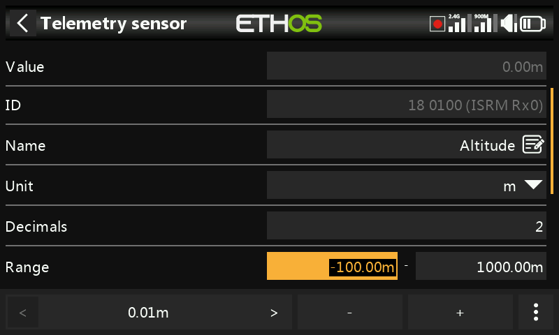

# User Interface and Navigation

The radio has a touch screen, making the user interface quite intuitive. Touching the [Model Setup](../model-setup/index.md) (Airplane icon), [Configure Screens](../displays/index.md) (Multiple screens icon), and [System Setup](../system-setup/index.md) (Gear icon) tabs take you directly to those functions, which are described in those sections of the manual. They can also be accessed using the \[MDL\], \[DISP\] and \[SYS\] keys respectively.

Alternately the rotary selector may be used to move the highlight to the desired tile or parameter, followed by pressing Enter to select it.

A long press on the \[RTN\] key will return you to the Home screen from any sub-menu.

Touching the system time on the right of the bottom bar takes you to the Date & Time section, allowing you to set the time and date.

Touching the speaker or battery icons in the top bar will bring up the relevant Sound & Vibr. and Battery control panels.

## Reset menu

A long press on the \[ENT\] key from the Home screens brings up a reset menu:

### Reset flight

Reset flight will reset telemetry, the timers, and the function switches. Note that preflight checks will be done after a ‘Reset flight’.

### Reset telemetry

Will reset telemetry.

### Reset timers

Will reset the timers.

## Lock touchscreen

The LCD touchscreen may be locked to prevent inadvertent operation by pressing \[ENT\] and \[Page\] simultaneously for 1 second from the Home screen. It is also available as a special function.

## Editing controls

### Adding functional elements

You can create a new functional element such as a timer, logic switch, special function, curve or variable by tapping on the ‘+’ symbol next to the column headings in the relevant main menu.

On radios without a touchscreen, highlight an existing element and press \[Enter\], then select ’Add’ from the dialog that opens. Of course this option also works on touchscreen radios.

### Virtual keyboard

On touchscreen radios Ethos provides a virtual keyboard for editing text fields.

Simply touch on any text field (or click \[ENT\]) to bring up the keyboard.

Touch the backspace key (above the Enter key) to back space, erasing characters to the left of the cursor. Press the \[Page\] key to delete characters to the right of the cursor. Once you get to the end on the right, the \[Page\] key will start deleting any remaining characters to the left of the cursor.

Touch the text field to move the cursor to that position. Alternatively, press the \[SYS\] key to move the cursor to the left, or the \[DISP\] key to move it to the right.

Touch the '?123' or 'abc' key to toggle between alpha and numeric keypads. The numeric keyboard also has the special characters. There is also a caps lock for entering uppercase letters.

Radios without a touchscreen

On radios without a touchscreen, press the \[ENT\] key on any text field to go into edit mode.

Rotate the rotary encoder to scroll through the upper and lower case alphabets and the numerals, followed by the special characters. Press \[ENT\] to insert the character. The \[MDL\] key will change the case of the character to the immediate right of the cursor. Any following characters will remain in the new case until the case is changed again.

Press the \[Page\] key to delete characters to the right of the cursor.

Press the \[SYS\] key to move the cursor to the left, or the \[DISP\] key to move it to the right.

### Number value controls

When touching a number value a dialog appear at the bottom of the screen with the number value controls:

- ‘<’ and ‘>’ keys for changing the step size between the minimum (as appropriate) and going up in decades, e.g. 0.01%, 0.1%, 1.0% or 10.0%.  

- ‘-’ and ‘+’ keys incrementing or decrementing the value by the selected step size. The rotary encoder can also be used to adjust the value.  

- a ‘More’ button on the right for additional options, see below.

The ‘More’ button on the right opens another dialog for additional options:

- the default value
- set to minimum
- set to maximum
- replace the controls with a slider for adjustment, see below

The slider allows for the value to be adjusted quickly. The rotary encoder can also be used.

To revert back to the number adjustment keys, select ‘Disable slider.

Another example is a telemetry range value, which can be edited in a similar way.

### Options feature

Ethos has a very powerful 'Options' feature. Almost anywhere a value or source is expected, a long press of the Enter key will bring up an options dialog.

Fields with this feature can be identified by the menu icon (hamburger symbol) in the top left corner of the field.

Value options

The value options dialog shows which parameter is being configured. In this example you have the choice of setting the weight/rates to maximum or minimum, or to use a source. Using a source like a pot would allow the weight/rates to be adjusted in flight.

If you long press Enter on a value field that has already been changed to use a source, a dialog pops up allowing you to convert the source's current value to a fixed value.

Clicking on 'Options' will bring up options for the source, see below.

Source options

Invert

Invert allows a source such as a switch position to be negated or inverted. For example instead of being active when switch SA is up, it would be active when switch SA is NOT up, i.e. in either the mid or down positions.

Edge

You can select the 'Edge' option if you need a one-time action when the source transitions from False to True or from True to False. Only the transition is acted upon, not the True or False state.

A ‘†’ character will be displayed as a prefix to the source indicate the Edge option.

Please note that the ‘Edge’ option is available on switches but depending on the context. It is also available on the [Sticky](../model-setup/logical-switches.md) logic switch trigger conditions.

Source option for switches

###### Negative

The negative option allows the switch action to be inverted.

###### HalfRange

The ‘Half range’ option is available when using a 2-POS Switch or logic switch as a source. The range becomes \[0-100%\] instead of \[-100%-100%\].

Source option for trims

###### Negative

The negative option allows trim action to be inverted, useful in mixes Actions.

###### Full range

By default trims have a range of +/- 25%. When used as a source, trims can optionally be changed to full range +/- 100% (long press Enter on the trim).

Ignore trainer input

In logic switches the sources may have this option set to ignore sources coming from the trainer input. A typical application is where a logic switch is configured to detect movement of the master trainer’s sticks (e.g. Elevator stick) to allow for instant intervention if things go wrong. This option is needed to prevent the student stick inputs from triggering the logic switch.

Var options

Negative

Enabling Negative will make the Var value negative in this instance.

Ignore range

Some parameters have asymmetric ranges, such as the Min/Max parameters in Outputs, which have ranges of (-150% to 0%) and (0% to +150%) respectively. When using VARs as a source to adjust the Min/Max parameters, unless the Var has an identical range, it will be necessary to set the Var range to be ignored to avoid unexpected values due to range conversion.

Sensor options

On a telemetry source the options dialog allows its maximum or minimum value to be used.

Some sensors have additional options specific to that sensor.
