# User Interface & Navigation

Ethos is designed to be operated entirely with the right-hand **rotary
encoder** (turn to move the cursor, press for `ENT`) plus the `RTN` key to
back out of a menu — the touchscreen is a shortcut for some of this, not a
requirement. A handful of interaction patterns recur throughout the entire
UI, so it's worth knowing them before working through any specific menu.

## The contextual menu

Pressing `ENT` and holding briefly on almost anything — a model icon, a
timer, a mix — opens a contextual menu of actions for that item (Edit, Copy,
Move, Delete, Reset, and so on) instead of drilling straight into it. This
is the fastest way to reorder, duplicate, or delete items without having to
open them first.

## Editing text

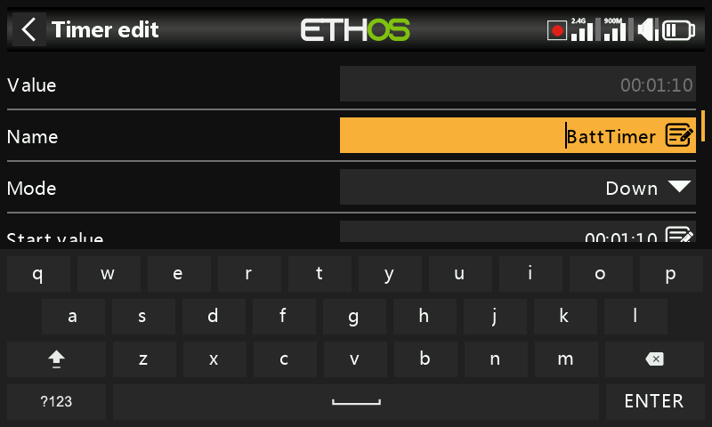

Editing a name (a model, a timer, a Lua script) opens a full on-screen
keyboard. It defaults to letters but switches to a numeric layout with a
single tap:

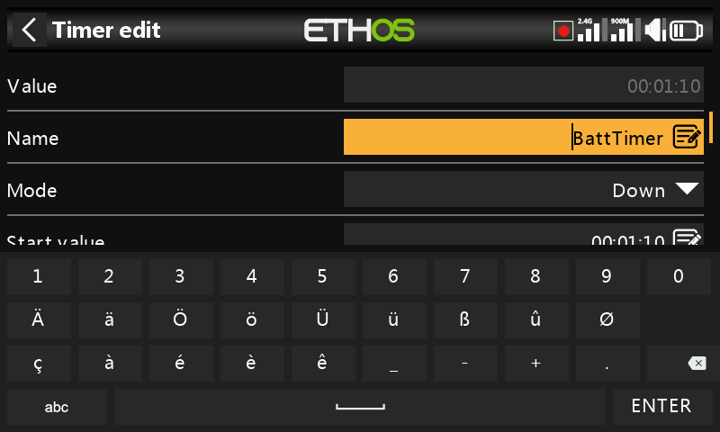

## Editing numbers

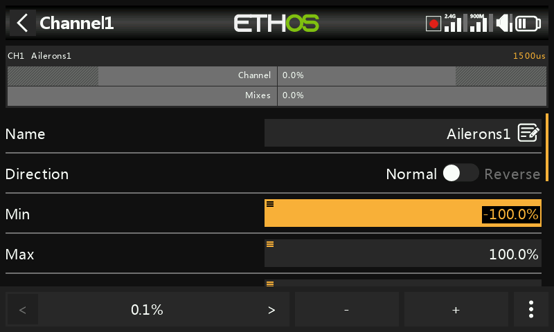

Numeric fields (a mix weight, a timer duration, a curve point) use a
compact numeric keypad rather than the full keyboard. Tapping the options
icon in the corner exposes extra ways to set the value:

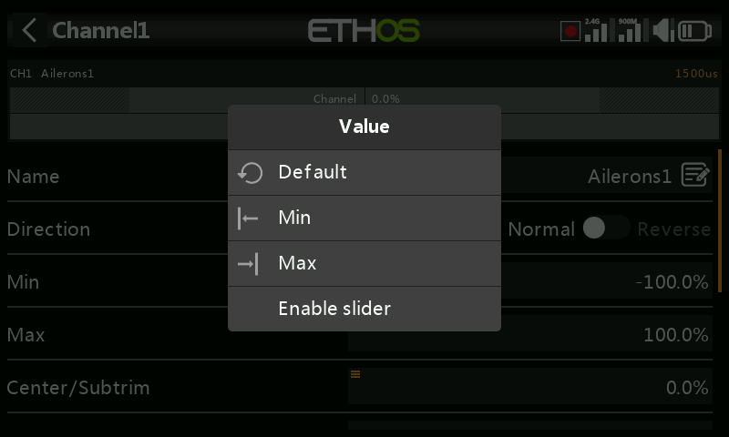

One of those options replaces the keypad with a **slider**, useful for
values you want to sweep through rather than type precisely:

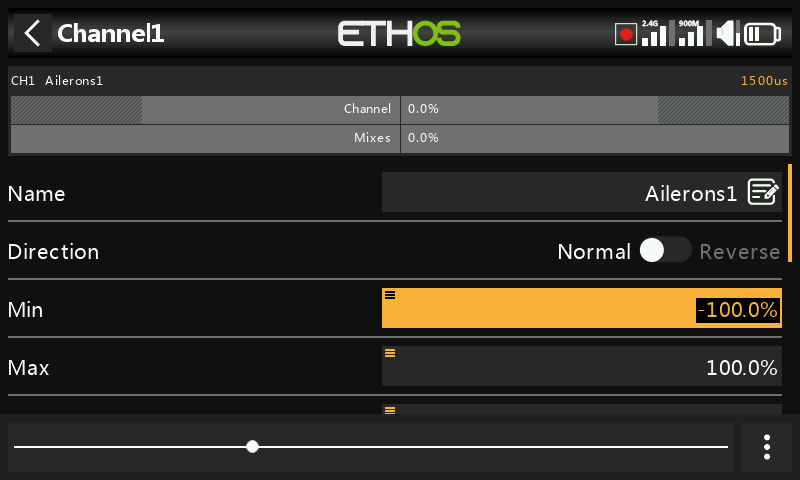

Numeric fields that are normally driven by a source (see below) also let
you disable the slider and type a fixed value directly:

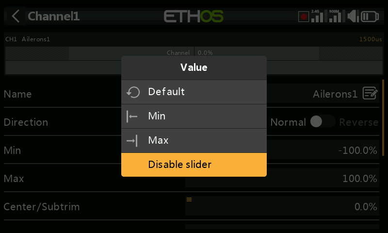

## Choosing a source

The single most common input pattern in Ethos is picking a **source** — a
long-press on `ENT` over almost any numeric field opens a dialog to drive
that value from something live instead of a fixed number:

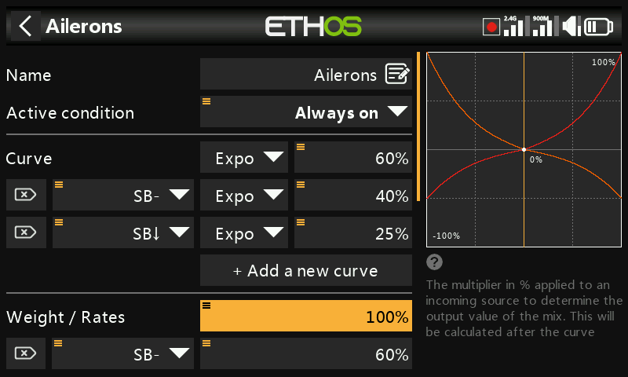

Selecting "Choose a source" opens a two-column picker: a **category** first
(analogs, switches, logical switches, trims, channels, gyro axes, trainer
channels, timers, telemetry sensors, or a handful of special values), then
the specific **member** of that category:

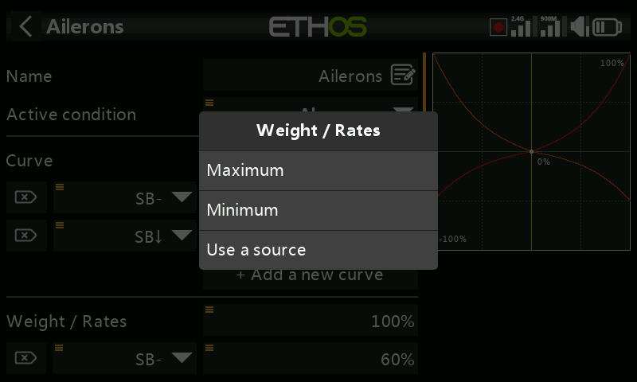

Once picked, the source it's using is shown inline, and long-pressing again
on the field opens source-specific options — for example a physical stick
input offers subtrim/calibration-style options:

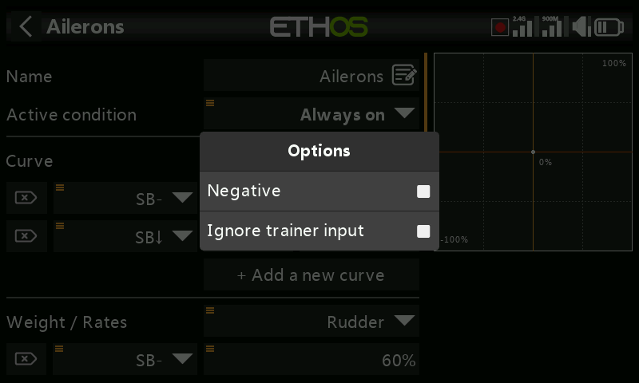

a 2-position switch offers the option to invert it:

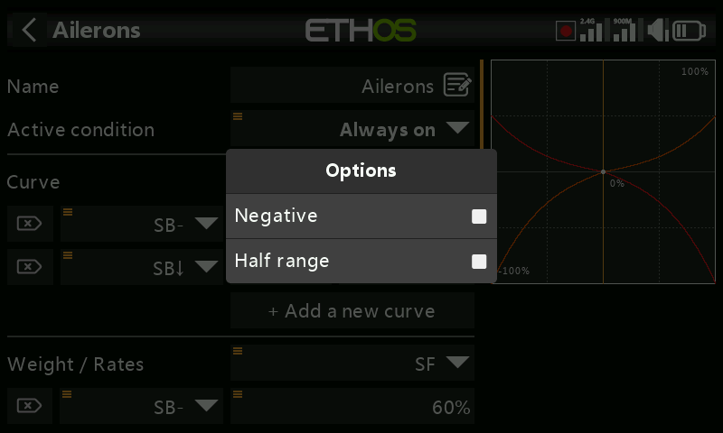

a trim offers the same, plus which trim it refers to:

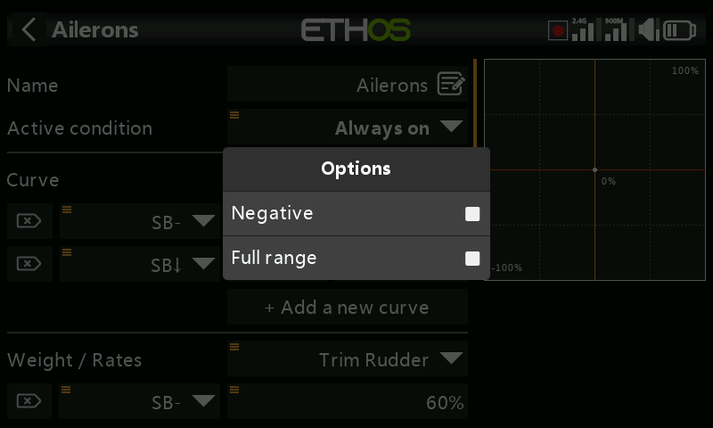

a variable shows which variable it's reading:

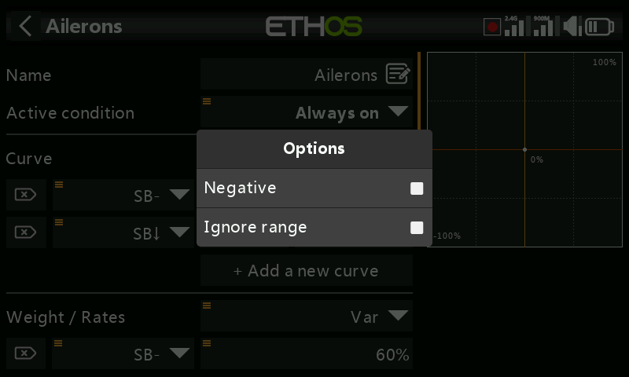

and a telemetry sensor can be reduced to a fixed min/max reading instead of
its live value — useful for things like "worst RSSI seen this flight":

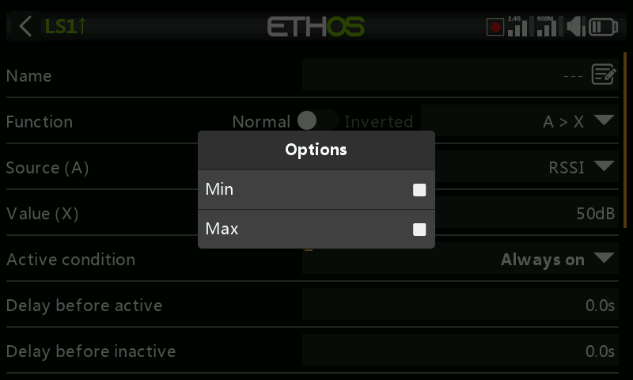

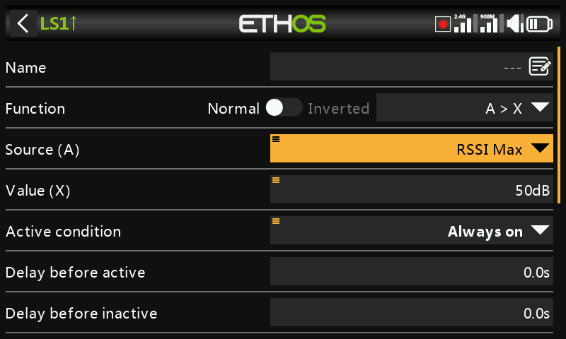

A source can also be **converted to a fixed value** at any point, which
snapshots its current reading and detaches it from the live source:

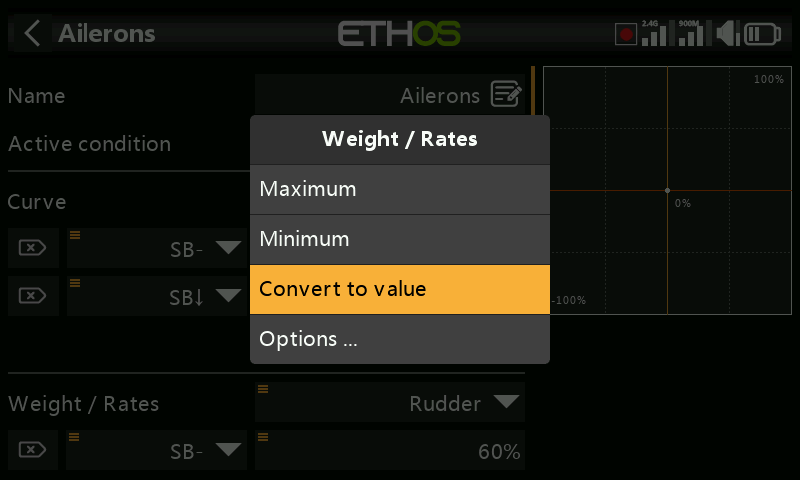

Switches picked this way (for a logical switch condition, a mix condition,
and so on) have their own options dialog, mainly to invert them:

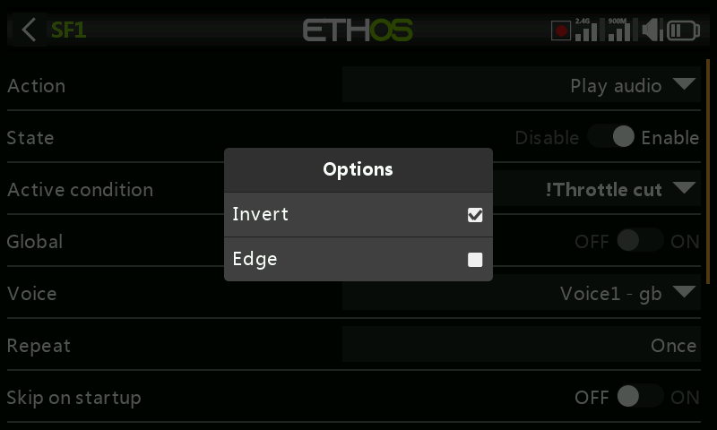
