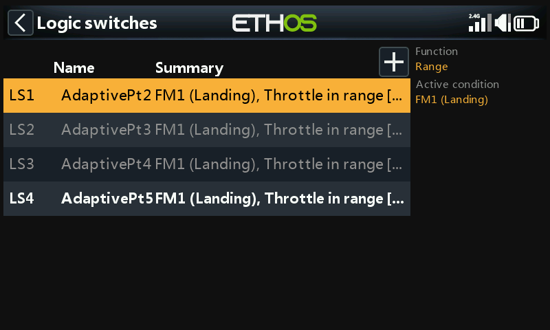
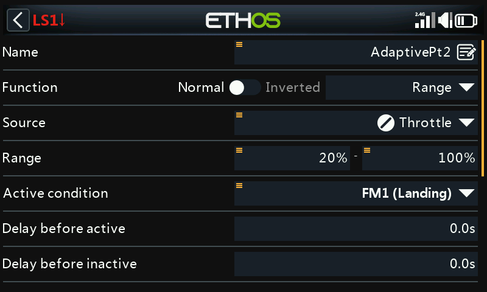
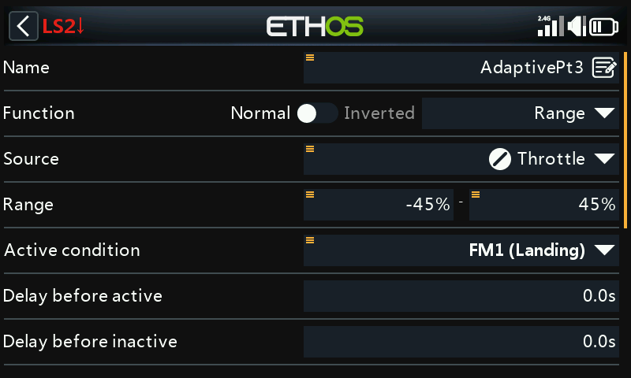
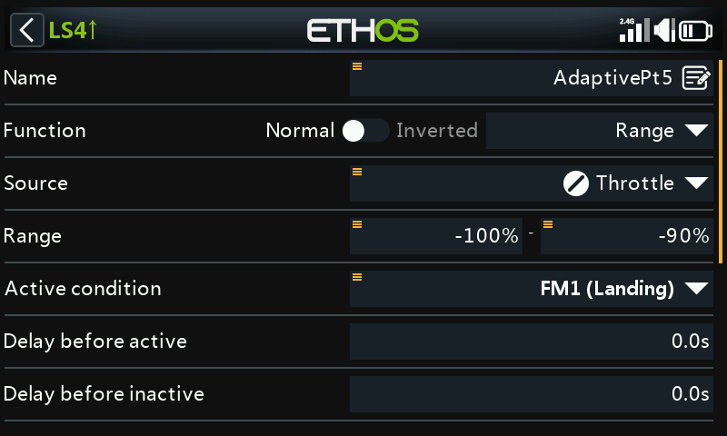
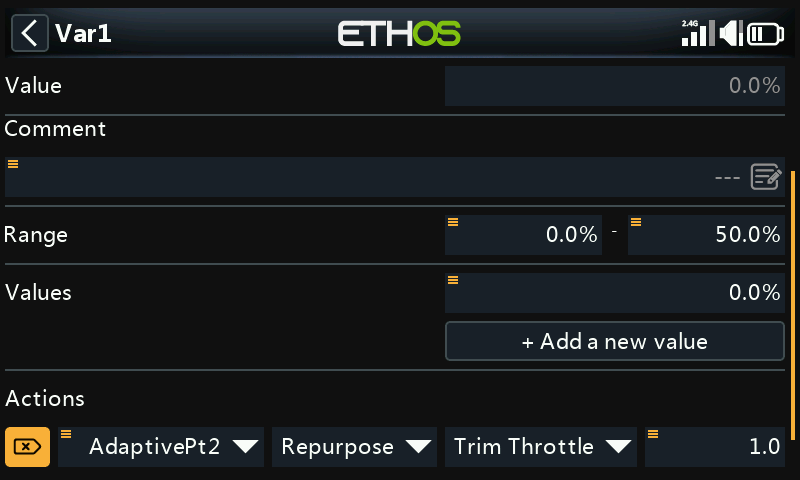
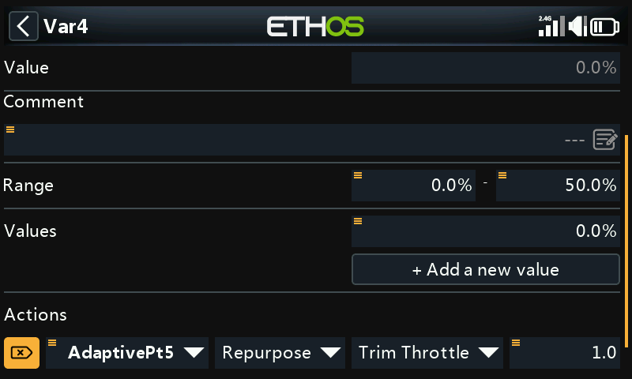
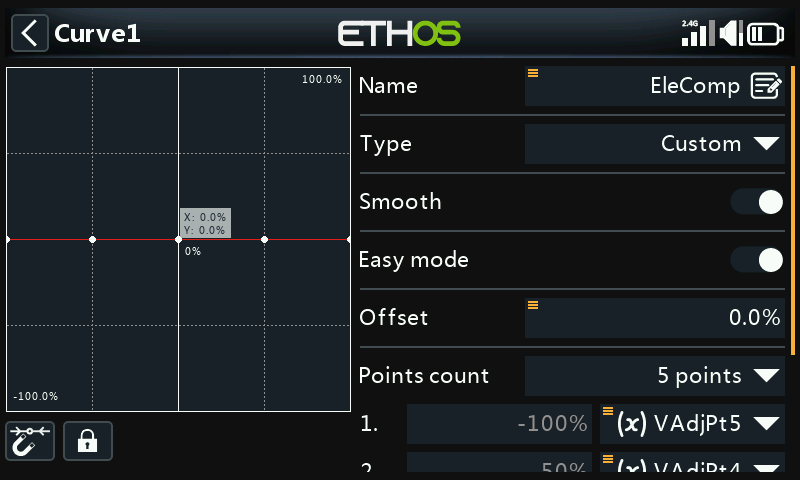
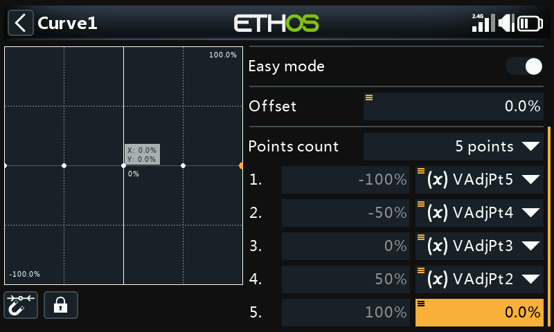

# In-Flight Adjustable Compensation Curve

## Why

Deploying flaps changes wing camber — high-wing aircraft tend to
"balloon up", low-wing aircraft tend to sink — needing elevator
correction that's non-linear with flap deflection, so a curve rather than
a fixed offset. This walkthrough uses [Vars](../model-setup/variables.md)
to make a compensation curve's points adjustable **in flight**, via a
repurposed throttle trim, gated by which curve point the flap stick is
currently near — building on [How-To: Butterfly
Mixer](butterfly-mixer.md)'s elevator compensation step.

## 1. Choose the curve type

A 5-point [custom curve](../model-setup/curves.md) is enough for smooth
compensation without excess complexity. Point 5 (rightmost, flap stick
fully up / no flaps) is always fixed at zero — no compensation needed
with no flaps deployed. The other 4 points are made adjustable via Vars.
Since the flap stick will often sit between two defined points, both
points on either side of it need to be adjustable together in that
overlap zone.

## 2. Calculate overlapping ranges

Point-to-point ranges (adapted, with permission, from Mike Shellim's
"Crow-aware adaptive elevator trim" for OpenTX at rc-soar.com — extended
slightly so Pt2's range reaches all the way to +100%, for the reason
explained in [Step 6](#6-apply-the-curve)):

| Flap stick range | Active point(s) |
|---|---|
| +100% to +45% | Pt2 only |
| +45% to +20% | Pt2 and Pt3 |
| +20% to −20% | Pt3 only |
| −20% to −45% | Pt3 and Pt4 |
| −45% to −90% | Pt4 only |
| −90% to −100% | Pt5 only |

## 3. Configure the logical switches

Four [logical switches](../model-setup/logical-switches.md), each using
**Range** on the flap (throttle) stick, active while the stick is in
that point's zone:

- `AdaptivePt2` — range 20% to 100% (extended to 100% specifically so
  Pt2 can be adjusted even with no flaps deployed — see Step 6).

  

- `AdaptivePt3` — range −45% to 45%.

  

- `AdaptivePt4` — range −90% to −20%.

  

- `AdaptivePt5` — range −100% to −90%.

  

## 4. Define the adjustment Vars

Four [Vars](../model-setup/variables.md), `VAdjPt2`–`VAdjPt5`, each with
range 0–50% (widen if needed) and a **repurposed throttle trim** action —
step size 1.0%, active condition the matching logical switch:

Since only one logical switch (at most two, in the overlap zones) is
active at a time, the same physical trim safely adjusts different Vars
depending on flap position.

## 5. Define the compensation curve

A new 5-point custom curve (e.g. "EleComp") with **Smooth** enabled.
Long-press `ENT` on points 1–4 and **Use a source** to assign
`VAdjPt5`…`VAdjPt2` respectively (point 5 stays fixed at 0, per Step 1).

## 6. Apply the curve

Use this curve exactly where [How-To: Butterfly
Mixer](butterfly-mixer.md#7-add-the-elevator-compensation-curve-and-mix)
attaches its EleComp curve to the elevator compensation mix.

Where possible, start from real data (manufacturer guidance, community
posts) on how much elevator travel a given flap deflection needs;
otherwise a few millimeters of compensation at full flaps is a reasonable
starting point.

!!! tip "Tuning approach"
    Start with small amounts of flap and small trim adjustments.
    `AdaptivePt2` can be tuned with **no flaps deployed at all** — apply
    a little flap, remove it again, and dial in a touch of compensation
    at a time, rather than fighting a ballooning or sinking model while
    trying to trim under pressure. Reapply a little flap to check, adjust
    again as needed. Once Pt2 feels right, move to the next point around
    mid-stick — if Pt2 needed a large trim change, it's worth landing and
    setting the remaining points to each be slightly larger than the
    last, rather than guessing blind.
