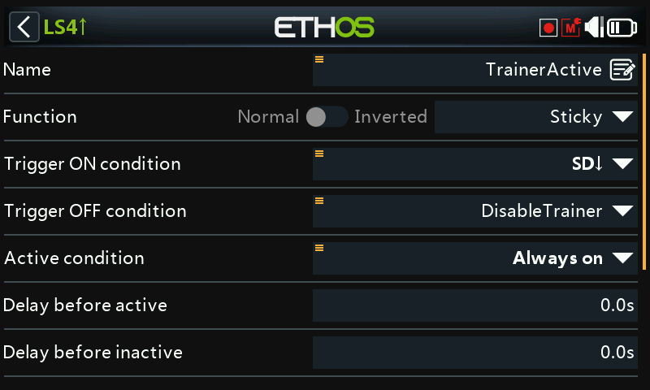
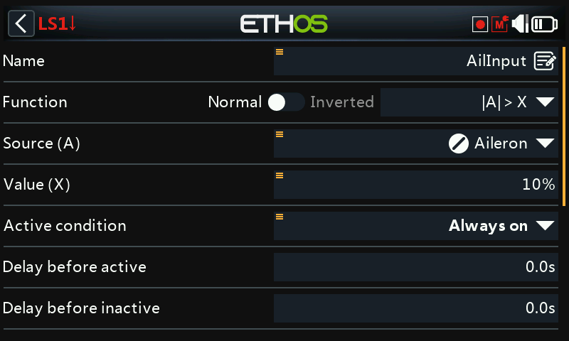
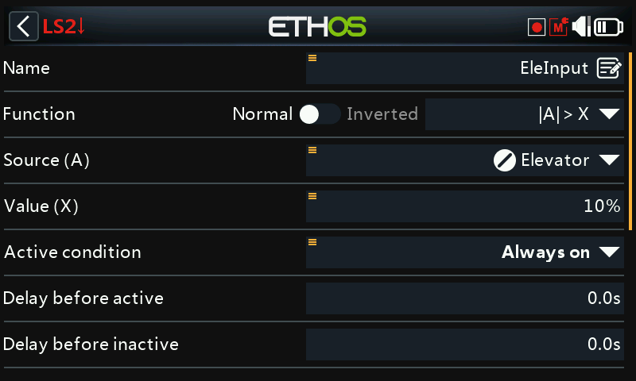
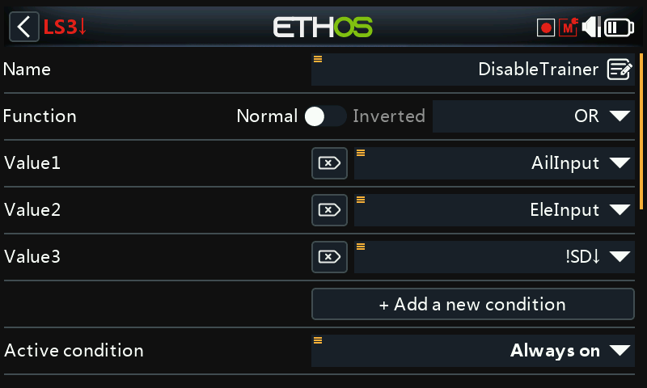

# Instant Take-Back for the Trainer Function

A useful enhancement to the [Trainer](../model-setup/trainer.md)
function: instead of only a switch, the instructor can reclaim control
instantly just by moving the aileron or elevator stick — no need to find
the trainer switch first if something goes wrong.

The trainer switch still starts the session; a [Sticky logical
switch](../model-setup/logical-switches.md#sticky) drives the trainer
function itself, cancelled either by the switch going off **or** by
detecting instructor stick movement.

## 1. Aileron detect logical switch

A logical switch using **|A| > X** on the aileron stick, true when it
moves more than 10% off center in either direction. Long-press the
aileron source and select **Ignore trainer input**, so the *student's*
aileron movement (arriving via the trainer link) doesn't also trigger it:

## 2. Elevator detect logical switch

The same pattern, on the elevator stick.

## 3. Cancellation logical switch

An **OR** logical switch, true when either the aileron-detect or
elevator-detect switch is true, **or** the trainer switch (e.g. SD) is
not down — i.e. any of "instructor moved a stick" or "trainer switch
turned off" ends the session.

## 4. Trainer-enable Sticky logical switch

A **Sticky** logical switch: **Trigger ON** is the trainer switch (SD
down), **Trigger OFF** is the cancellation switch from Step 3. Use this
Sticky switch — call it `TrainerActive` — as the Trainer function's own
active condition instead of the raw switch.

## 5. Audio feedback

Add [Play Audio special functions](../model-setup/special-functions.md)
announcing when `TrainerActive` becomes true and when it clears, so both
pilots get a clear audible cue for exactly when control changes hands.
