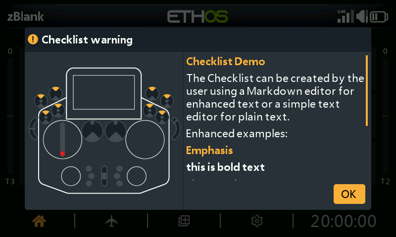

# User Defined Text Checklist



The [Checklist](../model-setup/checklist.md) function can display custom
text at startup — plain text or Markdown-formatted — automatically,
every time that model is loaded.

## 1. Create the checklist text

**Plain text** — write it in any text editor (Notepad++, or even MS
Word saved as plain text) and save as `<model name>.txt`.

**Enhanced text (Markdown)** — Ethos supports Markdown formatting, e.g.
`##` for a heading, `**bold**` for bold text. Use any text editor
(embedding the Markdown syntax by hand) or a dedicated Markdown editor
(Nextpad, MarkText, etc.), and save as `<model name>.md`.

```markdown
## Emphasis
**this is bold text**
*this is italic text*
```

## 2. Copy it to the radio

Copy the file into the same `models/` folder as the model's own `.bin`
file (see [File Manager](../system-setup/file-manager.md#top-level-folders)),
then safely eject the radio's drives before disconnecting.

## 3. Review it

Load the model — the checklist text now appears as part of the startup
checks automatically, scrollable if it runs longer than one screen.
