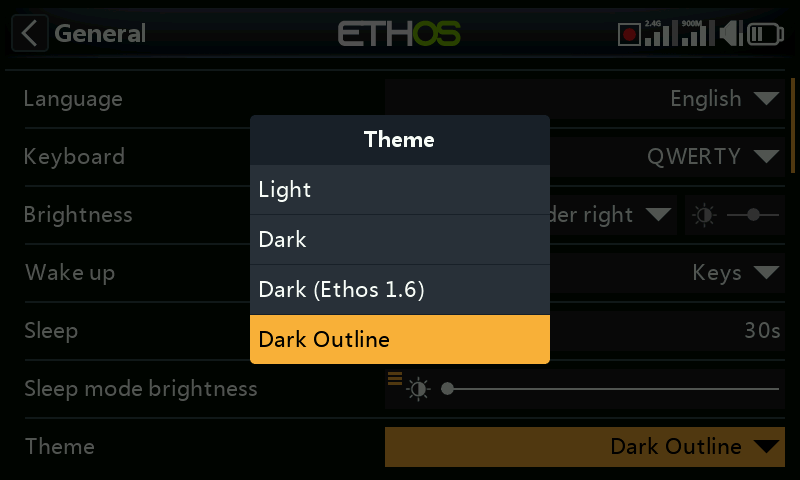
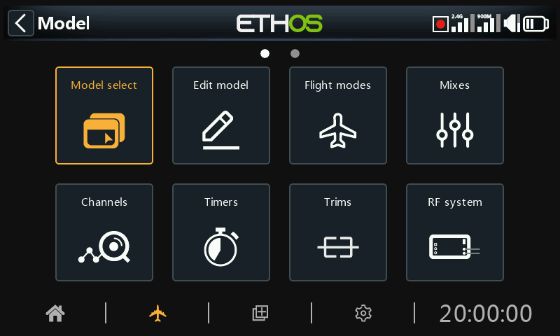

# Alternative Lua display themes

Alternative themes for the display may be installed using a Lua script. Four examples are given in the lua/examples/theme folder in the 26.1 branch of the Ethos-Feedback-Community repository on GitHub

| Dark (Ethos 1.6) | -- Colors from Ethos 1.6.6 |
| --- | --- |
| Dark Outline | -- Colors from the default Dark theme, but with outline focus style  
   (2px border width) |
| Dark (Copy) | -- Colors from the default Dark theme (commented out) |
| Light (Copy) | -- Colors from the default Light theme (commented out) |

To install these themes, refer to the ‘ETHOS Lua example script files location’ above and download the ‘theme/main.lua’ file, and save it into a ‘theme’ folder in the scripts folder on your SD or eMMC, or use a download tool to download the ‘theme’ folder. When you restart the radio the alternative themes will be installed, and become available in the System / General / [Theme](../system-setup/general.md) drop-down list.

The example themes file includes commented out copies of the standard light and dark themes which can be modified to suit your preferences.

Once installed, two additional themes will appear in the System / General / Theme options list. The first is the ‘Dark (Ethos1.6)’ theme with the colors and shading from Ethos 1.6.

The second additional theme uses outlines for the focus instead of the standard inverted highlight.
