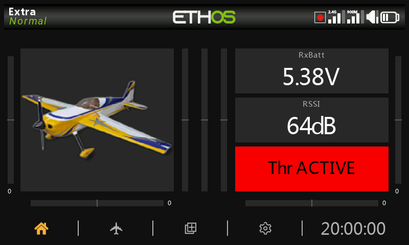
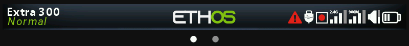
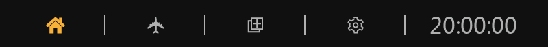
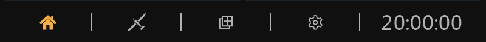
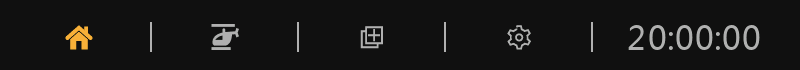

# Configured main view

## The top bar

The top bar displays the model name on the left, as well as the active flight mode if configured. On the right are icons for:

- Whether data logging is active
- RSSI 2.4G
- RSSI 900M
- Speaker sound volume
- Radio battery status
- Screen locked (see top bar below)
- USB connected (see top bar below)
- Trainer icon for master or slave as appropriate (see top bar below)

Touching the speaker and battery icons will bring up the relevant General (Audio etc.) and Battery control panels.

### Error warning

When ETHOS detects an error a red triangle error warning icon is displayed in the main view top bar.

Errors may be due to:

- Lua script errors
- RAM backup error
- Running a nightly firmware build

Error messages relating to the warning are displayed in the System / Info page. Please refer to the [Errors](../system-setup/info.md) section.

## The bottom bar

The bottom bar has four tabs for accessing the top level functions, i.e from left to right: Home, [Model Setup](../model-setup/index.md), [Configure Screens](../configure-screens/index.md), and [System Setup](../system-setup/index.md). The system time is displayed on the right. Touching the time will bring up the Date & Time settings.

The Model Setup icon above is for an Airplane type model.

The Model Setup icon above is for a Glider type model.

The Model Setup icon above is for a Heli type model.

The Model Setup icon above is for a Multirotor type model. There are additional icons for surface type models etc.

## The widgets area

The middle area of the main views consists of widgets which may be configured to display images, timers, telemetry data, radio values etc. The default main screen has a widget on the left for a model image and three widgets for timers, as well as displaying the trims and pots. The widgets are user configurable to display other information. Once multiple screens have been configured, they can be accessed using a touch swipe gesture or the Page key.

Please refer to the [Configure Screens](../configure-screens/index.md) section for more details.

Note: The ‘Throttle ACTIVE’ widget above is the Status widget available in the FrSky - ETHOS Lua Script Programming thread on rcgroups.
