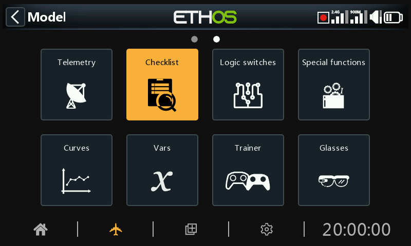
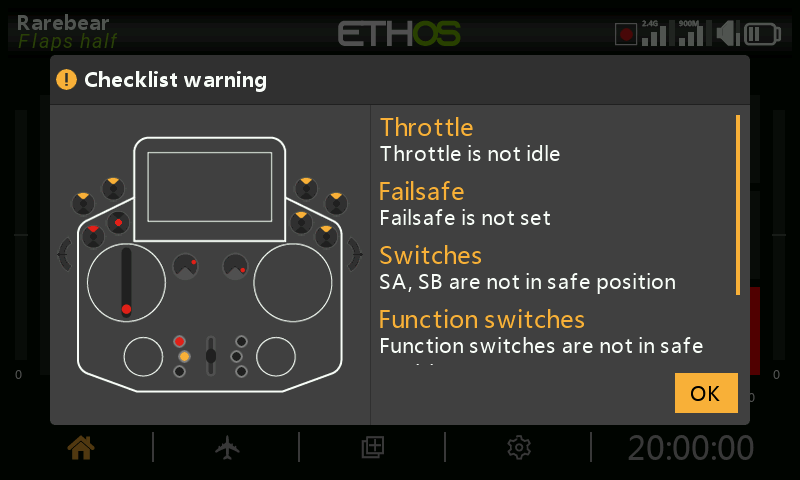
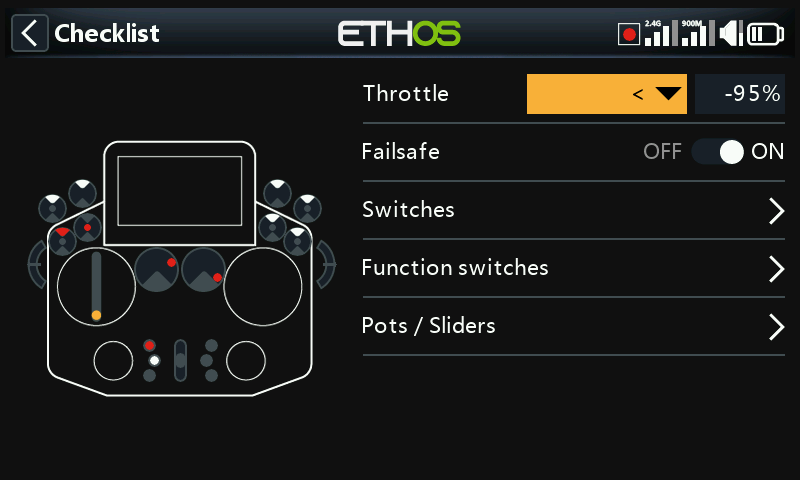
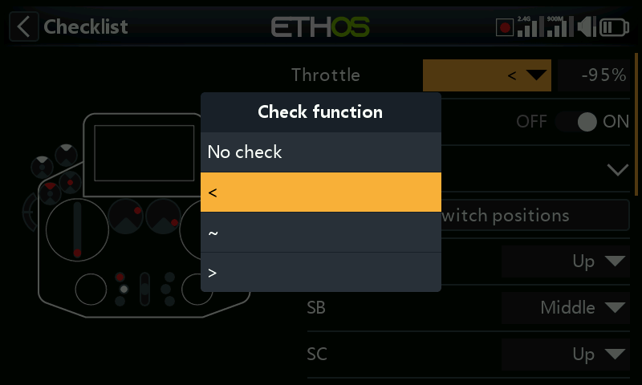
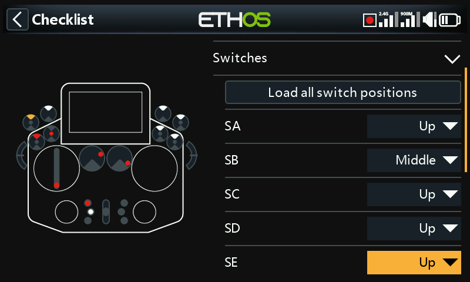
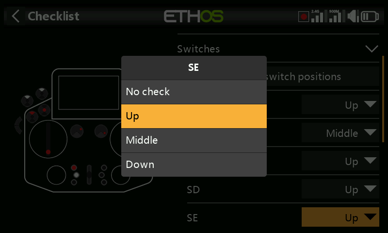
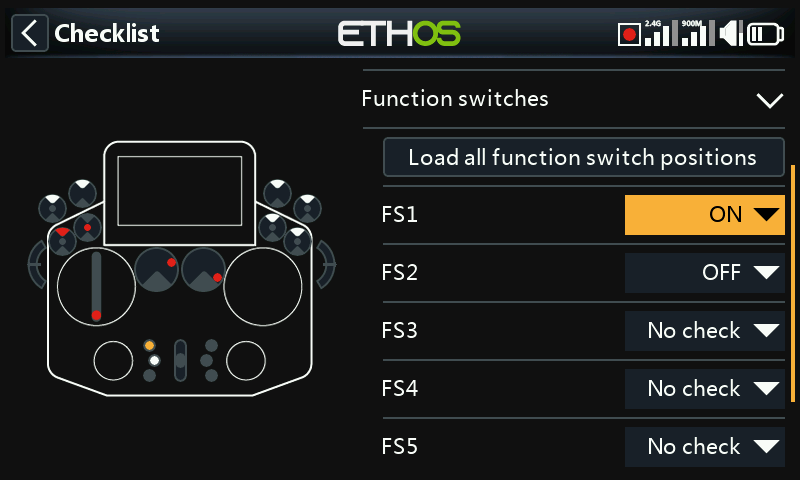
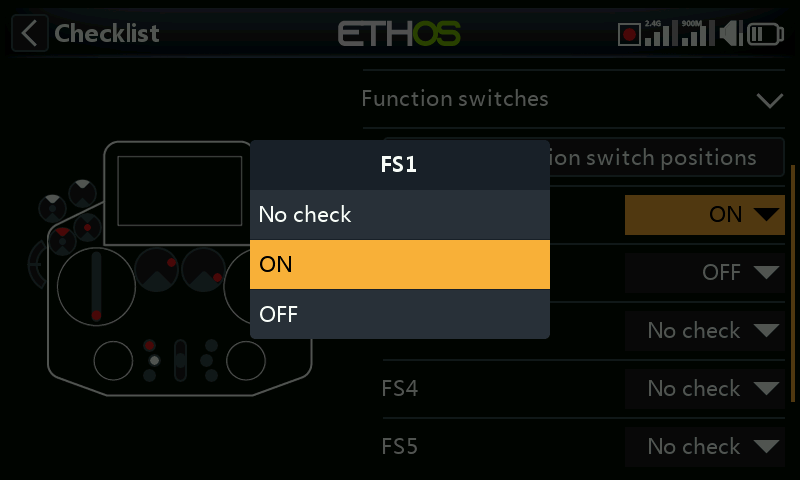
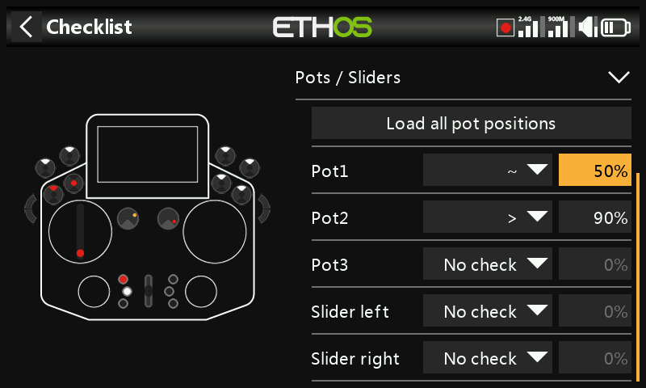
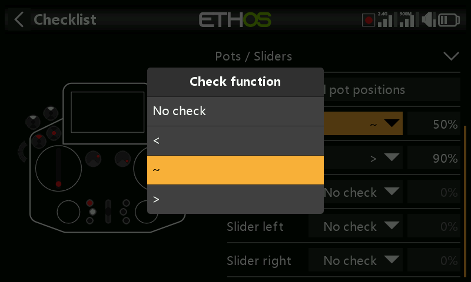

# Checklist

The Checklist function provides for a set of preflight checks. This is a group of safety features that take effect when powering up the radio and/or loading a model from the model list.

The default checks include radio is in silent mode, failsafe not set, switches and pots check, radio low battery, RTC battery low, etc. The switches check shows the direction the switch should be moved, please refer to the red dots in the warning screen example above.

Please note that contrary to the alert above, either the OK or RTN key will skip the preflight checks.

Additional checks can be set below.

## Throttle check

To enable throttle check, select the operator to be used. The options are ‘<’ less than, ‘~’ approximately equal, or ‘>’ greater than. The preflight check will warn you if the throttle stick is outside of the value set in the value parameter.

## Failsafe check

When enabled, it will warn you if Failsafe has not been set for the current model. It is highly advisable to leave this enabled!

## Switches check

For each switch, you can define whether the radio requests that switches to be in the desired predefined positions. If switches have been given user defined names in System / Hardware / ‘Switches settings’, the names will be displayed.

The ‘Load all switch positions’ option can be used to read the desired positions from the current switch positions except for those marked ‘No check’.

The check options are shown above.

## Function switches check

For each function switch, you can define whether the radio requests that switches to be in the desired predefined positions. The options are shown above.

The ‘Load all function switch positions’ option can be used to read the desired positions from the current function switch positions except for those marked ‘No check’.

## Pots / Sliders check

Defines whether the radio requests the pots and sliders to be in predefined positions at startup. The desired pot values can be entered for each pot.

The ‘Load all pot positions’ option can be used to read the desired positions from the current pot positions except for those marked ‘No check’. A careful check must be made to ensure that the automatically selected operators are as desired (i.e. ‘~’ vs ‘<’ or ‘>’).

Alternatively, the check functions may be set individually (i.e. ‘~’ vs ‘<’ or ‘>’).

## User defined text

The Checklist function can also display user defined text. The text can be plain text or enhanced text.

Once the text file is installed for a given model and that model is loaded the radio will display the Checklist as part of the startup routine. Please refer to How to set up a User Defined Text Checklist in the How To section.
