# Curves

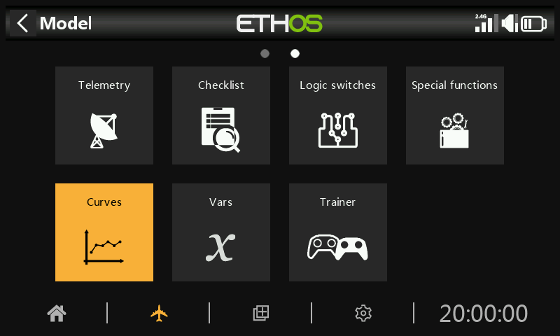

Curves may be used to modify the control response in the Mixes or Outputs. While the standard Expo curve is available directly in those sections, this section is used to define any custom curves that may be required. The 'Add curve' function may also be reached from the Mixes and Outputs edit screens directly.

There are 50 curves available.

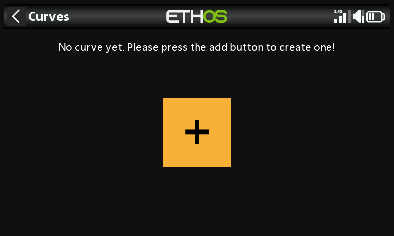

There are no default curves (except Expo which is built in). Tap on the ‘+’ button to add a new curve.

Once curves have been defined, tapping on one will bring up a popup menu, allowing you to edit, move, copy/paste, clone or delete that curve. You can also add a new curve by selecting ‘Add’, or by tapping on the ‘+’ symbol next to the column headings.

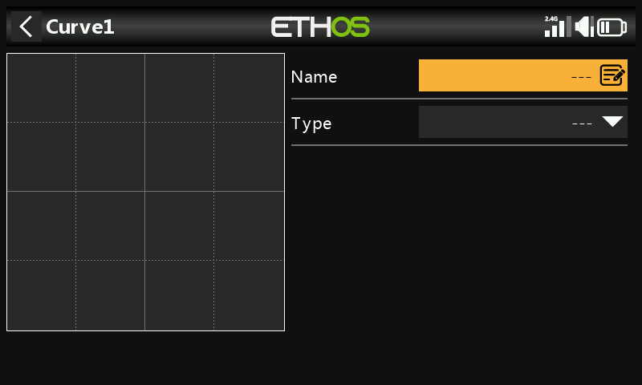

The initial screen allows you to name your curve, and to select the curve type.

The available curve types are:

## Expo

The default exponential curve has value of 40.

A positive value will soften the response around 0, while a negative value will sharpen the response around 0. Softening the response around mid stick helps to avoid over controlling the model, especially for beginners.

## Function

The following mathematical function curves are available:

x > 0

If the source value is positive, then the curve output follows the source.

If the source value is negative, then the curve output is 0.

Offset

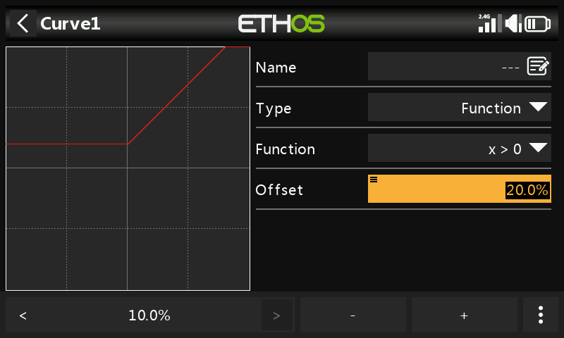

Note that all curves can have a positive or negative offset which will shift the curve upwards or downwards on the Y axis. Curves offsets and Y value have a one decimal precision.

x < 0

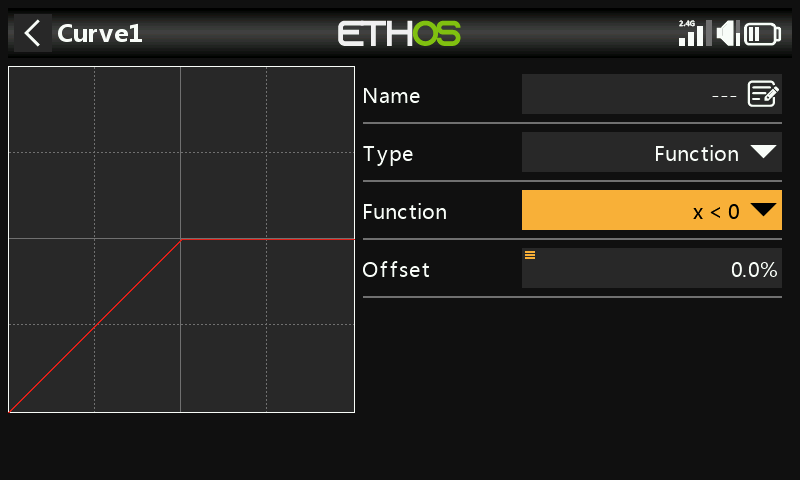

If the source value is negative, then the curve output follows the source.

If the source value is positive, then the curve output is 0.

|x|

The curve output follows the source, but is always positive (also called ‘absolute value’).

f > 0

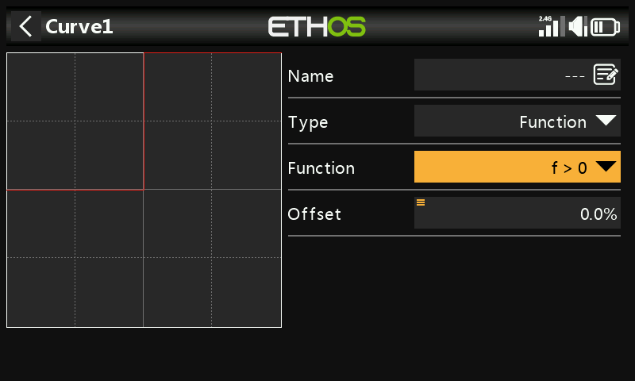

If the source value is negative, then the curve output is 0.

If the source value is positive, then the curve output is 100%.

f < 0

If the source value is negative, then the curve output is -100%.

If the source value is positive, then the curve output is 0.

|f|

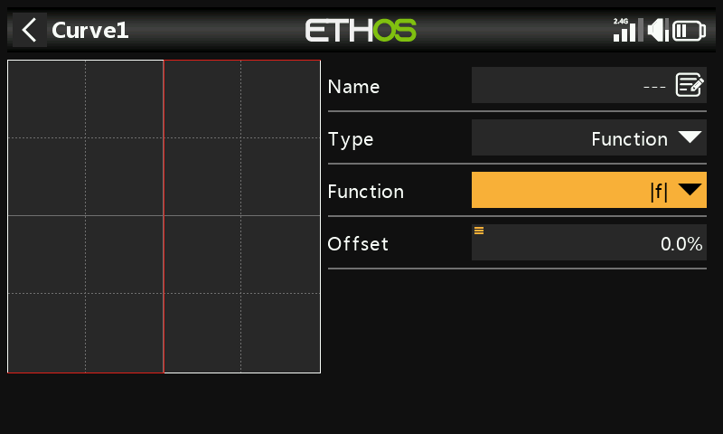

If the source value is negative, then the curve output is -100%.

If the source value is positive, then the curve output is +100%.

## Custom

Points count

The default custom curve has 5 points. You may have up to 21 points on your curve.

##### Menu buttons

 The source(s) configured in the curve’s mixes may be used, or optionally any other convenient analog input. If you select this 'Auto analog input' option, the first stick, slider or pot you move will be used as the source for X.

When selected, the nearest curve point on the X axis will be automatically selected for adjustment with the rotary encoder.

The input must be adjusted to align the X value with a curve point before adjustment is made.

 Tapping on this icon, or pressing the ENTER key while in graph edit mode will toggle Lock mode on and off. When enabled, all inputs are locked so that you can release the stick input, allowing you to observe the control surfaces while you adjust your curve.

To assist in setup, the cursor will be active, showing the value of the input that is driving the curve.

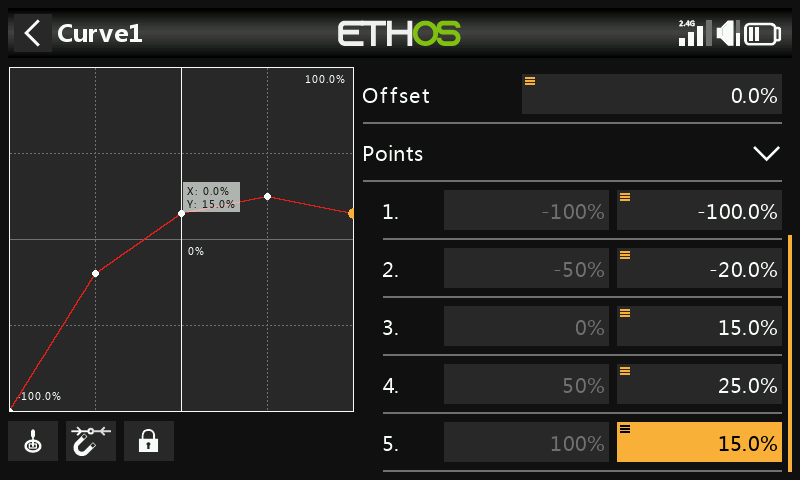

Curves offsets and Y value have a one decimal precision.

Smooth

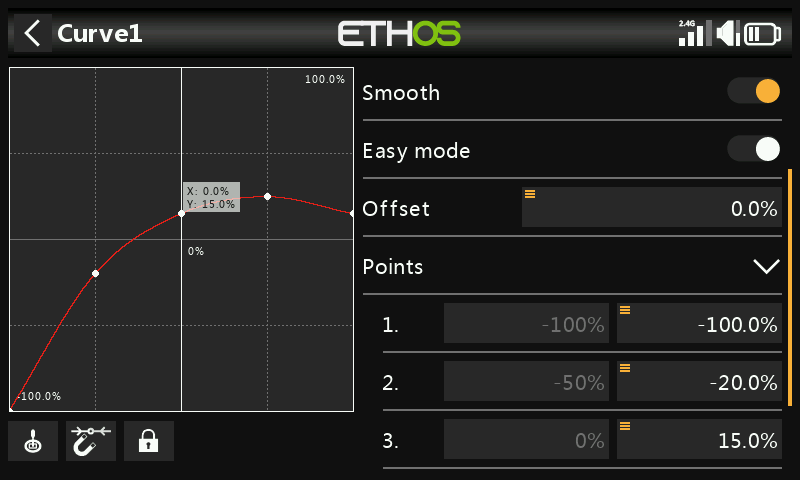

If enabled a smooth curve is created through all points.

Easy mode = On

Easy mode has equidistant fixed values on the X axis, and only allows the Y coordinates for the curve to be programmed.

Points

With Easy Mode On, only the Y coordinates may be configured (see examples above).

Easy mode = Off

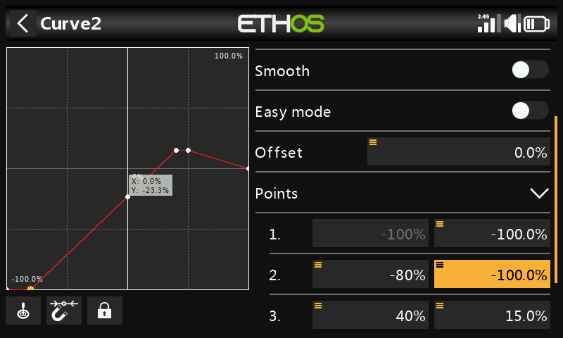

Points

With ‘Easy mode’ Off, both the X and Y coordinates may be configured, (see example above).  Note that the -100% and +100% X coordinates for the curve end-points cannot be edited, because the curve must cover the full signal range.

## Function curve ***offset*** change in flight

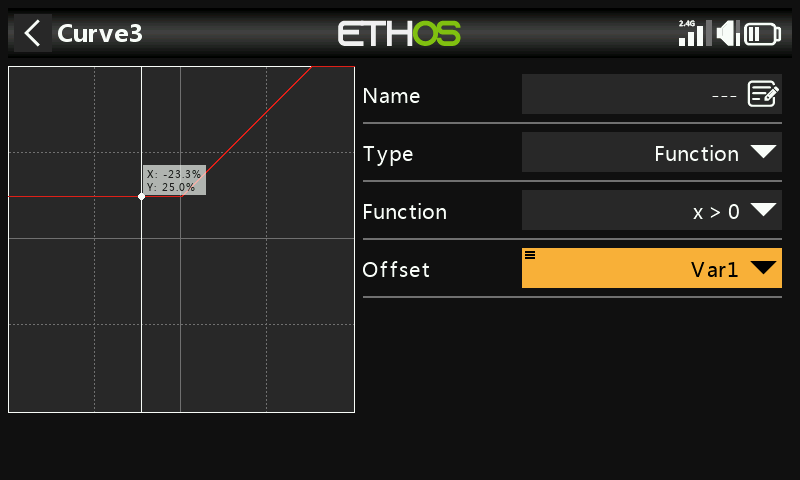

The above example shows the Offset parameter of a curve of type “Function" driven by a Var, which could possibly be adjusted in flight by a reassigned Trim.

## Curve point change in flight

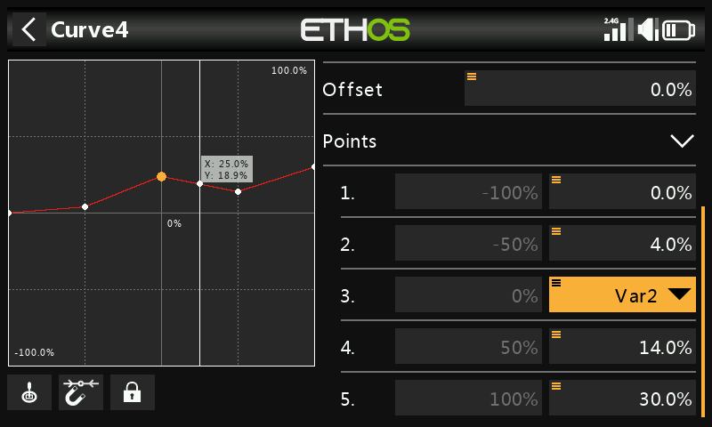

In this example above the middle curve point is being driven by a Var, which again could be adjusted in flight by a reassigned Trim. Please refer to the [VARs](variables.md) section for more details.
