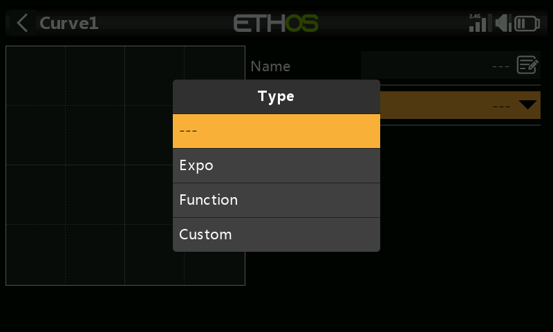
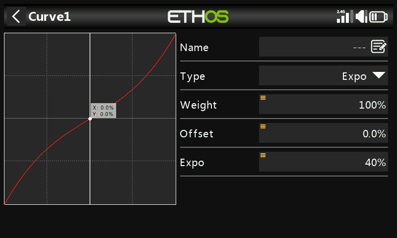
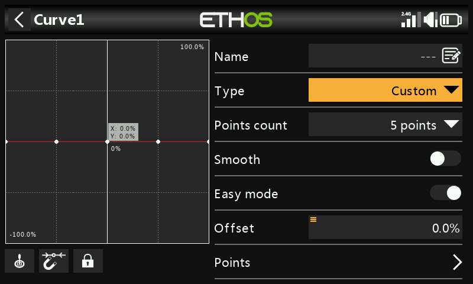
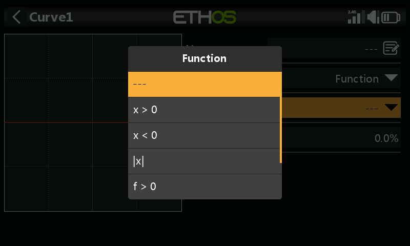

# Curves

Reusable response curves that can be attached to any mix (see [Mixes —
Curve](mixes.md#anatomy-of-a-mix)) — beyond the built-in Expo, this covers
custom point-based curves and function curves (e.g. `x>0`, absolute value).

!!! note "Draft"
    This page is a placeholder — full content coming in a later pass.
