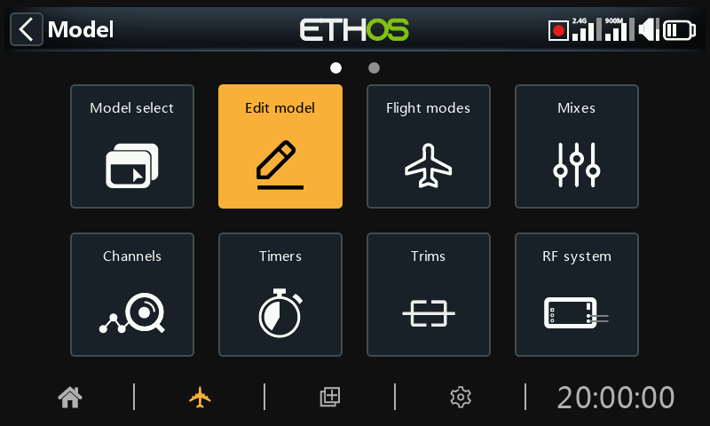
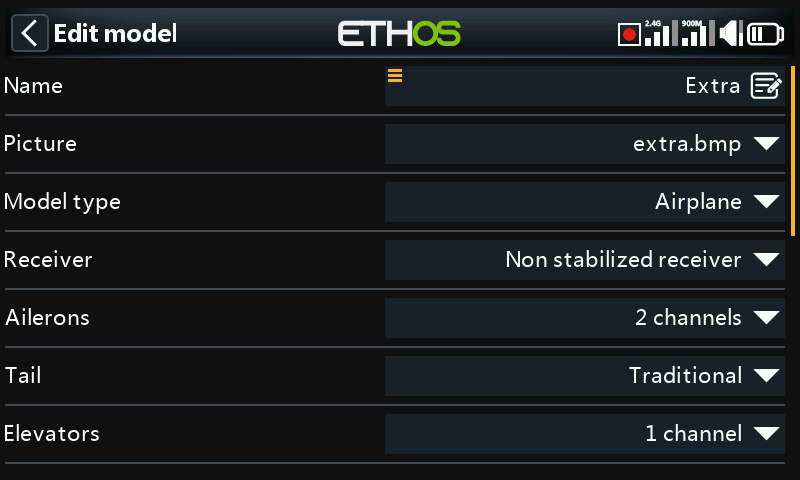
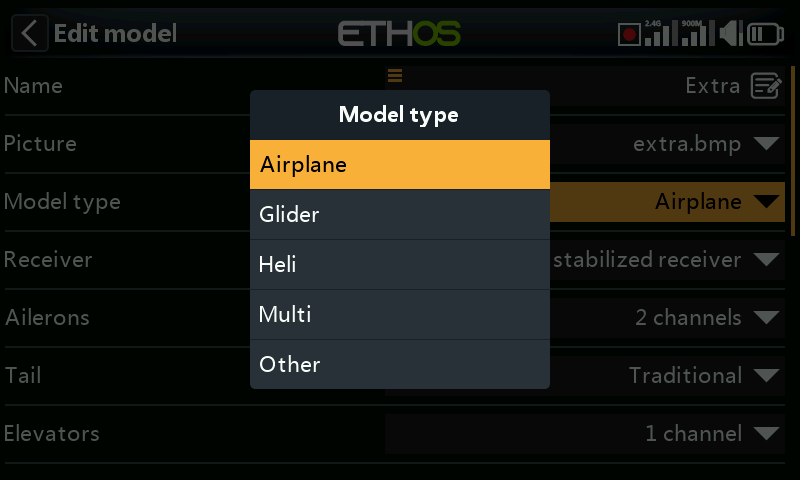
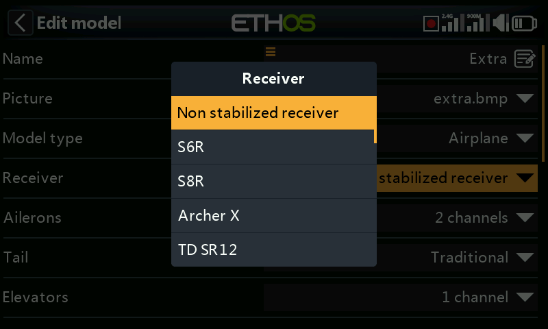
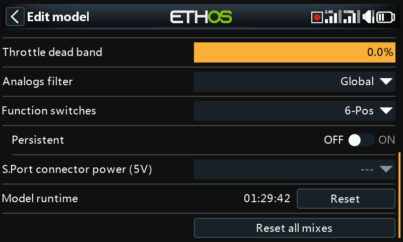
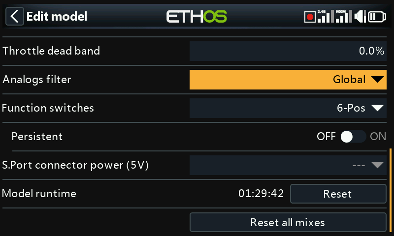
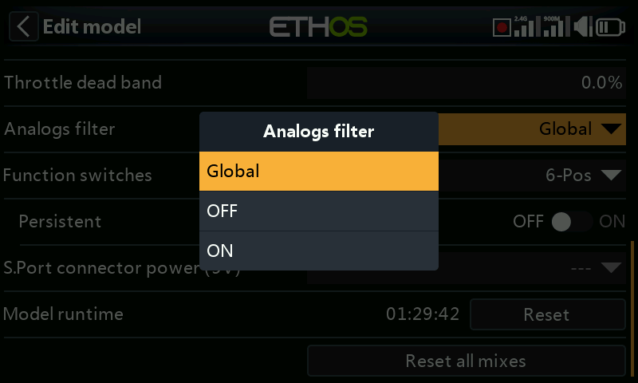
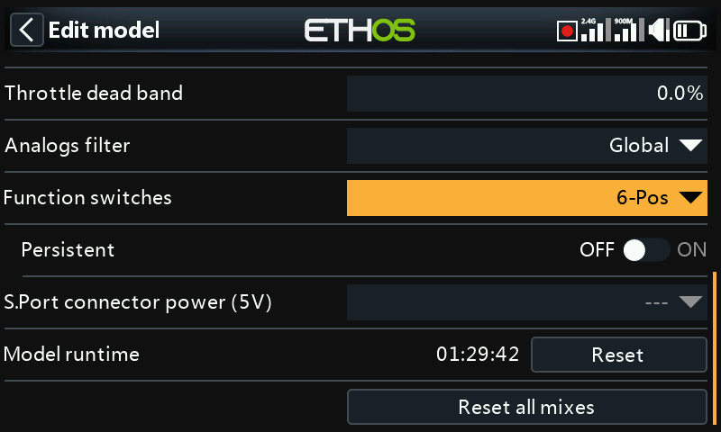
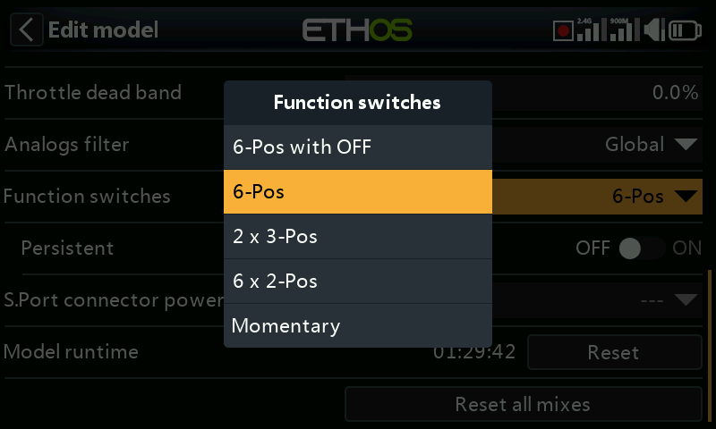
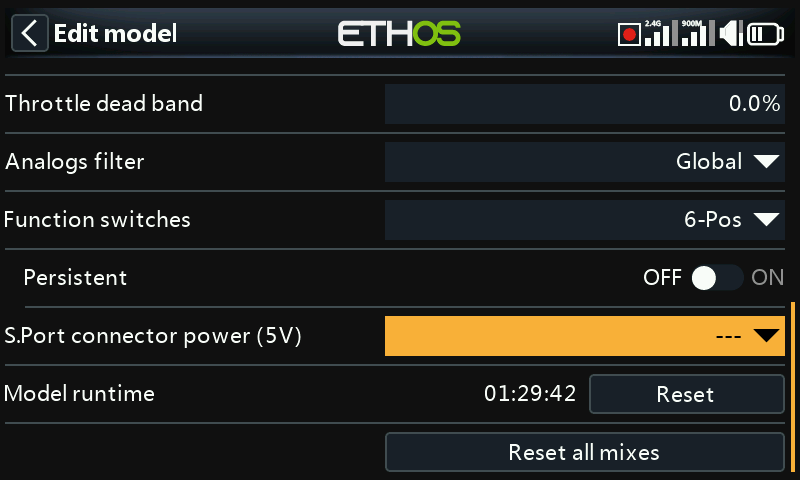

# Edit model

The ‘Edit model’ option is used to edit the basic parameters for the model as set up by the wizard.

## Name, Picture

The model can be renamed, or the picture assigned or changed. When browsing for a picture a preview thumbnail is shown to facilitate locating the correct image.

Model bitmaps must be located in the [bitmaps/models](../system-setup/file-manager.md) folder on the SD card or eMMC.

## Model type

Changing the model type will cause all mixes to be reset.

## Receiver

Lists the current receiver type, which can be changed.

## Channel assignments

Changing the tail type, or heli swash plate will cause all mixes to be reset. On the other channels the number of assigned output channels can be changed or unassigned.

## Throttle dead band

Allows configuration of a throttle deadband for zero-based throttles with forward and reverse to avoid unintended motor movement when the stick is at neutral.

## Analogs filter

There is a global analog to digital converter filter setting on the Hardware page under [Analogs Filter](../system-setup/hardware.md), which may improve jitter around stick centre. This model specific setting can be used to override the global setting.

## Function switches

The six function switches are available wherever 'Active condition' parameters are found. Please note that they cannot be used as a source like normal switches can.

### Configuration

They may be configured as follows:

#### 6-Pos with OFF

Pressing any function switch will latch that switch ON. However, pressing a switch that is already ON a second time will turn it off, leaving all six function switches OFF.

#### 6-POS

Pressing any function switch will latch that switch ON until a different function switch is pressed to latch the newly pressed switch ON.

#### 2 x 3-Pos

Breaks the 6 function switches into two groups of 3. Each group can have one switch ON.

#### 6 x 2-Pos

Breaks the 6 function switches into 6 latching switches. Each switch can be ON or OFF.

#### Momentary

Breaks the 6 function switches into 6 momentary switches. Each switch is ON while depressed.

### Persistent

If enabled, this will cause the function switch to be in the same state when the radio is turned on or the model is reloaded.

## S.Port connector power (5V)

The ‘+’ (middle) pin on the S.Port connector may be configured as follows:

- The ‘+’ (middle) pin on the S.Port connector may be left switched off. Use the ‘---’ option.
- The ‘+’ (middle) pin on the S.Port connector may be configured as ‘Always on’ to provide +5V to a peripheral device. 
- The ‘+’ (middle) pin on the S.Port connector may be controlled by a switch or other source to provide +5V to a peripheral device.

Care must be taken not to overload the output.

## Model runtime

The model runtime timer keeps track of the total time that the model has run. Press the model runtime reset button to reset it.

## Reset all mixes

Executing 'Reset all mixes' will reset all the mixes.
