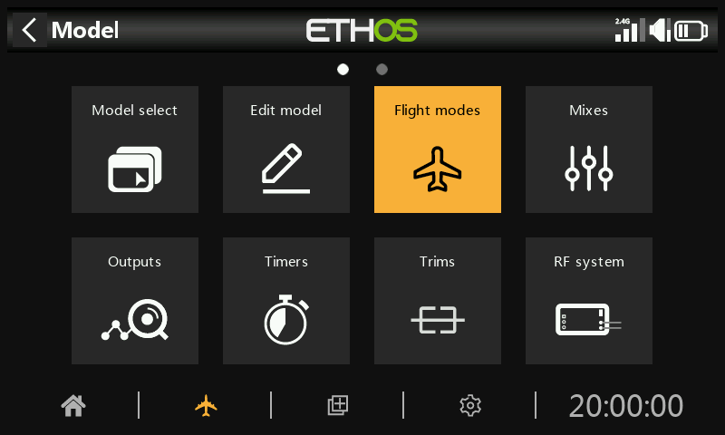
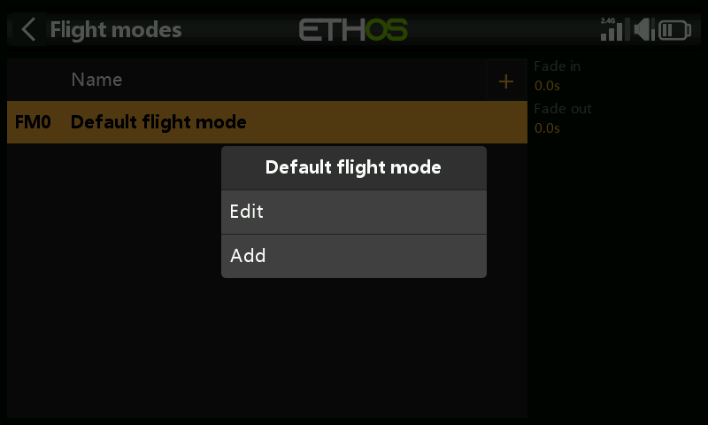
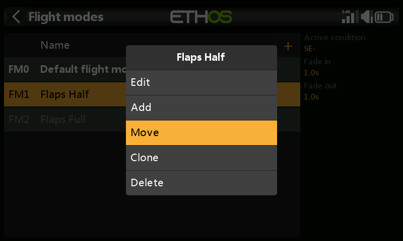
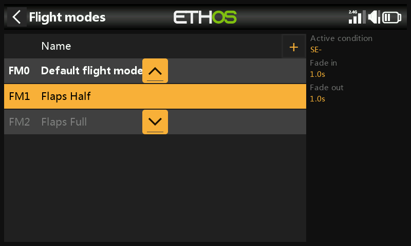

# Flight modes

Flight modes bring incredible flexibility to a model setup, because they allow models to be set up for switch selectable specific tasks or flight behavior. For example, gliders may be set up to have switch selectable modes such as Launch, Cruise, Speed and Thermal. Power planes may have flight modes for Normal precision flying, Take Off, and Landing with either half or full flaps deployed. Helicopters have modes such as Normal for spool up and take off/landing, Idle Up 1 for aerobatic flying, and Idle Up 2 for perhaps 3D.

Flight modes remove much of the switching and trimming burden from the pilot.

The great power of flight modes is that they support independent trims and can also be used to enable Vars and Mixes. Together, these features allow for great flexibility. Please refer to the [Introduction to Flight Modes](../tutorials/basic-fixed-wing.md) in the Tutorials section to see examples of these features applied.

There are no default flight modes defined. Tap on the default flight mode, and select Edit if you wish to rename it, otherwise select Add to define a new flight mode. There may be up to 20 flight modes.

## Name

Allows the flight mode to be named.

## Active condition

When adding a flight mode the default active condition is inactive, i.e ‘---’. Flight modes may be controlled by switch or button positions, function switches, logic switches, a system event such as throttle cut or hold, or trim positions.

Note that the default flight mode does not have an ‘Active condition’ parameter, because this is the flight mode that is always active when no other flight mode is active. The first flight mode that has its switch ON is the active one. Note that only one flight mode is active at a time.

The active flight mode is shown in bold.

## Fade in, out

The times assigned for smooth transitions between flight modes. The example shows one second assigned to each. Please note that flight mode fade in / fade out only works if the mix is flight mode dependent.

Once programed the flight mode selections are displayed in the mixes. Up to 100 flight modes can be programmed. Like most functions in ETHOS the user can program descriptive text flight mode names such as Cruise, Speed, Thermal or Normal, Take Off, Landing.

Please note when adding a new flight mode to a model all mixes using flight modes must be checked for correct operation, because the new flight mode will by default be active in all mixes using flight modes. This is an issue for example when using a Lock mix to lock a specific channel in a specific FM.

## Flight mode management

Tap on a flight mode to bring up a menu which allows you to edit, add a new flight mode, clone or delete flight modes.

A cloned flight mode will inherit the parent’s flight mode settings in mixes, so the mixes will behave the same and also be active (or not) when the cloned flight mode is active. The new clone should be added as the last FM so that it can't interfere with any existing FM.

You can use the 'Move' option to change the priority of a flight mode. The priority of flight modes is in ascending order, and the first one that has its switch ON is the active one.
