# Glasses

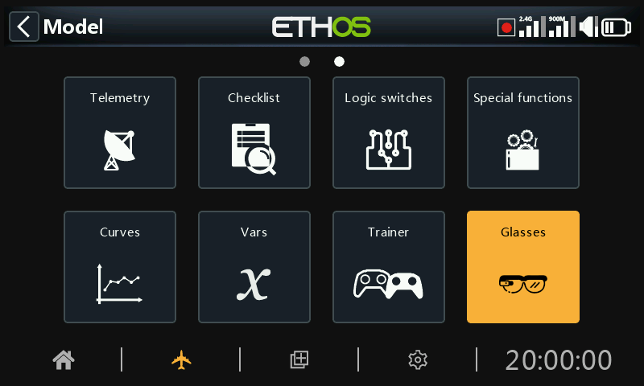

The Glasses menu facilitates the connection and configuration of ActiveLook glasses, allowing the wearer to view real-time flight data, telemetry, and FPV video as a heads-up display in the glasses.

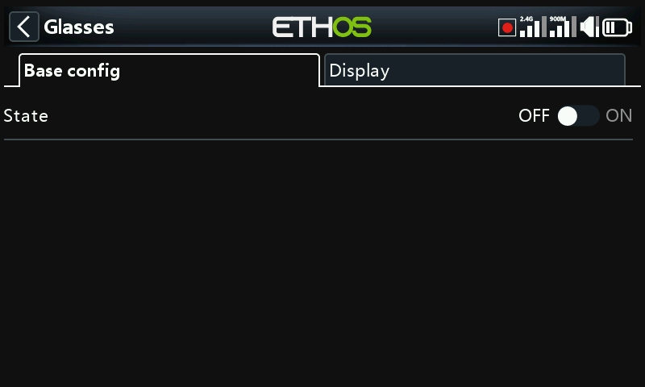

The Glasses menu consists of two tabs, ‘Base config’ for connection configuration, and ‘Display’ for configuring the heads-up display.

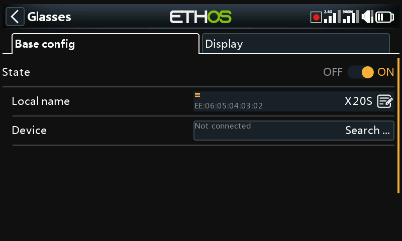

## Base config

### State

The Glasses function can be enabled/disabled.

### Local name

#### Local address

This is the local Bluetooth address of the radio.

This is the local BT name that will be displayed in devices being connected. The default name is the radio model, but may be edited here.

### Device

#### Search

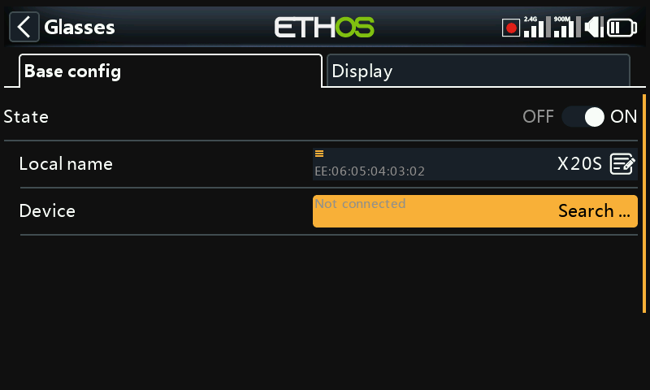

Tap on 'Search devices' to put the radio into BT search mode.

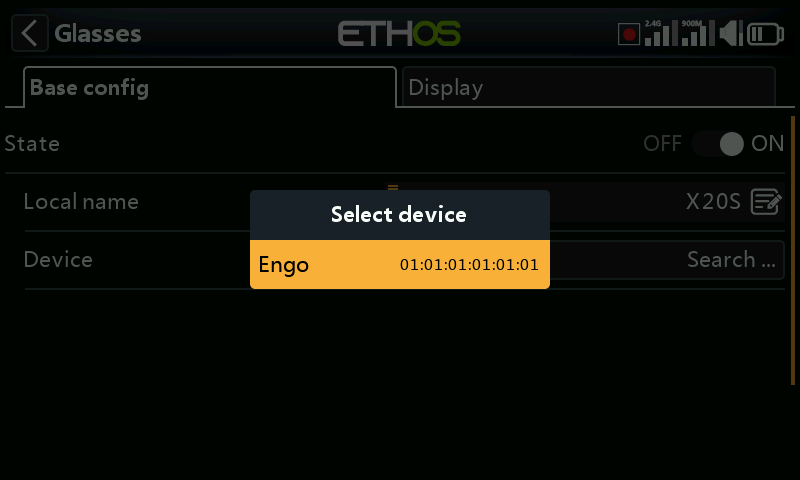

Found devices are listed in a popup dialog with a request to select a device. Select the BT address that matches the glasses to be used.

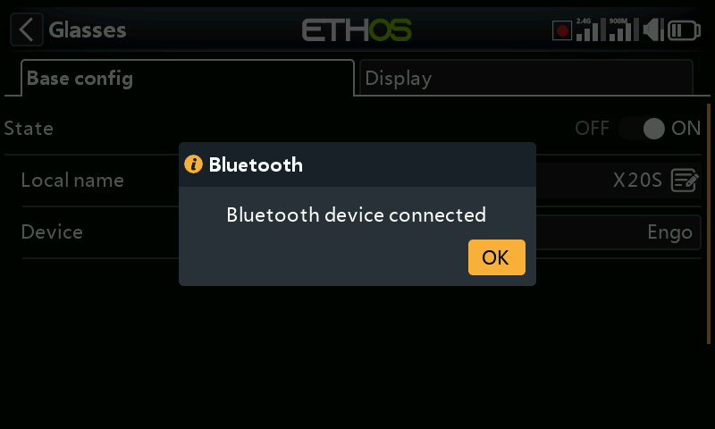

The selected BT device has been connected.

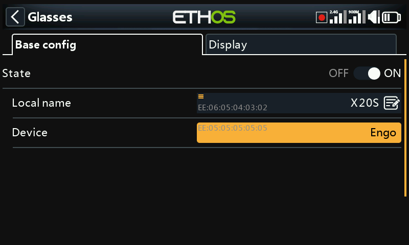

Once the glasses device has been found and linked, the remote glasses’ Bluetooth address is displayed on the Device line.

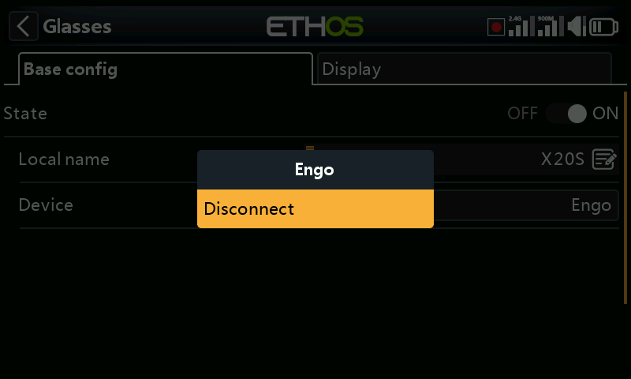

#### Disconnect

Tap on the Device to bring up a Disconnect option.

## Display

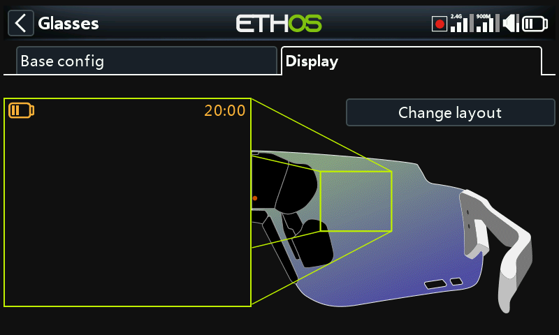

The ‘Display’ tab is used for configuring the heads-up display.

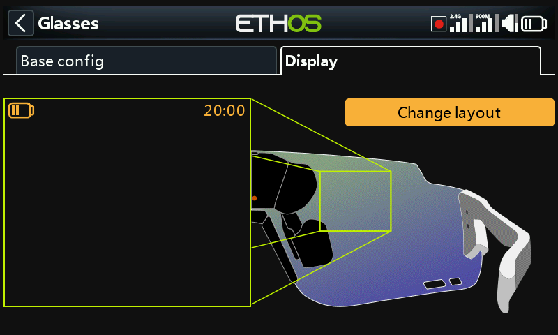

Tap on the ‘Change layout’ button to open the layout selection dialog.

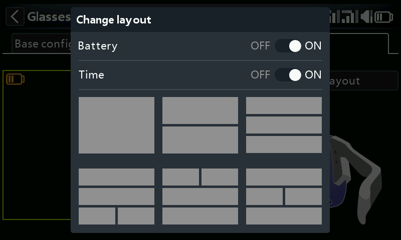

Select the desired layout from the 6 options in the menu.

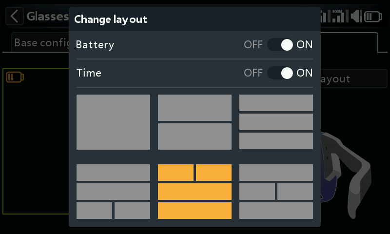

For this example number 5 has been chosen

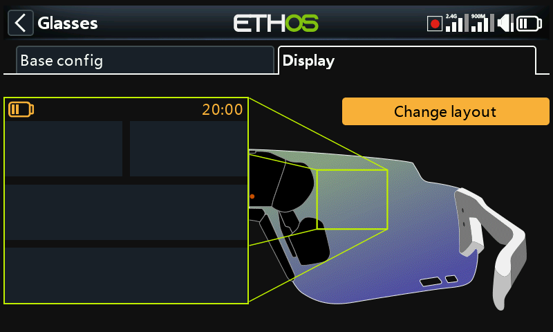

Layout 5 is ready for configuration.

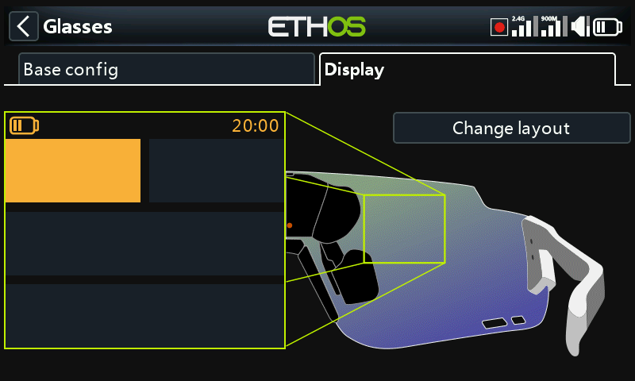

Select widget 1 for setup.

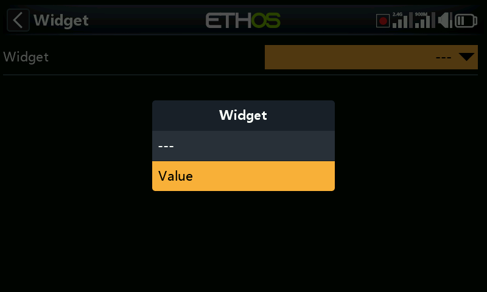

At this stage only Value widgets are available for selection.

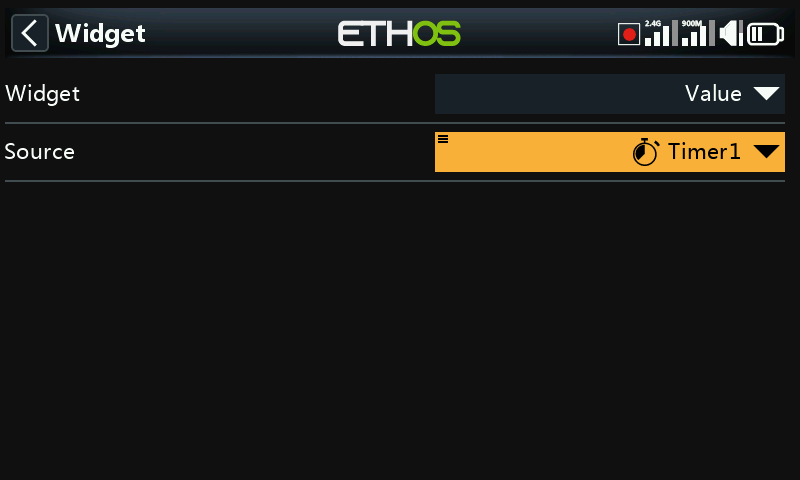

For this example timer 1 has been selected for display.

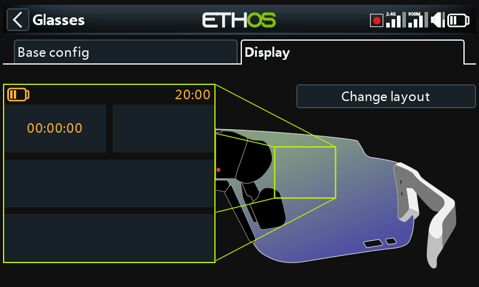

Widget 1 has been configured to display timer 1.

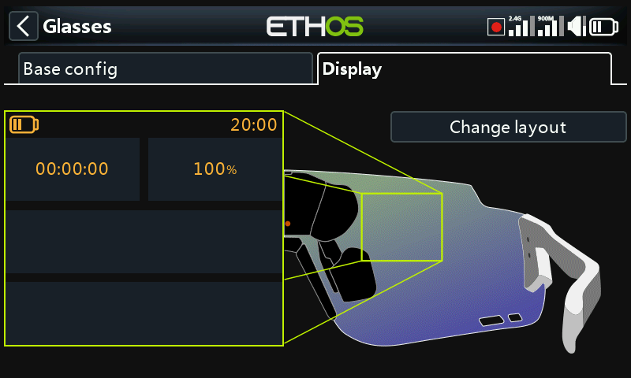

And widget 2 has been configured to display VFR Min.
