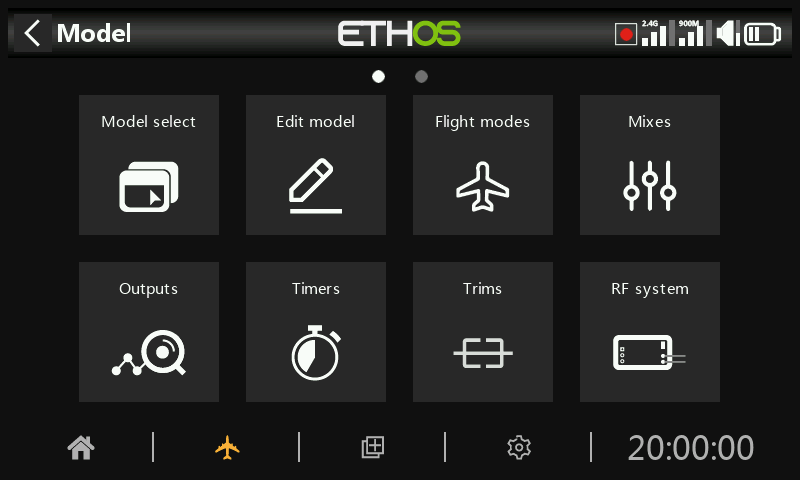

# Overview

Within System Setup, touch a tile to configure the selected section, or use the rotary selector to move the highlight to the desired tile, then press Enter. You can swipe left to access the second page of functions, or use the rotary selector to move the highlight to the second page. Alternatively, the Page key may be used to switch between the pages.

## Model select

The ‘Model select’ option is used to create, select, add, clone, or delete models. It is also used to create and manage user specific model category folders.

## Edit model

The ‘Edit model’ option is used to edit the basic parameters for the model as set up by the wizard, and is mainly used to edit the model name or picture. It is also used to configure the function switches, which are model specific.

## Flight modes

Flight modes allow models to be set up for switch selectable specific tasks or flight behavior. For example, gliders may be set up to have flight modes such as Launch, Cruise, Speed and Thermal. Power planes may have flight modes for Normal flying, Take Off and Landing. Helicopters have modes such as Normal for spool up and take off/landing, Idle Up 1 for aerobatic flying, and Idle Up 2 for perhaps 3D.

## Mixes

The Mixes section is where the model’s control functions are configured. It allows any of the many sources of input to be combined as desired and mapped to any of the output channels.

This section also allows the source to be conditioned by defining weights/rates and offsets, adding curves (eg Expo). The mix can be made subject to a switch and/or flight modes, and a slow function to be added.

## Outputs

The Outputs section is the interface between the setup "logic" and the real world with servos, linkages and control surfaces as well as actuators and transducers. In the Mixes we have set up what we want our different controls to do. This section allows these pure logical outputs to be adapted to the mechanical characteristics of the model. This is where we configure minimum and maximum throws, servo or channel reverse, and adjust the servo or channel center point using the PPM center adjustment, or add an offset using subtrim. We can also define a curve to correct any real world response issues. For example, a curve can be used to ensure that left and right flaps track accurately.

## Timers

The Timers section is used to configure the eight available timers.

## Trims

The Trims section allows you to configure the trim range and trim step size, or to configure custom trim behavior for each of the 4 control sticks. It also allows cross trims and instant trim to be configured. Some models have two additional trim switches T5 and T6, which are very useful for in-flight adjustments. Additional trims may be configured as required.

## RF system

This section is used to configure the ‘Owner registration ID’, and the internal and/or external RF modules. This is also where receiver binding takes place, and receiver options are configured.

The ‘Owner registration ID’ is an 8 character ID that contains a unique random code, which can be changed if desired. This ID becomes the ‘Registration ID’ when registering a receiver. Enter the same code in the ‘Owner registration ID’ field of your other transmitters you want to use the Smart Share feature with them. This must be done before creating the model you want to use it on.

## Telemetry

Telemetry is used for passing information from the model back to the RC pilot. This information can be quite extensive, and includes RSSI (receiver signal strength) and VFR (valid frame rate), various voltages and currents, and any other sensor outputs such as GPS position, altitude, etc.

Note that the telemetry screens are set up as main views in the [Configure Screens](../displays/index.md) section.

## Checklist

The Checklist section is used to define startup alerts for things like initial throttle position, whether failsafe is configured, pot and slider positions, and initial switch positions.

## Logic switches

Logic switches are user programmed virtual switches. They aren’t physical switches that you flip from one position to another, however they can be used as program triggers in the same way as any physical switch. They are turned on and off by evaluating the conditions of the programming. They may use a variety of inputs such as physical switches, other logical switches, and other sources such as telemetry values, channel values, timer values, or Vars. They can even use values returned by a LUA model script.

## Special functions

This is where switches can be used to trigger special functions such as trainer mode, soundtrack playback, speech output of variables, data logging etc. Special Functions are used to configure model specific functions.

## Curves

Custom curves can be used in input formatting, in the mixes or in the outputs. There are 50 curves available, and can be of several types (between 2 and 21 point, with either fixed or user-definable x-coordinates).

In the Mixes a typical application is using an Expo curve to soften the response around mid-stick. A curve may also be used to smooth a flap to elevator compensation mix so that the aircraft does not 'balloon up' when flaps are applied.

In the Outputs a balancing curve may be used to ensure accurate tracking of the left and right flaps.

## Vars

Variables (Vars) can be used to name and store a model’s settings parameters in a way which can then be referenced elsewhere in the radio programming including the mixes. Vars can be thought of as containers that hold information.

## Trainer

The Trainer section is used to set the radio as a Master or Slave in a trainer setup. The trainer link can be via Bluetooth or a cable.

## Lua

This page is used to manage Lua sources and tasks on a per-model basis.
