# Logic Switches

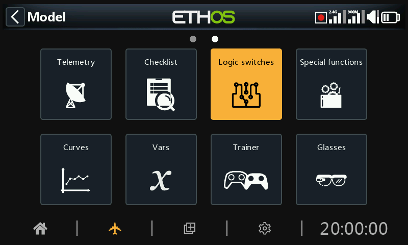

Logical switches are user programmed virtual switches. They aren’t physical switches that you flip from one position to another, however they can be used as program triggers in the same way as any physical switch. They are turned on and off (in logical terms they become True or False) by evaluating the input conditions against the programming for the logical switch. They may use a variety of inputs such as physical controls and switches, other logical switches, and other sources such as telemetry values, mixes values, timer values, gyro and trainer channels. They can even use values returned by a LUA model script (to be supported).

Up to 100 logic switches are supported.

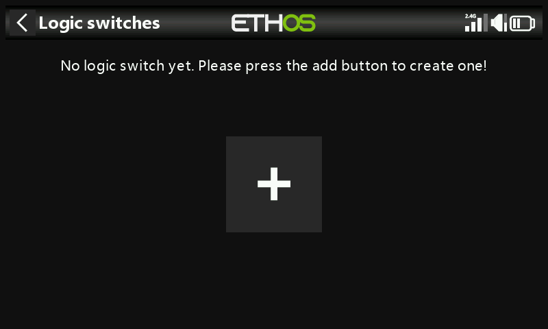

There are no default logic switches. Tap on the ‘+’ button to add a logic switch.

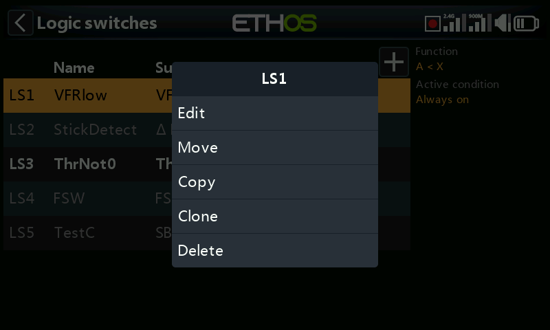

Once logic switches have been defined, tapping on a logic switch will bring up the above popup menu, allowing you to edit, move, copy/paste, clone or delete that switch.

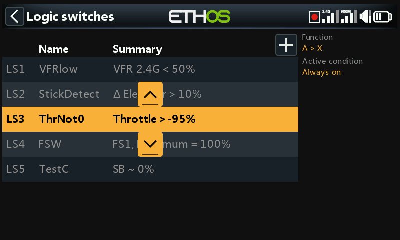

Selecting 'Move' will bring up arrow keys allowing the logic switch to be moved up or down.

## Adding logic switches

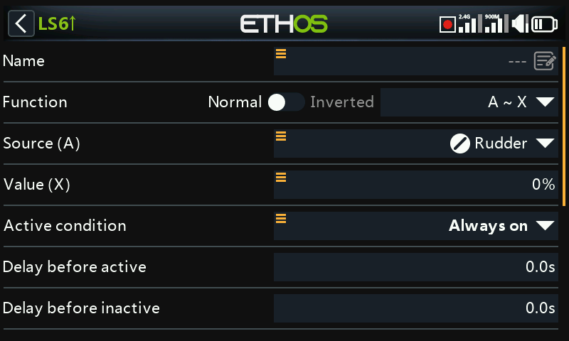

Note that the logic switch label in the menu heading is green when the state of the logic switch is True, or red when False.

### Name

Allows the logic switch to be named.

### Function

The functions available are listed below. Please note that all functions may have normal or inverted outputs. Please also refer to the shared parameters section, as well as the telemetry and comparison of sources sections following the function descriptions below.

#### A ~ X

The condition is True if the value of the selected source 'A' is approximately equal (within about 10%) to 'X', a user defined value.

In most cases, it is better to use the approximately equals function rather than the 'exactly' equals function.

#### A = X

The condition is True if the value of the selected source 'A' is 'exactly' equal to 'X', a user defined value.

Care must be taken when using the 'exactly' equals function. For example, when testing if a voltage is equal to a setting of 8.4V, the actual telemetry reading may jump from 8.5V to 8.35V, so the condition is never met and the Logical Switch will never turn on.

#### A > X

The condition is True if the value of the selected source 'A' is greater than 'X', a user defined value.

#### A < X

The condition is True if the value of the selected source 'A' is less than 'X', a user defined value.

#### |A| > X

The condition is True if the absolute value of the selected source 'A' is greater than 'X', a user defined value. (Absolute means disregarding whether 'A' is positive or negative, and just using the value.)

#### |A| < X

The condition is True if the absolute value of the selected source 'A' is less than 'X', a user defined value. (Absolute means disregarding whether 'A' is positive or negative, and just using the value.)

#### ∆ > X

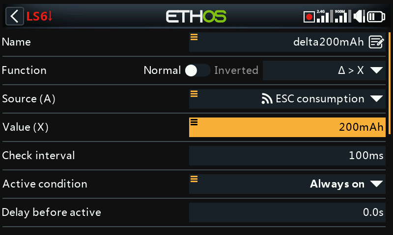

The condition is True if the change in value 'd' (i.e. delta) of the selected source ‘A’ is greater than or equal to the user defined value 'X', within the 'Check interval'. If the 'Check interval' is set to '---', then the check interval becomes infinite.

Please refer to [this example](../programming-tutorials/how-to-section.md) for one use of the Delta function.

#### |∆| > X

The condition is True if the absolute value of the change '|d|' in the selected source ‘A’ is greater than or equal to the user defined value 'X'. (Absolute means disregarding whether ‘A’ is positive or negative.). again, if the 'Check interval' is set to '---', then the check interval becomes infinite.

#### Range

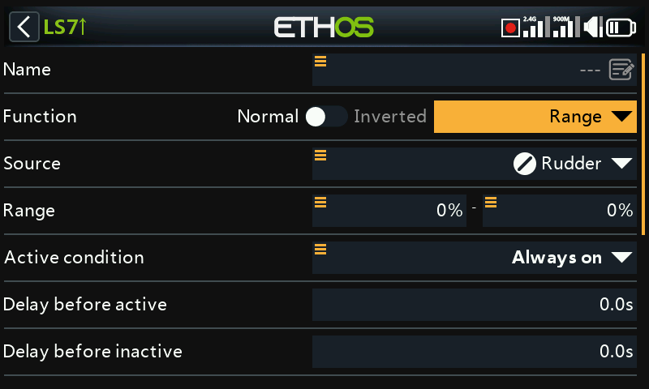

The condition is True if the value of the selected source 'A' is within the range specified.

#### AND

The AND function can have multiple values. The condition is True if **all** the sources selected in Value 1, Value 2 ... Value(n) are true (i.e. ON).

#### OR

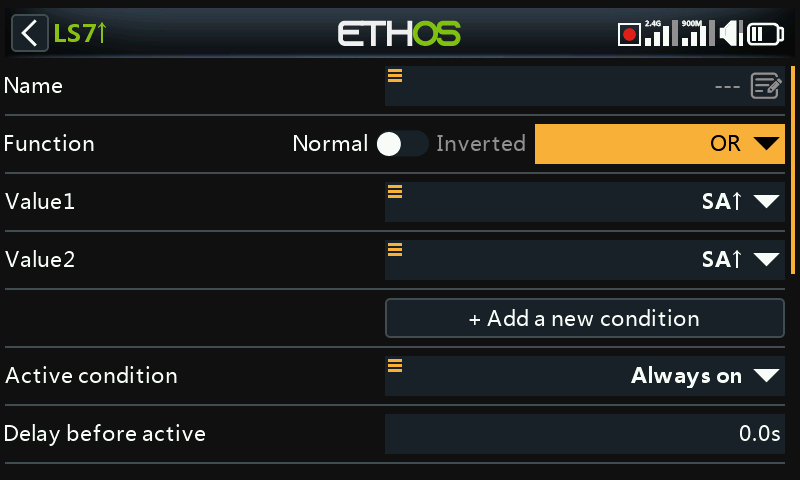

The condition is True if **at least one** **or more** of the sources selected in Value 1, Value 2 … Value(n) are true (i.e. ON).

#### XOR (Exclusive OR)

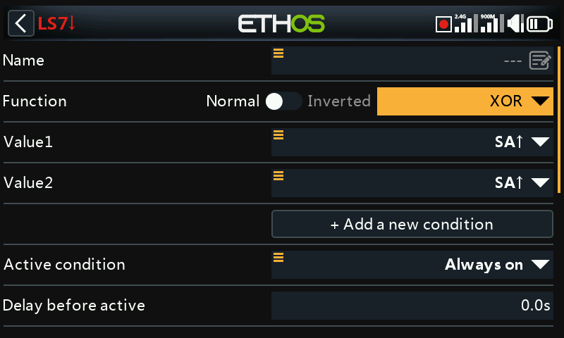

The condition is True if **only** **one** of the sources selected in Value 1, Value 2 … Value(n) are true (i.e. ON).

#### Timer generator

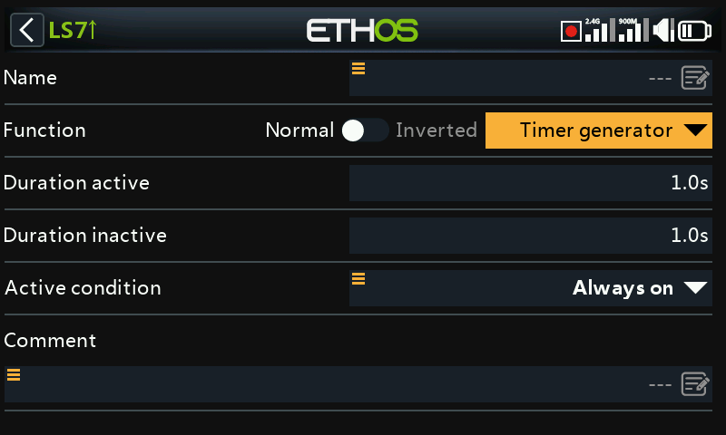

The logical switch toggles on and off continuously. It switches on for time ‘Duration active’, and off for time ‘Duration inactive’.

#### Sticky

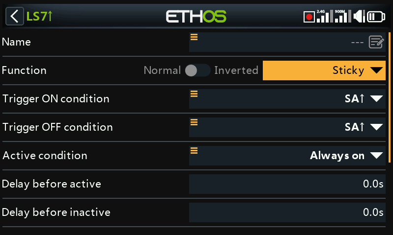

Or with Edge options:

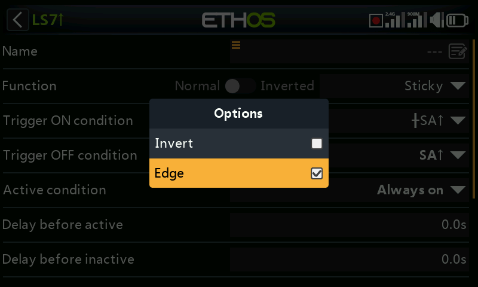

For the Edge option, long press \[ENT\] on the Trigger ON or Trigger OFF condition, then select Edge. A ‘†’ character will be displayed as a prefix to indicate the Edge option.

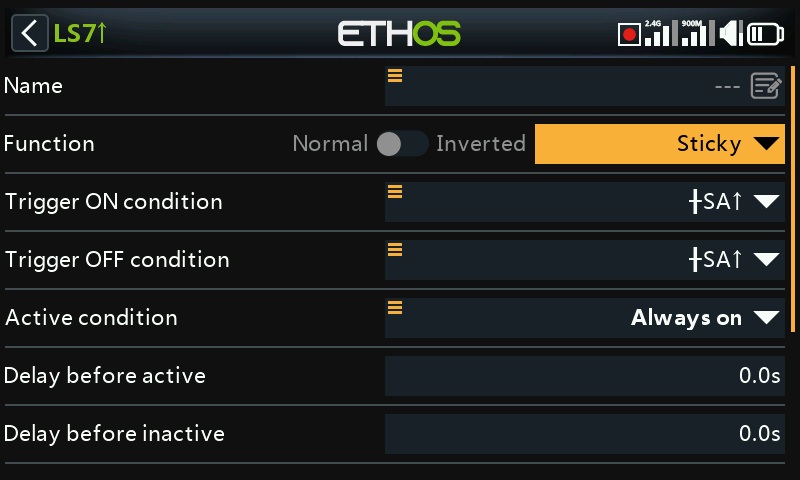

The Sticky logic switch has a latching function, also known as a Set/Reset Flip-flop. Its operation is akin to that of a JK flip-flop, and therefore always has unambiguous states at its output. It latches ON (i.e becomes True) when the Trigger ON conditions are met, and holds its value until it is forced to False when the Trigger OFF conditions are met. This can be gated by the optional ‘Active condition’ parameter. This means that if the active condition is True, then the Sticky output follows the Sticky function's latched condition, subject to Delays. However, if the active condition is False, then the logical switch output is also held False.

**Note**: The Sticky logic switch function has been enhanced in Ethos 1.6.2 by the addition of the Edge option on the trigger inputs, which allows enormous flexibility in its configuration. Careful testing should be performed to ensure correct operation.

##### Trigger ON condition

If the Trigger ON condition is for example SA↑ (no delay), then the Sticky output will switch from False to True as soon as SA goes high.

If the Trigger ON condition is SA↑ (delay=1s), then the Sticky output will switch from False to True 1 second after SA has gone high, provided SA remains high during this delay.

If the Trigger ON condition is †SA↑ (delay=1s) then the Sticky output will switch from True to False 1 second after SA has gone high, even if SA doesn't remain high during this delay.

##### Trigger OFF condition

If the Trigger OFF condition is for example SB↑ (no delay) then the Sticky output will switch from True to False as soon as SB goes high.

If the Trigger OFF condition is SB↑ (delay=1s) then the Sticky output will switch from True to False 1 second after SB has gone high, provided SB remains high during this delay.

If the Trigger OFF is †SB↑ (delay=1s) then the Sticky will switch from True to False 1 second after SB has gone high, even if SB doesn't remain high during this delay.

##### Active condition

Note that the Sticky function continues to operate, even if its output is gated by the ‘Active condition’ input. As soon as the active condition becomes True again, the Sticky’s latched condition is switched through to the output, subject to any Delays.

##### Delay before active/inactive

The trigger ON / OFF delays described above are applied AFTER the Active condition. This means that if the Active condition changes, the delay periods will be applied before the Sticky’s condition is switched through to the output again.

##### Toggle function

Simultaneously switching both trigger condition inputs from False to True will cause the Sticky output to change state once.

Note: Please also refer to the ‘Common parameters’ section below.

#### Edge

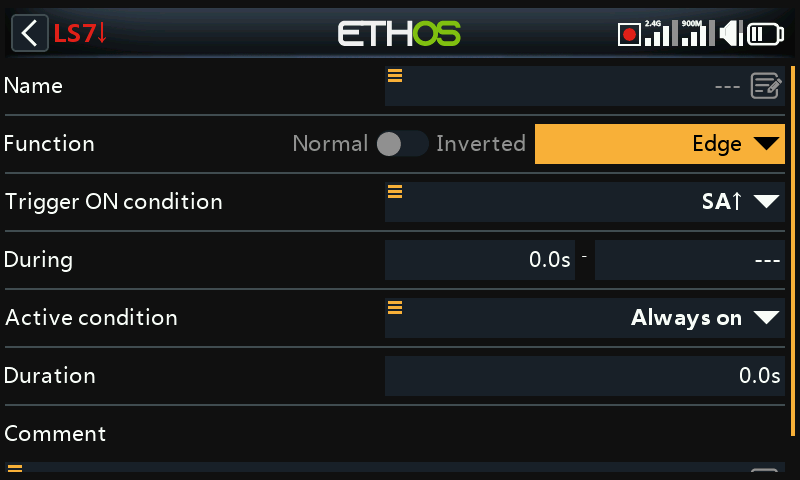

Edge is a momentary switch that becomes True for the period specified in 'Duration' when its edge trigger conditions are satisfied.

##### Rising edge option

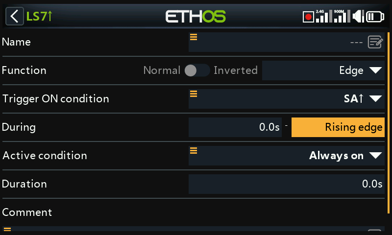

##### During = '0.0s'

During is in two parts \[t1:t2\]. With t1 of During = 0.0s and t2= 'Rising edge', the logic switch becomes True (for the period specified in 'Duration') the instant the 'Trigger On condition' transitions from False to True.

##### During >= '0.0s

During is in two parts \[t1:t2\]. With t1 of During a positive value (say 5.0s) and t2= 'Rising edge', the logic switch becomes True  (for the period specified in 'Duration') 5 seconds after the 'Trigger On condition' transitions from False to True. Any additional 'spikes' during the t1 period are ignored.

##### Falling edge option

##### During = '0.0s'

During is in two parts \[t1:t2\]. With During t1=0.0s and t2= '---' (Falling edge), the logic switch becomes True (for the period specified in 'Duration') the instant the 'Trigger On condition' transitions from True to False.

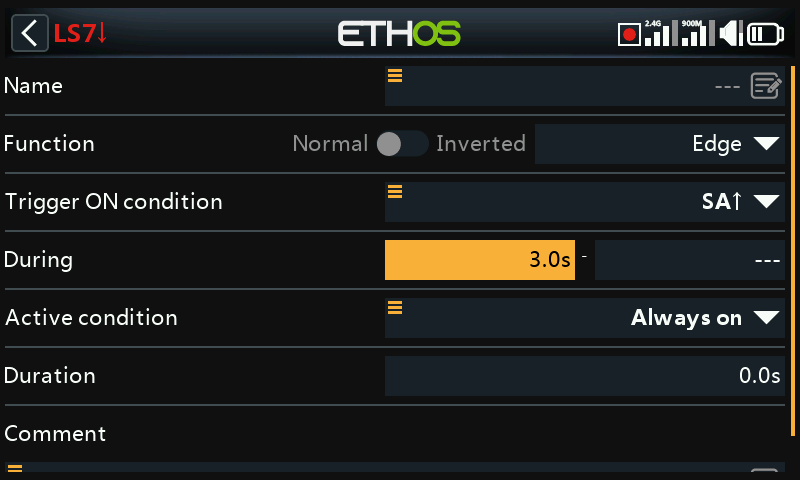

##### During >= '0.0s

During is in two parts \[t1:t2\]. With t1 of During a positive value (say 3.0s) and t2= '---' (Falling Edge), the logic switch becomes True (for the period specified in 'Duration') when the 'Trigger On condition' transitions from True to False, having been True for at least 3 seconds.

##### Pulse option

During is in two parts \[t1:t2\]; if values are entered for both t1 and t2, then a pulse is needed to trigger the logic switch.

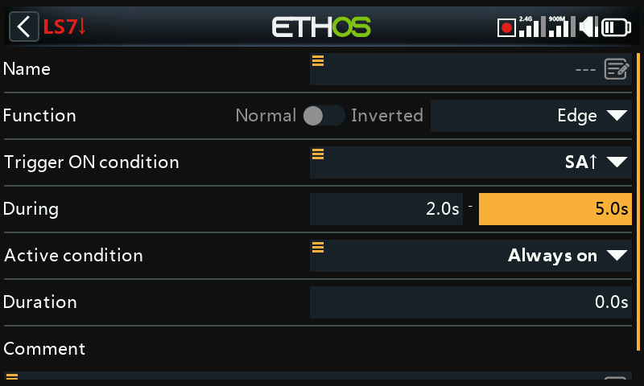

In the example above the logic switch will become True for the 'Duration' period if the 'Trigger On condition' goes from False to True, and then goes from True to False after at least 2 seconds but no later than 5 seconds.

## Shared parameters

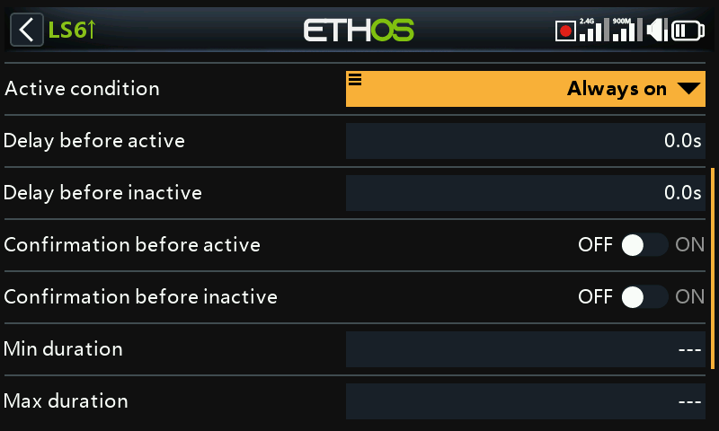

The logic switches all have a number of shared parameters:

### Active condition

The logic switches can be gated by the optional ‘Active condition’ parameter. This means that if the active condition is True, then the logic switch output follows the Function's condition. However, if the active condition is False, then the logic switch output is also held False.

The ‘Active condition’ may be selected from any of the following:

- Always on
- Switch positions
- Function switches
- Logic switches
- Trim positions
- Telemetry
- Flight modes
- System events 
  - Throttle hold
  - Throttle cut
  - Throttle active
  - Telemetry active
  - RSSI low
  - Trainer active
  - Flight reset

Note that the Sticky function continues to operate, even if its output is gated by the ‘Active condition’ switch. As soon as the active condition becomes True again, the Function's condition is switched through to the logic switch output.

### Delay before active

This value determines the time for which the logic switch conditions have to be True before the logic switch output becomes True (Not relevant to Timer Generator and Edge). Delays can go up to 60.0s.

Please refer to [this example](../programming-tutorials/how-to-section.md) about the Neuron ESC voltage going below 4.2V for at least x seconds.

### Delay before inactive

Similarly, this value determines the time for which the logic switch conditions have to be False before the logic switch output becomes False (Not relevant to Timer Generator and Edge). Delays can go up to 60.0s.

### Confirmation before active

When a logic switch detects a change of state to active this option requests user confirmation before the state changes.

There is a Cancel option for situations where the Confirmation Dialog is being raised too frequently.

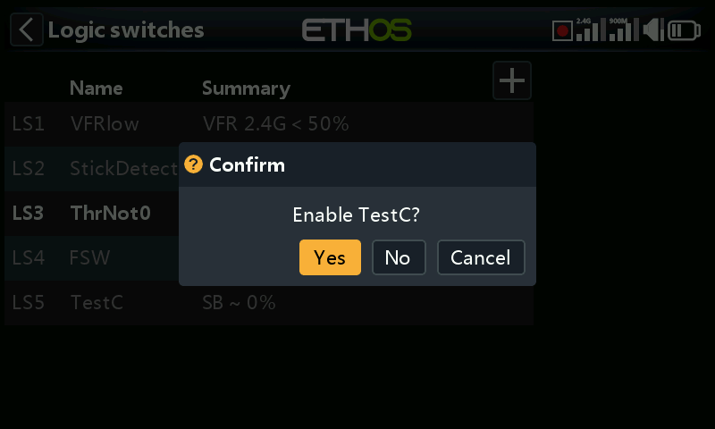

Some examples where the feature might be used:

1. For ground machines where you could use it before starting something dangerous.

2. For the NFC switch, where you can power off the model from the transmitter, it could be used to have a confirmation before powering off.

### Confirmation before inactive

When a logic switch detects a change of state to active this option requests user confirmation before the state changes.

There is a Cancel option for situations where the Confirmation Dialog is being raised too frequently.

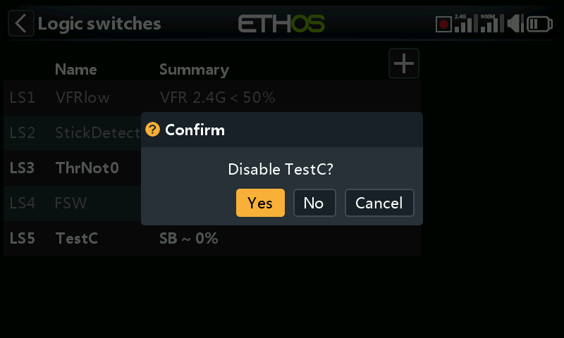

### Min Duration

Once the logic switch becomes True, it will remain True for at least the minimum duration specified. If the duration is the default ‘---’, the logic switch will only become True for one mixes processing cycle, which is too short to see,  so the LSW line will not go bold. Durations can go up to 60.0s.

### Max Duration

If a maximum duration is set, once the logic switch becomes True, it will only remain True for the maximum duration specified. Durations can go up to 60.0s.

### Comment

A comment may be added as explanation of its use or function, to aid in understanding. The comment is displayed when a logic switch is added to a value widget.

## Logic switches – use with telemetry

Besides the normal Active Condition categories, logic switches and special functions have a ‘Telemetry active’ condition (under ‘System event’) which is active when telemetry is being received.

If the source of a logic switch is a telemetry sensor, if your sensor is active then the logic switch will be active.

Warning!

When a logic switch using telemetry is used in a mix, an additional mix action using the same logic switch inverted (i.e when inactive) must be added to ensure that the mix will have valid values even when telemetry is lost. Remember that when a mix is inactive its channel output will be at neutral = 0% = 1500us or half throttle if on a throttle channel!

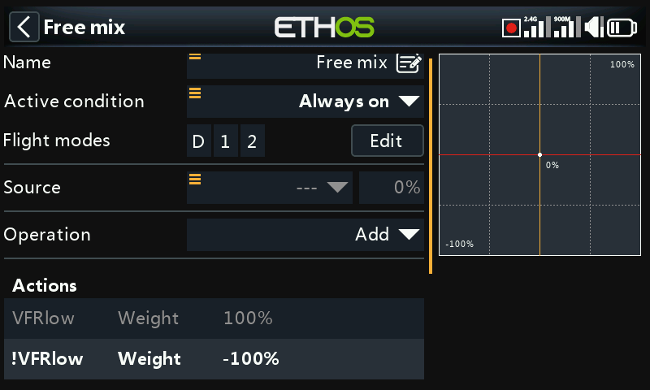

The example above shows logic switch VFRlow added, as well as its inverse !VFRlow to ensure that the mix will always have valid values.

Alternatively you could use an Offset action:

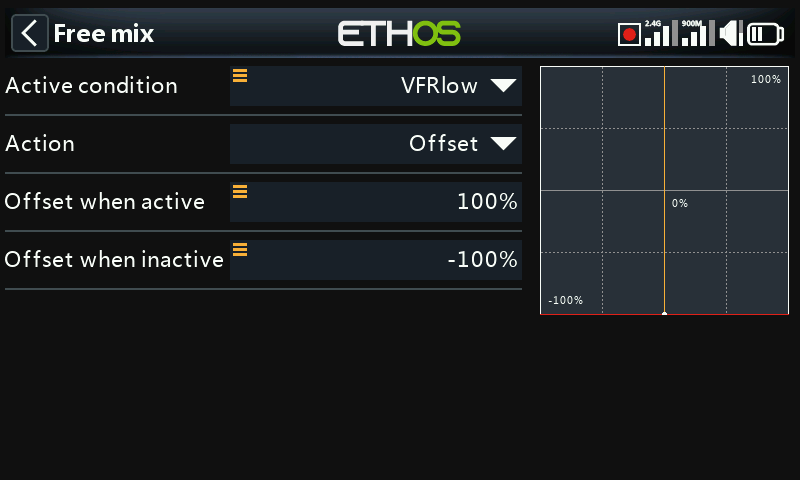

Offset actions have two values by default: one for when the offset action is active, and one for when the offset action is inactive. This covers all cases.

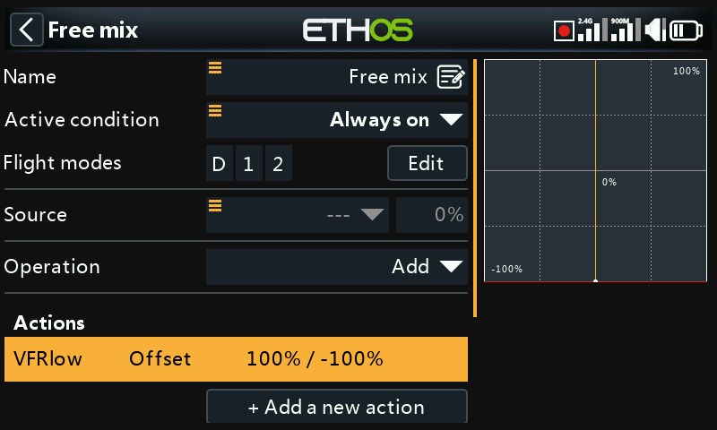

The above shows the mix summary line with the offset always having a valid value. The source has been set to the Special value 0, so the offset will be added to 0% and the mix output will be +100% when VFRlow is active, or -100% when VFRlow is inactive.

## Comparison of sources

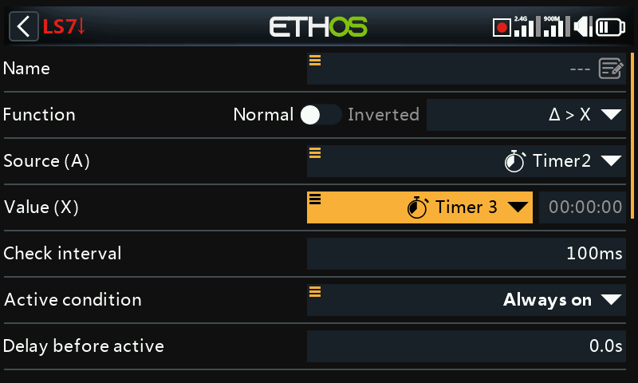

Normally source (A) is compared to a fixed Value (X). However, comparison of two same-format (i.e. having the same units) sources is allowed. For example, two timers, or two voltages, or two RPM sources may be compared.

## Option to ignore trainer input from slave

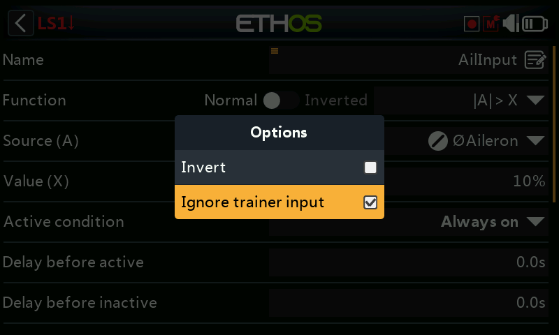

In logic switches the sources may have the ‘Ignore trainer input’ option set to ignore any sources coming from the slave trainer input.

A typical application is where a logic switch is configured to detect movement of the master trainer’s sticks (e.g. Aileron and Elevator sticks) to allow for instant intervention if things go wrong. This option is needed to prevent the slave trainer (i.e. student) stick inputs from triggering the logic switch.

The logic switch is then typically used in conjunction with a trainer switch to disable/enable the ‘Active condition’ in the master trainer function.

Please refer to How-To 11. [How to configure instant take-back for the trainer function](../programming-tutorials/emphasis.md) for an example.
