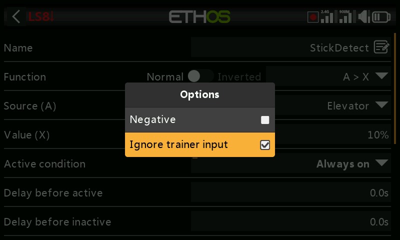

# Logical Switches

Logical switches are user-programmed *virtual* switches — not physical
controls, but usable anywhere a physical switch can be, as a program
trigger. Each one evaluates its configured condition against its inputs
(other switches, telemetry values, mix values, timer values, gyro/trainer
channels, and more) to become True or False. Up to 100 are supported;
none exist by default. Add one with **+**; a defined switch's menu label
shows green when True, red when False. Tap an existing one for
**Edit**/**Move**/**Copy-paste**/**Clone**/**Delete**.

## Function

Every function supports a normal or inverted output.

- **A ~ X** — true when source `A` is *approximately* equal (within
  ~10%) to a fixed value `X`. Generally preferable to exact equality —

  

  — since with `A = X`, a telemetry reading that jitters between, say,
  8.5V and 8.35V around an 8.4V target may simply never land exactly on
  8.4V, so the switch would never fire.
- **A = X** — true only when `A` exactly equals `X`.
- **A > X** / **A < X** — true when `A` is greater/less than `X`.
- **|A| > X** / **|A| < X** — as above, but comparing `A`'s absolute
  value (sign ignored).
- **Δ > X** — true when the change in `A` (delta) over the **Check
  interval** reaches at least `X`. An interval of `---` means an infinite
  window.

  
  

- **|Δ| > X** — as above, using the absolute value of the change.
- **Range** — true when `A` falls within a specified range.

  

- **AND** — true only if every source listed (Value 1…N) is true.

  

- **OR** — true if at least one listed source is true.

  

- **XOR** (exclusive OR) — true if *exactly one* listed source is true.

  

- **Timer generator** — free-runs on/off continuously: on for **Duration
  active**, off for **Duration inactive**.

  

- **Sticky** — a latch (SR flip-flop); see [below](#sticky).
- **Edge** — a momentary pulse; see [below](#edge).

### Sticky

Latches **True** once its **Trigger ON** condition is met, and stays
True until **Trigger OFF** is met — gated, optionally, by **Active
condition** (while that's False, the output is held False regardless;
Sticky's internal latch keeps evaluating in the background and is
switched through to the output again as soon as Active condition returns
True, subject to delays).

Since Ethos 1.6.2, both triggers accept an **Edge** modifier (long-press
`ENT` on the trigger condition, select Edge — shown with a `†` prefix) for
much finer control:

- **Trigger ON `SA` (no delay)** — latches True the instant SA goes high.
- **Trigger ON `SA` (delay = 1s)** — latches True 1s after SA goes high,
  *provided* SA is still high at the end of that second.
- **Trigger ON `†SA` (delay = 1s)** — latches True→False 1s after SA goes
  high, **regardless** of whether SA is still high by then (the edge
  already happened; the delay just times the outcome).

Trigger OFF behaves the same way in reverse. Delays apply **after** the
Active condition — so a change in Active condition re-triggers the delay
timing before the latched value reaches the output again. Flipping both
triggers from False→True simultaneously **toggles** the Sticky's output
once. See also [Shared parameters](#shared-parameters) below.

### Edge

A momentary pulse: True for **Duration**, once its trigger condition is
satisfied. **During** is a `[t1:t2]` pair controlling exactly when:

- **Rising edge, During = 0.0s** — fires the instant Trigger ON goes
  False→True.

  
  

- **Rising edge, During ≥ 0.0s (e.g. 5.0s)** — fires 5s after Trigger ON
  goes True, ignoring any shorter "spikes" during that 5s window.

  
  

- **Falling edge, During = 0.0s** — fires the instant Trigger ON goes
  True→False.
- **Falling edge, During ≥ 0.0s (e.g. 3.0s)** — fires on the True→False
  transition, but only if it had been True for at least 3s first.
- **Pulse (both t1 and t2 set)** — fires only if Trigger ON goes
  False→True→False within that window (e.g. between 2s and 5s later).

## Shared parameters {: #shared-parameters }

- **Active condition** — gates the switch's output the same way as
  Sticky's, above. Options: Always on, switch/function switch/logical
  switch/trim positions, Telemetry, Flight modes, or a system event
  (Throttle hold, Throttle cut, Throttle active, Telemetry active, RSSI
  low, Trainer active, Flight reset).
- **Delay before active** / **Delay before inactive** — how long the
  condition must hold True (or False) before the output follows, up to
  60s. Not relevant to Timer generator or Edge. (See [How-To: Battery
  Capacity Warning](../how-to/battery-capacity-warning.md) for a delay
  used to debounce a voltage dip.)
- **Confirmation before active** / **inactive** — prompts for user
  confirmation before the state actually changes (with a Cancel option,
  for cases where it fires too often to be useful) — handy for gating
  something risky, e.g. confirming before powering down a ground vehicle
  remotely.

  
  

- **Min Duration** — once True, stays True for at least this long. Left
  at `---`, the output may only be True for a single mixer cycle — too
  brief to even see the line go bold in the UI.
- **Max Duration** — once True, automatically reverts to False after this
  long, if still set. Both durations go up to 60s.
- **Comment** — free text, shown wherever this switch is added to a value
  widget, to document its purpose.

## Using with telemetry

A **Telemetry active** system event (or a switch whose source is a
telemetry sensor, active only while that sensor reports data) covers
"is telemetry currently being received" style conditions.

!!! warning
    A [mix](mixes.md) gated by a telemetry-based logical switch needs a
    **second** mix action using the same switch **inverted**, so the mix
    still has a valid value once telemetry is lost — remember an inactive
    mix outputs neutral (0% / 1500µs, or **half throttle** on a throttle
    channel). Alternatively, use an **Offset** action, which already has
    separate active/inactive values built in — e.g. source **0** (the
    special value) with the offset set so the mix reads +100% while `LS3`
    is active and −100% while inactive covers both cases in one action.

## Comparison of sources

A source is normally compared against a fixed value, but two sources of
the *same* type can be compared directly instead — e.g. two timers, two
voltages, or two RPM sensors.

## Ignore trainer input from slave

A source's [options](../getting-started/user-interface-and-navigation.md#choosing-a-source)
can exclude trainer input from a connected student (slave) radio —
typically used on a logical switch that's watching the **master's** own
stick movement (e.g. to intervene instantly if something goes wrong),
without the student's inputs also tripping it. Commonly paired with a
trainer switch that gates the master's own Active condition.
