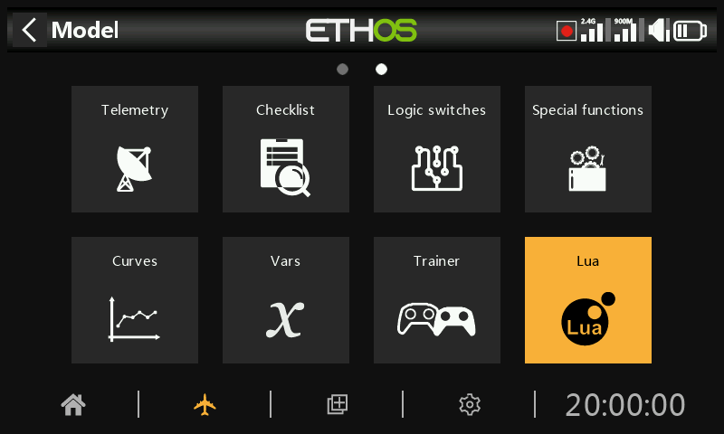

# Lua

The Lua menu only appears if the user has installed a Lua source or task script under the *scripts*/ folder on the SD card or eMMC.

Using Lua scripts it is possible to create custom sources such as for example custom sensors, or to create tasks that perform custom actions such as for example logging data to a file after flight is over.

Once installed, Lua sources or tasks are available globally to every model. This menu can then be used to selectively activate and configure the respective source and task scripts for the active model.

There are some example Lua source and task scripts in the ETHOS-Feedback-Community web page, see /lua/examples/task and /lua/examples/source.

## Lua tasks

For each task:

### Task enable

All available tasks are listed. Each task may be enabled for the active model.

### Task configuration

If a task is enabled, any associated Lua configuration form is shown to allow the task to be configured for the active model. The task would have a read and a write function to allow the user to save all its configuration parameters.

In the example above, the example task has a configurable range that can be customized for each model using the task.

## Lua s***ources***

For each source:

### ***Source*** enable

All available Lua sources are listed. Each source may be enabled for the active model.

### ***Source*** configuration

If a source is enabled, any associated Lua configuration form is shown to allow the source to be configured for the active model (such as Range in the task example screenshot above).The source would have a read and a write function to allow the user to save all its configuration parameters.

## Lua script functions

Applicable Lua functions include:

system.registerSource()

system.registerTask()

Please refer to the [Ethos Lua Reference Guide](https://www.frsky-rc.com/wp-content/uploads/Downloads/EthosSuite/LuaDoc/index.html) for more details.

## Installation

Lua sources and tasks are installed in the ‘scripts’ folder on the SD card or eMMC. Please refer to the [scripts](../system-setup/file-manager.md) section under System / File manager.
